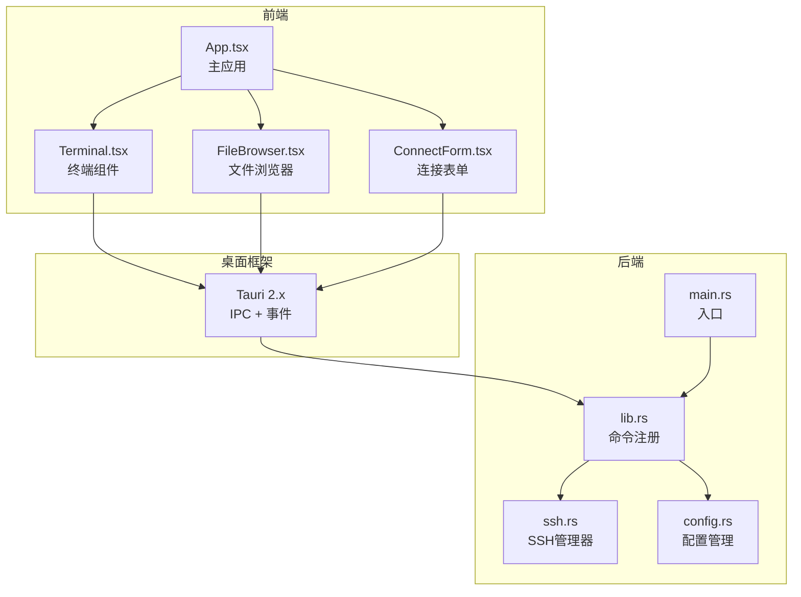
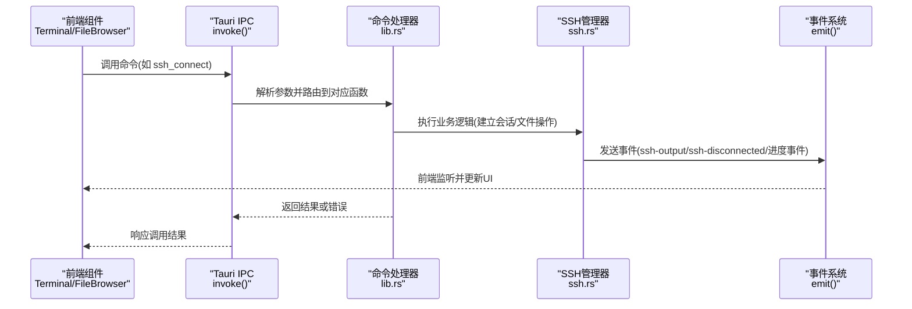
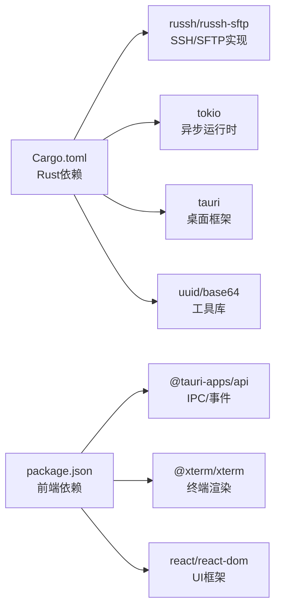

# API参考文档

<cite>
**本文档引用的文件**
- [main.rs](file://src-tauri/src/main.rs)
- [lib.rs](file://src-tauri/src/lib.rs)
- [ssh.rs](file://src-tauri/src/ssh.rs)
- [config.rs](file://src-tauri/src/config.rs)
- [tauri.conf.json](file://src-tauri/tauri.conf.json)
- [Cargo.toml](file://src-tauri/Cargo.toml)
- [App.tsx](file://src/App.tsx)
- [Terminal.tsx](file://src/components/Terminal.tsx)
- [FileBrowser.tsx](file://src/components/FileBrowser.tsx)
- [ConnectForm.tsx](file://src/components/ConnectForm.tsx)
- [package.json](file://package.json)
- [README.md](file://README.md)
</cite>

## 目录
1. [简介](#简介)
2. [项目结构](#项目结构)
3. [核心组件](#核心组件)
4. [架构总览](#架构总览)
5. [详细组件分析](#详细组件分析)
6. [依赖关系分析](#依赖关系分析)
7. [性能考虑](#性能考虑)
8. [故障排除指南](#故障排除指南)
9. [结论](#结论)
10. [附录](#附录)

## 简介
本项目是一个基于Tauri的跨平台SSH工具，提供终端交互、文件浏览与编辑、连接管理等功能。后端使用Rust + russh实现安全可靠的SSH连接，前端采用React + xterm.js构建直观的用户界面。本文档面向开发者与集成人员，提供完整的Tauri命令接口参考、事件系统说明、使用示例与最佳实践。

## 项目结构
项目采用前后端分离架构：
- 前端：React + TypeScript，负责UI与用户交互
- 后端：Rust + Tauri，负责SSH连接管理、文件操作与事件分发
- 通信：Tauri IPC（invoke）用于命令调用，事件系统用于流式数据推送

**图表来源**
- [main.rs:1-7](file://src-tauri/src/main.rs#L1-L7)
- [lib.rs:267-318](file://src-tauri/src/lib.rs#L267-L318)
- [ssh.rs:58-654](file://src-tauri/src/ssh.rs#L58-L654)
- [config.rs:1-113](file://src-tauri/src/config.rs#L1-L113)

**章节来源**
- [README.md:49-74](file://README.md#L49-L74)
- [tauri.conf.json:1-41](file://src-tauri/tauri.conf.json#L1-L41)

## 核心组件
- SSH管理器：负责建立/维护SSH会话、执行命令、处理SFTP文件操作、发送事件通知
- 配置管理器：提供连接配置的增删改查与设置持久化
- 事件系统：通过Tauri事件通道向前端推送实时输出、进度、状态变化等

**章节来源**
- [lib.rs:267-318](file://src-tauri/src/lib.rs#L267-L318)
- [ssh.rs:58-654](file://src-tauri/src/ssh.rs#L58-L654)
- [config.rs:1-113](file://src-tauri/src/config.rs#L1-L113)

## 架构总览
Tauri命令与事件在运行时的交互流程如下：

**图表来源**
- [lib.rs:21-315](file://src-tauri/src/lib.rs#L21-L315)
- [ssh.rs:132-198](file://src-tauri/src/ssh.rs#L132-L198)
- [Terminal.tsx:82-87](file://src/components/Terminal.tsx#L82-L87)
- [FileBrowser.tsx:268-284](file://src/components/FileBrowser.tsx#L268-L284)

## 详细组件分析

### SSH连接管理API
提供SSH会话的建立、输入、调整大小、断开、重连以及工作目录查询等能力。

- 命令：ssh_connect
  - 参数
    - host: 字符串，目标主机地址
    - port: 整数(u16)，SSH端口
    - username: 字符串，用户名
    - password: 可选字符串，密码认证
    - keyPath: 可选字符串，公钥文件路径
  - 返回
    - 成功：会话ID(字符串)
    - 失败：错误信息(字符串)
  - 使用场景
    - 用户点击“连接”按钮时发起新会话
    - 支持密码或密钥两种认证方式
  - 错误码
    - 认证失败：返回具体错误信息
    - 连接超时/不可达：返回连接失败信息
    - 未提供认证方式：返回“未提供认证方式”的错误
  - 示例
    - 前端调用：参见 [App.tsx:184-192](file://src/App.tsx#L184-L192)
    - 后端实现：参见 [lib.rs:21-41](file://src-tauri/src/lib.rs#L21-L41), [ssh.rs:71-120](file://src-tauri/src/ssh.rs#L71-L120)

- 命令：ssh_input
  - 参数
    - sessionId: 字符串，会话标识
    - data: 字符串，要发送到远端的数据
  - 返回
    - 成功：空
    - 失败：错误信息
  - 使用场景
    - 终端输入字符或命令
  - 示例
    - 前端调用：参见 [Terminal.tsx:68-73](file://src/components/Terminal.tsx#L68-L73)

- 命令：ssh_resize
  - 参数
    - sessionId: 字符串
    - cols: 整数(u32)，列数
    - rows: 整数(u32)，行数
  - 返回
    - 成功：空
    - 失败：错误信息
  - 使用场景
    - 窗口尺寸变化时同步远端PTY大小
  - 示例
    - 前端调用：参见 [Terminal.tsx:90-101](file://src/components/Terminal.tsx#L90-L101)

- 命令：ssh_disconnect
  - 参数
    - sessionId: 字符串
  - 返回
    - 成功：空
    - 失败：错误信息
  - 使用场景
    - 用户手动断开或清理资源
  - 示例
    - 前端调用：参见 [App.tsx:225-231](file://src/App.tsx#L225-L231)

- 命令：ssh_reconnect
  - 参数
    - sessionId: 字符串
  - 返回
    - 成功：空
    - 失败：错误信息(如超时)
  - 使用场景
    - 自动重连或手动重连
  - 示例
    - 前端调用：参见 [App.tsx:148-155](file://src/App.tsx#L148-L155)

- 命令：ssh_get_cwd
  - 参数
    - sessionId: 字符串
  - 返回
    - 成功：当前工作目录(字符串)
    - 失败：错误信息
  - 使用场景
    - 初始化文件浏览器或生成默认上传路径
  - 示例
    - 前端调用：参见 [App.tsx:307-309](file://src/App.tsx#L307-L309), [FileBrowser.tsx:363-368](file://src/components/FileBrowser.tsx#L363-L368)

**章节来源**
- [lib.rs:21-74](file://src-tauri/src/lib.rs#L21-L74)
- [ssh.rs:71-120](file://src-tauri/src/ssh.rs#L71-L120)
- [Terminal.tsx:68-101](file://src/components/Terminal.tsx#L68-L101)
- [App.tsx:184-231](file://src/App.tsx#L184-L231)

### 文件操作API
通过SFTP子系统实现文件与目录的读写、删除、复制、重命名、权限设置、空间检查与下载等。

- 命令：ssh_upload
  - 参数
    - sessionId: 字符串
    - remotePath: 字符串，远端目标路径
    - data: 字符串，Base64编码的二进制内容
  - 返回
    - 成功：空
    - 失败：错误信息
  - 使用场景
    - 将本地文件上传到远端
  - 进度事件
    - 事件名：upload-progress
    - 数据格式：{ sessionId, progress, sent, total }
  - 示例
    - 前端调用：参见 [App.tsx:324-334](file://src/App.tsx#L324-L334)
    - 事件监听：参见 [FileBrowser.tsx:287-295](file://src/components/FileBrowser.tsx#L287-L295)

- 命令：ssh_download_file
  - 参数
    - sessionId: 字符串
    - url: 字符串，远程URL
    - dest: 字符串，远端目标路径
  - 返回
    - 成功：空
    - 失败：错误信息
  - 使用场景
    - 在远端直接下载文件(使用curl)
  - 进度事件
    - 事件名：download-progress
    - 数据格式：{ sessionId, progress, status }，其中status可为"downloading"/"done"/"error"
  - 示例
    - 前端调用：参见 [FileBrowser.tsx:688-693](file://src/components/FileBrowser.tsx#L688-L693)
    - 事件监听：参见 [FileBrowser.tsx:268-284](file://src/components/FileBrowser.tsx#L268-L284)

- 命令：ssh_download_to_local
  - 参数
    - sessionId: 字符串
    - remotePath: 字符串
    - fileName: 字符串
  - 返回
    - 成功：本地临时文件路径(字符串)
    - 失败：错误信息
  - 使用场景
    - 下载远端文件到本地临时目录并打开
  - 示例
    - 前端调用：参见 [FileBrowser.tsx:509-519](file://src/components/FileBrowser.tsx#L509-L519)

- 命令：ssh_list_dir
  - 参数
    - sessionId: 字符串
    - path: 字符串
  - 返回
    - 成功：JSON字符串，数组元素包含{name, isDir, isSymlink, size, permissions, mtime, owner}
    - 失败：错误信息
  - 使用场景
    - 列出目录内容供文件浏览器展示
  - 示例
    - 前端调用：参见 [FileBrowser.tsx:213-227](file://src/components/FileBrowser.tsx#L213-L227)

- 命令：ssh_read_file
  - 参数
    - sessionId: 字符串
    - path: 字符串
  - 返回
    - 成功：文件内容(字符串，大文件截断至1MB)
    - 失败：错误信息
  - 使用场景
    - 文本文件预览与编辑
  - 示例
    - 前端调用：参见 [FileBrowser.tsx:529-536](file://src/components/FileBrowser.tsx#L529-L536)

- 命令：ssh_write_file
  - 参数
    - sessionId: 字符串
    - path: 字符串
    - content: 字符串
  - 返回
    - 成功：空
    - 失败：错误信息
  - 使用场景
    - 保存编辑后的文件
  - 示例
    - 前端调用：参见 [FileBrowser.tsx:542-550](file://src/components/FileBrowser.tsx#L542-L550)

- 命令：ssh_delete_file
  - 参数
    - sessionId: 字符串
    - path: 字符串
    - isDir: 布尔，是否为目录
  - 返回
    - 成功：空
    - 失败：错误信息
  - 使用场景
    - 删除文件或目录
  - 示例
    - 前端调用：参见 [FileBrowser.tsx:557-565](file://src/components/FileBrowser.tsx#L557-L565)

- 命令：ssh_create_dir
  - 参数
    - sessionId: 字符串
    - path: 字符串
  - 返回
    - 成功：空
    - 失败：错误信息
  - 使用场景
    - 新建目录
  - 示例
    - 前端调用：参见 [FileBrowser.tsx:586-593](file://src/components/FileBrowser.tsx#L586-L593)

- 命令：ssh_rename_file
  - 参数
    - sessionId: 字符串
    - oldPath: 字符串
    - newPath: 字符串
  - 返回
    - 成功：空
    - 失败：错误信息
  - 使用场景
    - 重命名文件或移动到其他目录
  - 示例
    - 前端调用：参见 [FileBrowser.tsx:633-641](file://src/components/FileBrowser.tsx#L633-L641)

- 命令：ssh_copy_file
  - 参数
    - sessionId: 字符串
    - src: 字符串
    - dst: 字符串
  - 返回
    - 成功：空
    - 失败：错误信息
  - 使用场景
    - 复制文件(不支持目录复制)
  - 示例
    - 前端调用：参见 [FileBrowser.tsx:630-637](file://src/components/FileBrowser.tsx#L630-L637)

- 命令：ssh_set_permissions
  - 参数
    - sessionId: 字符串
    - path: 字符串
    - mode: 字符串，权限模式(如"644")
  - 返回
    - 成功：空
    - 失败：错误信息(来自stderr)
  - 使用场景
    - 修改文件权限
  - 示例
    - 前端调用：参见 [FileBrowser.tsx:703-710](file://src/components/FileBrowser.tsx#L703-L710)

- 命令：ssh_check_space
  - 参数
    - sessionId: 字符串
    - path: 字符串
  - 返回
    - 成功：字符串，格式为"可用字节---写入测试结果---现有文件列表"
    - 失败：错误信息
  - 使用场景
    - 在粘贴/下载前检查磁盘空间与写权限
  - 示例
    - 前端调用：参见 [FileBrowser.tsx:247-265](file://src/components/FileBrowser.tsx#L247-L265)

**章节来源**
- [lib.rs:76-205](file://src-tauri/src/lib.rs#L76-L205)
- [ssh.rs:288-446](file://src-tauri/src/ssh.rs#L288-L446)
- [FileBrowser.tsx:268-295](file://src/components/FileBrowser.tsx#L268-L295)

### 配置管理API
提供连接配置的持久化与设置项的读取/保存。

- 命令：config_list
  - 参数：无
  - 返回
    - 成功：连接配置数组(Connection[])
  - 使用场景
    - 加载侧栏连接列表
  - 示例
    - 前端调用：参见 [App.tsx:251-260](file://src/App.tsx#L251-L260)

- 命令：config_save
  - 参数
    - connection: Connection对象
  - 返回
    - 成功：空
    - 失败：错误信息
  - 使用场景
    - 保存或更新连接配置
  - 示例
    - 前端调用：参见 [App.tsx:199-217](file://src/App.tsx#L199-L217), [App.tsx:235-249](file://src/App.tsx#L235-L249)

- 命令：config_delete
  - 参数
    - id: 字符串，连接ID
  - 返回
    - 成功：空
    - 失败：错误信息
  - 使用场景
    - 删除指定连接
  - 示例
    - 前端调用：参见 [App.tsx:231-233](file://src/App.tsx#L231-L233)

- 命令：settings_load
  - 参数：无
  - 返回
    - 成功：Settings对象
  - 使用场景
    - 应用启动时加载自动重连等设置
  - 示例
    - 前端调用：参见 [App.tsx:105-109](file://src/App.tsx#L105-L109)

- 命令：settings_save
  - 参数
    - settings: Settings对象
  - 返回
    - 成功：空
    - 失败：错误信息
  - 使用场景
    - 更新自动重连等设置
  - 示例
    - 前端调用：参见 [App.tsx:111-116](file://src/App.tsx#L111-L116)

数据模型
- Connection
  - id: 字符串
  - name: 字符串
  - host: 字符串
  - port: 整数(u16)
  - username: 字符串
  - auth_type: 字符串，"password"或"key"
  - key_path: 可选字符串
  - password: 可选字符串
- Settings
  - auto_reconnect: 布尔，默认true
  - reconnect_interval: 整数(u32)，重连间隔(秒)
  - max_reconnect_attempts: 整数(u32)，最大重连次数

**章节来源**
- [lib.rs:220-265](file://src-tauri/src/lib.rs#L220-L265)
- [config.rs:5-113](file://src-tauri/src/config.rs#L5-L113)

### 事件系统API
后端通过Tauri事件系统向前端推送实时数据与状态变化。

- 事件：ssh-output
  - 触发时机
    - 远端会话有标准输出时
  - 数据格式
    - { sessionId: string, data: string }
  - 使用场景
    - 终端显示远端输出
  - 示例
    - 前端监听：参见 [Terminal.tsx:82-87](file://src/components/Terminal.tsx#L82-L87)

- 事件：ssh-disconnected
  - 触发时机
    - 连接断开或发送失败
  - 数据格式
    - { sessionId: string, reason: string }
  - 使用场景
    - 触发自动重连或提示用户
  - 示例
    - 前端监听：参见 [App.tsx:124-164](file://src/App.tsx#L124-L164)

- 事件：ssh-closed
  - 触发时机
    - 显式关闭会话
  - 数据格式
    - sessionId: string
  - 使用场景
    - 清理UI状态
  - 示例
    - 前端监听：参见 [App.tsx:166-173](file://src/App.tsx#L166-L173)

- 事件：upload-progress
  - 触发时机
    - 上传过程中周期性触发
  - 数据格式
    - { sessionId: string, progress: number, sent: number, total: number }
  - 使用场景
    - 文件浏览器显示上传进度条
  - 示例
    - 前端监听：参见 [FileBrowser.tsx:287-295](file://src/components/FileBrowser.tsx#L287-L295)

- 事件：download-progress
  - 触发时机
    - 远端下载过程中的进度与最终完成/错误
  - 数据格式
    - { sessionId: string, progress: number, status: string, error?: string }
  - 使用场景
    - 文件浏览器显示下载进度与结果
  - 示例
    - 前端监听：参见 [FileBrowser.tsx:268-284](file://src/components/FileBrowser.tsx#L268-L284)

**章节来源**
- [ssh.rs:141-151](file://src-tauri/src/ssh.rs#L141-L151)
- [ssh.rs:480-518](file://src-tauri/src/ssh.rs#L480-L518)
- [ssh.rs:566-575](file://src-tauri/src/ssh.rs#L566-L575)
- [Terminal.tsx:82-87](file://src/components/Terminal.tsx#L82-L87)
- [FileBrowser.tsx:268-295](file://src/components/FileBrowser.tsx#L268-L295)

### 命令注册与生命周期
- 命令注册
  - 所有命令在后端统一注册，前端通过invoke调用
  - 注册清单参见 [lib.rs:291-315](file://src-tauri/src/lib.rs#L291-L315)
- 应用初始化
  - 创建SshManager实例并注入状态
  - 设置日志插件(调试模式)
  - 调整窗口尺寸与居中
  - 参考 [lib.rs:267-290](file://src-tauri/src/lib.rs#L267-L290)

**章节来源**
- [lib.rs:267-315](file://src-tauri/src/lib.rs#L267-L315)
- [main.rs:4-6](file://src-tauri/src/main.rs#L4-L6)

## 依赖关系分析

**图表来源**
- [Cargo.toml:18-33](file://src-tauri/Cargo.toml#L18-L33)
- [package.json:15-26](file://package.json#L15-L26)

**章节来源**
- [Cargo.toml:1-33](file://src-tauri/Cargo.toml#L1-L33)
- [package.json:1-28](file://package.json#L1-L28)

## 性能考虑
- 异步并发
  - 使用Tokio多任务处理多个会话与事件，避免阻塞
- 流式传输
  - SFTP写入采用32KB分块，边写边上报进度
  - curl下载解析进度行，实时推送download-progress事件
- 超时控制
  - 连接keepalive与空闲超时，防止僵尸连接
  - 重连整体超时(30秒)，避免长时间挂起
- 内存与I/O
  - 大文件读取限制在1MB以内返回给前端
  - SFTP配置优化并发写入与请求超时

**章节来源**
- [ssh.rs:82-87](file://src-tauri/src/ssh.rs#L82-L87)
- [ssh.rs:520-583](file://src-tauri/src/ssh.rs#L520-L583)
- [ssh.rs:449-518](file://src-tauri/src/ssh.rs#L449-L518)
- [ssh.rs:633-652](file://src-tauri/src/ssh.rs#L633-L652)

## 故障排除指南
- 连接失败
  - 检查主机/端口可达性与防火墙设置
  - 确认认证方式(密码/密钥)正确
  - 查看后端日志(调试模式启用)
- 断线重连
  - 启用自动重连设置，合理配置重连间隔与最大尝试次数
  - 监听ssh-disconnected事件，避免手动断开时触发重连
- 上传/下载异常
  - 检查远端磁盘空间与写权限
  - 监听upload-progress/download-progress事件定位问题阶段
- 权限修改失败
  - chmod命令返回stderr会被作为错误传播
  - 确认目标路径与权限字符串格式正确

**章节来源**
- [App.tsx:124-164](file://src/App.tsx#L124-L164)
- [FileBrowser.tsx:247-265](file://src/components/FileBrowser.tsx#L247-L265)
- [ssh.rs:385-417](file://src-tauri/src/ssh.rs#L385-L417)

## 结论
本项目通过Tauri实现了高性能、跨平台的SSH工具，后端以Rust + russh保证安全性与稳定性，前端以React + xterm.js提供流畅的用户体验。API设计清晰，事件系统完善，适合二次开发与企业集成。

## 附录

### API调用示例与最佳实践
- 建立连接
  - 前端：收集表单参数，调用ssh_connect，保存sessionId
  - 最佳实践：区分密码与密钥认证；连接成功后可选择保存到连接列表
- 输入与调整大小
  - 前端：监听ssh-output事件渲染终端；窗口变化时调用ssh_resize
- 文件操作
  - 前端：上传前先检查空间与权限；下载时显示进度；大文件谨慎预览
- 配置与设置
  - 前端：应用启动时加载settings；根据用户选择保存连接配置

**章节来源**
- [App.tsx:184-231](file://src/App.tsx#L184-L231)
- [Terminal.tsx:68-101](file://src/components/Terminal.tsx#L68-L101)
- [FileBrowser.tsx:247-295](file://src/components/FileBrowser.tsx#L247-L295)

### 版本兼容性与迁移指南
- 框架版本
  - Tauri 2.x + @tauri-apps/api 2.x
  - Rust 1.77.2 + russh 0.45 + russh-sftp 2
- 迁移要点
  - 从旧版Tauri迁移到2.x需要调整命令注册与事件API
  - 保持命令签名一致，避免破坏前端调用
  - 事件名与数据格式保持稳定，便于前端监听适配

**章节来源**
- [tauri.conf.json:1-41](file://src-tauri/tauri.conf.json#L1-L41)
- [Cargo.toml:18-33](file://src-tauri/Cargo.toml#L18-L33)
- [package.json:15-26](file://package.json#L15-L26)