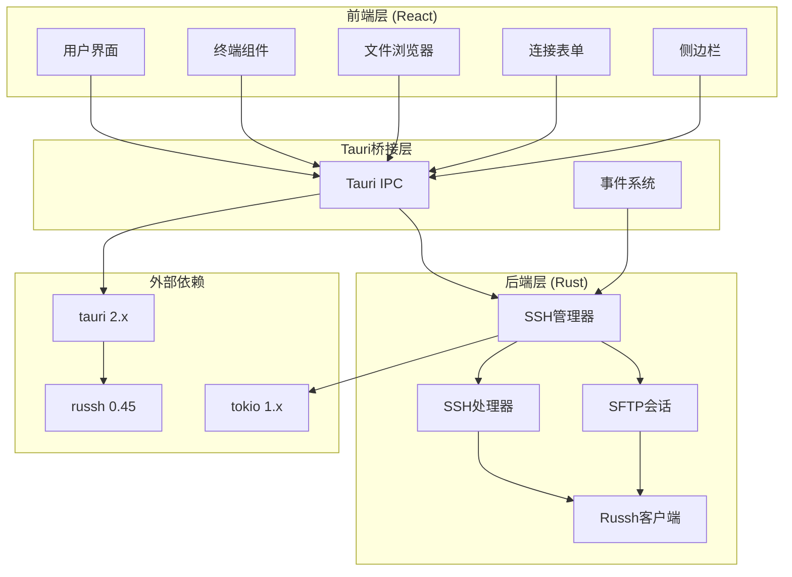
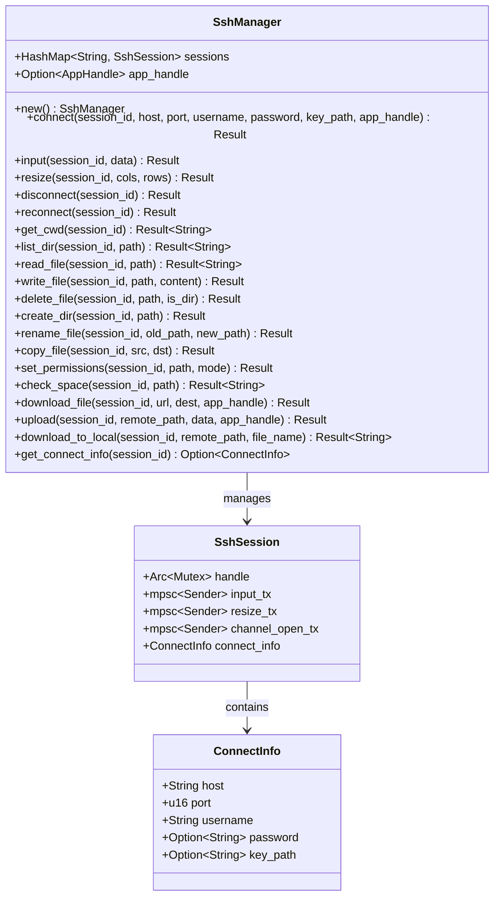
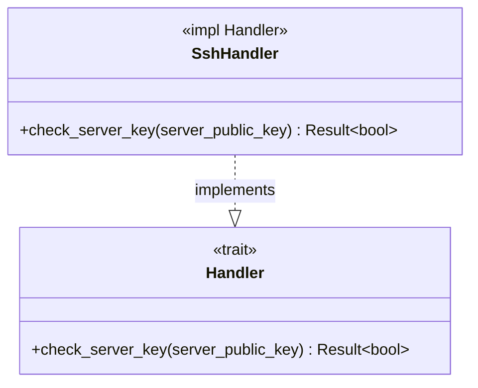
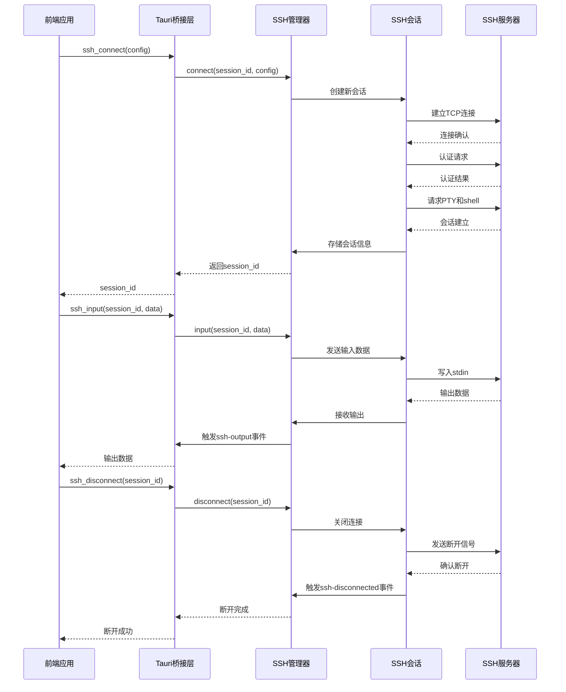
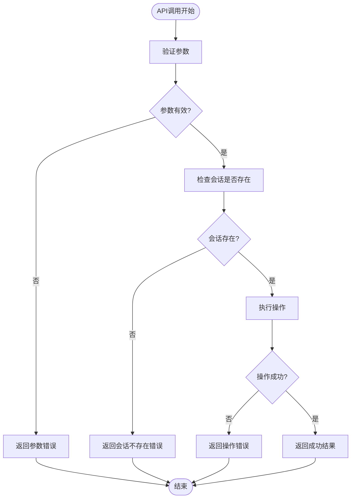
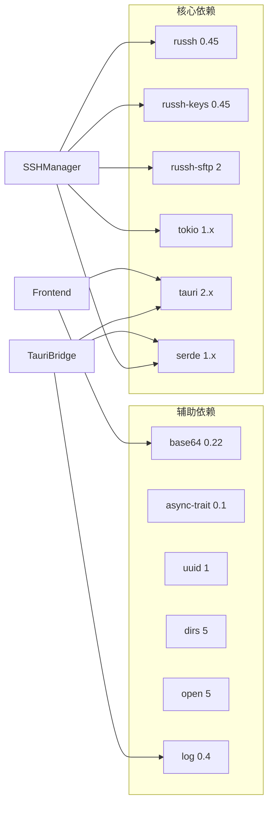
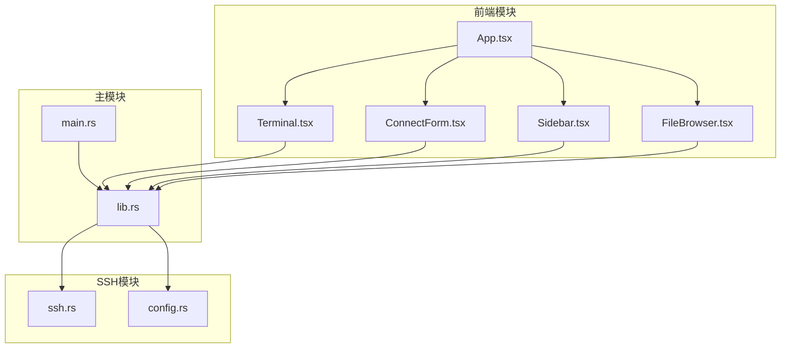

# SSH连接API

<cite>
**本文档引用的文件**
- [ssh.rs](file://src-tauri/src/ssh.rs)
- [lib.rs](file://src-tauri/src/lib.rs)
- [main.rs](file://src-tauri/src/main.rs)
- [Cargo.toml](file://src-tauri/Cargo.toml)
- [config.rs](file://src-tauri/src/config.rs)
- [README.md](file://README.md)
- [App.tsx](file://src/App.tsx)
- [Terminal.tsx](file://src/components/Terminal.tsx)
- [ConnectForm.tsx](file://src/components/ConnectForm.tsx)
- [Sidebar.tsx](file://src/components/Sidebar.tsx)
- [FileBrowser.tsx](file://src/components/FileBrowser.tsx)
</cite>

## 目录
1. [简介](#简介)
2. [项目结构](#项目结构)
3. [核心组件](#核心组件)
4. [架构概览](#架构概览)
5. [详细组件分析](#详细组件分析)
6. [依赖关系分析](#依赖关系分析)
7. [性能考虑](#性能考虑)
8. [故障排除指南](#故障排除指南)
9. [结论](#结论)

## 简介

SSH连接API是基于Rust的SSH工具项目的核心功能模块，提供了完整的SSH连接管理能力。该系统采用Tauri框架构建桌面应用程序，使用russh库实现SSH协议，支持终端交互、文件传输、远程命令执行等功能。

本项目的主要特性包括：
- 安全的SSH连接建立和管理
- 实时终端输出流处理
- 支持密码认证和密钥认证
- 文件浏览器和文件操作功能
- 自动重连机制
- 进度事件通知

## 项目结构

该项目采用前后端分离的架构设计，后端使用Rust + Tauri，前端使用React + TypeScript。



**图表来源**
- [lib.rs:268-318](file://src-tauri/src/lib.rs#L268-L318)
- [ssh.rs:58-654](file://src-tauri/src/ssh.rs#L58-L654)

**章节来源**
- [README.md:49-74](file://README.md#L49-L74)
- [Cargo.toml:18-33](file://src-tauri/Cargo.toml#L18-L33)

## 核心组件

### SSH管理器 (SshManager)

SSH管理器是整个SSH连接系统的核心组件，负责管理所有活跃的SSH会话。它提供了完整的连接生命周期管理功能。



**图表来源**
- [ssh.rs:58-654](file://src-tauri/src/ssh.rs#L58-L654)
- [ssh.rs:37-56](file://src-tauri/src/ssh.rs#L37-L56)

### SSH处理器 (SshHandler)

SSH处理器实现了russh库的Handler trait，用于处理SSH连接的各种事件和消息。



**图表来源**
- [ssh.rs:23-35](file://src-tauri/src/ssh.rs#L23-L35)

**章节来源**
- [ssh.rs:58-654](file://src-tauri/src/ssh.rs#L58-L654)

## 架构概览

SSH连接系统的整体架构采用了分层设计，确保了良好的可维护性和扩展性。



**图表来源**
- [lib.rs:21-74](file://src-tauri/src/lib.rs#L21-L74)
- [ssh.rs:71-199](file://src-tauri/src/ssh.rs#L71-L199)

## 详细组件分析

### SSH连接API详解

#### ssh_connect - 建立SSH连接

**函数签名**: `ssh_connect(app_handle, state, config) -> Result<String, String>`

**参数说明**:
- `app_handle`: Tauri应用句柄，用于事件发布
- `state`: SSH管理器状态，使用Arc<Mutex<SshManager>>
- `config`: 连接配置对象，包含主机信息和认证凭据

**配置参数**:
- `host`: 目标主机地址 (String)
- `port`: SSH端口号 (u16, 默认22)
- `username`: 用户名 (String)
- `password`: 密码 (Option<String>)
- `key_path`: 私钥文件路径 (Option<String>)

**返回值**:
- 成功: 返回新的会话ID (String)
- 失败: 返回错误信息 (String)

**错误处理**:
- 连接失败: "Connection failed: {error}"
- 认证失败: "Key auth failed: {error}" 或 "Password auth failed: {error}"
- 无认证方式: "No authentication method provided"

**调用示例**:
```typescript
// 使用密码认证
const sessionId = await invoke('ssh_connect', {
  config: {
    host: '192.168.1.100',
    port: 22,
    username: 'root',
    password: 'your_password'
  }
})

// 使用密钥认证
const sessionId = await invoke('ssh_connect', {
  config: {
    host: '192.168.1.100',
    port: 22,
    username: 'root',
    keyPath: '~/.ssh/id_rsa'
  }
})
```

#### ssh_input - 发送命令输入

**函数签名**: `ssh_input(state, session_id, data) -> Result<(), String>`

**参数说明**:
- `state`: SSH管理器状态
- `session_id`: 目标会话的唯一标识符
- `data`: 要发送的字符串数据

**返回值**:
- 成功: Ok(())
- 失败: "Session not found" 或 "Failed to send input"

**调用示例**:
```typescript
// 发送命令到终端
await invoke('ssh_input', {
  sessionId: 'abc-123-def-456',
  data: 'ls -la\n'
})

// 发送特殊键组合
await invoke('ssh_input', {
  sessionId: 'abc-123-def-456',
  data: '\x03' // Ctrl+C
})
```

#### ssh_resize - 调整终端大小

**函数签名**: `ssh_resize(state, session_id, cols, rows) -> Result<(), String>`

**参数说明**:
- `state`: SSH管理器状态
- `session_id`: 目标会话ID
- `cols`: 新的列数 (u32)
- `rows`: 新的行数 (u32)

**返回值**:
- 成功: Ok(())
- 失败: "Session not found" 或 "Failed to send resize"

**调用示例**:
```typescript
// 调整终端为80x24大小
await invoke('ssh_resize', {
  sessionId: 'abc-123-def-456',
  cols: 80,
  rows: 24
})
```

#### ssh_disconnect - 断开SSH连接

**函数签名**: `ssh_disconnect(state, session_id) -> Result<(), String>`

**参数说明**:
- `state`: SSH管理器状态
- `session_id`: 要断开的会话ID

**返回值**:
- 成功: Ok(())
- 失败: "Session not found"

**调用示例**:
```typescript
await invoke('ssh_disconnect', {
  sessionId: 'abc-123-def-456'
})
```

#### ssh_reconnect - 重新连接

**函数签名**: `ssh_reconnect(state, session_id) -> Result<(), String>`

**参数说明**:
- `state`: SSH管理器状态
- `session_id`: 要重新连接的会话ID

**返回值**:
- 成功: Ok(())
- 失败: "Session not found", "App handle not available", 或 "Reconnect timed out (30s)"

**错误处理**:
- 会话不存在: "Session not found"
- 应用句柄不可用: "App handle not available"
- 重连超时: "Reconnect timed out (30s)"

**调用示例**:
```typescript
try {
  await invoke('ssh_reconnect', {
    sessionId: 'abc-123-def-456'
  })
  console.log('重新连接成功')
} catch (error) {
  console.error('重新连接失败:', error)
}
```

### 会话ID使用方法和生命周期管理

**会话ID生成**: 使用UUID v4算法生成唯一标识符

**生命周期管理**:
1. **创建**: ssh_connect调用时生成并返回
2. **使用**: 在所有SSH相关API中作为第一个参数传递
3. **销毁**: ssh_disconnect或ssh_reconnect时清理
4. **超时**: 系统内置60秒的不活动超时检测

**会话状态监控**:
- `ssh-output`: 实时输出事件
- `ssh-disconnected`: 连接断开事件
- `ssh-closed`: 会话关闭事件

**章节来源**
- [lib.rs:21-255](file://src-tauri/src/lib.rs#L21-L255)
- [ssh.rs:71-654](file://src-tauri/src/ssh.rs#L71-L654)

### 连接配置参数说明

#### 基础连接参数
- **host**: 目标主机的IP地址或域名
- **port**: SSH服务端口，默认22
- **username**: 登录用户名

#### 认证方式选择
系统支持两种认证方式：

**密码认证**:
```typescript
config: {
  host: '192.168.1.100',
  port: 22,
  username: 'root',
  password: 'your_password'
}
```

**密钥认证**:
```typescript
config: {
  host: '192.168.1.100',
  port: 22,
  username: 'root',
  keyPath: '~/.ssh/id_rsa'
}
```

#### 高级配置选项
- **keepalive_interval**: 心跳间隔，默认10秒
- **keepalive_max**: 最大心跳次数，默认3次
- **inactivity_timeout**: 不活动超时，默认60秒

**章节来源**
- [ssh.rs:37-44](file://src-tauri/src/ssh.rs#L37-L44)
- [ssh.rs:82-87](file://src-tauri/src/ssh.rs#L82-L87)

### 错误处理机制

SSH连接系统采用统一的错误处理策略：



**图表来源**
- [ssh.rs:201-223](file://src-tauri/src/ssh.rs#L201-L223)
- [lib.rs:44-52](file://src-tauri/src/lib.rs#L44-L52)

**常见错误类型**:
- 参数验证错误: "Session not found"
- 连接建立错误: "Connection failed: ..."
- 认证失败: "Key auth failed: ..." 或 "Password auth failed: ..."
- 操作超时: "Reconnect timed out (30s)"

**章节来源**
- [ssh.rs:201-654](file://src-tauri/src/ssh.rs#L201-L654)

## 依赖关系分析

### 外部依赖关系



**图表来源**
- [Cargo.toml:18-33](file://src-tauri/Cargo.toml#L18-L33)

### 内部模块依赖



**图表来源**
- [lib.rs:1-10](file://src-tauri/src/lib.rs#L1-L10)
- [main.rs:1-7](file://src-tauri/src/main.rs#L1-L7)

**章节来源**
- [Cargo.toml:18-33](file://src-tauri/Cargo.toml#L18-L33)

## 性能考虑

### 并发处理优化

SSH连接系统采用Tokio异步运行时，支持高并发连接管理：

- **通道容量**: 输入通道容量256，调整通道容量32
- **会话池**: 使用HashMap存储多个活跃会话
- **内存管理**: 使用Arc<Mutex<T>>模式实现线程安全共享

### 网络性能优化

- **Keep-alive机制**: 10秒心跳检测，最多3次重试
- **超时控制**: 60秒不活动超时，30秒重连超时
- **缓冲区管理**: 64KB最大包长度，8并发写入

### 前端性能优化

- **事件驱动**: 使用Tauri事件系统减少轮询
- **进度反馈**: 实时上传下载进度显示
- **懒加载**: 文件内容按需加载

## 故障排除指南

### 常见连接问题

**连接超时**:
- 检查网络连通性
- 验证SSH服务端口可达性
- 确认防火墙设置

**认证失败**:
- 验证用户名和密码正确性
- 检查密钥文件权限 (600)
- 确认公钥已添加到authorized_keys

**会话丢失**:
- 检查keep-alive配置
- 验证网络稳定性
- 查看日志文件获取详细错误信息

### 调试技巧

**启用详细日志**:
```bash
# 开发模式下自动启用日志
npx tauri dev
```

**查看系统日志**:
- Windows: `%APPDATA%\ssh-tool\ssh-tool.log`
- Linux: `~/.cache/ssh-tool/log.txt`
- macOS: `~/Library/Caches/ssh-tool/log.txt`

**章节来源**
- [lib.rs:268-289](file://src-tauri/src/lib.rs#L268-L289)

## 结论

SSH连接API提供了完整的企业级SSH连接管理解决方案。通过合理的架构设计和完善的错误处理机制，该系统能够稳定地处理各种复杂的SSH连接场景。

**主要优势**:
- 完整的连接生命周期管理
- 丰富的文件操作功能
- 实时的进度反馈机制
- 强大的错误恢复能力
- 用户友好的界面设计

**未来改进方向**:
- 支持更多认证方式（如Kerberos）
- 增加连接池功能
- 优化大文件传输性能
- 添加连接监控和统计功能

该系统为开发者提供了一个可靠的SSH连接基础，可以轻松扩展以满足各种企业级应用场景的需求。