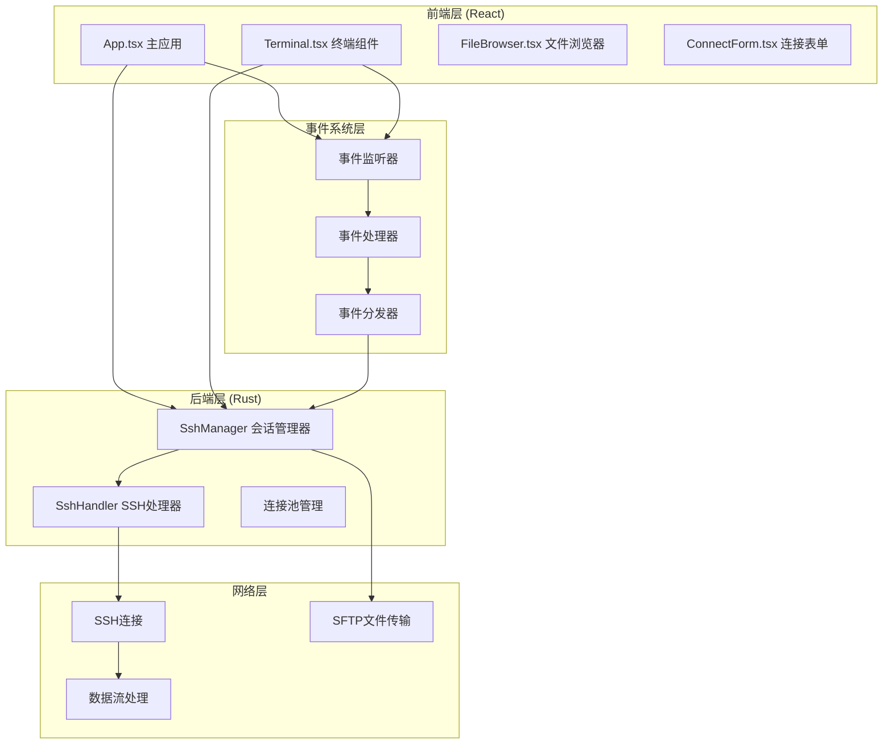
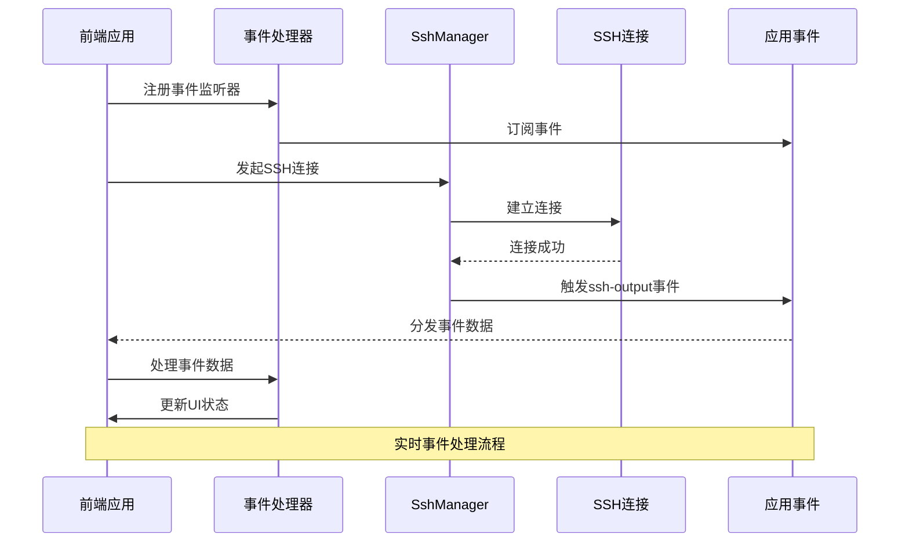
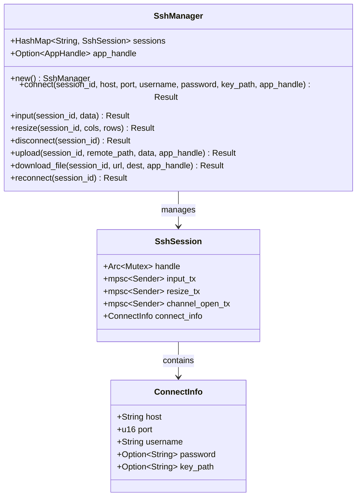
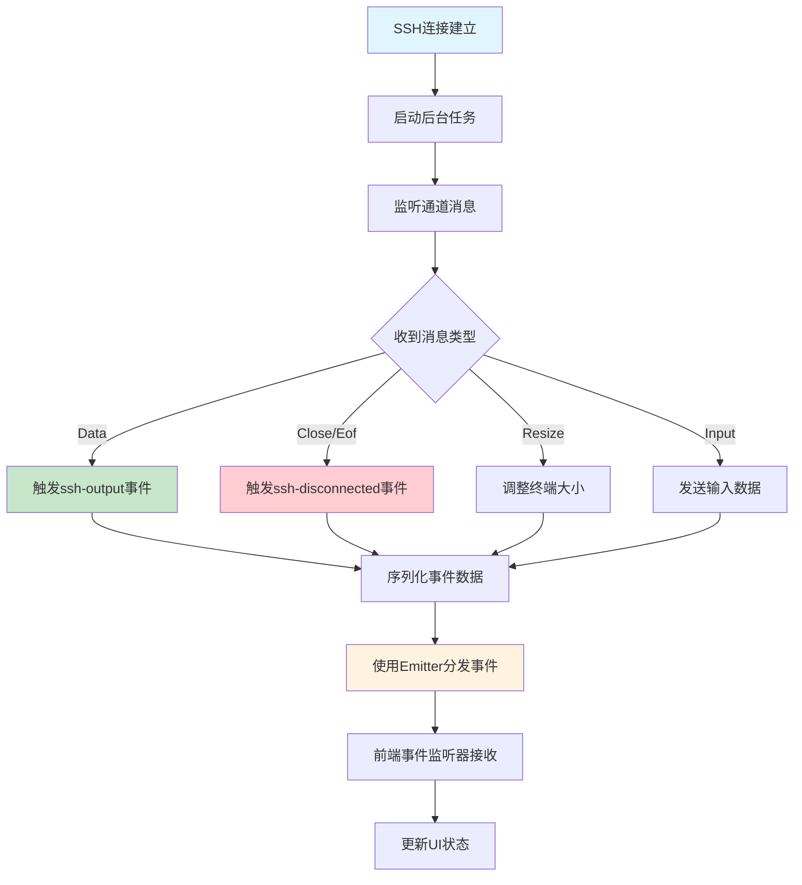
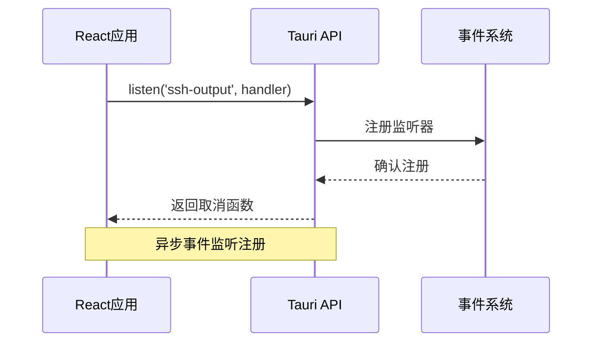
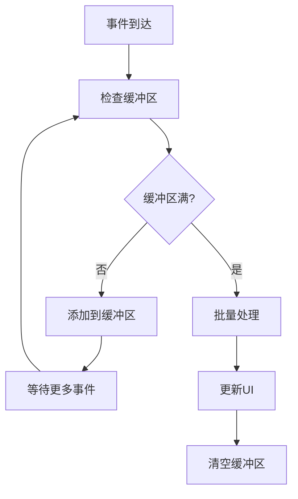

# 事件系统API

<cite>
**本文档引用的文件**
- [lib.rs](file://src-tauri/src/lib.rs)
- [ssh.rs](file://src-tauri/src/ssh.rs)
- [App.tsx](file://src/App.tsx)
- [Terminal.tsx](file://src/components/Terminal.tsx)
- [config.rs](file://src-tauri/src/config.rs)
- [main.rs](file://src-tauri/src/main.rs)
- [Cargo.toml](file://src-tauri/Cargo.toml)
- [package.json](file://package.json)
</cite>

## 目录
1. [简介](#简介)
2. [项目结构](#项目结构)
3. [核心组件](#核心组件)
4. [架构概览](#架构概览)
5. [详细组件分析](#详细组件分析)
6. [事件API规范](#事件api规范)
7. [事件监听器注册](#事件监听器注册)
8. [事件数据格式](#事件数据格式)
9. [事件处理最佳实践](#事件处理最佳实践)
10. [性能考虑与内存管理](#性能考虑与内存管理)
11. [故障排除指南](#故障排除指南)
12. [结论](#结论)

## 简介

SSH工具事件系统是一个基于Tauri框架构建的跨平台SSH客户端，提供了完整的事件驱动架构。该系统通过事件机制实现了连接状态管理、数据传输监控、错误处理和会话超时管理等功能。事件系统采用异步设计，支持实时数据传输和用户交互响应。

## 项目结构

SSH工具采用前后端分离的架构设计，主要分为以下层次：



**图表来源**
- [lib.rs:268-319](file://src-tauri/src/lib.rs#L268-L319)
- [ssh.rs:58-653](file://src-tauri/src/ssh.rs#L58-L653)

**章节来源**
- [lib.rs:1-319](file://src-tauri/src/lib.rs#L1-L319)
- [main.rs:1-7](file://src-tauri/src/main.rs#L1-L7)

## 核心组件

### 事件系统架构

事件系统的核心由以下组件构成：

1. **SshManager**: 主要的会话管理器，负责SSH连接的生命周期管理
2. **SshHandler**: 实现SSH协议处理的异步处理器
3. **事件发射器**: 基于Tauri的Emitter接口，用于事件分发
4. **前端事件监听器**: React组件中的事件监听器
5. **会话状态管理**: 维护连接状态和会话信息

### 事件类型分类

系统支持以下四类事件：

1. **连接状态事件**: 连接建立、断开、重新连接
2. **数据传输事件**: SSH输出数据、上传下载进度
3. **错误事件**: 连接失败、认证错误、传输错误
4. **会话超时事件**: 连接超时、空闲检测

**章节来源**
- [ssh.rs:23-35](file://src-tauri/src/ssh.rs#L23-L35)
- [ssh.rs:58-653](file://src-tauri/src/ssh.rs#L58-L653)

## 架构概览



**图表来源**
- [ssh.rs:132-178](file://src-tauri/src/ssh.rs#L132-L178)
- [App.tsx:123-164](file://src/App.tsx#L123-L164)

## 详细组件分析

### SshManager组件

SshManager是事件系统的核心组件，负责管理所有SSH会话和事件处理：



**图表来源**
- [ssh.rs:58-653](file://src-tauri/src/ssh.rs#L58-L653)
- [ssh.rs:50-56](file://src-tauri/src/ssh.rs#L50-L56)
- [ssh.rs:37-44](file://src-tauri/src/ssh.rs#L37-L44)

### 事件处理流程



**图表来源**
- [ssh.rs:135-178](file://src-tauri/src/ssh.rs#L135-L178)
- [ssh.rs:141-163](file://src-tauri/src/ssh.rs#L141-L163)

**章节来源**
- [ssh.rs:63-199](file://src-tauri/src/ssh.rs#L63-L199)

## 事件API规范

### 事件类型定义

系统定义了以下标准事件类型：

| 事件名称 | 触发条件 | 数据格式 | 描述 |
|---------|---------|---------|------|
| `ssh-output` | 收到SSH输出数据 | `{ sessionId: string, data: string }` | SSH会话输出数据事件 |
| `ssh-disconnected` | 连接断开或发送失败 | `{ sessionId: string, reason: string }` | SSH连接断开事件 |
| `ssh-closed` | 会话关闭 | `string` (sessionId) | 会话完全关闭事件 |
| `download-progress` | 下载进度更新 | `{ sessionId: string, progress: number, status: string, error?: string }` | 文件下载进度事件 |
| `upload-progress` | 上传进度更新 | `{ sessionId: string, progress: number, sent: number, total: number }` | 文件上传进度事件 |

### 事件数据格式详解

#### ssh-output事件数据格式
```json
{
  "sessionId": "abc-123-def-456",
  "data": "ls -la\r\n"
}
```

#### ssh-disconnected事件数据格式
```json
{
  "sessionId": "abc-123-def-456",
  "reason": "Connection lost"
}
```

#### download-progress事件数据格式
```json
{
  "sessionId": "abc-123-def-456",
  "progress": 45.5,
  "status": "downloading",
  "error": "Network error"
}
```

#### upload-progress事件数据格式
```json
{
  "sessionId": "abc-123-def-456",
  "progress": 75,
  "sent": 76800,
  "total": 102400
}
```

**章节来源**
- [ssh.rs:141-163](file://src-tauri/src/ssh.rs#L141-L163)
- [ssh.rs:480-517](file://src-tauri/src/ssh.rs#L480-L517)
- [ssh.rs:566-582](file://src-tauri/src/ssh.rs#L566-L582)

## 事件监听器注册

### 前端事件监听器注册

前端使用Tauri的`listen`函数注册事件监听器：



**图表来源**
- [Terminal.tsx:82-87](file://src/components/Terminal.tsx#L82-L87)
- [App.tsx:124-164](file://src/App.tsx#L124-L164)

### 事件监听器生命周期管理

事件监听器需要正确的生命周期管理：

1. **注册监听器**: 使用`listen`函数注册事件监听
2. **返回取消函数**: 注册后获得取消函数
3. **清理资源**: 在组件卸载时调用取消函数
4. **避免内存泄漏**: 确保监听器正确移除

**章节来源**
- [Terminal.tsx:113-121](file://src/components/Terminal.tsx#L113-L121)
- [App.tsx:163-173](file://src/App.tsx#L163-L173)

## 事件数据格式

### 事件负载结构

每个事件都遵循统一的数据格式规范：

#### 基础事件结构
```typescript
interface BaseEventPayload {
  sessionId: string;
}

interface SessionSpecificEvent<T> extends BaseEventPayload {
  payload: T;
}
```

#### 具体事件类型

1. **SSH输出事件**
   ```typescript
   interface SshOutputEvent {
     sessionId: string;
     data: string;
   }
   ```

2. **连接断开事件**
   ```typescript
   interface SshDisconnectedEvent {
     sessionId: string;
     reason: string;
   }
   ```

3. **下载进度事件**
   ```typescript
   interface DownloadProgressEvent {
     sessionId: string;
     progress: number;
     status: 'downloading' | 'done' | 'error';
     error?: string;
   }
   ```

4. **上传进度事件**
   ```typescript
   interface UploadProgressEvent {
     sessionId: string;
     progress: number;
     sent: number;
     total: number;
   }
   ```

**章节来源**
- [Terminal.tsx:82-87](file://src/components/Terminal.tsx#L82-L87)
- [App.tsx:125-162](file://src/App.tsx#L125-L162)

## 事件处理最佳实践

### 事件去重策略

为了防止重复事件处理，建议采用以下策略：

1. **会话ID过滤**: 确保事件只处理对应会话的数据
2. **时间戳去重**: 对相同内容的事件进行时间戳比较
3. **内容哈希**: 为事件内容生成哈希值进行去重

### 批量处理优化

对于高频事件（如SSH输出），可以采用批量处理：



### 错误处理策略

1. **事件监听错误**: 捕获监听器注册异常
2. **事件处理错误**: 处理事件数据解析错误
3. **网络错误恢复**: 实现自动重连机制
4. **资源清理**: 确保错误情况下正确清理资源

**章节来源**
- [App.tsx:138-157](file://src/App.tsx#L138-L157)
- [ssh.rs:633-652](file://src-tauri/src/ssh.rs#L633-L652)

## 性能考虑与内存管理

### 内存管理策略

1. **会话池管理**: 合理管理SSH会话的生命周期
2. **事件缓冲区**: 控制事件队列大小，避免内存溢出
3. **监听器清理**: 及时移除不再使用的事件监听器
4. **资源释放**: 确保连接和文件句柄正确关闭

### 性能优化技术

1. **异步处理**: 使用Tokio异步运行时处理高并发事件
2. **事件合并**: 将多个小事件合并为批量处理
3. **背压控制**: 实现事件流的背压机制
4. **缓存策略**: 缓存常用的会话信息减少查询开销

### 资源限制配置

系统默认配置了合理的资源限制：

- **连接超时**: 30秒连接超时
- **重连间隔**: 5秒重连间隔
- **最大重连次数**: 10次重连尝试
- **事件缓冲大小**: 256个输入事件缓冲

**章节来源**
- [ssh.rs:82-86](file://src-tauri/src/ssh.rs#L82-L86)
- [App.tsx:51-58](file://src/App.tsx#L51-L58)

## 故障排除指南

### 常见问题诊断

1. **事件不触发**
   - 检查事件监听器是否正确注册
   - 验证会话ID是否匹配
   - 确认事件名称拼写正确

2. **事件重复处理**
   - 检查是否有多个监听器注册
   - 实施事件去重机制
   - 验证会话状态一致性

3. **内存泄漏**
   - 确保监听器正确清理
   - 检查会话池管理
   - 监控事件队列长度

### 调试技巧

1. **启用日志**: 使用Tauri日志插件记录事件处理过程
2. **事件追踪**: 添加事件ID跟踪机制
3. **性能监控**: 监控事件处理延迟和吞吐量
4. **错误统计**: 统计各类错误的发生频率

**章节来源**
- [lib.rs:272-278](file://src-tauri/src/lib.rs#L272-L278)
- [ssh.rs:617-627](file://src-tauri/src/ssh.rs#L617-L627)

## 结论

SSH工具事件系统提供了一个完整、可靠的事件驱动架构，支持实时的SSH连接管理和数据传输监控。通过合理的事件设计和最佳实践，系统能够高效地处理大量并发事件，同时保持良好的性能和稳定性。

关键特性包括：
- 完整的事件类型覆盖
- 强大的错误处理机制  
- 优化的性能表现
- 清晰的API设计
- 良好的可扩展性

该事件系统为SSH工具提供了坚实的基础，支持未来功能的扩展和增强。