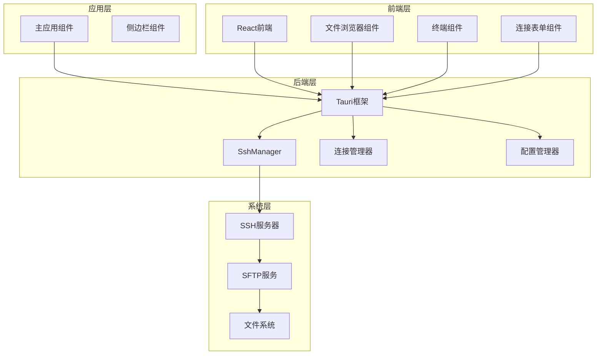
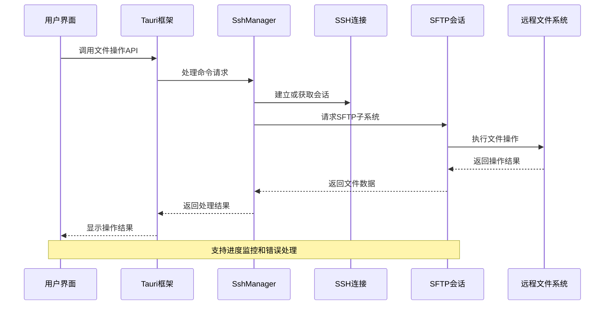
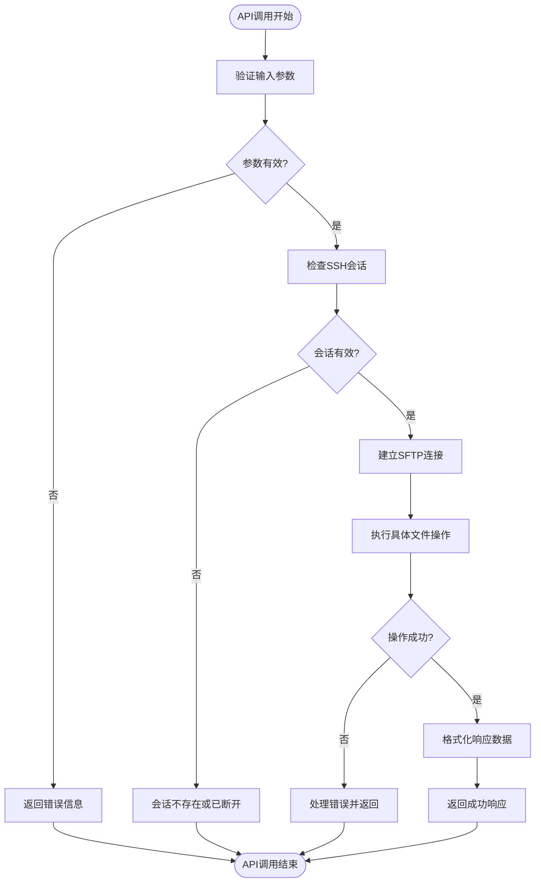
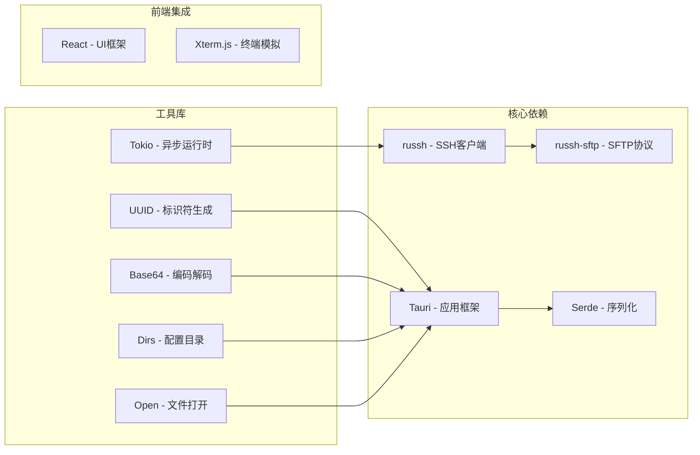
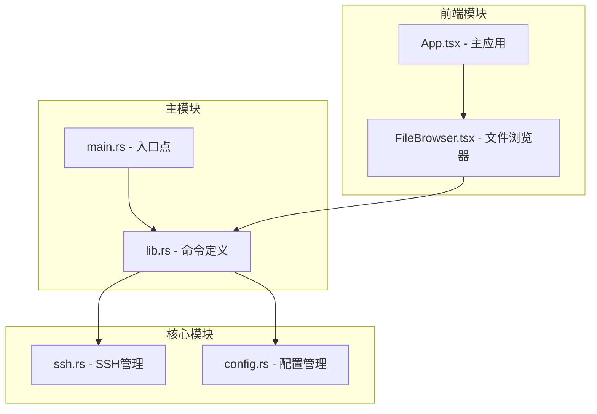
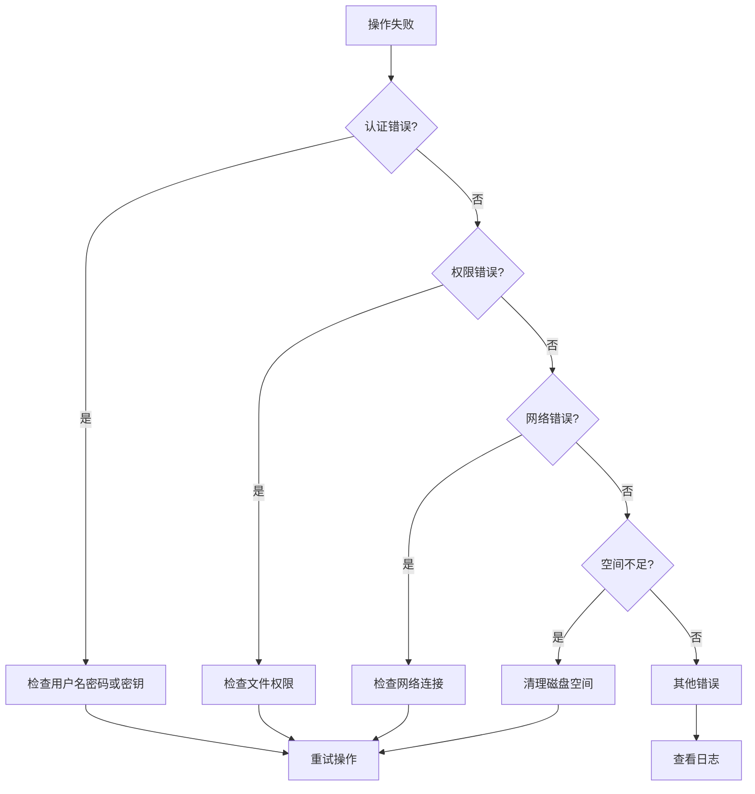

# 文件管理API

<cite>
**本文档中引用的文件**
- [main.rs](file://src-tauri/src/main.rs)
- [lib.rs](file://src-tauri/src/lib.rs)
- [ssh.rs](file://src-tauri/src/ssh.rs)
- [config.rs](file://src-tauri/src/config.rs)
- [default.json](file://src-tauri/capabilities/default.json)
- [Cargo.toml](file://src-tauri/Cargo.toml)
- [tauri.conf.json](file://src-tauri/tauri.conf.json)
- [package.json](file://package.json)
- [App.tsx](file://src/App.tsx)
- [FileBrowser.tsx](file://src/components/FileBrowser.tsx)
</cite>

## 目录
1. [简介](#简介)
2. [项目结构](#项目结构)
3. [核心组件](#核心组件)
4. [架构概览](#架构概览)
5. [详细组件分析](#详细组件分析)
6. [依赖关系分析](#依赖关系分析)
7. [性能考虑](#性能考虑)
8. [故障排除指南](#故障排除指南)
9. [结论](#结论)

## 简介

SSH文件管理系统是一个基于Tauri框架构建的跨平台应用程序，提供了通过SSH协议进行文件管理的功能。该系统支持多种文件操作命令，包括目录浏览、文件读写、上传下载、权限设置等，为用户提供了一个直观的图形界面来管理远程服务器上的文件。

本项目采用Rust作为后端语言，使用russh库建立SSH连接，通过SFTP协议进行文件传输，并结合React前端提供用户界面。系统支持会话管理、自动重连、进度监控等功能，确保文件操作的可靠性和用户体验。

## 项目结构

项目采用前后端分离的架构设计，主要分为以下几部分：



**图表来源**
- [lib.rs:268-318](file://src-tauri/src/lib.rs#L268-L318)
- [ssh.rs:58-653](file://src-tauri/src/ssh.rs#L58-L653)

**章节来源**
- [main.rs:1-7](file://src-tauri/src/main.rs#L1-L7)
- [lib.rs:268-318](file://src-tauri/src/lib.rs#L268-L318)

## 核心组件

### SshManager核心功能

SshManager是整个文件管理系统的中枢组件，负责管理SSH会话和执行各种文件操作。其核心功能包括：

- **会话管理**：维护多个并发SSH会话，支持连接、断开、重连
- **文件操作**：提供完整的文件系统操作能力
- **传输控制**：实现大文件分块传输和进度监控
- **事件处理**：监听和处理SSH连接状态变化

### 连接管理器

连接管理器负责存储和管理用户的SSH连接配置，支持连接的保存、加载和删除操作。

### 配置管理器

配置管理器提供应用级别的设置管理，包括自动重连设置、窗口配置等。

**章节来源**
- [ssh.rs:58-653](file://src-tauri/src/ssh.rs#L58-L653)
- [config.rs:27-113](file://src-tauri/src/config.rs#L27-L113)

## 架构概览

系统采用分层架构设计，确保各组件职责清晰、耦合度低：



**图表来源**
- [lib.rs:103-245](file://src-tauri/src/lib.rs#L103-L245)
- [ssh.rs:272-286](file://src-tauri/src/ssh.rs#L272-L286)

## 详细组件分析

### 文件操作API详解

#### ssh_list_dir - 列出目录内容

**功能描述**：列出指定目录的所有文件和子目录信息。

**参数定义**：
- `session_id`: string - SSH会话标识符
- `path`: string - 目标目录路径

**返回数据格式**：
```json
[
  {
    "name": "文件名",
    "isDir": true/false,
    "isSymlink": true/false,
    "size": 1024,
    "permissions": "rwxr-xr-x",
    "mtime": 1640995200,
    "owner": "username"
  }
]
```

**权限要求**：需要对目标目录有读取权限

**章节来源**
- [lib.rs:103-112](file://src-tauri/src/lib.rs#L103-L112)
- [ssh.rs:288-307](file://src-tauri/src/ssh.rs#L288-L307)

#### ssh_read_file - 读取文件内容

**功能描述**：读取指定文件的内容，支持大文件的分块读取。

**参数定义**：
- `session_id`: string - SSH会话标识符
- `path`: string - 目标文件路径

**返回数据格式**：字符串格式的文件内容

**权限要求**：需要对目标文件有读取权限

**最佳实践**：
- 对于大于1MB的文件，系统会自动截断到1MB以避免内存问题
- 建议在前端进行文件大小检查后再调用此API

**章节来源**
- [lib.rs:114-123](file://src-tauri/src/lib.rs#L114-L123)
- [ssh.rs:309-323](file://src-tauri/src/ssh.rs#L309-L323)

#### ssh_write_file - 写入文件内容

**功能描述**：将内容写入指定文件。

**参数定义**：
- `session_id`: string - SSH会话标识符
- `path`: string - 目标文件路径
- `content`: string - 要写入的内容

**返回数据格式**：无（成功时返回空）

**权限要求**：需要对目标文件有写入权限

**最佳实践**：
- 对于大文件，建议使用分块上传而非一次性写入
- 注意文件编码问题，确保内容编码正确

**章节来源**
- [lib.rs:125-135](file://src-tauri/src/lib.rs#L125-L135)
- [ssh.rs:325-336](file://src-tauri/src/ssh.rs#L325-L336)

#### ssh_upload - 上传文件（Base64编码）

**功能描述**：将本地文件上传到远程服务器。

**参数定义**：
- `session_id`: string - SSH会话标识符
- `remote_path`: string - 远程目标路径
- `data`: string - Base64编码的文件内容

**返回数据格式**：无（成功时返回空）

**权限要求**：需要对目标目录有写入权限

**最佳实践**：
- 使用32KB分块进行上传，支持进度监控
- 建议在前端进行文件大小检查和重复文件检测

**章节来源**
- [lib.rs:77-91](file://src-tauri/src/lib.rs#L77-L91)
- [ssh.rs:520-583](file://src-tauri/src/ssh.rs#L520-L583)

#### ssh_download_file - 下载远程URL到服务器

**功能描述**：从远程URL下载文件到服务器指定位置。

**参数定义**：
- `session_id`: string - SSH会话标识符
- `url`: string - 远程文件URL
- `dest`: string - 目标文件路径

**返回数据格式**：无（成功时返回空）

**权限要求**：需要对目标目录有写入权限

**最佳实践**：
- 支持curl进度监控，实时显示下载进度
- 设置合理的超时时间（默认1小时）
- 建议先检查磁盘空间和写权限

**章节来源**
- [lib.rs:208-218](file://src-tauri/src/lib.rs#L208-L218)
- [ssh.rs:449-518](file://src-tauri/src/ssh.rs#L449-L518)

#### ssh_download_to_local - 下载文件到本地预览

**功能描述**：下载远程文件到本地临时目录并使用默认程序打开。

**参数定义**：
- `session_id`: string - SSH会话标识符
- `remote_path`: string - 远程文件路径
- `file_name`: string - 本地文件名

**返回数据格式**：string - 本地文件完整路径

**权限要求**：需要对远程文件有读取权限

**最佳实践**：
- 自动创建临时目录用于文件预览
- 支持图片等二进制文件的本地预览
- 下载完成后自动打开文件

**章节来源**
- [lib.rs:236-245](file://src-tauri/src/lib.rs#L236-L245)
- [ssh.rs:585-615](file://src-tauri/src/ssh.rs#L585-L615)

#### ssh_delete_file - 删除文件或目录

**功能描述**：删除指定的文件或空目录。

**参数定义**：
- `session_id`: string - SSH会话标识符
- `path`: string - 要删除的路径
- `is_dir`: boolean - 是否为目录

**返回数据格式**：无（成功时返回空）

**权限要求**：需要对目标文件或目录有删除权限

**最佳实践**：
- 删除前确认操作，防止误删重要文件
- 目录删除前需为空目录
- 建议先检查文件存在性

**章节来源**
- [lib.rs:137-147](file://src-tauri/src/lib.rs#L137-L147)
- [ssh.rs:338-349](file://src-tauri/src/ssh.rs#L338-L349)

#### ssh_create_dir - 创建目录

**功能描述**：在指定路径创建新目录。

**参数定义**：
- `session_id`: string - SSH会话标识符
- `path`: string - 新目录路径

**返回数据格式**：无（成功时返回空）

**权限要求**：需要对父目录有写入权限

**最佳实践**：
- 支持递归创建多级目录
- 建议检查父目录是否存在
- 注意目录权限继承

**章节来源**
- [lib.rs:149-158](file://src-tauri/src/lib.rs#L149-L158)
- [ssh.rs:351-357](file://src-tauri/src/ssh.rs#L351-L357)

#### ssh_rename_file - 重命名文件或目录

**功能描述**：重命名或移动文件/目录。

**参数定义**：
- `session_id`: string - SSH会话标识符
- `old_path`: string - 源路径
- `new_path`: string - 新路径

**返回数据格式**：无（成功时返回空）

**权限要求**：需要对源文件/目录有读取权限，对目标目录有写入权限

**最佳实践**：
- 支持跨目录移动操作
- 目标路径已存在时会覆盖
- 建议先检查源文件存在性

**章节来源**
- [lib.rs:160-170](file://src-tauri/src/lib.rs#L160-L170)
- [ssh.rs:359-365](file://src-tauri/src/ssh.rs#L359-L365)

#### ssh_copy_file - 复制文件

**功能描述**：复制文件到新位置。

**参数定义**：
- `session_id`: string - SSH会话标识符
- `src`: string - 源文件路径
- `dst`: string - 目标文件路径

**返回数据格式**：无（成功时返回空）

**权限要求**：需要对源文件有读取权限，对目标目录有写入权限

**最佳实践**：
- 不支持目录复制
- 建议先检查源文件存在性和目标空间
- 支持同目录内复制

**章节来源**
- [lib.rs:172-182](file://src-tauri/src/lib.rs#L172-L182)
- [ssh.rs:367-383](file://src-tauri/src/ssh.rs#L367-L383)

#### ssh_set_permissions - 设置文件权限

**功能描述**：修改文件或目录的访问权限。

**参数定义**：
- `session_id`: string - SSH会话标识符
- `path`: string - 目标路径
- `mode`: string - 权限模式（如"755"）

**返回数据格式**：无（成功时返回空）

**权限要求**：需要对目标文件/目录有修改权限

**最佳实践**：
- 支持八进制权限模式
- 建议先检查当前权限状态
- 注意权限变更的安全影响

**章节来源**
- [lib.rs:184-194](file://src-tauri/src/lib.rs#L184-L194)
- [ssh.rs:385-417](file://src-tauri/src/ssh.rs#L385-L417)

#### ssh_check_space - 检查磁盘空间和权限

**功能描述**：检查目标目录的可用空间、写权限和现有文件列表。

**参数定义**：
- `session_id`: string - SSH会话标识符
- `path`: string - 检查路径

**返回数据格式**：string - 格式化的检查结果

**权限要求**：需要对目标目录有读取权限

**最佳实践**：
- 在批量操作前调用此API
- 结合磁盘空间和权限检查进行操作
- 支持现有文件检测，避免覆盖

**章节来源**
- [lib.rs:196-205](file://src-tauri/src/lib.rs#L196-L205)
- [ssh.rs:419-446](file://src-tauri/src/ssh.rs#L419-L446)

### 数据流图



**图表来源**
- [ssh.rs:272-286](file://src-tauri/src/ssh.rs#L272-L286)
- [ssh.rs:419-446](file://src-tauri/src/ssh.rs#L419-L446)

## 依赖关系分析

### 外部依赖

系统依赖的关键外部库包括：



**图表来源**
- [Cargo.toml:18-33](file://src-tauri/Cargo.toml#L18-L33)

### 内部模块依赖



**图表来源**
- [main.rs:4-6](file://src-tauri/src/main.rs#L4-L6)
- [lib.rs:1-10](file://src-tauri/src/lib.rs#L1-L10)

**章节来源**
- [Cargo.toml:18-33](file://src-tauri/Cargo.toml#L18-L33)
- [package.json:15-26](file://package.json#L15-L26)

## 性能考虑

### 并发处理

系统采用Tokio异步运行时处理并发操作，支持多会话同时工作：

- **最大并发写入**：8个并发写操作
- **包大小限制**：64KB每个数据包
- **请求超时**：60秒请求超时
- **会话超时**：60秒不活动超时

### 内存管理

- **大文件处理**：超过1MB的文件只读取前1MB内容
- **分块上传**：32KB分块大小，平衡内存使用和网络效率
- **临时文件**：预览功能使用系统临时目录

### 网络优化

- **Keep-alive**：10秒心跳检测
- **自动重连**：可配置的重连间隔和次数
- **进度监控**：实时显示上传下载进度

## 故障排除指南

### 常见错误类型



### 错误处理策略

1. **认证失败**：检查用户名、密码或私钥路径
2. **权限拒绝**：确认用户对目标文件/目录的权限
3. **网络中断**：启用自动重连功能
4. **磁盘空间不足**：清理空间或选择其他位置
5. **超时错误**：增加超时时间或优化网络环境

### 调试建议

- 启用详细日志记录
- 检查SSH服务器配置
- 验证防火墙设置
- 监控系统资源使用情况

**章节来源**
- [ssh.rs:82-106](file://src-tauri/src/ssh.rs#L82-L106)
- [ssh.rs:419-446](file://src-tauri/src/ssh.rs#L419-L446)

## 结论

SSH文件管理系统提供了一个功能完整、性能可靠的文件管理解决方案。通过精心设计的API架构和完善的错误处理机制，系统能够满足各种文件操作需求。

**主要优势**：
- 完整的文件操作API集合
- 友好的用户界面和交互体验
- 强大的错误处理和恢复机制
- 良好的性能和资源管理
- 支持大文件和批量操作

**未来改进方向**：
- 添加文件操作历史记录
- 实现更精细的权限控制
- 增加文件同步功能
- 优化大文件传输性能
- 扩展更多文件格式支持

该系统为用户提供了安全、高效的远程文件管理能力，适用于各种服务器管理和开发场景。