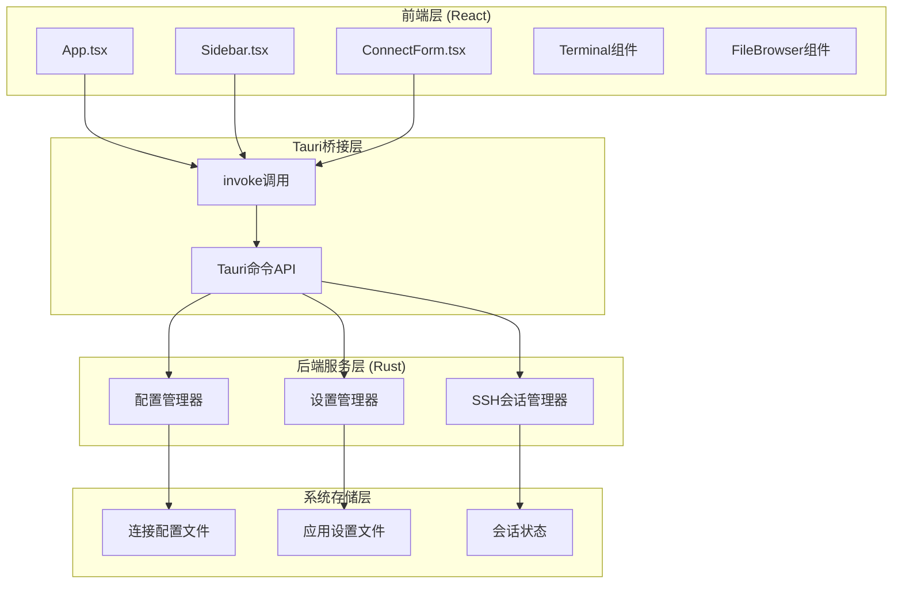
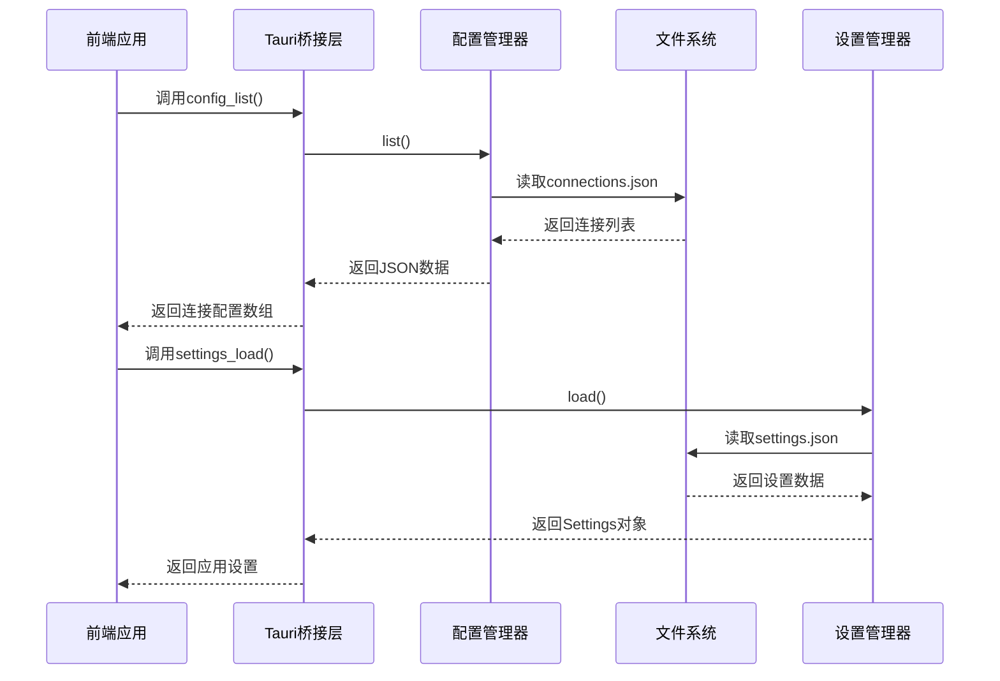
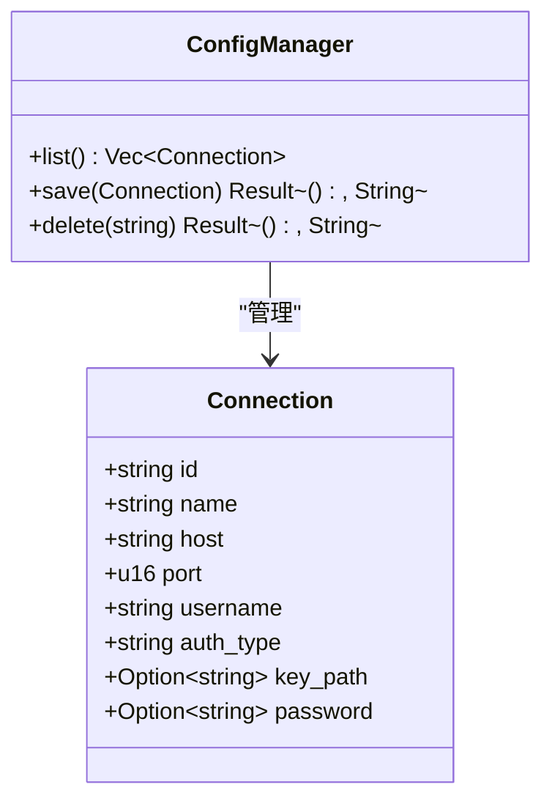
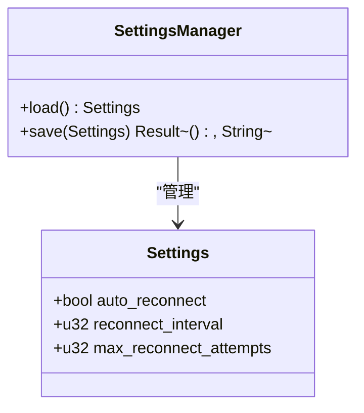
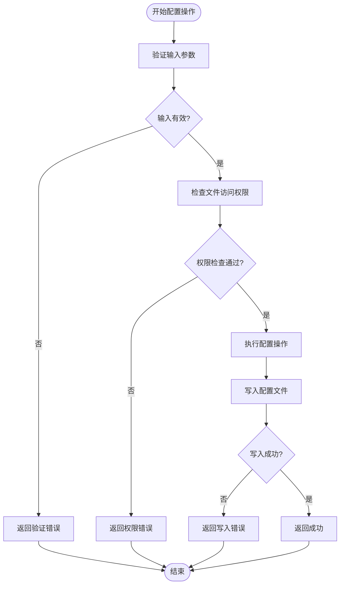
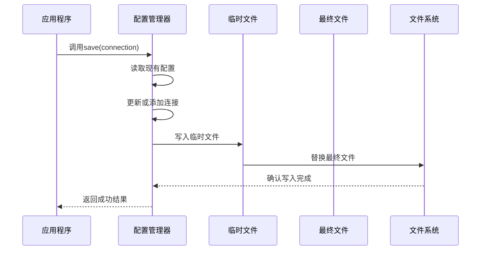
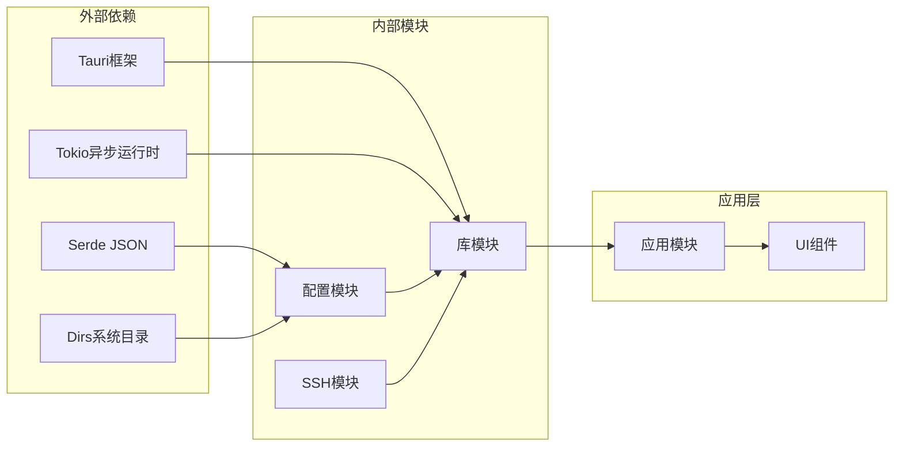

# 配置管理API

<cite>
**本文档引用的文件**
- [config.rs](file://src-tauri/src/config.rs)
- [lib.rs](file://src-tauri/src/lib.rs)
- [ssh.rs](file://src-tauri/src/ssh.rs)
- [App.tsx](file://src/App.tsx)
- [Sidebar.tsx](file://src/components/Sidebar.tsx)
- [ConnectForm.tsx](file://src/components/ConnectForm.tsx)
- [tauri.conf.json](file://src-tauri/tauri.conf.json)
- [Cargo.toml](file://src-tauri/Cargo.toml)
</cite>

## 目录
1. [简介](#简介)
2. [项目结构](#项目结构)
3. [核心组件](#核心组件)
4. [架构概览](#架构概览)
5. [详细组件分析](#详细组件分析)
6. [依赖关系分析](#依赖关系分析)
7. [性能考虑](#性能考虑)
8. [故障排除指南](#故障排除指南)
9. [结论](#结论)
10. [附录](#附录)

## 简介

SSH Tool 是一个基于 Tauri 框架构建的跨平台 SSH 客户端工具，专注于提供便捷的服务器连接管理和文件传输功能。本项目实现了完整的配置管理系统，支持连接配置的持久化存储、应用设置的管理以及自动重连机制。

配置管理API是整个系统的核心功能之一，提供了以下主要能力：
- 连接配置的增删改查操作
- 应用设置的加载和保存
- 配置文件的持久化机制
- 默认值处理和配置验证
- 自动重连功能的配置支持

## 项目结构

该项目采用前后端分离的架构设计，前端使用 React + TypeScript 构建用户界面，后端使用 Rust + Tauri 提供系统级功能和安全控制。



**图表来源**
- [lib.rs:221-265](file://src-tauri/src/lib.rs#L221-L265)
- [config.rs:27-58](file://src-tauri/src/config.rs#L27-L58)
- [config.rs:94-112](file://src-tauri/src/config.rs#L94-L112)

**章节来源**
- [lib.rs:268-318](file://src-tauri/src/lib.rs#L268-L318)
- [tauri.conf.json:1-41](file://src-tauri/tauri.conf.json#L1-L41)

## 核心组件

### 配置管理器 (ConfigManager)

配置管理器负责连接配置的持久化存储，提供完整的 CRUD 操作能力。

**主要功能：**
- 列出所有连接配置
- 保存新的或更新的连接配置
- 删除指定的连接配置
- 处理配置文件的读写操作

**数据模型：**
- 使用 JSON 文件格式存储连接信息
- 支持连接配置的序列化和反序列化
- 自动创建配置目录结构

**章节来源**
- [config.rs:27-58](file://src-tauri/src/config.rs#L27-L58)

### 设置管理器 (SettingsManager)

设置管理器负责应用全局设置的管理，提供默认值处理和持久化存储。

**主要功能：**
- 加载应用设置
- 保存用户自定义设置
- 提供默认值回退机制
- 处理设置文件的读写

**默认设置：**
- 自动重连：启用
- 重连间隔：5秒
- 最大重连次数：10次

**章节来源**
- [config.rs:94-112](file://src-tauri/src/config.rs#L94-L112)

### SSH会话管理器 (SshManager)

SSH会话管理器负责SSH连接的生命周期管理，与配置管理紧密集成。

**主要功能：**
- 建立和维护SSH连接
- 管理会话状态
- 实现自动重连机制
- 处理文件传输操作

**章节来源**
- [ssh.rs:58-653](file://src-tauri/src/ssh.rs#L58-L653)

## 架构概览

配置管理API采用分层架构设计，确保了良好的模块化和可维护性。



**图表来源**
- [lib.rs:221-265](file://src-tauri/src/lib.rs#L221-L265)
- [config.rs:29-57](file://src-tauri/src/config.rs#L29-L57)
- [config.rs:96-111](file://src-tauri/src/config.rs#L96-L111)

## 详细组件分析

### Connection 数据模型

Connection 结构体定义了SSH连接配置的完整数据结构。



**图表来源**
- [config.rs:5-17](file://src-tauri/src/config.rs#L5-L17)
- [config.rs:27-58](file://src-tauri/src/config.rs#L27-L58)

**字段说明：**

| 字段名 | 类型 | 必填 | 描述 | 默认值 |
|--------|------|------|------|--------|
| id | string | 是 | 连接唯一标识符 | 自动生成 |
| name | string | 否 | 连接显示名称 | 主机名 |
| host | string | 是 | 服务器主机地址 | - |
| port | u16 | 是 | SSH端口号 | 22 |
| username | string | 是 | 用户名 | - |
| auth_type | string | 是 | 认证类型 | "password" 或 "key" |
| key_path | Option<string> | 否 | 私钥文件路径 | None |
| password | Option<string> | 否 | 密码 | None |

**章节来源**
- [config.rs:5-17](file://src-tauri/src/config.rs#L5-L17)
- [App.tsx:20-29](file://src/App.tsx#L20-L29)

### Settings 数据模型

Settings 结构体定义了应用的全局配置选项。



**图表来源**
- [config.rs:62-70](file://src-tauri/src/config.rs#L62-L70)
- [config.rs:94-112](file://src-tauri/src/config.rs#L94-L112)

**字段说明：**

| 字段名 | 类型 | 必填 | 描述 | 默认值 |
|--------|------|------|------|--------|
| auto_reconnect | bool | 否 | 是否启用自动重连 | true |
| reconnect_interval | u32 | 否 | 重连间隔（秒） | 5 |
| max_reconnect_attempts | u32 | 否 | 最大重连尝试次数 | 10 |

**章节来源**
- [config.rs:62-84](file://src-tauri/src/config.rs#L62-L84)

### 配置文件格式

#### 连接配置文件 (connections.json)

连接配置文件采用JSON格式存储，位于系统配置目录中。

**文件位置：**
- Windows: `%APPDATA%\ssh-tool\connections.json`
- macOS/Linux: `$HOME/.config/ssh-tool/connections.json`

**文件结构示例：**
```json
[
  {
    "id": "1698765432123",
    "name": "生产服务器",
    "host": "192.168.1.10",
    "port": 22,
    "username": "admin",
    "auth_type": "key",
    "key_path": "/home/user/.ssh/id_rsa"
  },
  {
    "id": "1698765432456",
    "name": "测试服务器",
    "host": "192.168.1.20",
    "port": 22,
    "username": "test",
    "auth_type": "password",
    "password": "encrypted_password"
  }
]
```

**章节来源**
- [config.rs:19-25](file://src-tauri/src/config.rs#L19-L25)
- [config.rs:30-38](file://src-tauri/src/config.rs#L30-L38)

#### 应用设置文件 (settings.json)

应用设置文件同样采用JSON格式存储，包含用户的偏好设置。

**文件位置：**
- Windows: `%APPDATA%\ssh-tool\settings.json`
- macOS/Linux: `$HOME/.config/ssh-tool/settings.json`

**文件结构示例：**
```json
{
  "auto_reconnect": true,
  "reconnect_interval": 5,
  "max_reconnect_attempts": 10
}
```

**章节来源**
- [config.rs:86-92](file://src-tauri/src/config.rs#L86-L92)
- [config.rs:97-105](file://src-tauri/src/config.rs#L97-L105)

### 配置管理API

#### config_list API

用于获取所有已保存的连接配置。

**函数签名：**
```rust
fn config_list() -> Vec<Connection>
```

**功能描述：**
- 读取配置文件并解析为Connection对象数组
- 如果文件不存在则返回空数组
- 支持配置文件的自动创建

**错误处理：**
- 文件不存在时返回空数组
- 解析失败时返回空数组
- 权限不足时返回空数组

**章节来源**
- [lib.rs:221-223](file://src-tauri/src/lib.rs#L221-L223)
- [config.rs:30-38](file://src-tauri/src/config.rs#L30-L38)

#### config_save API

用于保存或更新连接配置。

**函数签名：**
```rust
fn config_save(connection: Connection) -> Result<(), String>
```

**功能描述：**
- 将新连接添加到配置列表
- 更新现有连接的属性
- 保持连接ID的唯一性
- 写入配置文件

**更新逻辑：**
1. 读取现有配置列表
2. 查找相同ID的连接
3. 如果存在则更新，否则添加新连接
4. 写回配置文件

**章节来源**
- [lib.rs:225-228](file://src-tauri/src/lib.rs#L225-L228)
- [config.rs:40-50](file://src-tauri/src/config.rs#L40-L50)

#### config_delete API

用于删除指定的连接配置。

**函数签名：**
```rust
fn config_delete(id: String) -> Result<(), String>
```

**功能描述：**
- 过滤掉指定ID的连接
- 保留其他所有连接
- 写回配置文件

**章节来源**
- [lib.rs:230-233](file://src-tauri/src/lib.rs#L230-L233)
- [config.rs:52-57](file://src-tauri/src/config.rs#L52-L57)

#### settings_load API

用于加载应用设置。

**函数签名：**
```rust
fn settings_load() -> Settings
```

**功能描述：**
- 读取设置文件
- 如果文件不存在则返回默认设置
- 支持部分字段的默认值处理

**默认值策略：**
- auto_reconnect: true
- reconnect_interval: 5
- max_reconnect_attempts: 10

**章节来源**
- [lib.rs:258-260](file://src-tauri/src/lib.rs#L258-L260)
- [config.rs:97-105](file://src-tauri/src/config.rs#L97-L105)

#### settings_save API

用于保存应用设置。

**函数签名：**
```rust
fn settings_save(settings: Settings) -> Result<(), String>
```

**功能描述：**
- 将设置对象写入settings.json文件
- 支持完整的设置覆盖

**章节来源**
- [lib.rs:262-265](file://src-tauri/src/lib.rs#L262-L265)
- [config.rs:107-111](file://src-tauri/src/config.rs#L107-L111)

### 配置验证规则

系统实现了多层次的配置验证机制：



**图表来源**
- [config.rs:40-50](file://src-tauri/src/config.rs#L40-L50)
- [config.rs:107-111](file://src-tauri/src/config.rs#L107-L111)

**验证规则：**

1. **连接配置验证：**
   - 必填字段检查：id、host、port、username、auth_type
   - 数据类型验证：port必须为u16范围内的数值
   - 认证方式验证：auth_type必须为"password"或"key"
   - 路径有效性：key_path必须指向有效的私钥文件

2. **设置配置验证：**
   - 数值范围验证：reconnect_interval >= 1秒
   - 数值范围验证：max_reconnect_attempts >= 1次
   - 逻辑一致性：auto_reconnect为布尔值

3. **文件系统验证：**
   - 目录创建：自动创建配置目录
   - 文件权限：确保读写权限
   - 锁定机制：避免并发写入冲突

**章节来源**
- [config.rs:13-16](file://src-tauri/src/config.rs#L13-L16)
- [config.rs:64-69](file://src-tauri/src/config.rs#L64-L69)

### 持久化机制

系统采用了可靠的持久化机制确保配置数据的安全存储：



**图表来源**
- [config.rs:40-50](file://src-tauri/src/config.rs#L40-L50)

**持久化特性：**

1. **原子性操作：**
   - 使用临时文件确保写入过程的原子性
   - 避免部分写入导致的文件损坏
   - 支持回滚机制

2. **并发安全：**
   - 文件锁定机制防止并发写入
   - 读写分离优化性能
   - 异常情况下的数据恢复

3. **数据完整性：**
   - JSON格式保证数据结构正确性
   - 序列化/反序列化错误检测
   - 配置文件格式验证

**章节来源**
- [config.rs:19-25](file://src-tauri/src/config.rs#L19-L25)
- [config.rs:86-92](file://src-tauri/src/config.rs#L86-L92)

### 默认值处理

系统实现了智能的默认值处理机制，确保配置的完整性和可用性：

**默认值策略：**

1. **字段级默认值：**
   - 可选字段使用`skip_serializing_if`跳过None值
   - 关键字段提供明确的默认值
   - 支持部分字段缺失的场景

2. **应用级默认值：**
   - Settings结构体提供Default实现
   - 单独的默认值函数确保一致性
   - 配置文件缺失时的回退机制

3. **运行时默认值：**
   - 设置加载时的字段验证
   - 缺失字段的自动补全
   - 版本兼容性的向后支持

**章节来源**
- [config.rs:13-16](file://src-tauri/src/config.rs#L13-L16)
- [config.rs:72-84](file://src-tauri/src/config.rs#L72-L84)

## 依赖关系分析

配置管理系统的依赖关系体现了清晰的分层架构：



**图表来源**
- [Cargo.toml:18-32](file://src-tauri/Cargo.toml#L18-L32)
- [lib.rs:1-10](file://src-tauri/src/lib.rs#L1-L10)

**依赖特点：**

1. **核心依赖：**
   - Serde用于数据序列化和反序列化
   - Tauri提供跨平台原生功能
   - Tokio支持异步I/O操作
   - Dirs简化系统目录访问

2. **模块间耦合：**
   - 配置模块独立于其他模块
   - 通过Tauri命令接口进行通信
   - 最小化模块间的直接依赖

3. **版本兼容性：**
   - Rust 2021 edition确保现代语法
   - Tauri 2.x系列提供稳定API
   - 依赖版本锁定避免不兼容升级

**章节来源**
- [Cargo.toml:18-32](file://src-tauri/Cargo.toml#L18-L32)
- [lib.rs:1-10](file://src-tauri/src/lib.rs#L1-L10)

## 性能考虑

配置管理系统的性能优化策略：

### 1. 文件I/O优化

- **内存缓存：** 连接配置在内存中缓存，减少频繁的文件读写
- **批量操作：** 支持批量保存多个连接配置
- **延迟写入：** 在短时间内多次修改时合并写入操作

### 2. 并发处理

- **异步I/O：** 使用Tokio异步运行时提高文件操作效率
- **无锁设计：** 配置文件采用原子替换而非传统锁机制
- **并发安全：** 通过临时文件和原子操作确保并发安全性

### 3. 内存管理

- **零拷贝优化：** 在可能的情况下避免不必要的数据复制
- **智能释放：** 及时释放不再使用的内存资源
- **垃圾回收：** 利用Rust的RAII特性自动管理资源

## 故障排除指南

### 常见问题及解决方案

#### 1. 配置文件无法创建

**症状：** 调用config_save时报错，提示无法创建配置文件

**可能原因：**
- 配置目录权限不足
- 磁盘空间不足
- 文件系统只读

**解决步骤：**
1. 检查配置目录是否存在：`%APPDATA%\ssh-tool`
2. 验证目录写入权限
3. 确认磁盘空间充足
4. 以管理员权限运行应用程序

**章节来源**
- [config.rs:19-25](file://src-tauri/src/config.rs#L19-L25)

#### 2. 配置加载失败

**症状：** 调用settings_load返回默认设置而非用户设置

**可能原因：**
- settings.json文件损坏
- JSON格式错误
- 文件权限问题

**诊断方法：**
1. 检查settings.json文件格式是否正确
2. 验证JSON语法的有效性
3. 确认文件编码为UTF-8

**修复方案：**
1. 备份当前配置文件
2. 删除损坏的配置文件
3. 重新启动应用程序生成新的配置文件

**章节来源**
- [config.rs:97-105](file://src-tauri/src/config.rs#L97-L105)

#### 3. 连接配置丢失

**症状：** 重启应用程序后连接配置消失

**可能原因：**
- 配置文件被意外删除
- 应用程序崩溃导致写入中断
- 系统权限问题

**预防措施：**
1. 定期备份配置文件
2. 监控应用程序日志
3. 确保稳定的电源供应

**恢复步骤：**
1. 检查回收站是否有删除的配置文件
2. 查看应用程序日志寻找异常信息
3. 从备份恢复配置文件

**章节来源**
- [config.rs:30-38](file://src-tauri/src/config.rs#L30-L38)

#### 4. 设置项不生效

**症状：** 修改设置后重启应用程序发现设置未改变

**可能原因：**
- 设置文件写入失败
- 应用程序缓存问题
- 版本兼容性问题

**排查步骤：**
1. 检查settings.json文件是否正确写入
2. 验证设置值是否在预期范围内
3. 清除应用程序缓存后重启

**章节来源**
- [config.rs:107-111](file://src-tauri/src/config.rs#L107-L111)

### 调试技巧

#### 1. 日志分析

启用Tauri调试模式查看详细的配置操作日志：
- 启动参数：`--debug`
- 日志级别：Info级别
- 输出位置：控制台或日志文件

#### 2. 配置验证

使用JSON验证工具检查配置文件格式：
- 在线JSON验证器
- VS Code JSON扩展
- Rust编译器错误信息

#### 3. 性能监控

监控配置操作的性能指标：
- 文件读写时间
- 内存使用量
- CPU占用率

## 结论

SSH Tool 的配置管理API提供了完整、可靠且高效的配置管理解决方案。通过精心设计的数据模型、健壮的持久化机制和智能的默认值处理，系统能够满足各种使用场景的需求。

**主要优势：**
- **可靠性：** 基于原子文件操作和错误处理机制
- **易用性：** 简洁的API接口和直观的数据模型
- **可扩展性：** 模块化设计支持功能扩展
- **安全性：** 严格的权限控制和数据验证

**未来改进方向：**
- 添加配置版本管理和迁移工具
- 实现配置同步和备份功能
- 增强配置模板和批量管理能力
- 优化大配置集的性能表现

## 附录

### API参考表

#### 配置管理API

| 函数名 | 参数 | 返回值 | 描述 |
|--------|------|--------|------|
| config_list | 无 | Vec<Connection> | 获取所有连接配置 |
| config_save | Connection | Result<(), String> | 保存连接配置 |
| config_delete | String | Result<(), String> | 删除连接配置 |
| settings_load | 无 | Settings | 加载应用设置 |
| settings_save | Settings | Result<(), String> | 保存应用设置 |

#### 数据模型字段说明

**Connection结构体字段：**
- id: 唯一标识符，字符串类型
- name: 显示名称，字符串类型
- host: 主机地址，字符串类型
- port: 端口号，u16类型
- username: 用户名，字符串类型
- auth_type: 认证类型，字符串类型
- key_path: 私钥路径，Option<String>
- password: 密码，Option<String>

**Settings结构体字段：**
- auto_reconnect: 自动重连开关，bool类型
- reconnect_interval: 重连间隔，u32类型（秒）
- max_reconnect_attempts: 最大重连次数，u32类型

### 配置文件迁移指南

#### 从旧版本迁移

1. **备份当前配置：**
   ```bash
   cp -r ~/.config/ssh-tool ~/.config/ssh-tool.backup
   ```

2. **检查文件格式：**
   - 验证JSON格式正确性
   - 确认字段名称一致
   - 检查数据类型匹配

3. **手动修复问题：**
   - 修正格式错误
   - 补充缺失字段
   - 转换数据类型

4. **验证迁移结果：**
   - 启动应用程序测试
   - 检查所有功能正常
   - 验证配置加载成功

#### 批量配置管理

**批量导入：**
1. 准备JSON格式的配置文件
2. 使用config_save API逐个导入
3. 验证导入结果

**批量导出：**
1. 调用config_list API获取所有配置
2. 处理返回的连接配置数组
3. 保存为所需的文件格式

### 备份和恢复操作

#### 自动备份策略

1. **定期备份：**
   - 每日自动备份配置文件
   - 保留最近7天的备份版本
   - 存储在用户文档目录

2. **增量备份：**
   - 监控配置文件变化
   - 仅备份变更内容
   - 减少存储空间占用

#### 手动备份流程

1. **准备备份目录：**
   ```bash
   mkdir -p ~/ssh-tool-backup
   ```

2. **复制配置文件：**
   ```bash
   cp ~/.config/ssh-tool/*.json ~/ssh-tool-backup/
   ```

3. **验证备份完整性：**
   - 检查文件数量
   - 验证JSON格式
   - 测试配置加载

#### 恢复操作步骤

1. **停止应用程序：**
   - 确保应用程序完全退出
   - 关闭所有相关进程

2. **替换配置文件：**
   ```bash
   cp ~/ssh-tool-backup/*.json ~/.config/ssh-tool/
   ```

3. **重启应用程序：**
   - 启动SSH Tool
   - 验证配置加载成功
   - 测试连接功能

**章节来源**
- [config.rs:19-25](file://src-tauri/src/config.rs#L19-L25)
- [config.rs:86-92](file://src-tauri/src/config.rs#L86-L92)