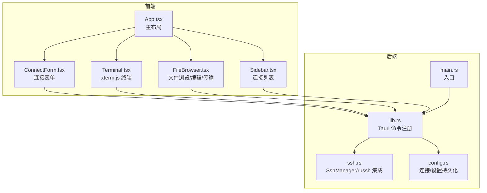
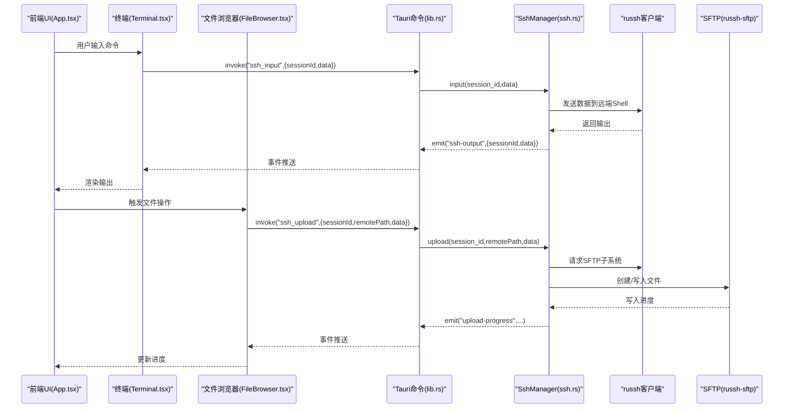
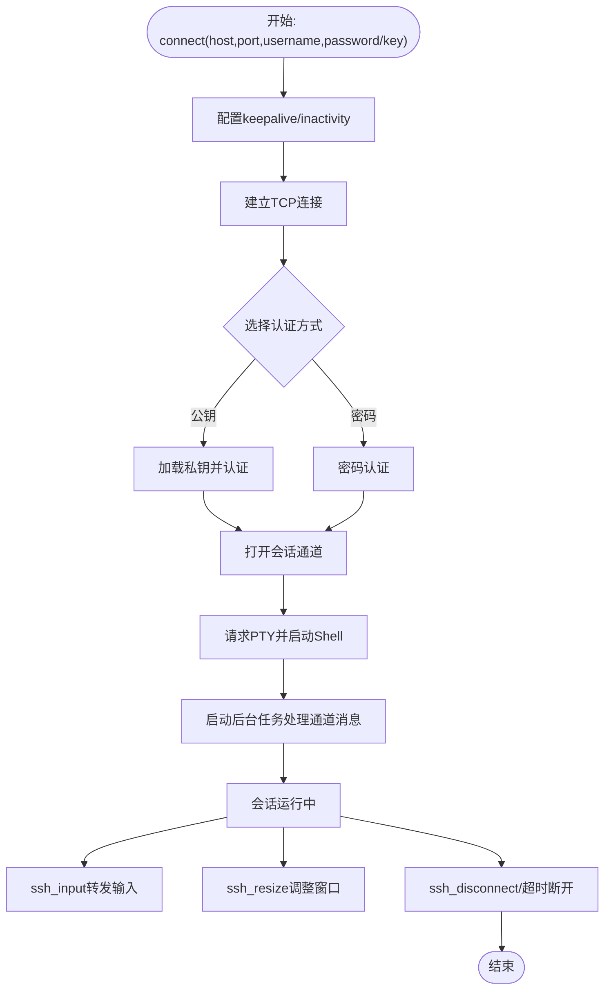
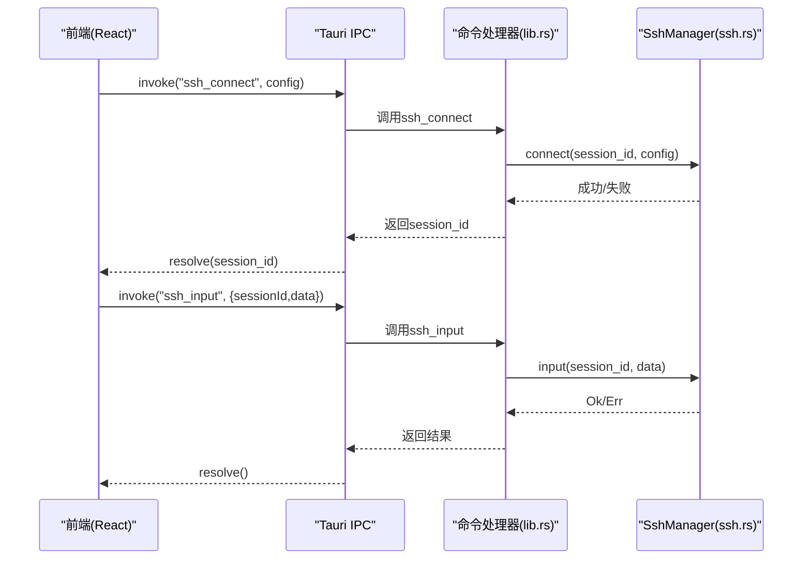
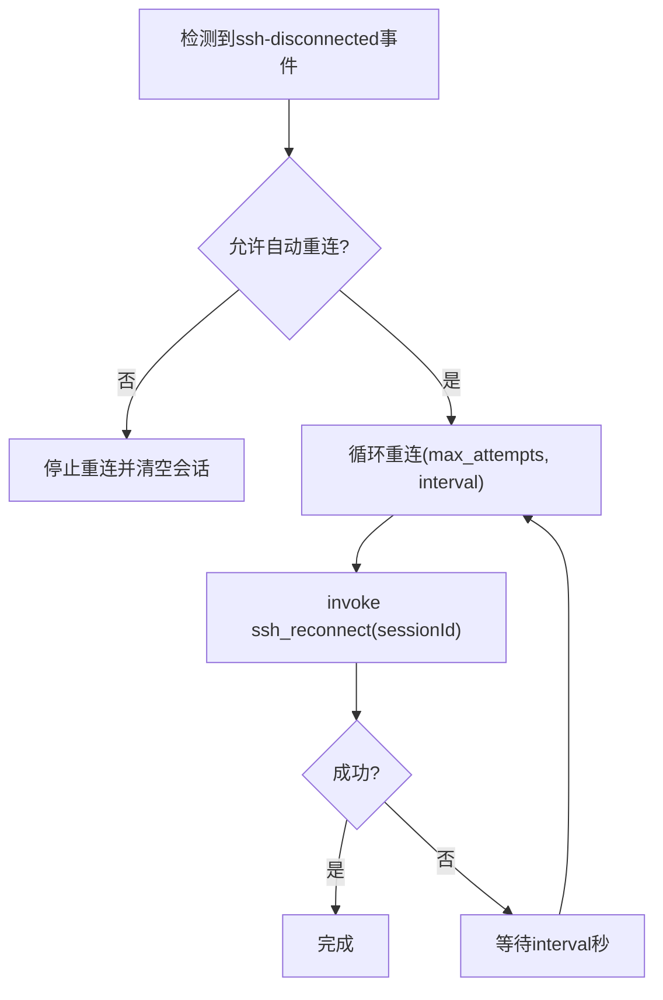
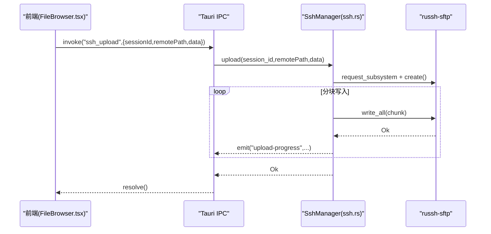
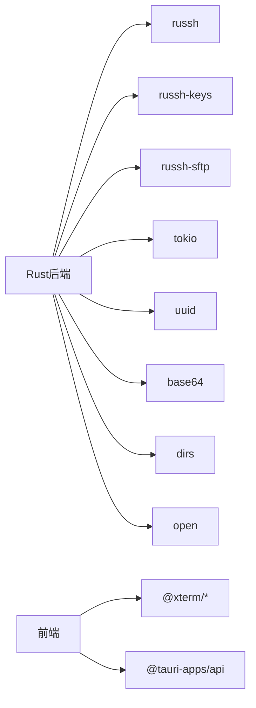

# SSH连接管理

<cite>
**本文引用的文件**
- [main.rs](file://src-tauri/src/main.rs)
- [lib.rs](file://src-tauri/src/lib.rs)
- [ssh.rs](file://src-tauri/src/ssh.rs)
- [config.rs](file://src-tauri/src/config.rs)
- [Cargo.toml](file://src-tauri/Cargo.toml)
- [tauri.conf.json](file://src-tauri/tauri.conf.json)
- [App.tsx](file://src/App.tsx)
- [Terminal.tsx](file://src/components/Terminal.tsx)
- [FileBrowser.tsx](file://src/components/FileBrowser.tsx)
- [ConnectForm.tsx](file://src/components/ConnectForm.tsx)
- [Sidebar.tsx](file://src/components/Sidebar.tsx)
- [README.md](file://README.md)
</cite>

## 目录
1. [简介](#简介)
2. [项目结构](#项目结构)
3. [核心组件](#核心组件)
4. [架构总览](#架构总览)
5. [详细组件分析](#详细组件分析)
6. [依赖关系分析](#依赖关系分析)
7. [性能考虑](#性能考虑)
8. [故障排查指南](#故障排查指南)
9. [结论](#结论)
10. [附录](#附录)

## 简介
本项目是一个基于 Tauri 的跨平台桌面 SSH 管理工具，提供终端交互与远程文件管理能力。后端使用 Rust + russh 实现 SSH 会话管理，前端采用 React + xterm.js 构建用户界面。系统支持密码认证与公钥认证、会话生命周期管理、自动重连、SFTP 文件操作、下载进度与上传进度事件推送等特性。

## 项目结构
- 后端（Rust）位于 src-tauri，包含 Tauri 命令注册、SSH 管理器、配置管理与 russh 集成。
- 前端（React）位于 src，包含主应用布局、终端组件、文件浏览器、连接表单与侧边栏。
- 构建与打包配置位于 tauri.conf.json 与 Cargo.toml。

图表来源
- [main.rs:1-7](file://src-tauri/src/main.rs#L1-L7)
- [lib.rs:268-319](file://src-tauri/src/lib.rs#L268-L319)
- [ssh.rs:58-654](file://src-tauri/src/ssh.rs#L58-L654)
- [config.rs:1-113](file://src-tauri/src/config.rs#L1-L113)
- [App.tsx:37-415](file://src/App.tsx#L37-L415)
- [Terminal.tsx:17-150](file://src/components/Terminal.tsx#L17-L150)
- [FileBrowser.tsx:154-800](file://src/components/FileBrowser.tsx#L154-L800)
- [ConnectForm.tsx:26-232](file://src/components/ConnectForm.tsx#L26-L232)
- [Sidebar.tsx:28-155](file://src/components/Sidebar.tsx#L28-L155)

章节来源
- [README.md:49-74](file://README.md#L49-L74)
- [tauri.conf.json:1-41](file://src-tauri/tauri.conf.json#L1-L41)
- [Cargo.toml:18-33](file://src-tauri/Cargo.toml#L18-L33)

## 核心组件
- SshManager：负责 SSH 会话的创建、输入转发、窗口大小调整、SFTP 文件操作、断开与重连。
- Russh 集成：通过 russh 客户端建立连接、进行密码或公钥认证、请求 PTY 与 Shell、处理通道消息。
- Tauri 命令系统：将 Rust 中的 SSH 操作暴露为前端可调用的命令，并通过事件向前端推送输出与进度。
- 配置管理：本地 JSON 文件存储连接配置与应用设置（自动重连策略）。
- 前端组件：Terminal（xterm.js）、FileBrowser（SFTP 文件操作）、ConnectForm（连接参数）、Sidebar（连接列表）。

章节来源
- [lib.rs:21-319](file://src-tauri/src/lib.rs#L21-L319)
- [ssh.rs:58-654](file://src-tauri/src/ssh.rs#L58-L654)
- [config.rs:1-113](file://src-tauri/src/config.rs#L1-L113)
- [App.tsx:37-415](file://src/App.tsx#L37-L415)

## 架构总览
系统采用“前端事件驱动 + 后端命令执行”的模式：
- 前端通过 Tauri IPC 调用后端命令（如 ssh_connect、ssh_input、ssh_upload 等）。
- 后端在 Rust 中执行 SSH 操作，通过事件（如 ssh-output、upload-progress、download-progress）向前端推送实时数据。
- 自动重连由前端监听断开事件后触发 ssh_reconnect 命令实现。

图表来源
- [lib.rs:21-319](file://src-tauri/src/lib.rs#L21-L319)
- [ssh.rs:520-583](file://src-tauri/src/ssh.rs#L520-L583)
- [Terminal.tsx:68-120](file://src/components/Terminal.tsx#L68-L120)
- [FileBrowser.tsx:286-337](file://src/components/FileBrowser.tsx#L286-L337)

## 详细组件分析

### SSH会话生命周期与russh集成
- 连接建立：SshManager.connect 使用 russh::client::connect 建立 TCP 连接，随后根据是否提供 keyPath 或 password 选择公钥或密码认证。
- 会话初始化：认证成功后打开会话通道，请求 PTY 并启动 Shell；同时启动后台任务处理通道消息、输入转发与窗口变化。
- 数据流：通道收到的数据通过事件推送至前端；前端输入通过 ssh_input 命令转发给后端，再发送到远端。
- 断开与超时：disconnect 使用超时避免死锁；reconnect 在超时时间内复用原连接信息重新连接。

图表来源
- [ssh.rs:71-199](file://src-tauri/src/ssh.rs#L71-L199)
- [ssh.rs:201-223](file://src-tauri/src/ssh.rs#L201-L223)
- [ssh.rs:213-223](file://src-tauri/src/ssh.rs#L213-L223)
- [ssh.rs:617-627](file://src-tauri/src/ssh.rs#L617-L627)
- [ssh.rs:633-652](file://src-tauri/src/ssh.rs#L633-L652)

章节来源
- [ssh.rs:71-199](file://src-tauri/src/ssh.rs#L71-L199)
- [ssh.rs:201-223](file://src-tauri/src/ssh.rs#L201-L223)
- [ssh.rs:213-223](file://src-tauri/src/ssh.rs#L213-L223)
- [ssh.rs:617-627](file://src-tauri/src/ssh.rs#L617-L627)
- [ssh.rs:633-652](file://src-tauri/src/ssh.rs#L633-L652)

### Tauri命令系统与前后端通信
- 命令注册：lib.rs 中通过 #[tauri::command] 注册所有 SSH 相关命令与配置命令，并在 run() 中统一注册到 Tauri。
- 前端调用：前端通过 @tauri-apps/api 的 invoke 调用后端命令；通过 listen 订阅事件以接收实时数据。
- 数据传输：命令参数与返回值使用 JSON 序列化；大文件上传采用 Base64 字符串传输，便于跨语言边界传递。

图表来源
- [lib.rs:21-319](file://src-tauri/src/lib.rs#L21-L319)
- [App.tsx:180-223](file://src/App.tsx#L180-L223)
- [Terminal.tsx:68-73](file://src/components/Terminal.tsx#L68-L73)

章节来源
- [lib.rs:21-319](file://src-tauri/src/lib.rs#L21-L319)
- [App.tsx:180-223](file://src/App.tsx#L180-L223)
- [Terminal.tsx:68-73](file://src/components/Terminal.tsx#L68-L73)

### 自动重连机制与错误处理
- 前端策略：App.tsx 监听 ssh-disconnected 事件，根据设置决定是否自动重连；按间隔与最大尝试次数循环重试。
- 后端策略：SshManager.reconnect 先断开旧会话（带超时），再以相同凭据重新连接（整体超时控制）。
- 错误处理：命令层统一返回 Result<String, String>，事件层对下载/上传进度进行状态标记与错误上报。

图表来源
- [App.tsx:124-164](file://src/App.tsx#L124-L164)
- [App.tsx:138-157](file://src/App.tsx#L138-L157)
- [ssh.rs:633-652](file://src-tauri/src/ssh.rs#L633-L652)

章节来源
- [App.tsx:124-164](file://src/App.tsx#L124-L164)
- [App.tsx:138-157](file://src/App.tsx#L138-L157)
- [ssh.rs:633-652](file://src-tauri/src/ssh.rs#L633-L652)

### SFTP文件操作与进度事件
- 列表/读取/写入/删除/重命名/复制/权限设置/空间检查/下载/上传等均通过 SFTP 实现。
- 上传采用分块写入并逐块发送进度事件；下载通过远端 curl 输出解析进度百分比并推送事件。
- 大文件读取限制在 1MB 以内，避免内存压力。

图表来源
- [ssh.rs:520-583](file://src-tauri/src/ssh.rs#L520-L583)
- [FileBrowser.tsx:286-337](file://src/components/FileBrowser.tsx#L286-L337)

章节来源
- [ssh.rs:288-307](file://src-tauri/src/ssh.rs#L288-L307)
- [ssh.rs:309-336](file://src-tauri/src/ssh.rs#L309-L336)
- [ssh.rs:338-357](file://src-tauri/src/ssh.rs#L338-L357)
- [ssh.rs:359-383](file://src-tauri/src/ssh.rs#L359-L383)
- [ssh.rs:385-417](file://src-tauri/src/ssh.rs#L385-L417)
- [ssh.rs:419-446](file://src-tauri/src/ssh.rs#L419-L446)
- [ssh.rs:449-518](file://src-tauri/src/ssh.rs#L449-L518)
- [ssh.rs:520-583](file://src-tauri/src/ssh.rs#L520-L583)

### 连接参数验证与认证方式选择
- 参数校验：前端表单对 host/port/username 进行基本校验；后端命令参数结构体定义了必填字段。
- 认证选择：优先使用公钥（keyPath），否则使用密码（password）。未提供任一认证方式则报错。
- 凭据安全：密码仅在需要时提示输入；公钥路径由用户指定。

章节来源
- [ConnectForm.tsx:59-73](file://src/components/ConnectForm.tsx#L59-L73)
- [lib.rs:11-19](file://src-tauri/src/lib.rs#L11-L19)
- [ssh.rs:94-106](file://src-tauri/src/ssh.rs#L94-L106)

### SSH配置管理与设置持久化
- 连接配置：config.rs 提供 list/save/delete 接口，数据保存在本地 JSON 文件中（按系统配置目录）。
- 应用设置：默认启用自动重连，重连间隔与最大尝试次数可配置；设置同样持久化到本地文件。

章节来源
- [config.rs:29-58](file://src-tauri/src/config.rs#L29-L58)
- [config.rs:96-112](file://src-tauri/src/config.rs#L96-L112)
- [App.tsx:104-121](file://src/App.tsx#L104-L121)

## 依赖关系分析
- Rust 依赖：russh、russh-keys、russh-sftp、tokio、uuid、base64、dirs、open 等。
- 前端依赖：@xterm/xterm、@xterm/addon-fit、@xterm/addon-web-links、@tauri-apps/api。
- Tauri 配置：窗口尺寸、打包图标、开发/构建脚本等。

图表来源
- [Cargo.toml:18-33](file://src-tauri/Cargo.toml#L18-L33)
- [tauri.conf.json:26-39](file://src-tauri/tauri.conf.json#L26-L39)

章节来源
- [Cargo.toml:18-33](file://src-tauri/Cargo.toml#L18-L33)
- [tauri.conf.json:26-39](file://src-tauri/tauri.conf.json#L26-L39)

## 性能考虑
- 通道与事件：使用 mpsc 通道与 select! 处理多路事件，避免阻塞；后台任务独立持有通道句柄。
- SFTP 写入：分块写入（32KB）并逐块发送进度，减少单次写入时间与内存占用。
- 下载进度：解析 curl -# 输出中的百分比，避免额外进程开销。
- 超时控制：连接、断开、重连均设置超时，防止 UI 卡死。
- 大文件读取：限制读取上限（1MB），避免内存压力。

章节来源
- [ssh.rs:132-178](file://src-tauri/src/ssh.rs#L132-L178)
- [ssh.rs:550-583](file://src-tauri/src/ssh.rs#L550-L583)
- [ssh.rs:469-498](file://src-tauri/src/ssh.rs#L469-L498)
- [ssh.rs:617-627](file://src-tauri/src/ssh.rs#L617-L627)
- [ssh.rs:639-652](file://src-tauri/src/ssh.rs#L639-L652)
- [ssh.rs:318-323](file://src-tauri/src/ssh.rs#L318-L323)

## 故障排查指南
- 连接失败
  - 检查 host/port 是否可达；确认用户名与认证方式（公钥/密码）正确。
  - 查看后端日志（开发模式下启用 tauri-plugin-log）。
- 认证失败
  - 公钥：确认 keyPath 正确且私钥未加密或提供正确密码；检查服务器 authorized_keys。
  - 密码：确认密码正确且服务器允许密码登录。
- 会话断开
  - 前端会监听 ssh-disconnected 事件并触发自动重连；若禁用自动重连，需手动重连。
  - 后端断开使用超时保护，避免长时间卡死。
- 上传/下载异常
  - 上传：检查目标目录权限与磁盘空间；关注 upload-progress 事件。
  - 下载：检查 URL 可达性与远端 curl 可用性；关注 download-progress 事件。
- 文件操作失败
  - 检查路径是否存在；权限不足时无法创建/删除/修改文件。

章节来源
- [ssh.rs:94-106](file://src-tauri/src/ssh.rs#L94-L106)
- [ssh.rs:617-627](file://src-tauri/src/ssh.rs#L617-L627)
- [FileBrowser.tsx:268-284](file://src/components/FileBrowser.tsx#L268-L284)
- [FileBrowser.tsx:286-337](file://src/components/FileBrowser.tsx#L286-L337)

## 结论
本项目通过 Tauri 将 Rust 的高性能 SSH 能力与 React 的易用界面结合，提供了完整的 SSH 连接、终端交互与文件管理能力。russh 集成完善、命令系统清晰、事件推送及时，配合自动重连与合理的性能策略，能够满足日常运维与开发场景的需求。建议在生产环境中进一步增强日志与错误分类、增加连接池与并发会话管理能力。

## 附录
- 开发与打包
  - 开发：npx tauri dev
  - 打包：npx tauri build
- 技术栈概览
  - 后端：Rust + russh + tokio
  - 桌面：Tauri 2.x
  - 前端：React + xterm.js
  - 通信：Tauri IPC + 事件

章节来源
- [README.md:9-38](file://README.md#L9-L38)