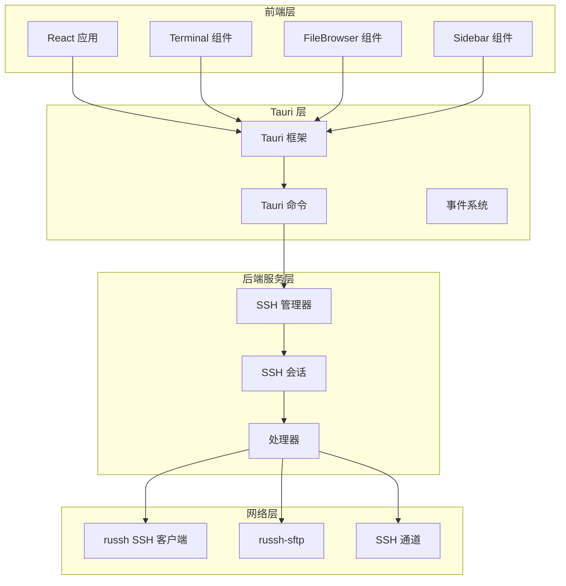
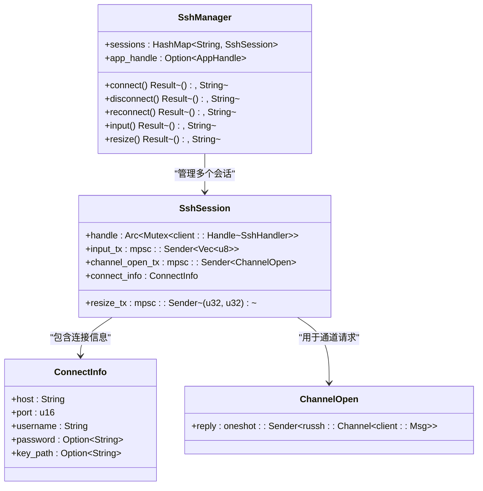
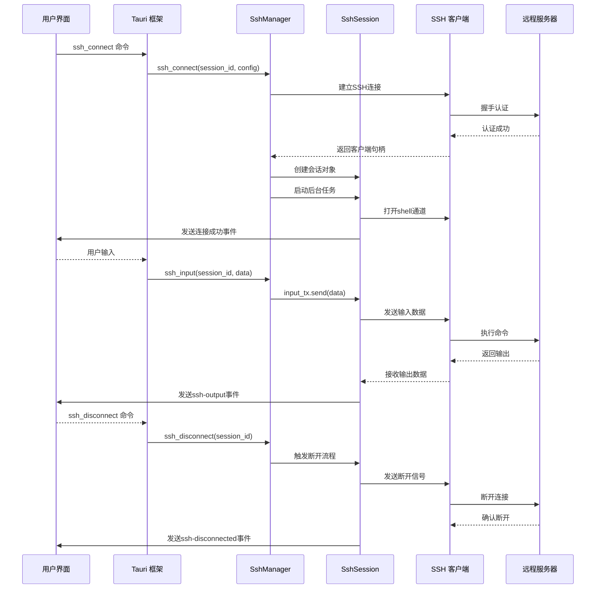
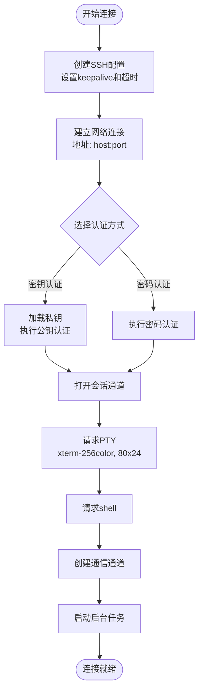
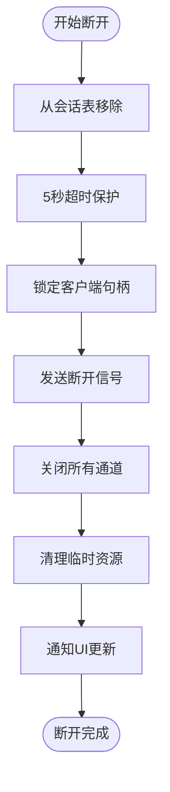
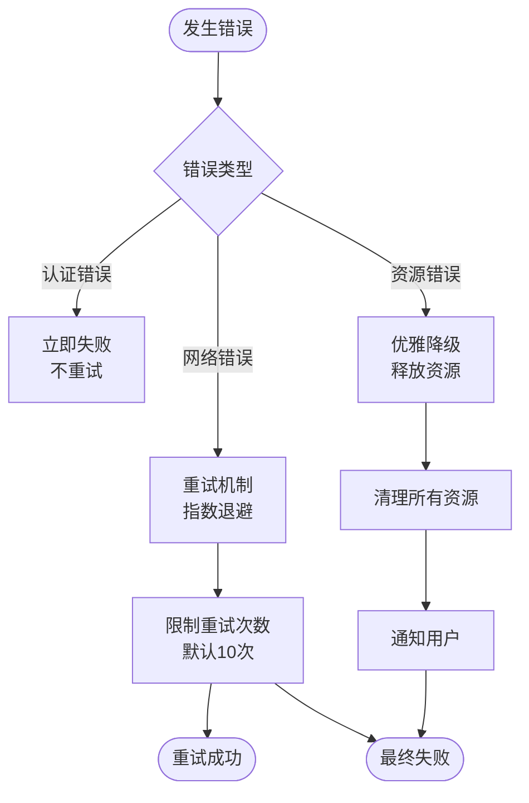
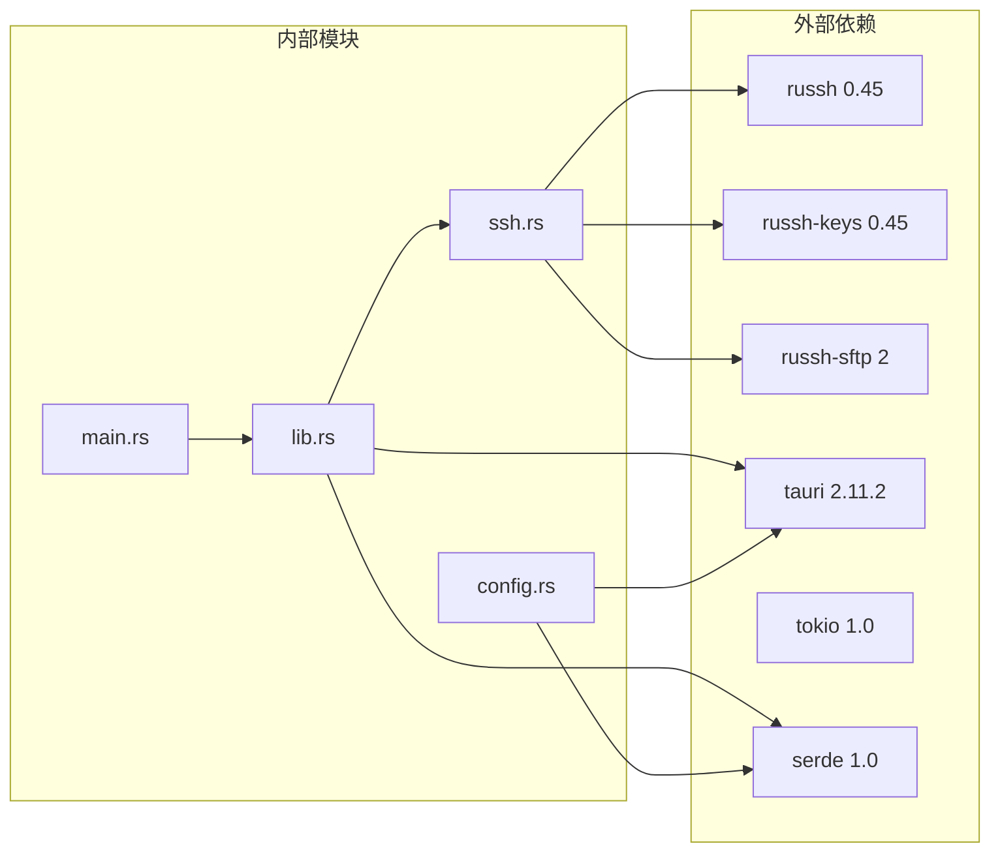

# 会话生命周期管理

<cite>
**本文档引用的文件**
- [src-tauri/src/ssh.rs](file://src-tauri/src/ssh.rs)
- [src-tauri/src/lib.rs](file://src-tauri/src/lib.rs)
- [src-tauri/src/main.rs](file://src-tauri/src/main.rs)
- [src-tauri/Cargo.toml](file://src-tauri/Cargo.toml)
- [src/App.tsx](file://src/App.tsx)
- [src/components/Terminal.tsx](file://src/components/Terminal.tsx)
- [src-tauri/src/config.rs](file://src-tauri/src/config.rs)
</cite>

## 目录
1. [简介](#简介)
2. [项目结构](#项目结构)
3. [核心组件](#核心组件)
4. [架构概览](#架构概览)
5. [详细组件分析](#详细组件分析)
6. [依赖关系分析](#依赖关系分析)
7. [性能考虑](#性能考虑)
8. [故障排除指南](#故障排除指南)
9. [结论](#结论)

## 简介

SSH会话生命周期管理是本SSH工具项目的核心功能模块，负责管理SSH连接的完整生命周期，从建立连接到最终断开的整个过程。该系统基于Rust语言和russh库构建，采用Tokio异步运行时，提供了可靠的SSH会话管理和终端交互功能。

本项目采用前后端分离的架构设计：
- **后端**：使用Tauri框架和Rust语言，通过命令接口提供SSH连接管理
- **前端**：使用React和TypeScript构建用户界面，通过IPC与后端通信
- **通信机制**：通过Tauri的IPC（进程间通信）和事件系统实现双向数据传输

## 项目结构

项目采用模块化的组织方式，主要分为以下层次：



**图表来源**
- [src-tauri/src/lib.rs:268-318](file://src-tauri/src/lib.rs#L268-L318)
- [src-tauri/src/ssh.rs:58-61](file://src-tauri/src/ssh.rs#L58-L61)

**章节来源**
- [src-tauri/src/main.rs:1-7](file://src-tauri/src/main.rs#L1-L7)
- [src-tauri/src/lib.rs:268-318](file://src-tauri/src/lib.rs#L268-L318)
- [src-tauri/Cargo.toml:18-33](file://src-tauri/Cargo.toml#L18-L33)

## 核心组件

### SshSession 结构体详解

SshSession是会话生命周期管理的核心数据结构，负责维护单个SSH会话的所有状态信息：



**图表来源**
- [src-tauri/src/ssh.rs:50-56](file://src-tauri/src/ssh.rs#L50-L56)
- [src-tauri/src/ssh.rs:58-61](file://src-tauri/src/ssh.rs#L58-L61)
- [src-tauri/src/ssh.rs:37-44](file://src-tauri/src/ssh.rs#L37-L44)
- [src-tauri/src/ssh.rs:46-48](file://src-tauri/src/ssh.rs#L46-L48)

每个字段都有明确的职责分工：

#### handle 字段
- **类型**：`Arc<Mutex<client::Handle<SshHandler>>>`
- **作用**：持有SSH客户端句柄的共享所有权，允许在多个任务之间安全传递
- **特性**：使用Arc实现线程安全的引用计数，Mutex确保并发访问安全
- **生命周期**：与整个会话生命周期绑定，直到会话被销毁

#### input_tx 字段
- **类型**：`mpsc::Sender<Vec<u8>>`
- **作用**：接收来自前端的用户输入数据
- **容量**：256个消息缓冲区，防止阻塞前端UI
- **用途**：将用户键盘输入转发到SSH会话的shell通道

#### resize_tx 字段
- **类型**：`mpsc::Sender<(u32, u32)>`
- **作用**：接收终端尺寸变化通知
- **容量**：32个消息缓冲区，支持快速连续的尺寸调整
- **用途**：向远程shell发送窗口大小变化信号

#### channel_open_tx 字段
- **类型**：`mpsc::Sender<ChannelOpen>`
- **作用**：协调会话通道的打开请求
- **容量**：8个请求缓冲区，限制并发通道数量
- **机制**：使用oneshot通道进行请求-响应模式

**章节来源**
- [src-tauri/src/ssh.rs:50-56](file://src-tauri/src/ssh.rs#L50-L56)

### SshManager 管理器

SshManager是会话管理的核心控制器，负责：
- 会话的创建、维护和销毁
- 连接状态监控和异常处理
- 自动重连机制
- 资源清理和内存管理

**章节来源**
- [src-tauri/src/ssh.rs:58-61](file://src-tauri/src/ssh.rs#L58-L61)

## 架构概览

SSH会话生命周期管理系统采用分层架构设计，确保了良好的可维护性和扩展性：



**图表来源**
- [src-tauri/src/lib.rs:21-41](file://src-tauri/src/lib.rs#L21-L41)
- [src-tauri/src/ssh.rs:71-199](file://src-tauri/src/ssh.rs#L71-L199)

## 详细组件分析

### 会话状态管理

系统实现了完整的会话状态管理机制，包括连接建立、活跃状态监控、空闲检测和自动断开：

#### 连接建立流程



**图表来源**
- [src-tauri/src/ssh.rs:82-119](file://src-tauri/src/ssh.rs#L82-L119)
- [src-tauri/src/ssh.rs:121-178](file://src-tauri/src/ssh.rs#L121-L178)

#### 活跃状态监控

系统通过多种机制监控会话的活跃状态：

1. **Keepalive机制**：每10秒发送一次保活包，最多3次失败后判定连接死亡
2. **空闲超时**：60秒内无活动则触发超时检查
3. **通道状态监听**：实时监听数据流和关闭事件

#### 空闲检测和自动断开

```mermaid
stateDiagram-v2
[*] --> Connecting
Connecting --> Active : 认证成功
Active --> Monitoring : 会话建立
Monitoring --> Active : 收到数据
Monitoring --> Idle : 60秒无活动
Idle --> Monitoring : 用户操作
Monitoring --> Dead : keepalive失败
Active --> Dead : 连接中断
Dead --> [*] : 清理完成
state Monitoring {
[*] --> Checking
Checking --> Monitoring : keepalive成功
Checking --> Dead : keepalive失败
}
```

**图表来源**
- [src-tauri/src/ssh.rs:83-86](file://src-tauri/src/ssh.rs#L83-L86)
- [src-tauri/src/ssh.rs:135-177](file://src-tauri/src/ssh.rs#L135-L177)

**章节来源**
- [src-tauri/src/ssh.rs:82-119](file://src-tauri/src/ssh.rs#L82-L119)
- [src-tauri/src/ssh.rs:135-177](file://src-tauri/src/ssh.rs#L135-L177)

### 会话清理和资源释放

系统实现了多层次的资源清理策略，确保不会发生资源泄漏：

#### 内存管理

1. **智能指针使用**：所有共享数据都使用`Arc<Mutex<T>>`包装
2. **自动清理**：当会话结束时，所有Arc引用自动释放
3. **通道清理**：MPSC通道在会话结束时自动关闭

#### 文件描述符管理

1. **SFTP会话清理**：每次SFTP操作后自动关闭会话
2. **SSH通道管理**：通过oneshot通道精确控制通道生命周期
3. **网络连接释放**：断开时发送标准断开信号

#### 后台任务终止



**图表来源**
- [src-tauri/src/ssh.rs:617-627](file://src-tauri/src/ssh.rs#L617-L627)

**章节来源**
- [src-tauri/src/ssh.rs:617-627](file://src-tauri/src/ssh.rs#L617-L627)

### 异常处理最佳实践

系统实现了全面的异常处理机制：

#### 死连接检测

1. **Keepalive失败检测**：连续3次保活失败判定为死连接
2. **超时检测**：60秒空闲超时触发检查
3. **通道状态检测**：监听Close/Eof事件判断连接状态

#### 资源泄漏防护

1. **超时保护**：所有断开操作都在5秒超时内完成
2. **通道限制**：最大8个并发通道请求
3. **内存限制**：MPSC通道容量限制防止内存膨胀

#### 优雅降级策略



**图表来源**
- [src/App.tsx:138-157](file://src/App.tsx#L138-L157)
- [src-tauri/src/ssh.rs:633-652](file://src-tauri/src/ssh.rs#L633-L652)

**章节来源**
- [src/App.tsx:138-157](file://src/App.tsx#L138-L157)
- [src-tauri/src/ssh.rs:633-652](file://src-tauri/src/ssh.rs#L633-L652)

## 依赖关系分析

系统依赖关系清晰，遵循单一职责原则：



**图表来源**
- [src-tauri/Cargo.toml:18-33](file://src-tauri/Cargo.toml#L18-L33)
- [src-tauri/src/ssh.rs:1-9](file://src-tauri/src/ssh.rs#L1-L9)

**章节来源**
- [src-tauri/Cargo.toml:18-33](file://src-tauri/Cargo.toml#L18-L33)

## 性能考虑

### 并发模型优化

1. **异步I/O**：使用Tokio异步运行时处理所有网络操作
2. **通道缓冲**：合理设置MPSC通道容量平衡内存使用和性能
3. **连接池**：每个会话独立连接，避免连接竞争

### 内存使用优化

1. **零拷贝设计**：尽量使用引用而非复制数据
2. **智能缓存**：仅缓存必要的会话元数据
3. **及时清理**：会话结束后立即释放所有资源

### 网络效率优化

1. **Keepalive配置**：10秒保活间隔平衡资源消耗和连接稳定性
2. **批量操作**：SFTP操作使用批处理减少网络往返
3. **超时控制**：合理的超时设置避免长时间阻塞

## 故障排除指南

### 常见问题诊断

#### 连接失败排查

1. **网络连接问题**：检查防火墙和网络连通性
2. **认证失败**：验证用户名、密码或密钥文件
3. **服务器拒绝**：检查SSH服务器配置和权限

#### 性能问题排查

1. **高延迟**：检查网络质量，考虑调整keepalive参数
2. **内存泄漏**：确认会话正确断开，检查通道是否关闭
3. **CPU占用高**：检查是否有过多并发操作

#### 自动重连问题

1. **重连循环**：检查重连间隔和最大尝试次数设置
2. **重连失败**：查看日志中的具体错误原因
3. **手动断开误触发**：确认manualDisconnect标志状态

**章节来源**
- [src/App.tsx:124-164](file://src/App.tsx#L124-L164)
- [src-tauri/src/ssh.rs:633-652](file://src-tauri/src/ssh.rs#L633-L652)

## 结论

SSH会话生命周期管理系统通过精心设计的架构和完善的异常处理机制，提供了可靠、高效的SSH连接管理功能。系统的主要优势包括：

1. **可靠性**：多重保活机制和超时保护确保连接稳定
2. **性能**：异步I/O和合理的资源管理提供良好性能
3. **可维护性**：清晰的模块划分和接口设计便于维护
4. **用户体验**：自动重连和优雅降级提升用户满意度

该系统为SSH工具提供了坚实的基础，支持进一步的功能扩展和性能优化。