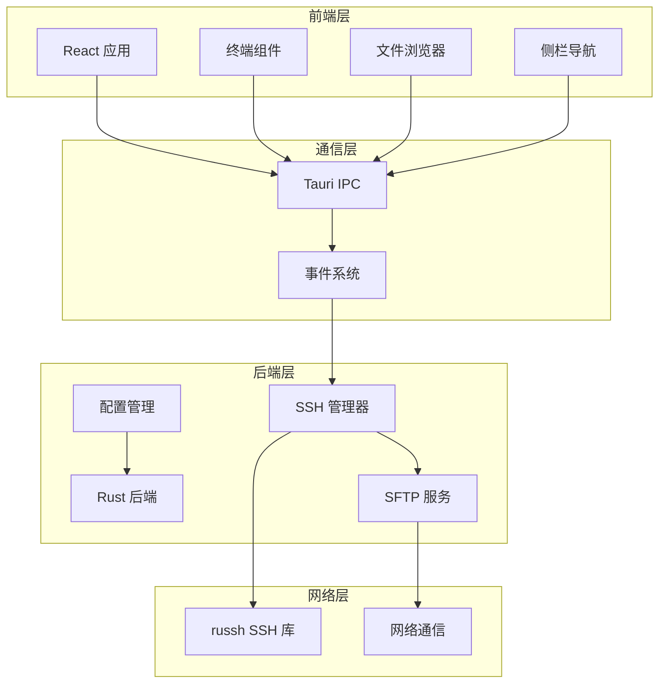
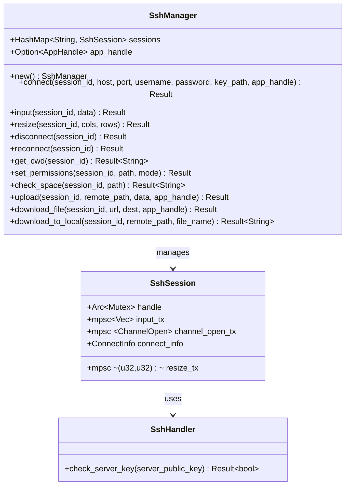
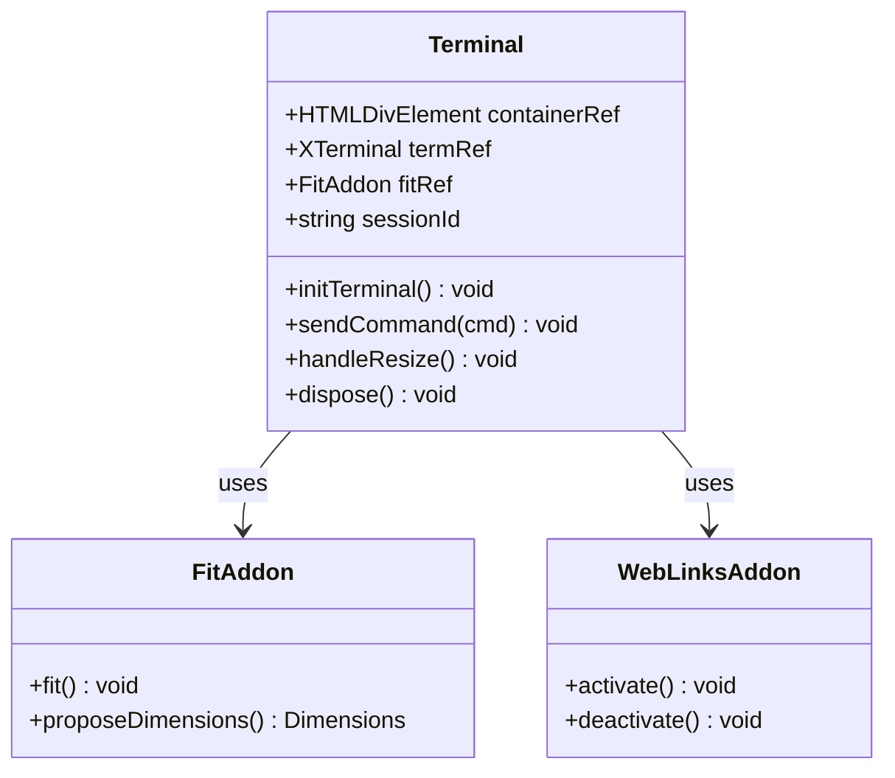
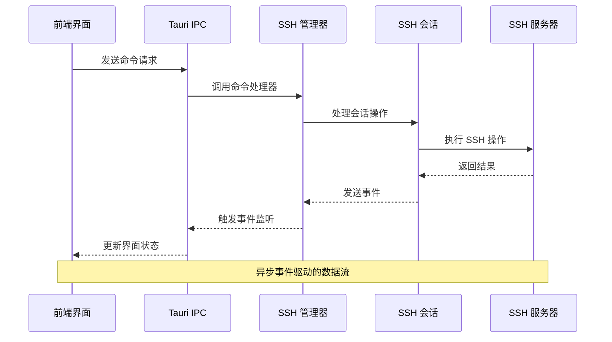
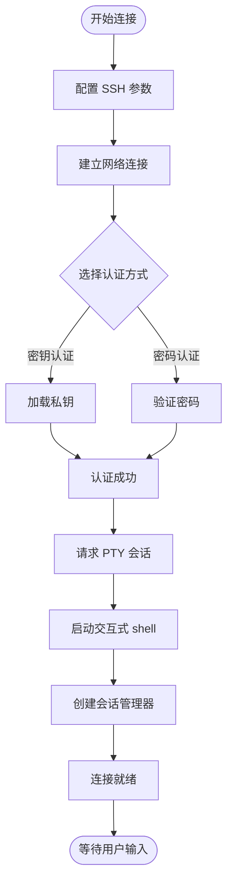
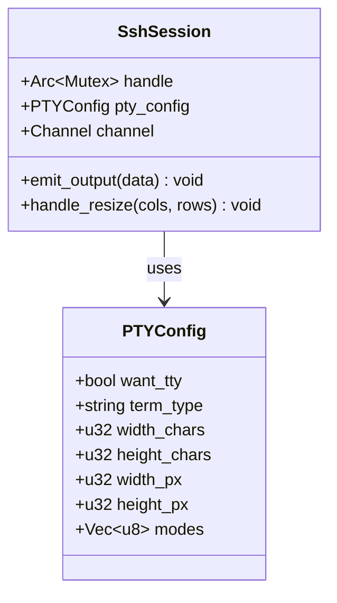
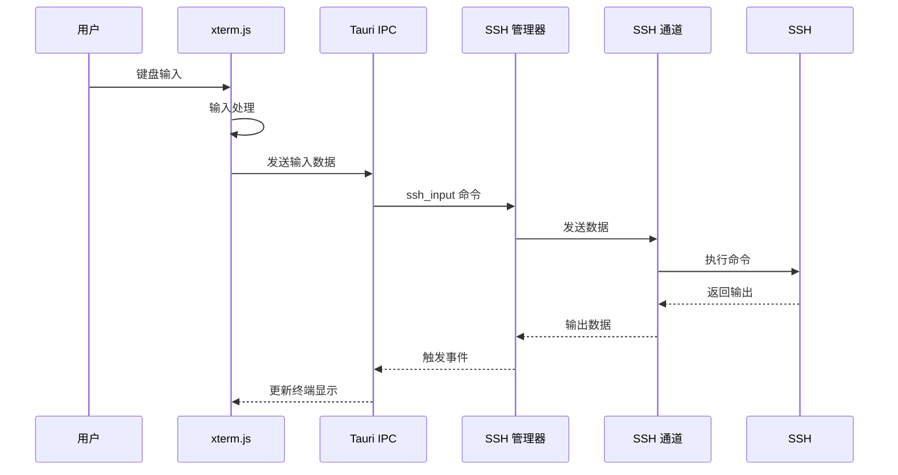
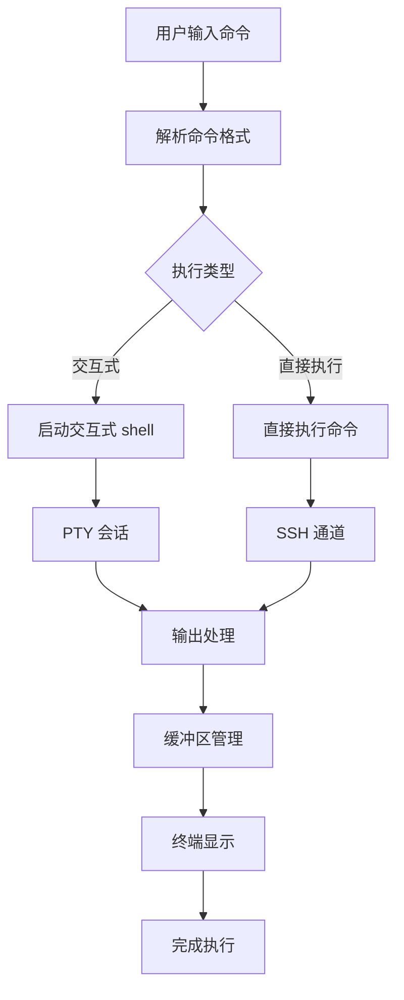
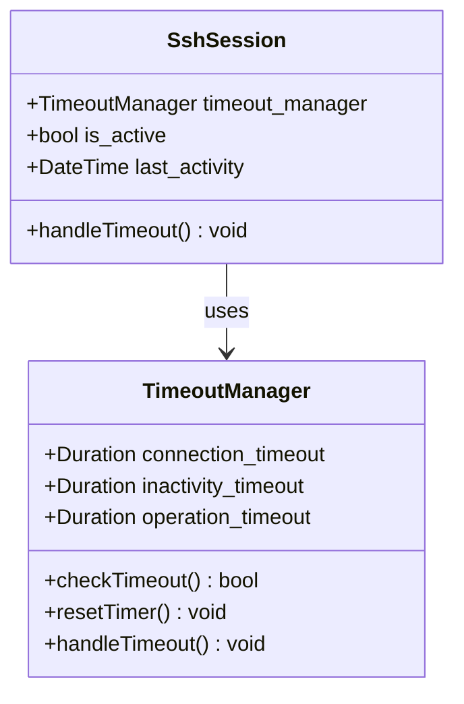
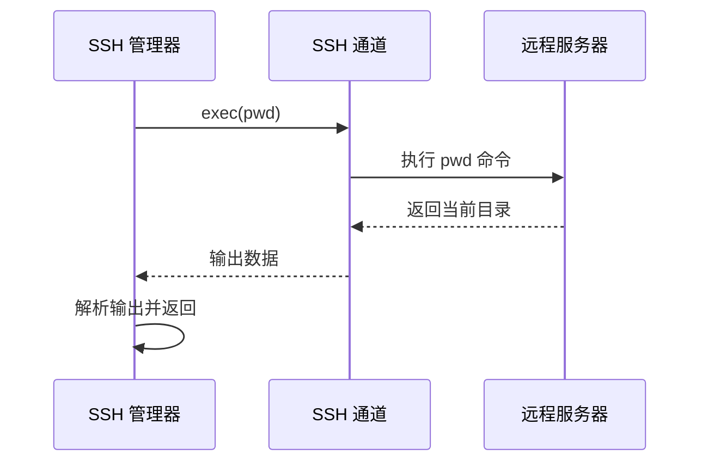

# 命令执行与控制

<cite>
**本文档引用的文件**
- [main.rs](file://src-tauri/src/main.rs)
- [lib.rs](file://src-tauri/src/lib.rs)
- [ssh.rs](file://src-tauri/src/ssh.rs)
- [Terminal.tsx](file://src/components/Terminal.tsx)
- [App.tsx](file://src/App.tsx)
- [FileBrowser.tsx](file://src/components/FileBrowser.tsx)
- [Cargo.toml](file://src-tauri/Cargo.toml)
- [config.rs](file://src-tauri/src/config.rs)
- [README.md](file://README.md)
</cite>

## 目录
1. [简介](#简介)
2. [项目结构](#项目结构)
3. [核心组件](#核心组件)
4. [架构概览](#架构概览)
5. [详细组件分析](#详细组件分析)
6. [TTY和PTY配置管理](#tty和pty配置管理)
7. [输入数据处理管道](#输入数据处理管道)
8. [命令执行流程](#命令执行流程)
9. [错误处理策略](#错误处理策略)
10. [实用功能实现](#实用功能实现)
11. [性能考虑](#性能考虑)
12. [故障排除指南](#故障排除指南)
13. [结论](#结论)

## 简介

SSH Tool 是一个基于 Rust 和 Tauri 的跨平台 SSH 客户端工具，专注于提供高效的命令执行与控制功能。该项目采用现代技术栈，结合了 Rust 的高性能特性、Tauri 的桌面应用框架、以及 xterm.js 的终端模拟器，为用户提供了完整的 SSH 会话管理解决方案。

本项目的核心优势在于其完善的命令执行机制、TTY/PTY 管理、实时数据传输和丰富的实用功能。通过异步架构设计和事件驱动的通信模式，系统能够稳定地处理复杂的 SSH 会话生命周期管理。

## 项目结构

项目采用前后端分离的架构设计，主要分为以下层次：

**图表来源**
- [lib.rs:268-318](file://src-tauri/src/lib.rs#L268-L318)
- [ssh.rs:58-61](file://src-tauri/src/ssh.rs#L58-L61)

**章节来源**
- [README.md:49-73](file://README.md#L49-L73)
- [Cargo.toml:18-33](file://src-tauri/Cargo.toml#L18-L33)

## 核心组件

### SSH 管理器 (SshManager)

SSH 管理器是整个系统的中枢，负责管理所有 SSH 会话的生命周期。它使用 Rust 的异步编程模型，通过 tokio 协程实现高并发的会话处理。

**图表来源**
- [ssh.rs:58-61](file://src-tauri/src/ssh.rs#L58-L61)
- [ssh.rs:50-56](file://src-tauri/src/ssh.rs#L50-L56)
- [ssh.rs:23-35](file://src-tauri/src/ssh.rs#L23-L35)

### 前端终端组件

前端使用 xterm.js 提供现代化的终端体验，支持多种主题和功能扩展。

**图表来源**
- [Terminal.tsx:17-150](file://src/components/Terminal.tsx#L17-L150)

**章节来源**
- [ssh.rs:58-654](file://src-tauri/src/ssh.rs#L58-L654)
- [Terminal.tsx:17-150](file://src/components/Terminal.tsx#L17-L150)

## 架构概览

系统采用事件驱动的异步架构，通过 Tauri 的 IPC 机制实现前后端通信：

**图表来源**
- [lib.rs:21-74](file://src-tauri/src/lib.rs#L21-L74)
- [ssh.rs:132-178](file://src-tauri/src/ssh.rs#L132-L178)

## 详细组件分析

### SSH 连接建立流程

SSH 连接建立过程包含多个关键步骤，从认证到会话初始化：

**图表来源**
- [ssh.rs:71-120](file://src-tauri/src/ssh.rs#L71-L120)

### 会话管理机制

每个 SSH 会话都由独立的协程管理，确保并发安全和资源隔离：

**章节来源**
- [ssh.rs:71-199](file://src-tauri/src/ssh.rs#L71-L199)
- [lib.rs:21-74](file://src-tauri/src/lib.rs#L21-L74)

## TTY和PTY配置管理

### PTY 请求配置

系统在连接建立时自动请求 PTY 会话，确保与远程 shell 的兼容性：

**图表来源**
- [ssh.rs:113-119](file://src-tauri/src/ssh.rs#L113-L119)

### 终端尺寸调整机制

系统实现了动态的终端尺寸调整功能，支持响应式布局变化：

**章节来源**
- [ssh.rs:165-167](file://src-tauri/src/ssh.rs#L165-L167)
- [Terminal.tsx:89-102](file://src/components/Terminal.tsx#L89-L102)

## 输入数据处理管道

### 键盘输入转发流程

前端的键盘输入通过 xterm.js 处理后，经过 Tauri IPC 传递到后端：

**图表来源**
- [Terminal.tsx:68-73](file://src/components/Terminal.tsx#L68-L73)
- [lib.rs:44-52](file://src-tauri/src/lib.rs#L44-L52)

### 特殊字符处理

系统正确处理各种特殊字符和控制序列，确保与标准终端行为一致：

**章节来源**
- [Terminal.tsx:68-73](file://src/components/Terminal.tsx#L68-L73)
- [ssh.rs:156-164](file://src-tauri/src/ssh.rs#L156-L164)

## 命令执行流程

### 交互式命令执行

系统支持直接的命令执行和交互式 shell 会话：

**图表来源**
- [ssh.rs:225-260](file://src-tauri/src/ssh.rs#L225-L260)

### 后台任务管理

每个会话都有独立的后台任务处理数据流：

**章节来源**
- [ssh.rs:132-178](file://src-tauri/src/ssh.rs#L132-L178)
- [ssh.rs:225-260](file://src-tauri/src/ssh.rs#L225-L260)

## 错误处理策略

### 超时控制机制

系统实现了多层次的超时控制，确保资源不会被长时间占用：

**图表来源**
- [ssh.rs:82-87](file://src-tauri/src/ssh.rs#L82-L87)
- [ssh.rs:236-251](file://src-tauri/src/ssh.rs#L236-L251)

### 中断处理机制

系统优雅地处理各种类型的中断情况：

**章节来源**
- [ssh.rs:146-154](file://src-tauri/src/ssh.rs#L146-L154)
- [ssh.rs:617-627](file://src-tauri/src/ssh.rs#L617-L627)

## 实用功能实现

### CWD 获取机制

系统通过执行 `pwd` 命令获取当前工作目录，并实现超时保护：

**图表来源**
- [ssh.rs:225-260](file://src-tauri/src/ssh.rs#L225-L260)

### 权限修改功能

系统提供安全的权限修改功能，包含参数转义和错误处理：

**章节来源**
- [ssh.rs:385-417](file://src-tauri/src/ssh.rs#L385-L417)
- [ssh.rs:420-446](file://src-tauri/src/ssh.rs#L420-L446)

### 空间检查功能

系统实现综合的空间检查，包括磁盘空间、写权限和现有文件检测：

**章节来源**
- [ssh.rs:420-446](file://src-tauri/src/ssh.rs#L420-L446)

## 性能考虑

### 并发优化

系统采用多线程和异步编程模型，最大化利用系统资源：

- **Tokio 运行时**：提供高效的异步任务调度
- **MPSC 通道**：实现零拷贝的数据传输
- **Arc/Mutex**：确保共享状态的安全访问

### 内存管理

系统实现了智能的内存管理策略：

- **缓冲区大小限制**：防止内存泄漏
- **超时清理**：自动释放闲置资源
- **分块传输**：大文件采用分块处理

## 故障排除指南

### 常见问题诊断

1. **连接失败**：检查网络连通性和认证凭据
2. **终端显示异常**：确认 PTY 请求是否成功
3. **命令执行超时**：检查服务器响应时间和超时设置
4. **权限问题**：验证用户权限和文件系统权限

### 日志记录

系统集成了详细的日志记录机制，便于问题诊断：

**章节来源**
- [lib.rs:271-278](file://src-tauri/src/lib.rs#L271-L278)
- [ssh.rs:146-154](file://src-tauri/src/ssh.rs#L146-L154)

## 结论

SSH Tool 项目展示了现代桌面应用开发的最佳实践，通过精心设计的架构实现了高性能、稳定的 SSH 会话管理。系统的关键优势包括：

- **完整的命令执行机制**：支持交互式和非交互式命令执行
- **完善的 TTY/PTY 管理**：确保与各种远程 shell 的兼容性
- **强大的错误处理**：提供超时控制、中断处理和异常恢复
- **丰富的实用功能**：包括 CWD 获取、权限修改、空间检查等
- **优秀的用户体验**：提供流畅的终端交互和文件管理功能

该系统为 SSH 工具开发提供了坚实的基础，可以作为类似项目的参考实现。