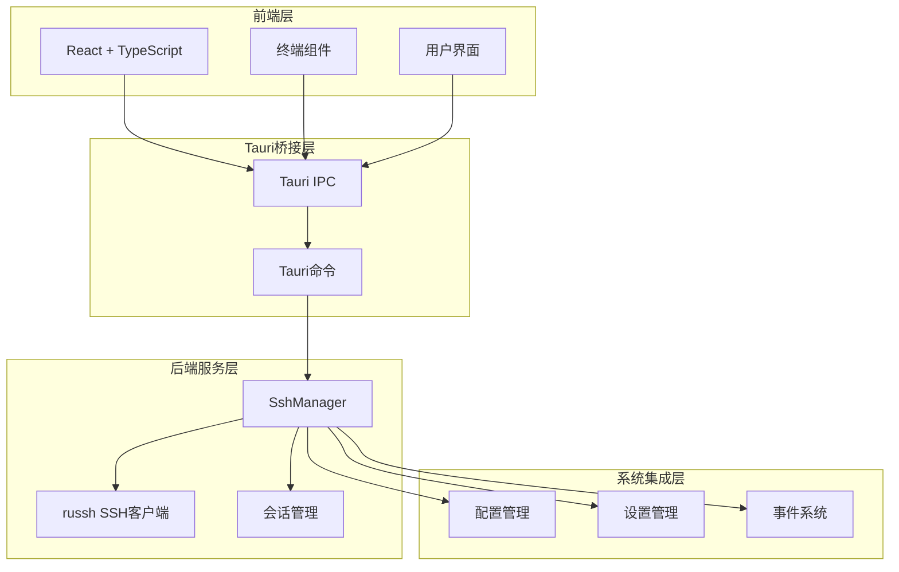
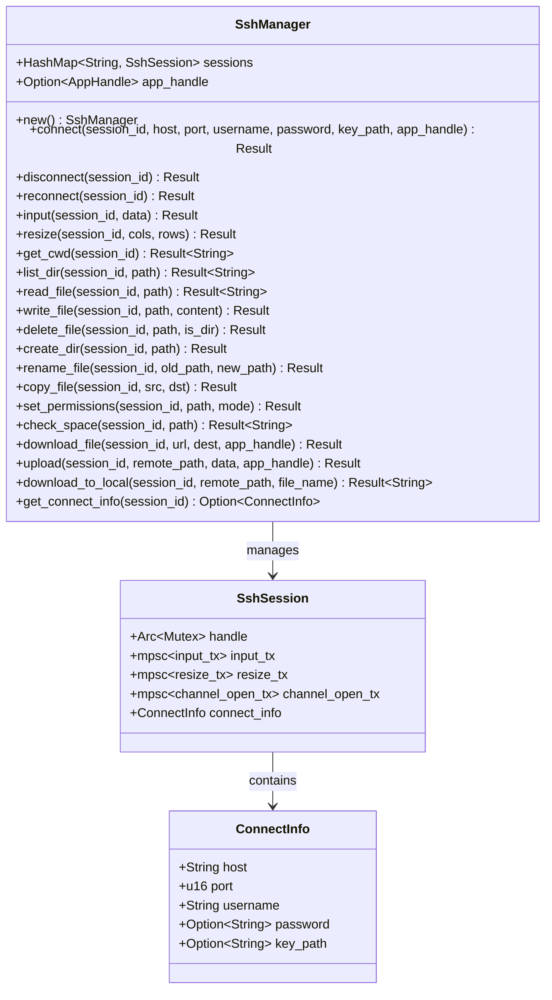
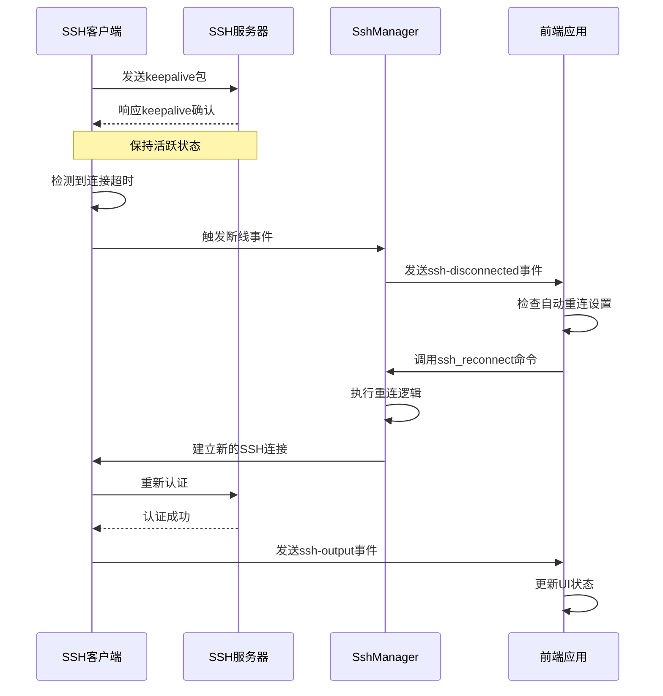
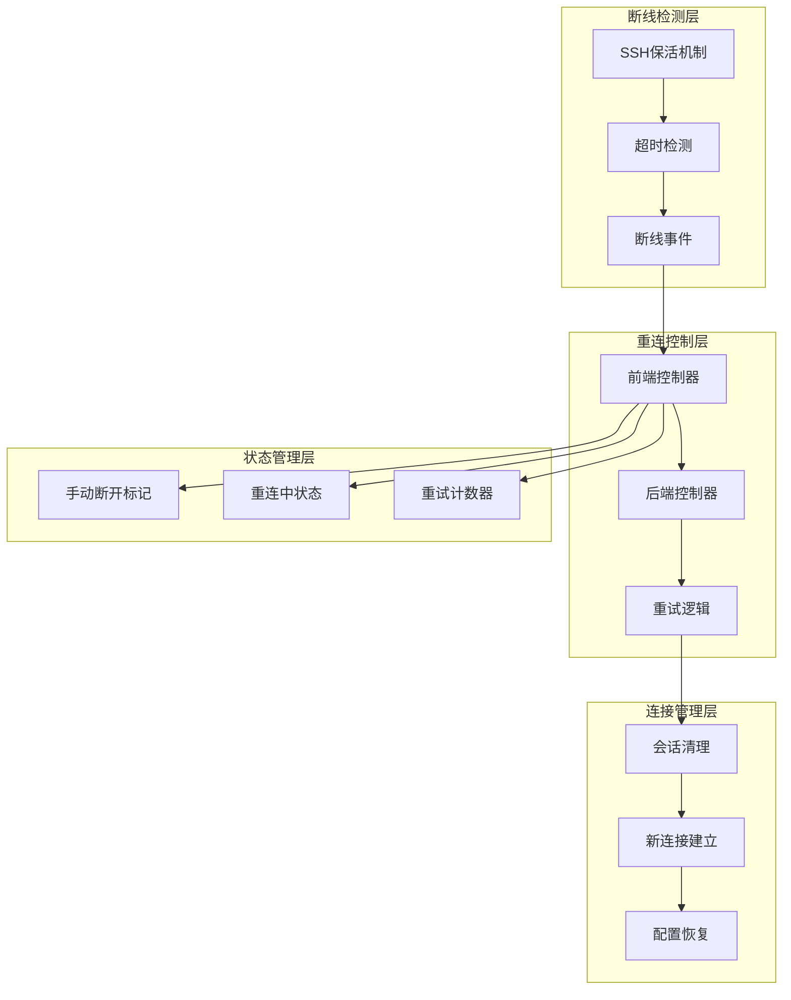
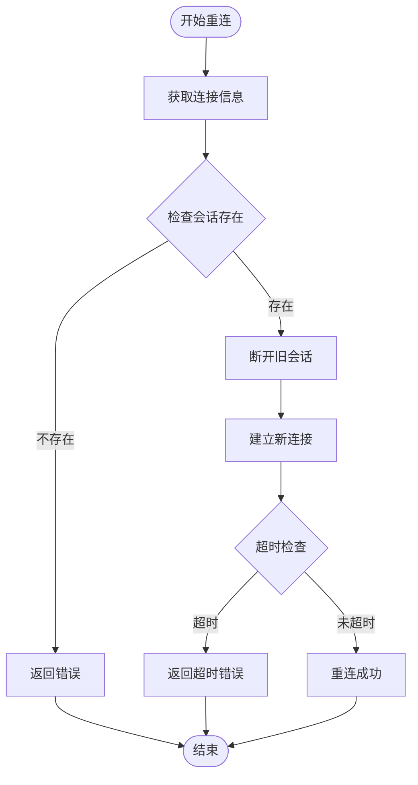
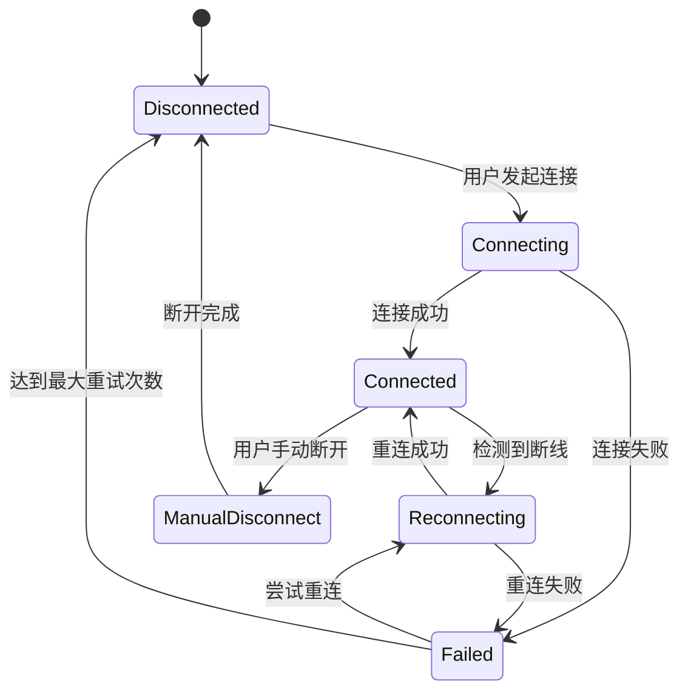
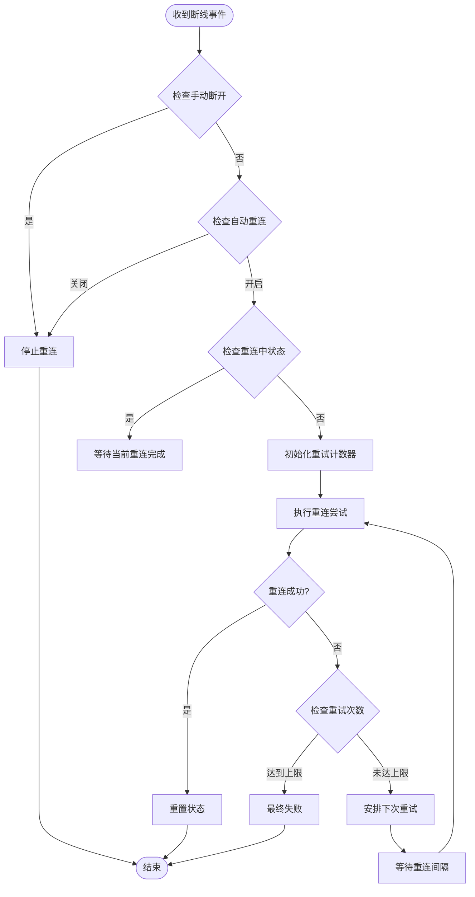
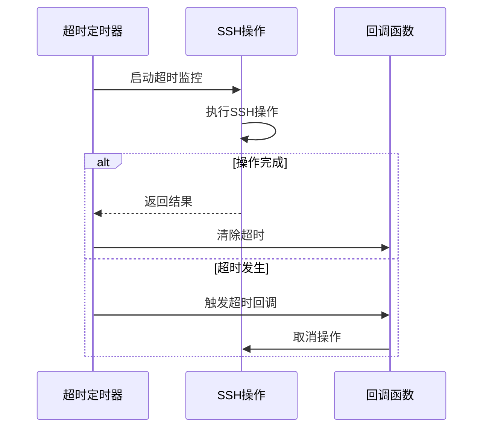
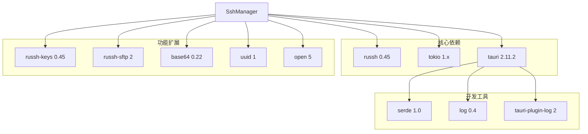
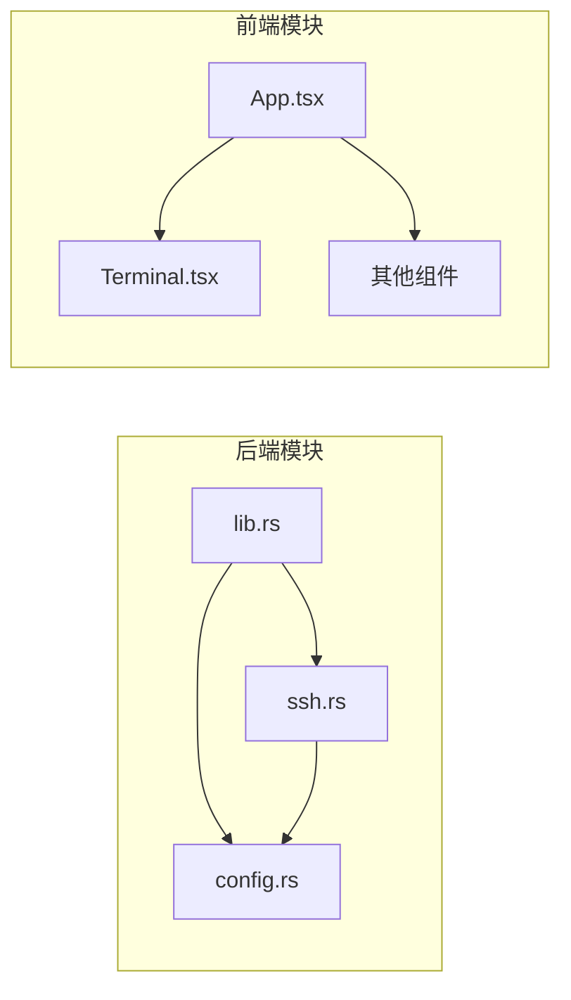

# 自动重连机制

<cite>
**本文档引用的文件**
- [ssh.rs](file://src-tauri/src/ssh.rs)
- [lib.rs](file://src-tauri/src/lib.rs)
- [config.rs](file://src-tauri/src/config.rs)
- [App.tsx](file://src/App.tsx)
- [Terminal.tsx](file://src/components/Terminal.tsx)
- [Cargo.toml](file://src-tauri/Cargo.toml)
- [README.md](file://README.md)
</cite>

## 目录
1. [简介](#简介)
2. [项目结构](#项目结构)
3. [核心组件](#核心组件)
4. [架构概览](#架构概览)
5. [详细组件分析](#详细组件分析)
6. [依赖关系分析](#依赖关系分析)
7. [性能考虑](#性能考虑)
8. [故障排除指南](#故障排除指南)
9. [结论](#结论)

## 简介

本项目实现了基于 Rust 和 Tauri 的 SSH 工具，其中包含完整的自动重连机制。该机制通过 SSH 协议层面的保活机制和应用层的重连策略相结合，确保在网络不稳定或服务器临时中断的情况下能够自动恢复连接。

自动重连机制的核心特性包括：
- 基于 SSH keepalive 的断线检测
- 可配置的重连间隔和最大尝试次数
- 超时控制和资源保护
- 用户手动断开与自动重连的区分
- 前后端协同的完整重连流程

## 项目结构

该项目采用前后端分离的架构设计，主要分为以下层次：

**图表来源**
- [lib.rs:268-318](file://src-tauri/src/lib.rs#L268-L318)
- [ssh.rs:58-653](file://src-tauri/src/ssh.rs#L58-L653)

**章节来源**
- [README.md:49-74](file://README.md#L49-L74)
- [Cargo.toml:18-33](file://src-tauri/Cargo.toml#L18-L33)

## 核心组件

### SSH 管理器 (SshManager)

SshManager 是整个自动重连机制的核心组件，负责管理所有 SSH 会话和重连逻辑。

**图表来源**
- [ssh.rs:58-653](file://src-tauri/src/ssh.rs#L58-L653)

### 断线检测机制

系统通过 SSH 协议层面的保活机制实现断线检测：

**图表来源**
- [ssh.rs:82-87](file://src-tauri/src/ssh.rs#L82-L87)
- [ssh.rs:146-151](file://src-tauri/src/ssh.rs#L146-L151)
- [App.tsx:124-164](file://src/App.tsx#L124-L164)

**章节来源**
- [ssh.rs:82-87](file://src-tauri/src/ssh.rs#L82-L87)
- [ssh.rs:146-151](file://src-tauri/src/ssh.rs#L146-L151)

## 架构概览

自动重连机制的整体架构由四个主要部分组成：

**图表来源**
- [ssh.rs:633-652](file://src-tauri/src/ssh.rs#L633-L652)
- [App.tsx:124-164](file://src/App.tsx#L124-L164)

## 详细组件分析

### 重连函数实现原理

#### reconnect 函数分析

reconnect 函数是自动重连机制的核心实现，其工作流程如下：

**图表来源**
- [ssh.rs:633-652](file://src-tauri/src/ssh.rs#L633-L652)

#### 断线检测机制

系统通过以下方式实现断线检测：

1. **SSH 保活配置**：设置 keepalive 间隔和最大保活次数
2. **空闲超时检测**：检测连接空闲时间超过设定阈值
3. **通道关闭检测**：监听 SSH 通道的 Close/Eof 事件
4. **数据发送失败检测**：捕获数据传输异常

**章节来源**
- [ssh.rs:82-87](file://src-tauri/src/ssh.rs#L82-L87)
- [ssh.rs:146-151](file://src-tauri/src/ssh.rs#L146-L151)

### 状态管理机制

#### 会话状态管理

**图表来源**
- [App.tsx:124-164](file://src/App.tsx#L124-L164)
- [ssh.rs:633-652](file://src-tauri/src/ssh.rs#L633-L652)

#### 前端状态管理

前端使用 React hooks 管理重连状态：

- `manualDisconnectRef`: 标记用户手动断开
- `reconnectingRef`: 标记当前是否在重连中
- `reconnectAttemptRef`: 记录重试次数
- `autoReconnectRef`: 存储自动重连设置

**章节来源**
- [App.tsx:57-59](file://src/App.tsx#L57-L59)
- [App.tsx:124-164](file://src/App.tsx#L124-L164)

### 重连策略分析

#### 重连参数配置

系统支持以下可配置参数：

| 参数名称 | 默认值 | 描述 | 范围 |
|---------|--------|------|------|
| auto_reconnect | true | 自动重连开关 | true/false |
| reconnect_interval | 5 | 重连间隔(秒) | 1-300 |
| max_reconnect_attempts | 10 | 最大重连次数 | 1-100 |

#### 重连策略实现

**图表来源**
- [App.tsx:138-157](file://src/App.tsx#L138-L157)
- [config.rs:62-84](file://src-tauri/src/config.rs#L62-L84)

**章节来源**
- [config.rs:62-84](file://src-tauri/src/config.rs#L62-L84)
- [App.tsx:138-157](file://src/App.tsx#L138-L157)

### 超时控制机制

#### 整体超时控制

系统在多个层面实施超时控制：

1. **连接超时**：30秒内必须完成重连
2. **操作超时**：各种 SSH 操作都有相应的超时限制
3. **读取超时**：文件操作等长时间任务的超时控制

#### 超时实现机制

**图表来源**
- [ssh.rs:639-651](file://src-tauri/src/ssh.rs#L639-L651)

**章节来源**
- [ssh.rs:639-651](file://src-tauri/src/ssh.rs#L639-L651)

## 依赖关系分析

### 外部依赖关系

**图表来源**
- [Cargo.toml:18-33](file://src-tauri/Cargo.toml#L18-L33)

### 内部模块依赖

**图表来源**
- [lib.rs:1-10](file://src-tauri/src/lib.rs#L1-L10)
- [ssh.rs:1-10](file://src-tauri/src/ssh.rs#L1-L10)

**章节来源**
- [Cargo.toml:18-33](file://src-tauri/Cargo.toml#L18-L33)
- [lib.rs:1-10](file://src-tauri/src/lib.rs#L1-L10)

## 性能考虑

### 连接池管理

系统采用每个会话一个连接的设计，避免了复杂的连接池管理，简化了并发控制但可能增加资源消耗。

### 内存管理

- 使用 `Arc<Mutex<client::Handle<SshHandler>>>` 管理 SSH 连接句柄
- 通过 `tokio::sync::mpsc` 实现异步消息传递
- 合理设置通道容量以平衡内存使用和性能

### 网络优化

- SSH keepalive 间隔设置为 10 秒，平衡保活效果和网络负载
- 设置 3 次最大保活尝试，防止无限重试
- 60 秒空闲超时，及时释放闲置连接

### 前端性能优化

- 使用 React hooks 缓存状态，减少不必要的重渲染
- 事件监听器在组件卸载时正确清理
- 终端组件使用虚拟化技术优化大量输出显示

## 故障排除指南

### 常见问题及解决方案

#### 重连失败问题

**问题描述**：重连多次失败后不再尝试

**可能原因**：
1. 达到最大重试次数限制
2. 服务器拒绝连接
3. 认证信息过期

**解决方案**：
1. 检查 `max_reconnect_attempts` 设置
2. 验证服务器可达性和认证信息
3. 查看日志获取详细错误信息

#### 重连间隔过短问题

**问题描述**：重连过于频繁导致服务器压力

**解决方案**：
1. 调整 `reconnect_interval` 到更合理的值（如 10-30 秒）
2. 实施指数退避算法
3. 添加服务器负载检测

#### 内存泄漏问题

**问题描述**：长时间使用后内存占用持续增长

**可能原因**：
1. 事件监听器未正确清理
2. 会话对象未正确释放
3. 异步任务未正确取消

**解决方案**：
1. 确保组件卸载时清理所有监听器
2. 在断开连接时正确释放会话资源
3. 使用超时机制防止异步任务挂起

#### 认证失败问题

**问题描述**：重连后认证失败

**可能原因**：
1. 密钥文件权限问题
2. 服务器公钥变更
3. 用户凭据过期

**解决方案**：
1. 检查密钥文件权限和路径
2. 更新服务器公钥指纹
3. 重新输入正确的用户名密码

**章节来源**
- [App.tsx:138-157](file://src/App.tsx#L138-L157)
- [ssh.rs:633-652](file://src-tauri/src/ssh.rs#L633-L652)

### 调试技巧

#### 日志记录

系统使用 Tauri 日志插件进行调试：
- 开发模式下启用详细日志
- 关键操作添加日志点
- 错误情况记录详细信息

#### 状态监控

- 监控 `ssh-disconnected` 事件
- 跟踪重连尝试次数
- 监视连接状态变化

## 结论

本项目的自动重连机制通过 SSH 协议层面的保活机制和应用层的智能重连策略相结合，提供了稳定可靠的连接恢复能力。系统的主要优势包括：

1. **多层次检测**：结合 SSH 保活和应用层检测，提高断线检测的准确性
2. **灵活配置**：支持重连间隔、最大尝试次数等参数的动态配置
3. **状态管理**：完善的前后端状态同步机制
4. **超时保护**：多层超时控制防止资源泄露
5. **用户友好**：清晰的重连状态反馈和错误提示

未来可以考虑的改进方向：
- 实现指数退避算法
- 添加服务器负载检测
- 支持连接池管理
- 增强错误分类和处理
- 实现重连优先级队列

该机制为 SSH 工具提供了可靠的连接稳定性，适用于各种网络环境下的远程服务器管理场景。