# 认证机制实现

<cite>
**本文档引用的文件**
- [ssh.rs](file://src-tauri/src/ssh.rs)
- [lib.rs](file://src-tauri/src/lib.rs)
- [config.rs](file://src-tauri/src/config.rs)
- [ConnectForm.tsx](file://src/components/ConnectForm.tsx)
- [Terminal.tsx](file://src/components/Terminal.tsx)
- [Cargo.toml](file://src-tauri/Cargo.toml)
- [README.md](file://README.md)
</cite>

## 目录
1. [简介](#简介)
2. [项目结构](#项目结构)
3. [核心组件](#核心组件)
4. [架构概览](#架构概览)
5. [详细组件分析](#详细组件分析)
6. [依赖关系分析](#依赖关系分析)
7. [性能考量](#性能考量)
8. [故障排除指南](#故障排除指南)
9. [结论](#结论)

## 简介

本项目是一个基于Tauri框架的SSH客户端工具，采用Rust语言实现，使用russh库作为SSH协议栈。本文档专注于SSH认证机制的实现，详细解释密码认证和公钥认证两种认证方式的工作原理和代码流程，深入分析公钥加载过程，包括密钥格式检测、私钥解密和认证凭据生成，并提供相应的安全考虑和最佳实践。

## 项目结构

该项目采用前后端分离的架构设计，后端使用Rust + Tauri + russh实现，前端使用React + TypeScript构建用户界面。

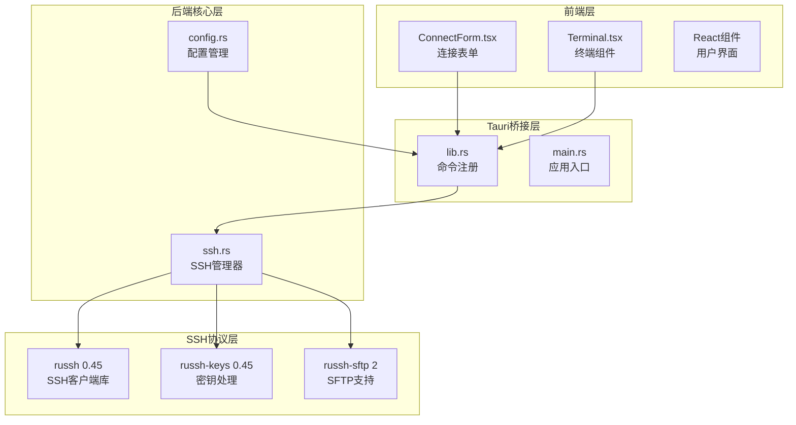

**图表来源**
- [lib.rs:268-318](file://src-tauri/src/lib.rs#L268-L318)
- [ssh.rs:58-653](file://src-tauri/src/ssh.rs#L58-L653)
- [Cargo.toml:18-32](file://src-tauri/Cargo.toml#L18-L32)

**章节来源**
- [README.md:49-73](file://README.md#L49-L73)
- [Cargo.toml:1-33](file://src-tauri/Cargo.toml#L1-L33)

## 核心组件

### SSH认证管理器

SSH认证管理器是整个认证系统的核心组件，负责管理SSH连接会话、处理认证流程和维护连接状态。

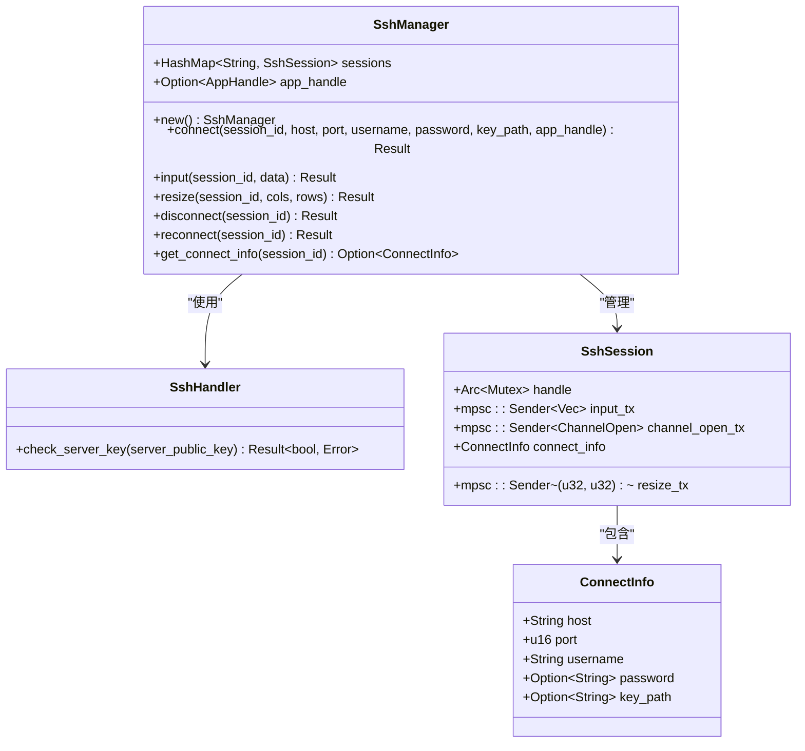

**图表来源**
- [ssh.rs:58-653](file://src-tauri/src/ssh.rs#L58-L653)
- [ssh.rs:37-56](file://src-tauri/src/ssh.rs#L37-L56)

### 认证流程控制器

认证流程控制器负责协调不同的认证方式，根据用户选择的认证类型执行相应的认证逻辑。

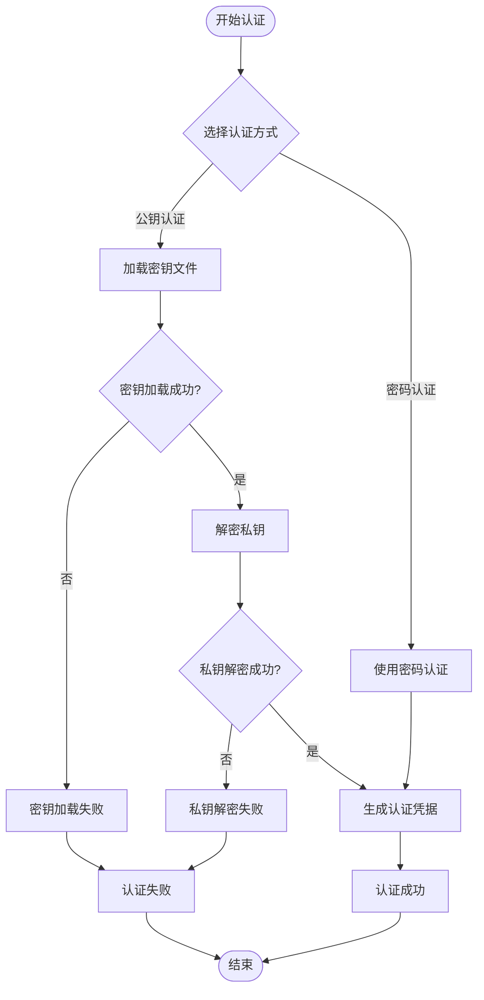

**图表来源**
- [ssh.rs:94-106](file://src-tauri/src/ssh.rs#L94-L106)
- [ssh.rs:95-98](file://src-tauri/src/ssh.rs#L95-L98)

**章节来源**
- [ssh.rs:58-653](file://src-tauri/src/ssh.rs#L58-L653)

## 架构概览

SSH认证机制的整体架构采用分层设计，从用户界面到SSH协议栈的完整认证流程如下：

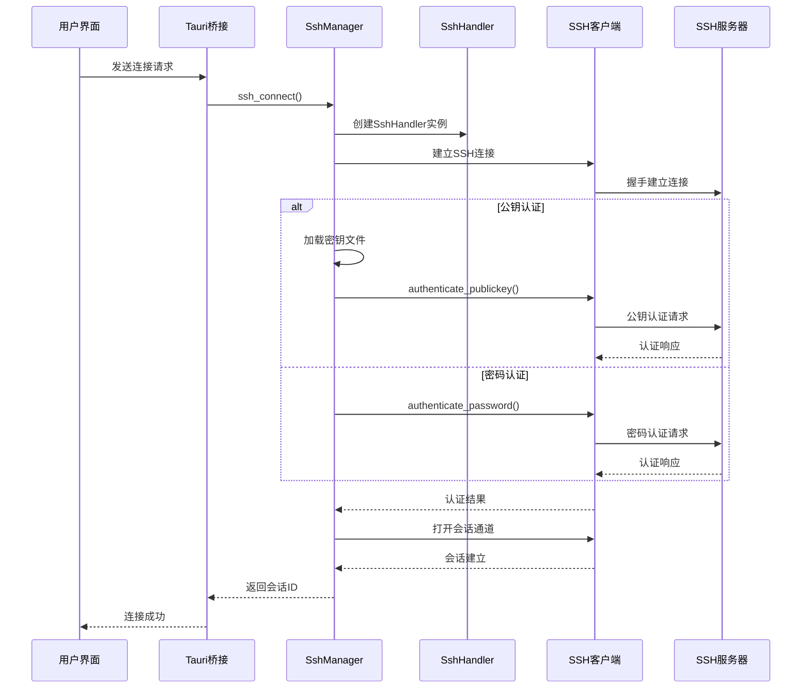

**图表来源**
- [ssh.rs:71-120](file://src-tauri/src/ssh.rs#L71-L120)
- [lib.rs:21-41](file://src-tauri/src/lib.rs#L21-L41)

## 详细组件分析

### 密码认证实现

密码认证是最直接的认证方式，适用于大多数SSH服务器配置。其工作流程相对简单，主要涉及密码验证和会话建立。

#### 密码认证流程

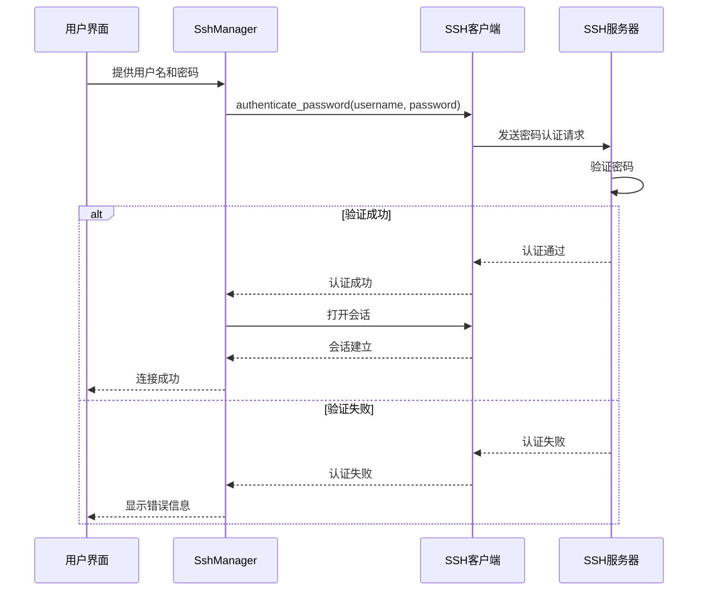

**图表来源**
- [ssh.rs:100-104](file://src-tauri/src/ssh.rs#L100-L104)

#### 密码传输安全

密码认证过程中，密码通过SSH协议进行传输，具有以下安全特性：
- 使用SSH加密通道传输密码
- 支持多种加密算法和哈希函数
- 防止中间人攻击
- 密码不会以明文形式存储在客户端

**章节来源**
- [ssh.rs:100-104](file://src-tauri/src/ssh.rs#L100-L104)

### 公钥认证实现

公钥认证是一种更安全的认证方式，使用非对称加密技术，避免了密码传输的风险。

#### 公钥认证流程

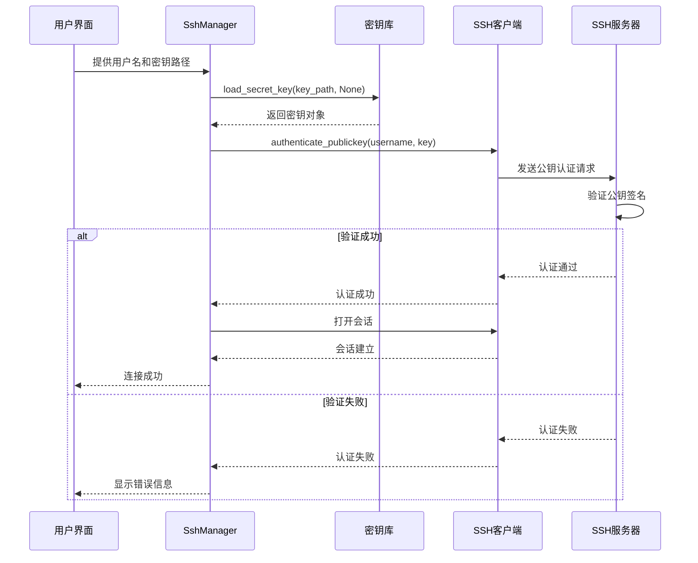

**图表来源**
- [ssh.rs:94-106](file://src-tauri/src/ssh.rs#L94-L106)
- [ssh.rs:95-98](file://src-tauri/src/ssh.rs#L95-L98)

#### 公钥加载和处理

公钥认证的核心在于正确加载和处理SSH密钥文件。系统支持多种密钥格式的自动检测和解析。

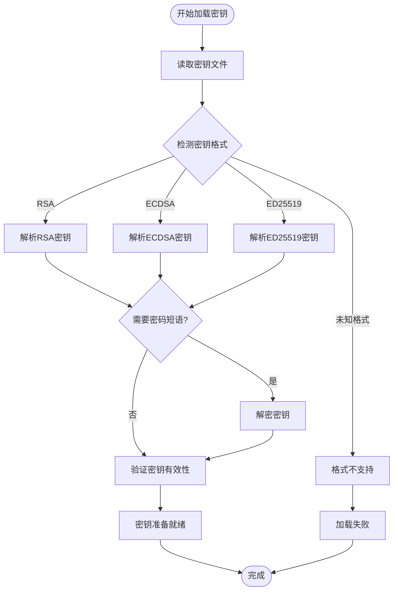

**图表来源**
- [ssh.rs:95-96](file://src-tauri/src/ssh.rs#L95-L96)

**章节来源**
- [ssh.rs:94-106](file://src-tauri/src/ssh.rs#L94-L106)

### 服务器密钥检查机制

SSH协议中包含重要的服务器身份验证机制，确保客户端连接到正确的服务器而非中间人。

#### 服务器密钥验证流程

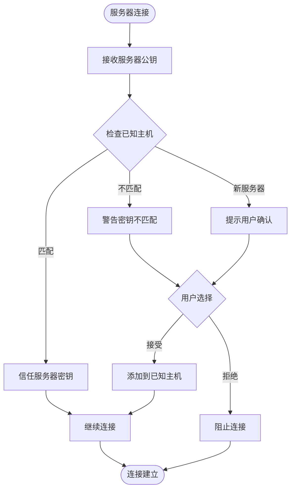

**图表来源**
- [ssh.rs:29-35](file://src-tauri/src/ssh.rs#L29-L35)

#### 当前实现的安全策略

当前实现中，服务器密钥检查机制返回始终信任的策略：

```mermaid
classDiagram
class SshHandler {
+check_server_key(server_public_key) Result~bool, Error~
}
note for SshHandler : "当前实现总是返回true<br/>表示信任所有服务器密钥"
```

**图表来源**
- [ssh.rs:29-35](file://src-tauri/src/ssh.rs#L29-L35)

**章节来源**
- [ssh.rs:23-35](file://src-tauri/src/ssh.rs#L23-L35)

### 用户界面集成

前端界面提供了直观的认证方式选择和参数输入功能。

#### 认证表单设计

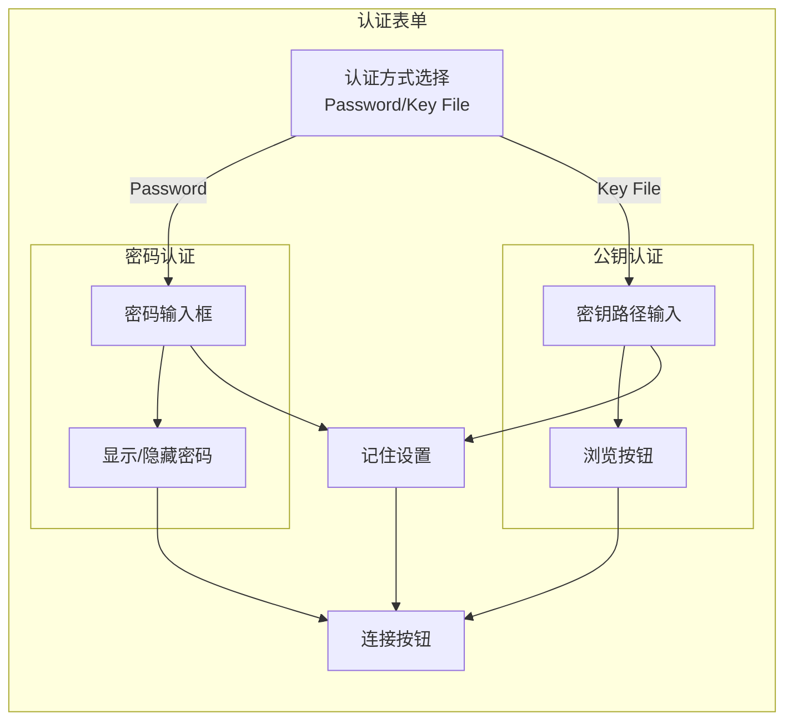

**图表来源**
- [ConnectForm.tsx:125-179](file://src/components/ConnectForm.tsx#L125-L179)

**章节来源**
- [ConnectForm.tsx:1-232](file://src/components/ConnectForm.tsx#L1-L232)

## 依赖关系分析

SSH认证机制依赖于多个Rust库来实现完整的功能。

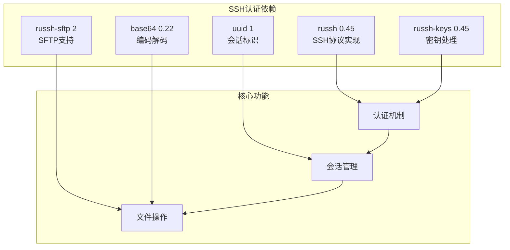

**图表来源**
- [Cargo.toml:18-32](file://src-tauri/Cargo.toml#L18-L32)

**章节来源**
- [Cargo.toml:18-32](file://src-tauri/Cargo.toml#L18-L32)

## 性能考量

### 认证性能优化

SSH认证过程涉及网络I/O和加密计算，需要考虑以下性能因素：

1. **连接复用**: 通过会话管理器复用现有连接，避免重复认证
2. **异步处理**: 使用Tokio异步运行时提高并发性能
3. **缓存策略**: 缓存已知主机密钥，减少重复验证
4. **超时控制**: 设置合理的认证超时时间，避免长时间阻塞

### 内存管理

认证过程中需要注意内存使用：
- 密钥文件的内存映射和释放
- 认证凭据的安全存储和清理
- 大量并发连接的资源管理

## 故障排除指南

### 常见认证问题及解决方案

#### 密钥权限问题

**问题症状**:
- "Permission denied" 错误
- "Bad permissions" 提示
- 连接被拒绝

**诊断步骤**:
1. 检查私钥文件权限是否正确
2. 验证公钥文件格式是否有效
3. 确认密钥文件路径是否正确

**解决方法**:
```bash
# 设置正确的密钥权限
chmod 600 ~/.ssh/id_rsa
chmod 644 ~/.ssh/id_rsa.pub
chmod 700 ~/.ssh
```

#### 密码错误

**问题症状**:
- "Authentication failed" 错误
- "Permission denied" 提示
- 连续认证失败

**诊断步骤**:
1. 验证用户名和密码是否正确
2. 检查账户是否被锁定
3. 确认SSH服务配置允许密码认证

**解决方法**:
- 重新输入正确的密码
- 联系系统管理员确认账户状态
- 检查SSH服务配置文件

#### 认证服务配置问题

**问题症状**:
- "No supported authentication methods" 错误
- "Authentication refused" 提示
- 无法建立SSH连接

**诊断步骤**:
1. 检查SSH服务器的认证配置
2. 验证允许的认证方法
3. 确认防火墙和网络设置

**解决方法**:
- 在SSH服务器上启用所需的认证方法
- 检查SSH配置文件中的认证设置
- 验证网络连通性和端口开放情况

#### 服务器密钥验证失败

**问题症状**:
- "Host key verification failed" 错误
- "Offending key" 提示
- 连接被阻止

**诊断步骤**:
1. 检查known_hosts文件中的条目
2. 验证服务器密钥是否发生变化
3. 确认服务器身份的真实性

**解决方法**:
- 更新known_hosts文件中的服务器密钥
- 手动验证服务器的新密钥指纹
- 谨慎处理密钥变更情况

### 调试技巧

#### 启用详细日志

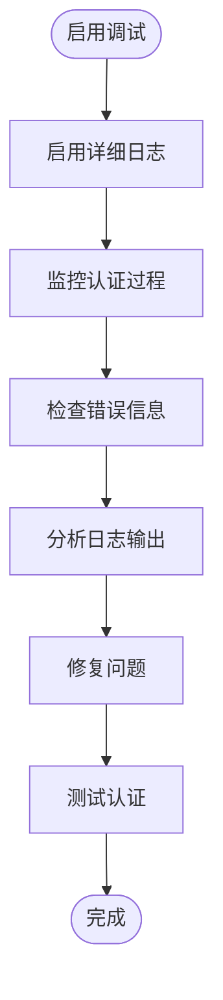

**章节来源**
- [ssh.rs:29-35](file://src-tauri/src/ssh.rs#L29-L35)

## 结论

本SSH认证机制实现了完整的密码认证和公钥认证功能，具有以下特点：

### 安全性优势
- 使用标准SSH协议进行认证
- 支持多种加密算法和密钥格式
- 提供服务器身份验证机制
- 防止中间人攻击

### 功能完整性
- 支持密码和公钥两种认证方式
- 提供完整的会话管理功能
- 集成SFTP文件传输能力
- 包含丰富的故障排除工具

### 可扩展性
- 模块化的架构设计
- 易于添加新的认证方式
- 支持自定义安全策略
- 良好的错误处理机制

### 改进建议

1. **增强服务器密钥验证**: 实现更严格的服务器密钥检查机制
2. **添加多因素认证**: 支持TOTP等二次认证
3. **改进密钥管理**: 提供更安全的密钥存储和管理功能
4. **优化用户体验**: 添加认证历史记录和快速连接功能

该认证机制为SSH连接提供了可靠的安全保障，适合在生产环境中使用，但仍需根据具体的安全要求进行适当的配置和优化。