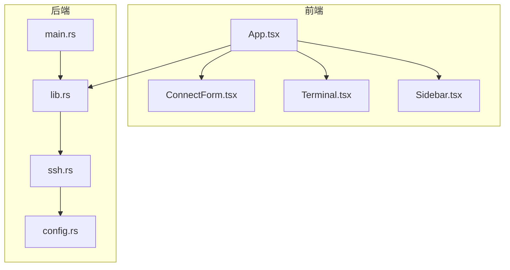
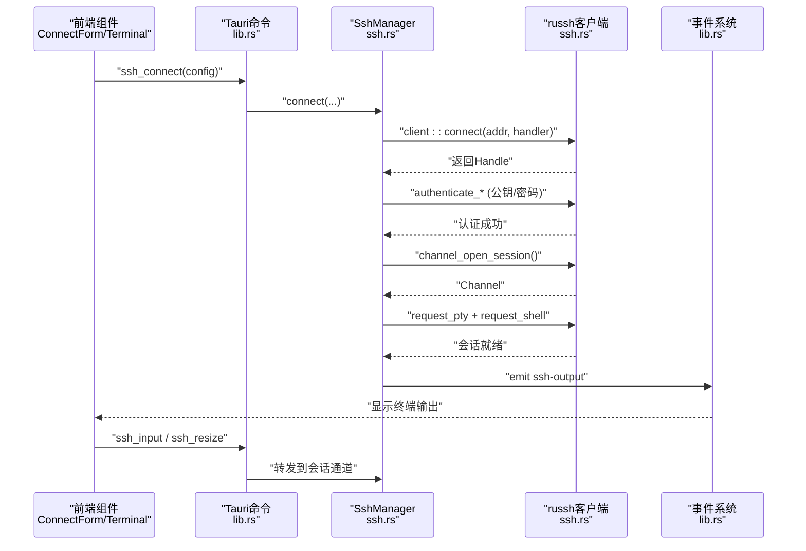
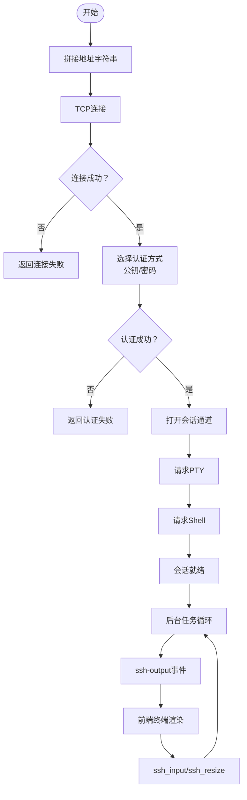
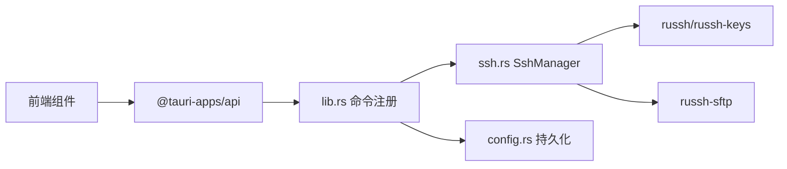

# 连接建立流程

<cite>
**本文引用的文件**
- [main.rs](file://src-tauri/src/main.rs)
- [lib.rs](file://src-tauri/src/lib.rs)
- [ssh.rs](file://src-tauri/src/ssh.rs)
- [config.rs](file://src-tauri/src/config.rs)
- [Cargo.toml](file://src-tauri/Cargo.toml)
- [README.md](file://README.md)
- [App.tsx](file://src/App.tsx)
- [ConnectForm.tsx](file://src/components/ConnectForm.tsx)
- [Terminal.tsx](file://src/components/Terminal.tsx)
- [Sidebar.tsx](file://src/components/Sidebar.tsx)
</cite>

## 目录
1. [简介](#简介)
2. [项目结构](#项目结构)
3. [核心组件](#核心组件)
4. [架构总览](#架构总览)
5. [详细组件分析](#详细组件分析)
6. [依赖关系分析](#依赖关系分析)
7. [性能与可靠性考量](#性能与可靠性考量)
8. [故障排查指南](#故障排查指南)
9. [结论](#结论)

## 简介
本技术文档围绕SSH连接建立的完整生命周期进行深入解析，涵盖从前端表单收集连接参数、到后端通过russh建立TCP连接、完成SSH握手与认证、打开会话通道、请求PTY与shell、以及会话期数据流与事件推送的全过程。文档还详细说明了ConnectInfo数据结构的设计与字段含义、连接参数校验与错误处理策略，并分析russh客户端配置选项（如keepalive、超时与连接池管理）。最后给出连接失败的常见原因与诊断建议，包括网络问题、主机密钥验证、防火墙阻断等场景。

## 项目结构
该项目采用Tauri桌面应用框架，前端使用React+TypeScript，后端使用Rust+russh实现SSH功能。核心交互通过Tauri命令与事件完成，后端负责实际的SSH连接与会话管理。

图表来源
- [main.rs:1-7](file://src-tauri/src/main.rs#L1-L7)
- [lib.rs:268-319](file://src-tauri/src/lib.rs#L268-L319)
- [ssh.rs:1-654](file://src-tauri/src/ssh.rs#L1-L654)
- [config.rs:1-113](file://src-tauri/src/config.rs#L1-L113)

章节来源
- [README.md:49-74](file://README.md#L49-L74)
- [Cargo.toml:18-33](file://src-tauri/Cargo.toml#L18-L33)

## 核心组件
- SshManager：后端连接管理器，负责建立连接、维护会话、分发输入输出、处理重连与断开。
- SshHandler：russh客户端回调处理器，用于主机密钥检查。
- ConnectInfo：连接参数载体，包含主机、端口、用户名、密码与私钥路径。
- Tauri命令层：将前端操作映射为后端命令，如ssh_connect、ssh_input、ssh_resize、ssh_disconnect、ssh_reconnect等。
- 前端组件：ConnectForm负责收集连接参数；Terminal负责渲染与交互；Sidebar负责连接列表与上下文菜单。

章节来源
- [ssh.rs:37-61](file://src-tauri/src/ssh.rs#L37-L61)
- [lib.rs:21-74](file://src-tauri/src/lib.rs#L21-L74)
- [App.tsx:180-300](file://src/App.tsx#L180-L300)
- [ConnectForm.tsx:26-73](file://src/components/ConnectForm.tsx#L26-L73)
- [Terminal.tsx:17-121](file://src/components/Terminal.tsx#L17-L121)
- [Sidebar.tsx:28-112](file://src/components/Sidebar.tsx#L28-L112)

## 架构总览
后端以SshManager为中心，通过russh建立SSH会话，使用Tokio异步任务处理通道消息、输入与窗口大小变化。前端通过Tauri命令发起连接，接收ssh-output/ssh-disconnected等事件驱动UI更新。

图表来源
- [lib.rs:21-41](file://src-tauri/src/lib.rs#L21-L41)
- [ssh.rs:71-199](file://src-tauri/src/ssh.rs#L71-L199)
- [Terminal.tsx:82-87](file://src/components/Terminal.tsx#L82-L87)

## 详细组件分析

### ConnectInfo 数据结构与字段语义
ConnectInfo用于封装一次SSH连接所需的核心参数，便于会话管理与重连使用。

- 字段设计
  - host：目标主机名或IP地址
  - port：SSH服务端口（默认22）
  - username：登录用户名
  - password：可选，密码认证
  - key_path：可选，私钥文件路径（用于公钥认证）

- 设计要点
  - 结构体Clone，便于跨任务传递
  - 作为SshSession的一部分保存，支持重连时复用
  - 仅承载必要字段，避免冗余

章节来源
- [ssh.rs:37-44](file://src-tauri/src/ssh.rs#L37-L44)
- [ssh.rs:50-56](file://src-tauri/src/ssh.rs#L50-L56)

### 连接建立生命周期（含地址解析、TCP、SSH握手、会话与PTY）
- 地址解析与TCP连接
  - 将host与port拼接为字符串，交由russh的client::connect执行TCP连接
  - 连接失败直接返回错误，不继续后续步骤
- SSH握手与认证
  - 使用默认配置，启用keepalive与空闲超时
  - 支持两种认证方式：公钥认证（加载本地私钥）或密码认证
  - 认证失败返回明确错误
- 会话初始化与PTY分配
  - 打开会话通道
  - 请求PTY（xterm-256color，80x24）
  - 请求交互式shell
- 会话期数据流
  - 后台任务监听通道消息，将Data事件通过ssh-output事件推送到前端
  - 前端Terminal组件订阅该事件并写入终端
  - 输入通过ssh_input命令转发至会话通道
  - 窗口尺寸变化通过ssh_resize命令通知远端

图表来源
- [ssh.rs:88-119](file://src-tauri/src/ssh.rs#L88-L119)
- [ssh.rs:135-178](file://src-tauri/src/ssh.rs#L135-L178)
- [Terminal.tsx:82-87](file://src/components/Terminal.tsx#L82-L87)

章节来源
- [ssh.rs:71-199](file://src-tauri/src/ssh.rs#L71-L199)
- [lib.rs:21-41](file://src-tauri/src/lib.rs#L21-L41)

### Russh 客户端配置与会话管理
- keepalive与空闲检测
  - keepalive_interval：周期性发送保活
  - keepalive_max：最大保活次数
  - inactivity_timeout：空闲超时，用于检测死连接
- 会话状态与通道管理
  - SshSession持有Arc<Mutex<client::Handle<SshHandler>>>，确保并发安全
  - 使用多路复用通道（mpsc）处理输入、窗口调整与子通道请求
  - 后台任务统一处理通道消息、输入与窗口变更
- 断开与重连
  - disconnect使用超时避免挂死
  - reconnect基于ConnectInfo重用凭据，整体超时控制

章节来源
- [ssh.rs:82-87](file://src-tauri/src/ssh.rs#L82-L87)
- [ssh.rs:50-56](file://src-tauri/src/ssh.rs#L50-L56)
- [ssh.rs:617-652](file://src-tauri/src/ssh.rs#L617-L652)

### 前端交互与事件驱动
- 连接表单
  - ConnectForm收集host/port/username/authType（密码/密钥），支持“记住”保存到配置
- 终端渲染
  - Terminal使用xterm.js渲染，监听ssh-output事件写入，监听ssh-closed事件提示断开
- 自动重连
  - App.tsx监听ssh-disconnected事件，按设置间隔与最大尝试次数自动重连

章节来源
- [ConnectForm.tsx:26-73](file://src/components/ConnectForm.tsx#L26-L73)
- [Terminal.tsx:82-111](file://src/components/Terminal.tsx#L82-L111)
- [App.tsx:124-164](file://src/App.tsx#L124-L164)

## 依赖关系分析
后端依赖russh、russh-keys、russh-sftp等实现SSH协议与SFTP功能；Tauri提供命令与事件桥接；前端通过@tauri-apps/api与后端通信。

图表来源
- [Cargo.toml:18-33](file://src-tauri/Cargo.toml#L18-L33)
- [lib.rs:268-319](file://src-tauri/src/lib.rs#L268-L319)
- [ssh.rs:1-654](file://src-tauri/src/ssh.rs#L1-L654)
- [config.rs:1-113](file://src-tauri/src/config.rs#L1-L113)

章节来源
- [Cargo.toml:18-33](file://src-tauri/Cargo.toml#L18-L33)

## 性能与可靠性考量
- 异步与并发
  - 使用Tokio全栈异步，后台任务统一处理通道消息，避免阻塞主线程
- 超时与保活
  - keepalive与inactivity_timeout降低死连接风险，提升会话鲁棒性
- 事件驱动
  - 通过事件推送输出，减少轮询，降低CPU占用
- 传输优化
  - SFTP上传使用分块写入与进度事件，下载使用curl进度解析，提升用户体验

章节来源
- [ssh.rs:82-87](file://src-tauri/src/ssh.rs#L82-L87)
- [ssh.rs:449-518](file://src-tauri/src/ssh.rs#L449-L518)
- [ssh.rs:520-583](file://src-tauri/src/ssh.rs#L520-L583)

## 故障排查指南
- 连接失败
  - 网络问题：确认主机可达、端口开放（默认22）、DNS解析正常
  - 防火墙阻断：检查服务器与客户端防火墙策略
  - 主机密钥验证：当前实现允许任意密钥（check_server_key返回true），生产环境应严格校验
- 认证失败
  - 密码认证：核对用户名与密码
  - 公钥认证：确认私钥路径正确、权限合适、公钥已添加到服务器authorized_keys
- 会话初始化失败
  - PTY请求失败：检查服务器是否允许PTY分配
  - Shell请求失败：确认用户有交互式shell权限
- 传输异常
  - SFTP读写：检查远程路径权限与磁盘空间
  - 下载进度：观察download-progress事件，结合stderr定位curl错误
- 断开与重连
  - ssh-disconnected事件：前端自动重连，可通过设置调整间隔与最大尝试次数
  - disconnect超时：避免长时间等待，防止资源泄漏

章节来源
- [ssh.rs:29-35](file://src-tauri/src/ssh.rs#L29-L35)
- [ssh.rs:93-106](file://src-tauri/src/ssh.rs#L93-L106)
- [ssh.rs:108-119](file://src-tauri/src/ssh.rs#L108-L119)
- [ssh.rs:272-286](file://src-tauri/src/ssh.rs#L272-L286)
- [ssh.rs:449-518](file://src-tauri/src/ssh.rs#L449-L518)
- [App.tsx:124-164](file://src/App.tsx#L124-L164)

## 结论
本项目以russh为核心实现了完整的SSH连接生命周期管理，从前端表单到后端会话与事件驱动的闭环体验。通过合理的keepalive与超时配置、事件驱动的数据流与自动重连机制，提供了稳定可靠的远程终端与文件传输能力。建议在生产环境中强化主机密钥校验与凭据保护，进一步完善错误分类与日志记录，以提升安全性与可观测性。