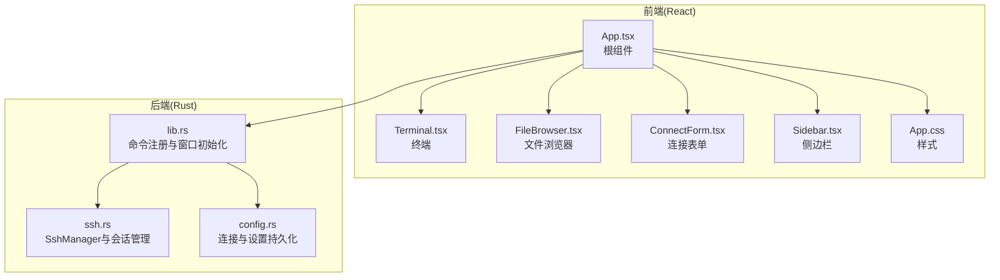
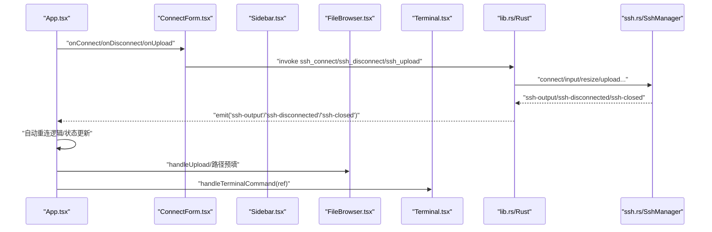
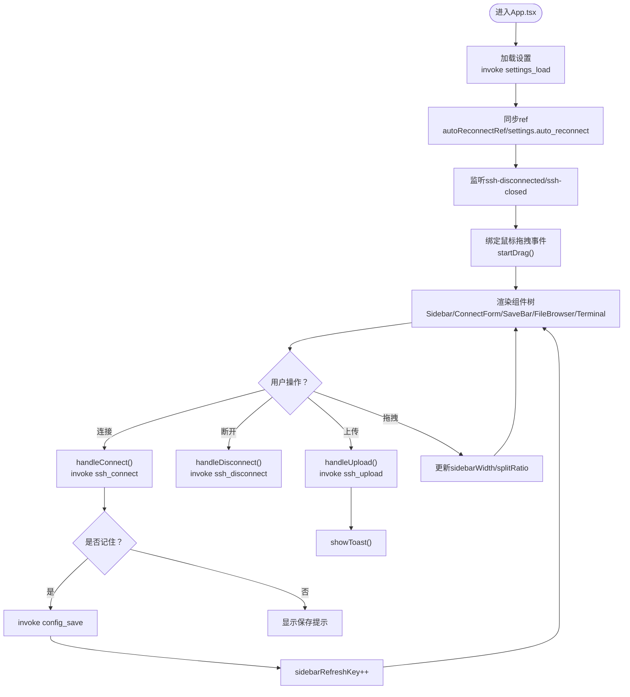
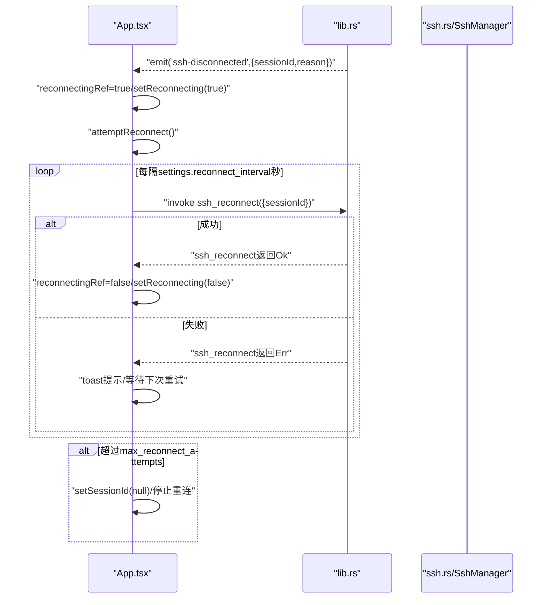
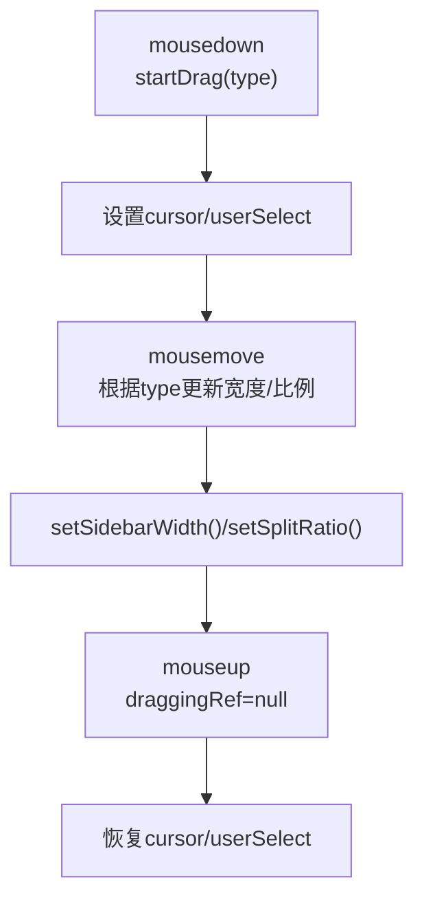
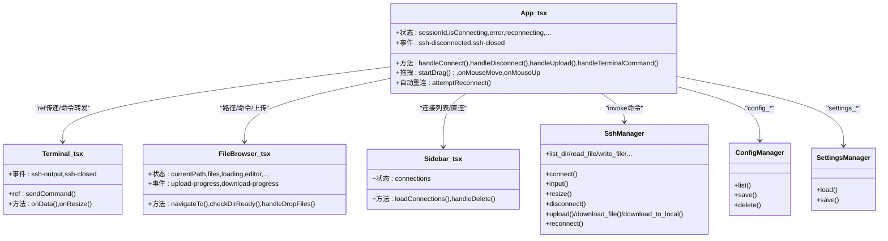
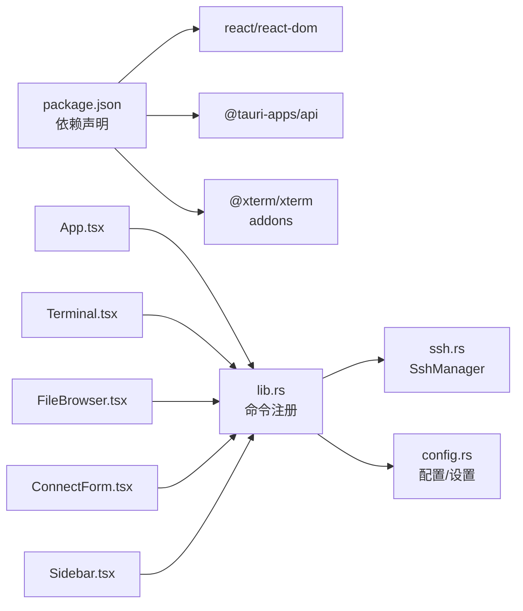

# App主组件

<cite>
**本文档引用的文件**
- [App.tsx](file://src/App.tsx)
- [main.tsx](file://src/main.tsx)
- [Terminal.tsx](file://src/components/Terminal.tsx)
- [FileBrowser.tsx](file://src/components/FileBrowser.tsx)
- [ConnectForm.tsx](file://src/components/ConnectForm.tsx)
- [Sidebar.tsx](file://src/components/Sidebar.tsx)
- [lib.rs](file://src-tauri/src/lib.rs)
- [ssh.rs](file://src-tauri/src/ssh.rs)
- [config.rs](file://src-tauri/src/config.rs)
- [App.css](file://src/App.css)
- [package.json](file://package.json)
</cite>

## 目录
1. [简介](#简介)
2. [项目结构](#项目结构)
3. [核心组件](#核心组件)
4. [架构总览](#架构总览)
5. [详细组件分析](#详细组件分析)
6. [依赖关系分析](#依赖关系分析)
7. [性能考虑](#性能考虑)
8. [故障排查指南](#故障排查指南)
9. [结论](#结论)

## 简介
本文件聚焦于App主组件（App.tsx），作为SSH工具应用的根组件，负责：
- 全局状态管理：会话ID、连接状态、错误信息、设置、拖拽分隔器等
- 组件树结构：左侧侧边栏、中间顶部表单与保存提示、右侧分割容器（文件浏览器与终端）
- 全局事件处理：监听SSH断开、关闭事件，触发自动重连与UI反馈
- 会话管理：建立/断开连接、保存连接配置、直接连接历史项
- 拖拽分隔器：侧边栏宽度与上下分割比例的可拖拽调整
- 自动重连机制：基于设置的间隔与最大尝试次数进行指数退避重连
- Tauri命令调用：通过invoke桥接前端与Rust后端，实现SSH连接、文件操作、设置读写等
- 用户界面布局：菜单栏、顶部表单区、分割容器、通知与保存提示条

## 项目结构
应用采用前后端分离的Tauri架构：
- 前端（React）：位于src目录，包含App.tsx根组件及各子组件
- 后端（Rust）：位于src-tauri目录，通过Tauri命令暴露SSH与文件系统能力
- 样式：App.css统一管理UI样式与主题

图表来源
- [App.tsx:37-415](file://src/App.tsx#L37-L415)
- [Terminal.tsx:17-150](file://src/components/Terminal.tsx#L17-L150)
- [FileBrowser.tsx:154-1266](file://src/components/FileBrowser.tsx#L154-L1266)
- [ConnectForm.tsx:26-232](file://src/components/ConnectForm.tsx#L26-L232)
- [Sidebar.tsx:28-155](file://src/components/Sidebar.tsx#L28-L155)
- [lib.rs:268-319](file://src-tauri/src/lib.rs#L268-L319)
- [ssh.rs:58-654](file://src-tauri/src/ssh.rs#L58-L654)
- [config.rs:27-113](file://src-tauri/src/config.rs#L27-L113)

章节来源
- [App.tsx:37-415](file://src/App.tsx#L37-L415)
- [lib.rs:268-319](file://src-tauri/src/lib.rs#L268-L319)

## 核心组件
- App.tsx：根组件，集中管理全局状态、事件监听、拖拽分隔器、自动重连、Tauri命令调用与UI布局
- Terminal.tsx：Xterm集成，负责终端渲染、输入转发、输出接收、尺寸变化与连接关闭提示
- FileBrowser.tsx：文件浏览、编辑、上传下载、权限修改、剪贴板复制/移动、拖拽排序等
- ConnectForm.tsx：连接表单，支持密码/密钥认证、记住选项、文件上传进度
- Sidebar.tsx：连接列表、右键菜单、删除与双击直连

章节来源
- [App.tsx:37-415](file://src/App.tsx#L37-L415)
- [Terminal.tsx:17-150](file://src/components/Terminal.tsx#L17-L150)
- [FileBrowser.tsx:154-1266](file://src/components/FileBrowser.tsx#L154-L1266)
- [ConnectForm.tsx:26-232](file://src/components/ConnectForm.tsx#L26-L232)
- [Sidebar.tsx:28-155](file://src/components/Sidebar.tsx#L28-L155)

## 架构总览
App.tsx作为协调者，通过Tauri命令与Rust后端交互，同时管理多个子组件的状态与事件。自动重连机制在断线时由后端事件驱动，前端根据设置进行定时重试；拖拽分隔器通过鼠标事件实时更新布局比例。

图表来源
- [App.tsx:180-334](file://src/App.tsx#L180-L334)
- [ConnectForm.tsx:59-90](file://src/components/ConnectForm.tsx#L59-L90)
- [lib.rs:21-315](file://src-tauri/src/lib.rs#L21-L315)
- [ssh.rs:132-199](file://src-tauri/src/ssh.rs#L132-L199)

## 详细组件分析

### App.tsx：根组件与状态管理
- 状态变量
  - 会话与连接：sessionId、isConnecting、error、reconnecting、manualDisconnectRef
  - 设置：settings（auto_reconnect、reconnect_interval、max_reconnect_attempts）、menuOpen
  - UI与交互：toast、prefill、showSave、connName、sidebarRefreshKey
  - 拖拽分隔器：sidebarWidth、splitRatio、draggingRef、splitContainerRef
  - 引用：termRef（Terminal句柄）、reconnectAttemptRef、autoReconnectRef、reconnectingRef
- 生命周期与事件
  - 加载设置：首次挂载时invoke settings_load，同步ref
  - 监听断线事件：ssh-disconnected，按设置执行自动重连或置空sessionId
  - 监听关闭事件：ssh-closed，清理当前会话
  - 鼠标事件：mousemove/mouseup，实现侧边栏宽度与上下分割比拖拽
- 功能方法
  - 连接/断开：handleConnect、handleDisconnect、handleDirectConnect
  - 保存连接：handleSaveConnection
  - 选择连接：handleSelectConnection
  - 上传文件：handleUpload（结合FileBrowser当前路径）
  - 发送命令：handleTerminalCommand（通过Terminal ref）
  - 设置切换：toggleAutoReconnect（invoke settings_save）
- 组件树
  - 左侧Sidebar、中间菜单栏+顶部表单+保存提示、右侧分割容器（上FileBrowser、下Terminal）

图表来源
- [App.tsx:104-121](file://src/App.tsx#L104-L121)
- [App.tsx:124-173](file://src/App.tsx#L124-L173)
- [App.tsx:97-101](file://src/App.tsx#L97-L101)
- [App.tsx:180-334](file://src/App.tsx#L180-L334)

章节来源
- [App.tsx:37-415](file://src/App.tsx#L37-L415)

### 自动重连机制
- 触发条件：收到ssh-disconnected事件且非手动断开、启用自动重连
- 重连策略：以settings.reconnect_interval秒为间隔，最多尝试settings.max_reconnect_attempts次
- 实现细节：使用setTimeout递归重试，每次失败打印进度提示；成功则清除重连状态
- 失败处理：超过最大尝试次数后清空sessionId并停止重连

图表来源
- [App.tsx:124-164](file://src/App.tsx#L124-L164)
- [lib.rs:248-255](file://src-tauri/src/lib.rs#L248-L255)
- [ssh.rs:633-652](file://src-tauri/src/ssh.rs#L633-L652)

章节来源
- [App.tsx:124-164](file://src/App.tsx#L124-L164)
- [ssh.rs:633-652](file://src-tauri/src/ssh.rs#L633-L652)

### 拖拽分隔器实现
- 侧边栏宽度：startDrag('sidebar')后，mousemove更新sidebarWidth（限制150-500）
- 上下分割比例：startDrag('split')后，mousemove计算相对高度比例（0.15-0.85）
- 清理：mouseup时重置draggingRef并恢复光标与选择样式

图表来源
- [App.tsx:97-101](file://src/App.tsx#L97-L101)
- [App.tsx:68-95](file://src/App.tsx#L68-L95)

章节来源
- [App.tsx:62-101](file://src/App.tsx#L62-L101)

### 会话管理与Tauri命令调用
- 连接：前端调用ssh_connect，后端创建SshManager会话并请求PTY/Shell，返回sessionId
- 输入/尺寸：Terminal onData触发ssh_input，窗口resize触发ssh_resize
- 断开：ssh_disconnect，后端超时断开并发出ssh-closed事件
- 文件操作：FileBrowser调用ssh_list_dir/ssh_read_file/ssh_write_file/ssh_delete_file/ssh_create_dir/ssh_rename_file/ssh_copy_file/ssh_set_permissions/ssh_check_space/ssh_download_file/ssh_upload/ssh_download_to_local
- 配置：config_list/config_save/config_delete
- 设置：settings_load/settings_save

图表来源
- [App.tsx:37-415](file://src/App.tsx#L37-L415)
- [Terminal.tsx:17-150](file://src/components/Terminal.tsx#L17-L150)
- [FileBrowser.tsx:154-1266](file://src/components/FileBrowser.tsx#L154-L1266)
- [Sidebar.tsx:28-155](file://src/components/Sidebar.tsx#L28-L155)
- [ssh.rs:58-654](file://src-tauri/src/ssh.rs#L58-L654)
- [config.rs:27-113](file://src-tauri/src/config.rs#L27-L113)

章节来源
- [lib.rs:21-315](file://src-tauri/src/lib.rs#L21-L315)
- [ssh.rs:71-654](file://src-tauri/src/ssh.rs#L71-L654)
- [config.rs:29-58](file://src-tauri/src/config.rs#L29-L58)

### 组件间通信模式
- 父子通信：App.tsx向子组件传递props（sessionId、prefill、onConnect等）
- 回调回调：子组件通过回调向上抛出动作（如ConnectForm的onConnect/onDisconnect/onUpload）
- 事件总线：Tauri emit/监听ssh-output/ssh-disconnected/ssh-closed，App.tsx统一处理
- 引用传递：App.tsx通过ref将Terminal句柄传入，实现命令下发

章节来源
- [App.tsx:340-411](file://src/App.tsx#L340-L411)
- [ConnectForm.tsx:26-33](file://src/components/ConnectForm.tsx#L26-L33)
- [Terminal.tsx:123-130](file://src/components/Terminal.tsx#L123-L130)

### 错误处理策略
- 连接错误：捕获invoke异常并设置error，提示用户
- 上传失败：handleUpload中捕获异常并toast提示
- 断线重连：自动重连失败时toast提示并最终停止
- 设置保存：settings_save失败静默处理，避免阻塞主流程
- 文件操作：FileBrowser对各类SFTP/SSH命令失败进行toast提示

章节来源
- [App.tsx:218-222](file://src/App.tsx#L218-L222)
- [App.tsx:330-334](file://src/App.tsx#L330-L334)
- [FileBrowser.tsx:320-333](file://src/components/FileBrowser.tsx#L320-L333)

## 依赖关系分析
- 前端依赖：React、@tauri-apps/api、@xterm/xterm及其插件
- 后端依赖：russh、russh-keys、russh-sftp、tokio、serde、dirs、open等
- 命令注册：lib.rs集中注册所有Tauri命令，供前端invoke调用
- 事件发射：ssh.rs在后台任务中emit ssh-output/ssh-disconnected/ssh-closed/download-progress/upload-progress

图表来源
- [package.json:15-26](file://package.json#L15-L26)
- [lib.rs:268-319](file://src-tauri/src/lib.rs#L268-L319)
- [ssh.rs:58-654](file://src-tauri/src/ssh.rs#L58-L654)
- [config.rs:27-113](file://src-tauri/src/config.rs#L27-L113)

章节来源
- [package.json:15-26](file://package.json#L15-L26)
- [lib.rs:291-315](file://src-tauri/src/lib.rs#L291-L315)

## 性能考虑
- 事件监听：仅在必要时注册/注销监听器，避免内存泄漏
- 重连退避：基于固定间隔重试，避免频繁轮询造成资源浪费
- 分割器拖拽：mousemove事件在全局window上绑定，注意节流/防抖可选优化
- 文件上传：分块写入SFTP并上报进度，避免大文件阻塞UI
- 终端适配：fitAddon.fit()在窗口大小变化时调用，减少闪烁

## 故障排查指南
- 无法连接
  - 检查网络与主机可达性
  - 确认认证方式（密码/密钥）正确
  - 查看error提示与日志
- 连接断开后不重连
  - 确认自动重连开关已开启
  - 检查reconnecting状态与toast提示
  - 超过最大尝试次数后会停止重连
- 上传失败
  - 检查远端目录写权限与磁盘空间
  - 查看upload-progress事件与toast提示
- 下载失败
  - 检查URL有效性与网络
  - 查看download-progress事件状态
- 终端无输出
  - 确认会话ID有效
  - 检查ssh-output事件是否正常到达

章节来源
- [App.tsx:124-164](file://src/App.tsx#L124-L164)
- [FileBrowser.tsx:267-284](file://src/components/FileBrowser.tsx#L267-L284)
- [FileBrowser.tsx:286-295](file://src/components/FileBrowser.tsx#L286-L295)

## 结论
App.tsx作为应用的核心协调者，通过清晰的状态管理、事件监听与Tauri命令桥接，实现了稳定的SSH连接、文件管理与终端交互体验。自动重连机制与拖拽分隔器提升了可用性，而严格的错误处理与UI反馈确保了良好的用户体验。建议后续可引入节流优化拖拽性能、增强日志记录以便问题定位，并完善更多安全与权限检查。