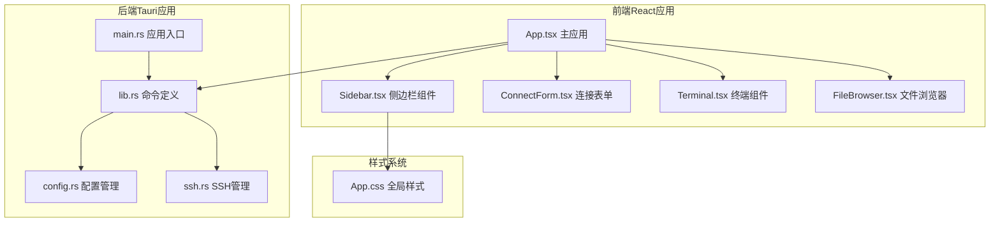
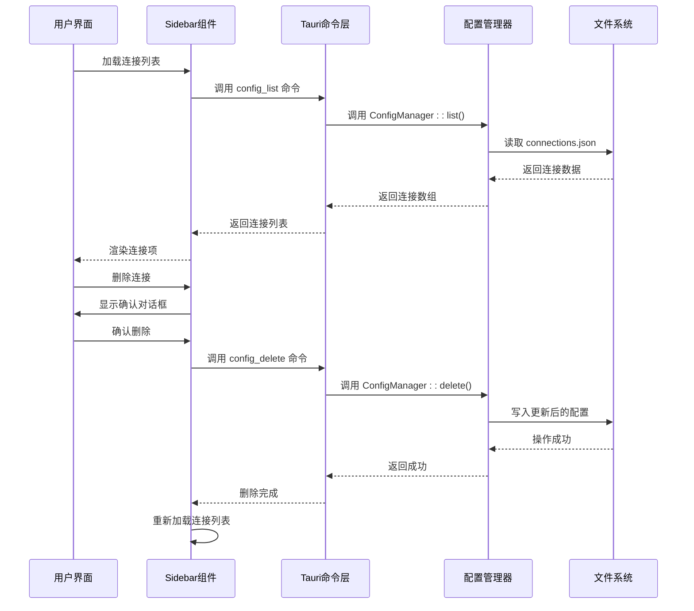
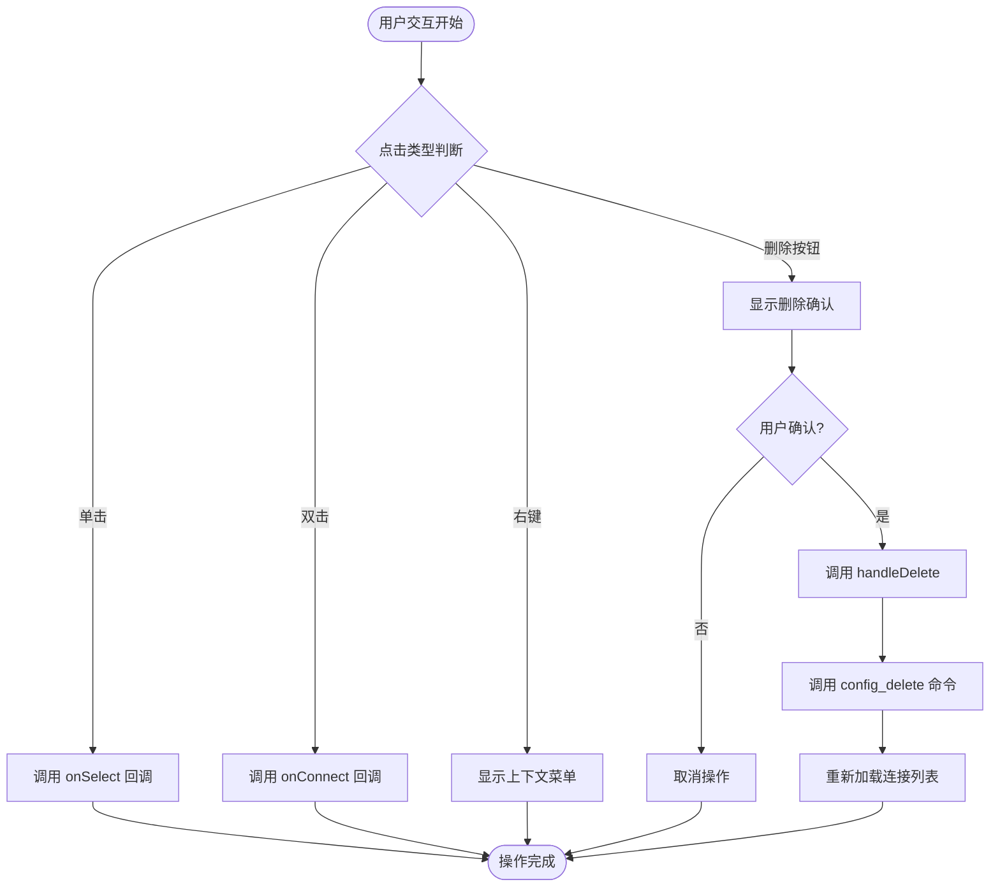
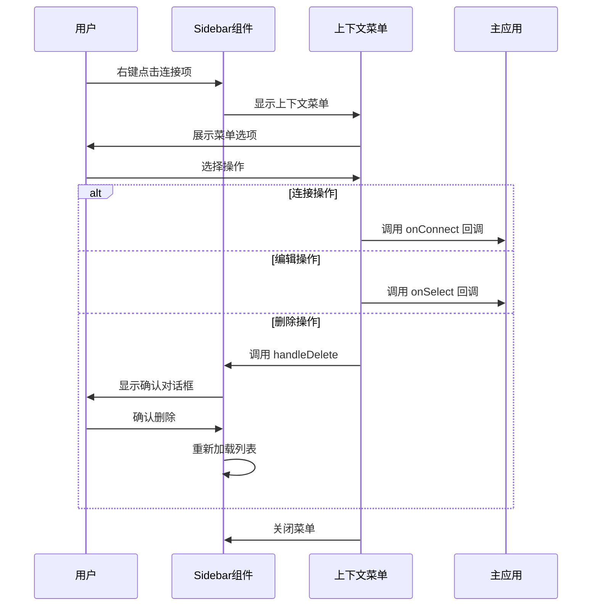
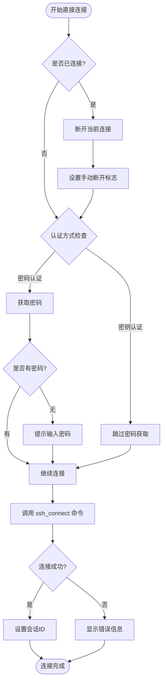
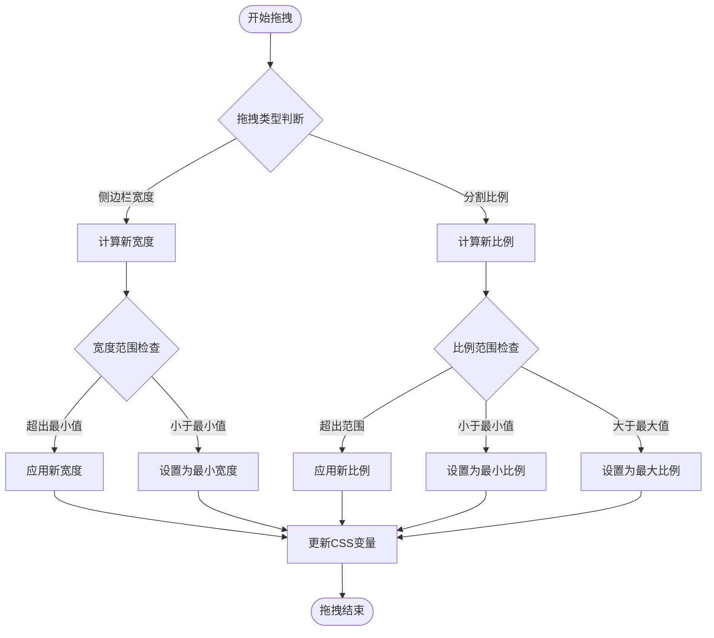
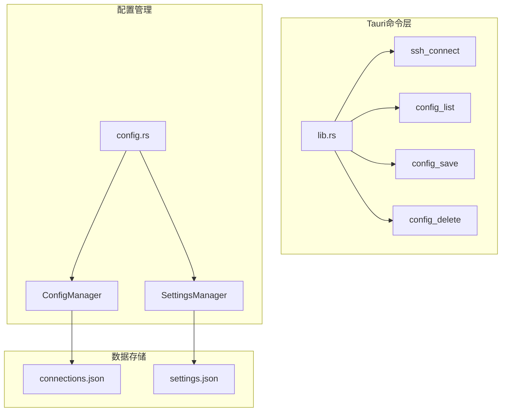

# 侧边栏组件

<cite>
**本文档引用的文件**
- [Sidebar.tsx](file://src/components/Sidebar.tsx)
- [App.tsx](file://src/App.tsx)
- [lib.rs](file://src-tauri/src/lib.rs)
- [config.rs](file://src-tauri/src/config.rs)
- [App.css](file://src/App.css)
- [main.rs](file://src-tauri/src/main.rs)
</cite>

## 目录
1. [简介](#简介)
2. [项目结构](#项目结构)
3. [核心组件](#核心组件)
4. [架构概览](#架构概览)
5. [详细组件分析](#详细组件分析)
6. [依赖关系分析](#依赖关系分析)
7. [性能考虑](#性能考虑)
8. [故障排除指南](#故障排除指南)
9. [结论](#结论)
10. [附录](#附录)

## 简介
本文件详细介绍了SSH工具应用中的Sidebar侧边栏组件。该组件负责连接列表的管理与显示，包括连接项的渲染、状态标识和交互功能。文档涵盖了连接项的选择机制、直接连接功能和新连接创建流程，以及侧边栏的宽度调整、滚动处理和响应式布局。同时提供了连接配置的加载、更新和删除操作说明，以及侧边栏API的使用指南、事件处理和性能优化策略。

## 项目结构
该项目采用React + Tauri的混合架构，侧边栏组件位于前端React应用中，通过Tauri命令与后端Rust逻辑进行通信。



**图表来源**
- [App.tsx:1-415](file://src/App.tsx#L1-L415)
- [Sidebar.tsx:1-155](file://src/components/Sidebar.tsx#L1-L155)
- [lib.rs:1-319](file://src-tauri/src/lib.rs#L1-L319)
- [config.rs:1-113](file://src-tauri/src/config.rs#L1-L113)

**章节来源**
- [App.tsx:1-415](file://src/App.tsx#L1-L415)
- [Sidebar.tsx:1-155](file://src/components/Sidebar.tsx#L1-L155)
- [lib.rs:1-319](file://src-tauri/src/lib.rs#L1-L319)

## 核心组件
Sidebar组件是整个应用的核心UI组件之一，负责连接管理界面的呈现和用户交互。

### 组件接口定义
组件通过以下接口接收外部传入的回调函数：
- `onSelect`: 连接项选择回调
- `onConnect`: 直接连接回调  
- `onNew`: 新建连接回调
- `refreshKey`: 刷新键值（用于触发重新加载）

### 数据结构设计
连接配置使用统一的数据模型：
```typescript
interface Connection {
  id: string
  name: string
  host: string
  port: number
  username: string
  auth_type: string
  key_path?: string
  password?: string
}
```

**章节来源**
- [Sidebar.tsx:4-20](file://src/components/Sidebar.tsx#L4-L20)
- [App.tsx:11-29](file://src/App.tsx#L11-L29)

## 架构概览
Sidebar组件采用分层架构设计，实现了清晰的职责分离和数据流控制。



**图表来源**
- [Sidebar.tsx:57-67](file://src/components/Sidebar.tsx#L57-L67)
- [lib.rs:221-233](file://src-tauri/src/lib.rs#L221-L233)
- [config.rs:30-57](file://src-tauri/src/config.rs#L30-L57)

## 详细组件分析

### 连接列表管理
Sidebar组件实现了完整的连接列表管理功能，包括加载、显示、删除等操作。

#### 连接项渲染机制
每个连接项包含以下信息：
- **名称显示**: 支持自定义名称或回退到主机名
- **详细信息**: 用户名@主机:端口格式
- **删除按钮**: 鼠标悬停时显示，点击时阻止事件冒泡

#### 交互功能实现


**图表来源**
- [Sidebar.tsx:86-111](file://src/components/Sidebar.tsx#L86-L111)
- [Sidebar.tsx:62-67](file://src/components/Sidebar.tsx#L62-L67)

**章节来源**
- [Sidebar.tsx:86-111](file://src/components/Sidebar.tsx#L86-L111)
- [Sidebar.tsx:62-67](file://src/components/Sidebar.tsx#L62-L67)

### 上下文菜单系统
组件实现了完整的上下文菜单功能，提供便捷的操作入口。

#### 菜单项功能
- **⚡ Connect**: 直接连接到选中的服务器
- **✏ Edit**: 编辑连接配置（通过选择回调）
- **🗑 Delete**: 删除连接配置（带确认提示）

#### 菜单交互设计


**图表来源**
- [Sidebar.tsx:115-150](file://src/components/Sidebar.tsx#L115-L150)
- [Sidebar.tsx:121-148](file://src/components/Sidebar.tsx#L121-L148)

**章节来源**
- [Sidebar.tsx:115-150](file://src/components/Sidebar.tsx#L115-L150)
- [Sidebar.tsx:121-148](file://src/components/Sidebar.tsx#L121-L148)

### 连接选择机制
Sidebar组件通过事件驱动的方式实现连接选择功能。

#### 选择流程
1. **单击事件**: 触发 `onSelect` 回调，预填充连接表单
2. **双击事件**: 触发 `onConnect` 回调，直接建立连接
3. **右键菜单**: 提供更多操作选项

#### 状态管理
组件内部维护连接列表状态，并通过Tauri命令与后端同步数据。

**章节来源**
- [Sidebar.tsx:89-92](file://src/components/Sidebar.tsx#L89-L92)
- [App.tsx:251-260](file://src/App.tsx#L251-L260)

### 直接连接功能
直接连接功能允许用户快速连接到指定的服务器配置。

#### 连接流程


**图表来源**
- [App.tsx:262-300](file://src/App.tsx#L262-L300)

**章节来源**
- [App.tsx:262-300](file://src/App.tsx#L262-L300)

### 新连接创建流程
Sidebar组件支持通过点击"+"按钮创建新的连接配置。

#### 创建流程
1. **触发事件**: 点击新连接按钮
2. **清理状态**: 清空当前会话和预填信息
3. **打开表单**: 显示连接表单界面
4. **保存配置**: 通过主应用的连接表单保存配置

**章节来源**
- [Sidebar.tsx:78-81](file://src/components/Sidebar.tsx#L78-L81)
- [App.tsx:343](file://src/App.tsx#L343)

### 宽度调整与响应式布局
应用实现了灵活的拖拽调整功能，支持侧边栏宽度和分割区域比例的动态调整。

#### 拖拽调整机制


**图表来源**
- [App.tsx:69-101](file://src/App.tsx#L69-L101)
- [App.tsx:342-348](file://src/App.tsx#L342-L348)

**章节来源**
- [App.tsx:69-101](file://src/App.tsx#L69-L101)
- [App.tsx:342-348](file://src/App.tsx#L342-L348)

### 滚动处理与视觉效果
组件实现了优雅的滚动处理和视觉反馈机制。

#### 滚动特性
- **垂直滚动**: 连接列表支持垂直滚动
- **悬停效果**: 删除按钮仅在悬停时显示
- **动画过渡**: 所有交互都有平滑的CSS过渡效果

**章节来源**
- [App.css:79-83](file://src/App.css#L79-L83)
- [App.css:148-150](file://src/App.css#L148-L150)

## 依赖关系分析

### 前端依赖关系
```mermaid
graph TB
subgraph "Sidebar组件依赖"
A[Sidebar.tsx]
B[React Hooks]
C[@tauri-apps/api]
D[Connection接口]
end
subgraph "主应用依赖"
E[App.tsx]
F[Terminal组件]
G[FileBrowser组件]
H[ConnectForm组件]
end
subgraph "样式依赖"
I[App.css]
J[全局样式]
K[组件样式]
end
A --> B
A --> C
A --> D
E --> A
E --> F
E --> G
E --> H
A --> I
E --> I
I --> J
I --> K
```

**图表来源**
- [Sidebar.tsx:1-3](file://src/components/Sidebar.tsx#L1-L3)
- [App.tsx:1-9](file://src/App.tsx#L1-L9)
- [App.css:1-20](file://src/App.css#L1-L20)

### 后端依赖关系


**图表来源**
- [lib.rs:221-233](file://src-tauri/src/lib.rs#L221-L233)
- [config.rs:27-58](file://src-tauri/src/config.rs#L27-L58)

**章节来源**
- [lib.rs:221-233](file://src-tauri/src/lib.rs#L221-L233)
- [config.rs:27-58](file://src-tauri/src/config.rs#L27-L58)

## 性能考虑

### 渲染优化策略
1. **条件渲染**: 空列表时显示提示信息而非空列表
2. **事件委托**: 使用事件冒泡减少事件处理器数量
3. **状态管理**: 合理的状态更新避免不必要的重渲染

### 数据加载优化
- **懒加载**: 连接列表在组件挂载时一次性加载
- **增量更新**: 通过刷新键值触发局部更新
- **缓存机制**: 避免重复的网络请求

### 内存管理
- **事件监听器**: 组件卸载时自动清理事件监听器
- **定时器清理**: 及时清理可能存在的定时器
- **引用管理**: 使用ref正确管理DOM元素引用

## 故障排除指南

### 常见问题及解决方案

#### 连接列表无法加载
**症状**: 侧边栏显示"点击+添加服务器"提示
**可能原因**:
- 配置文件不存在或损坏
- 权限不足访问配置目录
- Tauri命令调用失败

**解决步骤**:
1. 检查配置文件路径: `~/.config/ssh-tool/connections.json`
2. 验证文件权限和内容格式
3. 查看开发者工具中的错误日志

#### 连接失败
**症状**: 连接时出现错误提示
**可能原因**:
- 网络连接问题
- 认证信息错误
- 服务器拒绝连接

**解决步骤**:
1. 验证主机名和端口号
2. 检查用户名和密码/密钥
3. 确认防火墙和安全组设置

#### 上下文菜单不显示
**症状**: 右键点击无反应
**可能原因**:
- 事件处理器未正确绑定
- 样式冲突导致菜单被隐藏

**解决步骤**:
1. 检查鼠标事件监听器
2. 验证CSS定位属性
3. 确认z-index层级

**章节来源**
- [Sidebar.tsx:44-55](file://src/components/Sidebar.tsx#L44-L55)
- [App.tsx:218-223](file://src/App.tsx#L218-L223)

## 结论
Sidebar侧边栏组件通过清晰的架构设计和完善的交互功能，为用户提供了一个直观易用的连接管理界面。组件实现了从连接列表管理到直接连接的完整功能链路，配合后端的Tauri命令系统，确保了良好的性能和用户体验。

主要优势包括：
- **模块化设计**: 职责明确，易于维护和扩展
- **响应式交互**: 丰富的用户交互反馈
- **性能优化**: 合理的状态管理和渲染策略
- **错误处理**: 完善的异常处理和用户提示机制

## 附录

### API使用说明

#### Sidebar组件属性
| 属性名 | 类型 | 必需 | 描述 |
|--------|------|------|------|
| onSelect | (conn: Connection) => void | 是 | 连接项选择回调 |
| onConnect | (conn: Connection) => void | 是 | 直接连接回调 |
| onNew | () => void | 是 | 新建连接回调 |
| refreshKey | number | 否 | 刷新键值，用于触发重新加载 |

#### Tauri命令接口
| 命令名 | 参数 | 返回值 | 描述 |
|--------|------|--------|------|
| config_list | 无 | Connection[] | 获取连接列表 |
| config_save | connection: Connection | Result<(), String> | 保存连接配置 |
| config_delete | id: string | Result<(), String> | 删除连接配置 |
| ssh_connect | config: ConnectConfig | Result<string, String> | 建立SSH连接 |

### 最佳实践建议
1. **错误处理**: 始终处理异步操作的错误情况
2. **状态同步**: 确保前端状态与后端数据保持一致
3. **用户体验**: 提供清晰的加载状态和错误提示
4. **性能监控**: 定期检查组件的渲染性能和内存使用