# 前端组件系统

<cite>
**本文档引用的文件**
- [App.tsx](file://src/App.tsx)
- [Terminal.tsx](file://src/components/Terminal.tsx)
- [FileBrowser.tsx](file://src/components/FileBrowser.tsx)
- [ConnectForm.tsx](file://src/components/ConnectForm.tsx)
- [Sidebar.tsx](file://src/components/Sidebar.tsx)
- [main.tsx](file://src/main.tsx)
- [App.css](file://src/App.css)
- [package.json](file://package.json)
- [README.md](file://README.md)
</cite>

## 目录
1. [简介](#简介)
2. [项目结构](#项目结构)
3. [核心组件](#核心组件)
4. [架构概览](#架构概览)
5. [详细组件分析](#详细组件分析)
6. [组件间通信机制](#组件间通信机制)
7. [状态管理模式](#状态管理模式)
8. [性能考虑](#性能考虑)
9. [故障排除指南](#故障排除指南)
10. [结论](#结论)

## 简介

SSH Tool 是一个基于 React 和 Tauri 的跨平台 SSH 客户端工具，提供了完整的远程服务器管理和文件操作功能。该前端组件系统采用现代化的 React 架构设计，集成了 xterm.js 终端模拟器、文件浏览器和连接管理功能，为用户提供了一体化的 SSH 管理体验。

该项目的核心特点包括：
- **模块化组件架构**：清晰的组件分层和职责分离
- **实时通信**：通过 Tauri IPC 实现前后端双向通信
- **响应式设计**：支持拖拽分割、动态调整布局
- **丰富的文件操作**：支持文件上传下载、编辑、权限管理等
- **自动重连机制**：智能的连接状态管理和重连策略

## 项目结构

项目采用标准的 React + Vite 项目结构，主要分为前端组件层和后端 Rust 层：

```mermaid
graph TB
subgraph "前端层"
A[src/main.tsx] --> B[src/App.tsx]
B --> C[src/components/Terminal.tsx]
B --> D[src/components/FileBrowser.tsx]
B --> E[src/components/ConnectForm.tsx]
B --> F[src/components/Sidebar.tsx]
G[src/App.css] --> B
end
subgraph "后端层 (Rust)"
H[src-tauri/src/main.rs]
I[src-tauri/src/lib.rs]
J[src-tauri/src/ssh.rs]
K[src-tauri/src/config.rs]
end
subgraph "构建工具"
L[vite.config.ts]
M[tsconfig.json]
N[package.json]
end
O[@tauri-apps/api] --> P[Tauri IPC]
Q[xterm.js] --> R[终端渲染]
S[React 19] --> T[组件渲染]
B -.-> P
C -.-> P
D -.-> P
E -.-> P
F -.-> P
```

**图表来源**
- [main.tsx:1-11](file://src/main.tsx#L1-L11)
- [App.tsx:1-415](file://src/App.tsx#L1-L415)

**章节来源**
- [README.md:49-74](file://README.md#L49-L74)
- [package.json:1-28](file://package.json#L1-L28)

## 核心组件

### 组件架构设计理念

前端组件系统遵循以下设计原则：

1. **单一职责原则**：每个组件专注于特定功能领域
2. **组合优于继承**：通过 props 和回调函数实现组件组合
3. **状态提升**：共享状态集中在 App 组件中管理
4. **不可变数据**：使用 React 的不可变更新模式
5. **事件驱动**：通过回调函数实现组件间通信

### 组件树结构

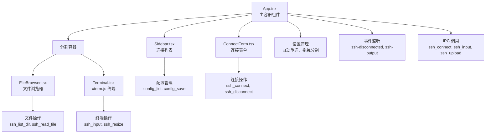

**图表来源**
- [App.tsx:340-412](file://src/App.tsx#L340-L412)
- [Sidebar.tsx:28-155](file://src/components/Sidebar.tsx#L28-L155)

**章节来源**
- [App.tsx:37-415](file://src/App.tsx#L37-L415)

## 架构概览

### 整体架构设计

SSH Tool 采用客户端-服务端分离的架构模式，前端负责用户界面和交互逻辑，后端负责 SSH 连接管理和文件操作。

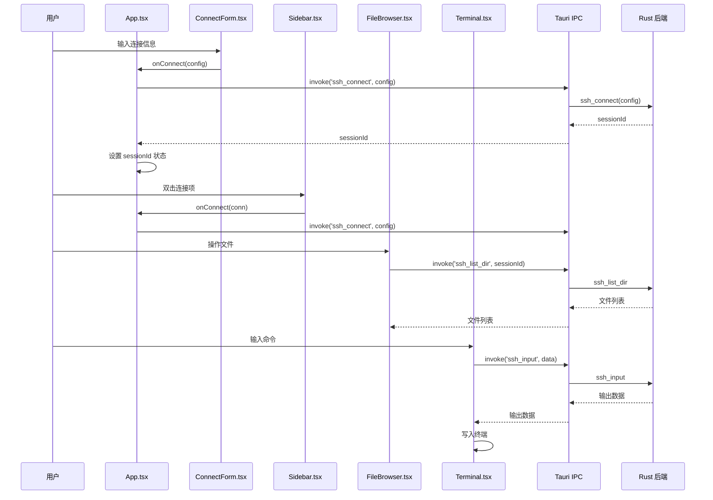

**图表来源**
- [App.tsx:180-338](file://src/App.tsx#L180-L338)
- [ConnectForm.tsx:59-73](file://src/components/ConnectForm.tsx#L59-L73)
- [Terminal.tsx:68-87](file://src/components/Terminal.tsx#L68-L87)

### 数据流架构

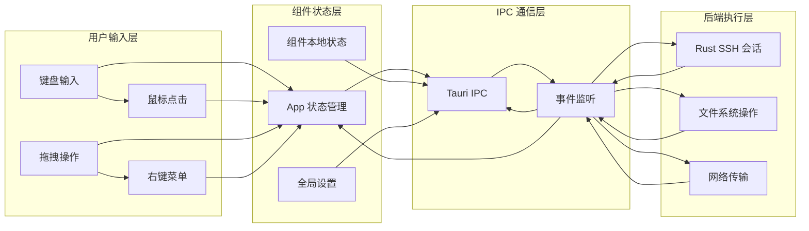

**图表来源**
- [App.tsx:68-164](file://src/App.tsx#L68-L164)
- [Terminal.tsx:23-121](file://src/components/Terminal.tsx#L23-L121)

## 详细组件分析

### App.tsx - 主容器组件

App.tsx 是整个应用的根组件，负责协调所有子组件的工作和状态管理。

#### 核心功能特性

1. **状态管理**：集中管理连接状态、错误信息、设置等
2. **事件处理**：监听 SSH 连接事件和自动重连逻辑
3. **布局控制**：管理侧边栏宽度和分割比例
4. **IPC 通信**：与后端进行 SSH 操作和配置管理

#### 关键状态和属性

| 状态名称 | 类型 | 描述 | 默认值 |
|---------|------|------|--------|
| sessionId | string \| null | 当前 SSH 会话 ID | null |
| isConnecting | boolean | 连接中状态 | false |
| error | string | 错误信息 | '' |
| showSave | boolean | 显示保存对话框 | false |
| connName | string | 连接名称 | '' |
| lastConfig | ConnectionConfig \| null | 最近一次连接配置 | null |
| toast | string | 提示消息 | '' |
| prefill | PrefillConfig \| null | 表单预填充配置 | null |
| settings | Settings | 应用设置 | 自动重连启用 |

#### 事件处理机制

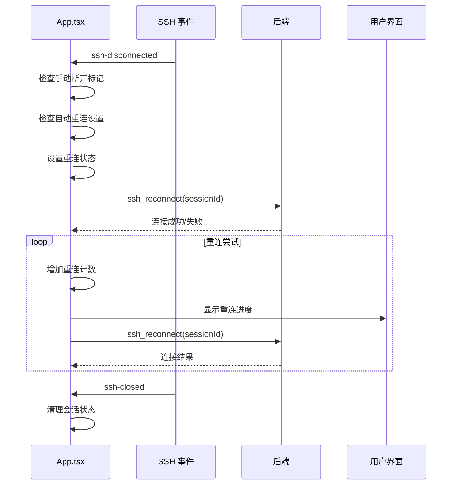

**图表来源**
- [App.tsx:124-173](file://src/App.tsx#L124-L173)
- [App.tsx:138-157](file://src/App.tsx#L138-L157)

**章节来源**
- [App.tsx:37-415](file://src/App.tsx#L37-L415)

### Terminal.tsx - xterm.js 集成组件

Terminal.tsx 实现了与 xterm.js 的深度集成，提供完整的终端功能。

#### 组件架构

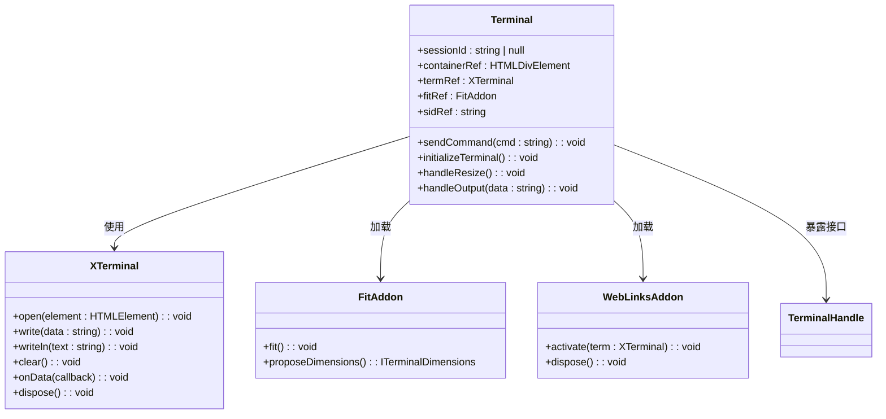

**图表来源**
- [Terminal.tsx:9-15](file://src/components/Terminal.tsx#L9-L15)
- [Terminal.tsx:17-150](file://src/components/Terminal.tsx#L17-L150)

#### 终端初始化流程

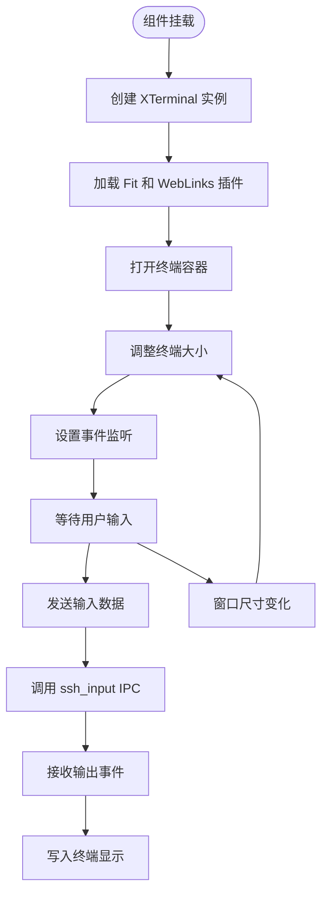

**图表来源**
- [Terminal.tsx:27-121](file://src/components/Terminal.tsx#L27-L121)
- [Terminal.tsx:123-141](file://src/components/Terminal.tsx#L123-L141)

#### 关键功能实现

1. **终端初始化**：配置主题、字体、光标行为
2. **输入处理**：将用户输入转换为 SSH 命令
3. **输出处理**：接收后端输出并渲染到终端
4. **自适应布局**：根据窗口大小调整终端尺寸
5. **命令注入**：支持外部组件通过 ref 发送命令

**章节来源**
- [Terminal.tsx:17-150](file://src/components/Terminal.tsx#L17-L150)

### FileBrowser.tsx - 远程文件管理系统

FileBrowser.tsx 提供了完整的远程文件浏览和管理功能。

#### 文件操作能力

| 操作类型 | 功能描述 | 支持格式 | 备注 |
|---------|----------|----------|------|
| 列表查看 | 查看目录内容 | 所有文件 | 排序：目录优先 |
| 文件下载 | 下载文件到本地 | 所有文件 | 支持进度显示 |
| 文件上传 | 上传本地文件 | 所有文件 | 支持批量上传 |
| 编辑文本 | 编辑文本文件 | 文本文件 | 支持语法高亮 |
| 创建文件 | 新建空文件 | 文本文件 | 限制大小 |
| 创建目录 | 新建目录 | 所有文件 | 无大小限制 |
| 删除操作 | 删除文件/目录 | 所有文件 | 目录递归删除 |
| 移动重命名 | 移动和重命名 | 所有文件 | 支持拖拽 |
| 权限管理 | 修改文件权限 | 所有文件 | 数字权限模式 |

#### 文件类型识别

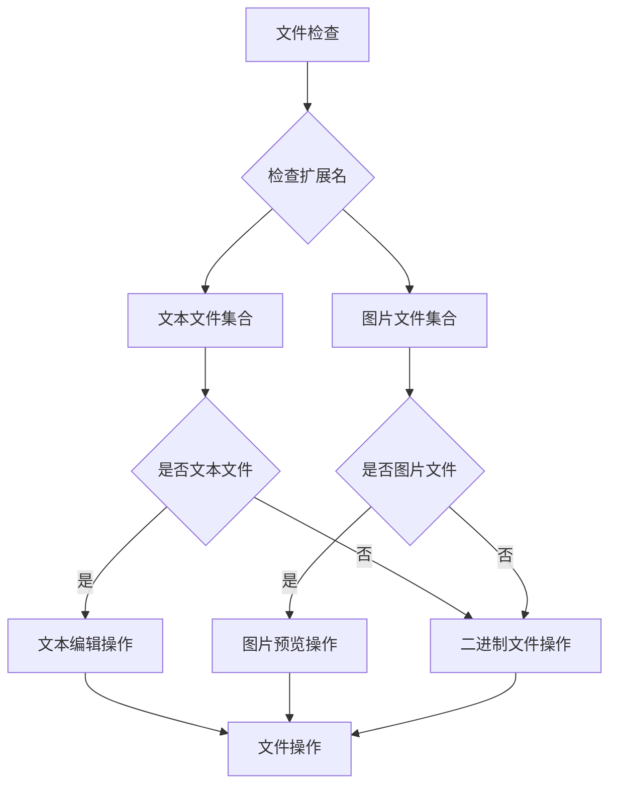

**图表来源**
- [FileBrowser.tsx:87-108](file://src/components/FileBrowser.tsx#L87-L108)
- [FileBrowser.tsx:154-800](file://src/components/FileBrowser.tsx#L154-L800)

#### 拖拽操作实现

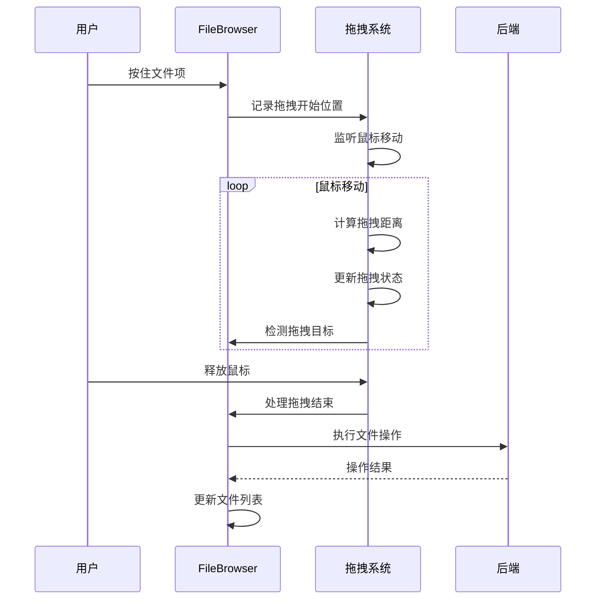

**图表来源**
- [FileBrowser.tsx:386-487](file://src/components/FileBrowser.tsx#L386-L487)

#### 关键状态管理

| 状态名称 | 类型 | 描述 | 用途 |
|---------|------|------|------|
| currentPath | string | 当前浏览路径 | 导航和操作定位 |
| files | FileEntry[] | 文件列表数据 | 渲染文件网格 |
| loading | boolean | 加载状态 | 显示加载指示器 |
| selectedFile | string \| null | 选中文件 | 操作目标标识 |
| editor | EditorState \| null | 编辑器状态 | 文本编辑界面 |
| contextMenu | FileContextMenu \| null | 上下文菜单 | 右键操作菜单 |
| clipboard | Clipboard \| null | 剪贴板状态 | 复制粘贴操作 |

**章节来源**
- [FileBrowser.tsx:154-800](file://src/components/FileBrowser.tsx#L154-L800)

### ConnectForm.tsx - 连接表单组件

ConnectForm.tsx 提供了直观的 SSH 连接配置界面。

#### 表单字段设计

| 字段名称 | 类型 | 必填 | 默认值 | 说明 |
|---------|------|------|--------|------|
| host | string | 是 | '' | 服务器地址 |
| port | number | 是 | 22 | 端口号 |
| username | string | 是 | 'root' | 用户名 |
| authType | string | 是 | 'password' | 认证方式 |
| password | string | 可选 | '' | 密码（密码认证） |
| keyPath | string | 可选 | '' | 密钥路径（密钥认证） |
| remember | boolean | 否 | true | 是否保存到连接列表 |

#### 认证方式切换逻辑

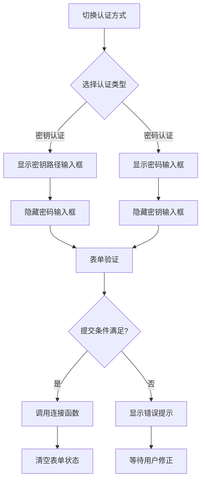

**图表来源**
- [ConnectForm.tsx:135-179](file://src/components/ConnectForm.tsx#L135-L179)

#### 文件上传功能

ConnectForm.tsx 集成了直接的文件上传功能，允许用户将本地文件上传到远程服务器。

**章节来源**
- [ConnectForm.tsx:26-232](file://src/components/ConnectForm.tsx#L26-L232)

### Sidebar.tsx - 连接列表管理

Sidebar.tsx 管理用户的 SSH 连接配置列表，提供快速连接和管理功能。

#### 连接项展示

每个连接项显示以下信息：
- **连接名称**：用户自定义的友好名称
- **主机信息**：用户名@主机:端口
- **删除按钮**：一键删除连接配置

#### 上下文菜单功能

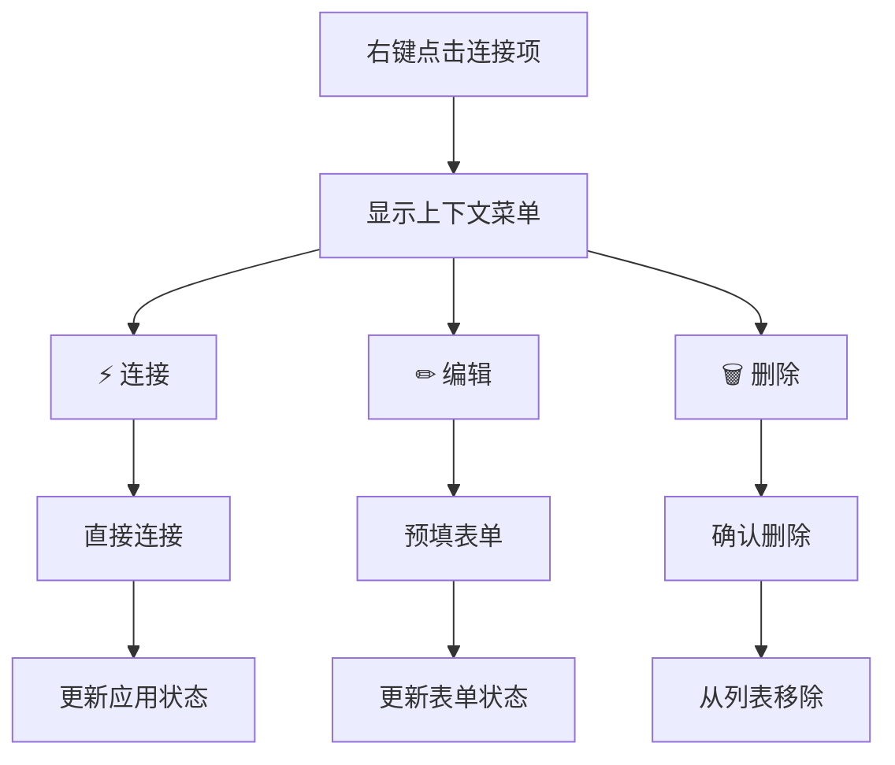

**图表来源**
- [Sidebar.tsx:115-150](file://src/components/Sidebar.tsx#L115-L150)

#### 数据持久化

连接配置通过 Tauri IPC 与后端进行交互，使用 JSON 文件存储连接信息。

**章节来源**
- [Sidebar.tsx:28-155](file://src/components/Sidebar.tsx#L28-L155)

## 组件间通信机制

### 事件驱动架构

SSH Tool 采用事件驱动的组件通信模式，通过 Tauri IPC 实现组件间的解耦通信。

#### 事件类型分类

| 事件类别 | 事件名称 | 触发源 | 功能描述 |
|---------|----------|--------|----------|
| 连接事件 | ssh-disconnected | 后端 | 连接断开通知 |
| 连接事件 | ssh-closed | 后端 | 连接关闭通知 |
| 输出事件 | ssh-output | 后端 | 终端输出数据 |
| 进度事件 | upload-progress | 后端 | 文件上传进度 |
| 进度事件 | download-progress | 后端 | 文件下载进度 |

#### 事件处理流程

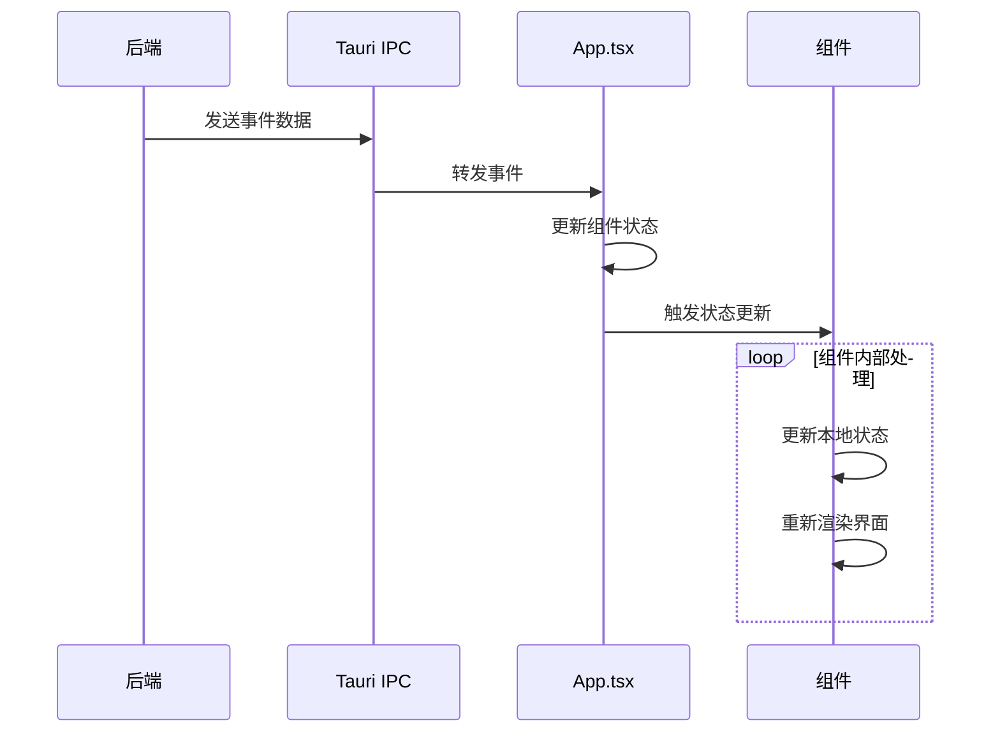

**图表来源**
- [App.tsx:124-173](file://src/App.tsx#L124-L173)
- [Terminal.tsx:82-111](file://src/components/Terminal.tsx#L82-L111)

### 回调函数模式

组件间通过回调函数实现单向通信，避免了复杂的事件总线系统。

#### 主要回调接口

| 组件 | 回调名称 | 参数类型 | 功能描述 |
|------|----------|----------|----------|
| App.tsx | handleConnect | ConnectionConfig | 处理连接请求 |
| App.tsx | handleDisconnect | void | 处理断开连接 |
| App.tsx | handleUpload | File | 处理文件上传 |
| App.tsx | handleSelectConnection | Connection | 选择连接项 |
| App.tsx | handleDirectConnect | Connection | 直接连接 |
| Sidebar.tsx | onSelect | Connection | 连接项选择 |
| Sidebar.tsx | onConnect | Connection | 连接项双击 |
| ConnectForm.tsx | onConnect | ConnectionConfig | 表单连接提交 |
| ConnectForm.tsx | onDisconnect | void | 表单断开连接 |
| ConnectForm.tsx | onUpload | File | 表单文件上传 |

**章节来源**
- [App.tsx:180-300](file://src/App.tsx#L180-L300)
- [Sidebar.tsx:15-20](file://src/components/Sidebar.tsx#L15-L20)
- [ConnectForm.tsx:3-24](file://src/components/ConnectForm.tsx#L3-L24)

## 状态管理模式

### 全局状态架构

SSH Tool 采用 React Hooks 的状态管理模式，将共享状态集中在 App.tsx 中管理。

#### 状态层次结构

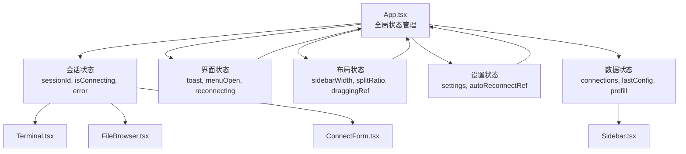

**图表来源**
- [App.tsx:38-60](file://src/App.tsx#L38-L60)
- [App.tsx:48-60](file://src/App.tsx#L48-L60)

#### 状态更新策略

1. **同步更新**：立即更新本地状态并触发重新渲染
2. **异步更新**：通过 IPC 调用后更新状态
3. **事件驱动**：监听后端事件更新状态
4. **引用更新**：使用 useRef 存储引用值

### 组件本地状态

各组件维护自己的本地状态，用于控制 UI 行为和用户体验。

#### 组件状态对比

| 组件 | 本地状态 | 作用域 | 生命周期 |
|------|----------|--------|----------|
| Terminal.tsx | termRef, fitRef, sidRef | 组件实例 | 组件卸载 |
| FileBrowser.tsx | selectedFile, editor, contextMenu | 组件实例 | 组件卸载 |
| ConnectForm.tsx | password, showPassword, remember | 组件实例 | 组件卸载 |
| Sidebar.tsx | contextMenu, connections | 组件实例 | 组件卸载 |

**章节来源**
- [App.tsx:48-60](file://src/App.tsx#L48-L60)
- [Terminal.tsx:18-25](file://src/components/Terminal.tsx#L18-L25)
- [FileBrowser.tsx:155-184](file://src/components/FileBrowser.tsx#L155-L184)

## 性能考虑

### 优化策略

1. **虚拟滚动**：对于大量文件列表使用虚拟滚动技术
2. **懒加载**：组件按需加载，减少初始包体积
3. **事件节流**：对高频事件进行节流处理
4. **内存管理**：及时清理事件监听器和定时器

### 性能监控

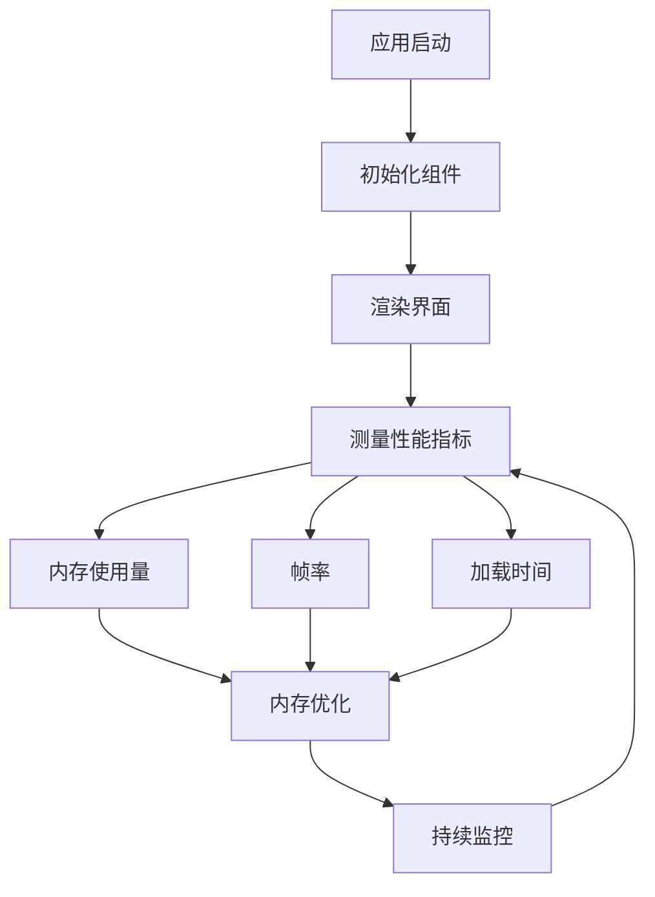

### 内存泄漏防护

组件在卸载时需要清理所有事件监听器和定时器：

1. **事件监听器清理**：使用返回的取消函数
2. **定时器清理**：使用 clearTimeout 和 clearInterval
3. **DOM 事件清理**：移除全局事件监听器
4. **引用清理**：设置引用为 null

**章节来源**
- [Terminal.tsx:113-121](file://src/components/Terminal.tsx#L113-L121)
- [FileBrowser.tsx:717-730](file://src/components/FileBrowser.tsx#L717-L730)

## 故障排除指南

### 常见问题及解决方案

#### 连接问题

| 问题症状 | 可能原因 | 解决方案 |
|----------|----------|----------|
| 连接超时 | 网络不稳定 | 检查网络连接，增加超时时间 |
| 认证失败 | 凭据错误 | 验证用户名、密码或密钥路径 |
| 权限不足 | 用户权限限制 | 使用具有足够权限的账户登录 |
| 端口被占用 | SSH 服务未启动 | 检查 SSH 服务状态 |

#### 终端问题

| 问题症状 | 可能原因 | 解决方案 |
|----------|----------|----------|
| 终端无响应 | 会话中断 | 检查连接状态，重新连接 |
| 显示异常 | 终端尺寸不匹配 | 调整窗口大小，触发重新适配 |
| 输入无效 | 编码问题 | 检查字符编码设置 |
| 输出乱码 | 字体不支持 | 更换支持的字体 |

#### 文件操作问题

| 问题症状 | 可能原因 | 解决方案 |
|----------|----------|----------|
| 无法上传 | 权限不足 | 检查目录写权限 |
| 上传失败 | 磁盘空间不足 | 清理磁盘空间 |
| 下载卡住 | 网络中断 | 检查网络连接 |
| 文件损坏 | 传输中断 | 重新传输文件 |

### 调试技巧

1. **开发者工具**：使用浏览器开发者工具调试组件状态
2. **日志记录**：在关键节点添加日志输出
3. **状态检查**：定期检查组件状态变化
4. **事件追踪**：监控 IPC 事件的传递过程

**章节来源**
- [App.tsx:218-223](file://src/App.tsx#L218-L223)
- [Terminal.tsx:106-111](file://src/components/Terminal.tsx#L106-L111)

## 结论

SSH Tool 的前端组件系统展现了现代 React 应用的最佳实践，通过精心设计的组件架构和事件驱动的通信机制，实现了功能完整、性能优良的 SSH 客户端工具。

### 主要优势

1. **模块化设计**：清晰的组件职责分离，便于维护和扩展
2. **事件驱动**：通过 Tauri IPC 实现松耦合的组件通信
3. **响应式布局**：支持动态调整的用户界面
4. **完善的错误处理**：全面的错误捕获和用户反馈机制
5. **性能优化**：合理的状态管理和内存使用策略

### 技术亮点

- **xterm.js 集成**：提供了专业的终端模拟体验
- **拖拽操作**：直观的文件管理操作方式
- **自动重连**：智能的连接状态管理和恢复机制
- **多认证支持**：灵活的用户认证方式选择

### 未来改进方向

1. **性能优化**：进一步优化大文件传输和大量文件浏览的性能
2. **功能扩展**：添加更多 SSH 高级功能和配置选项
3. **用户体验**：改善界面交互和视觉效果
4. **安全性**：增强安全性和权限控制机制

该组件系统为 SSH 工具提供了坚实的技术基础，通过持续的优化和完善，将成为一个功能强大、易于使用的跨平台 SSH 客户端解决方案。