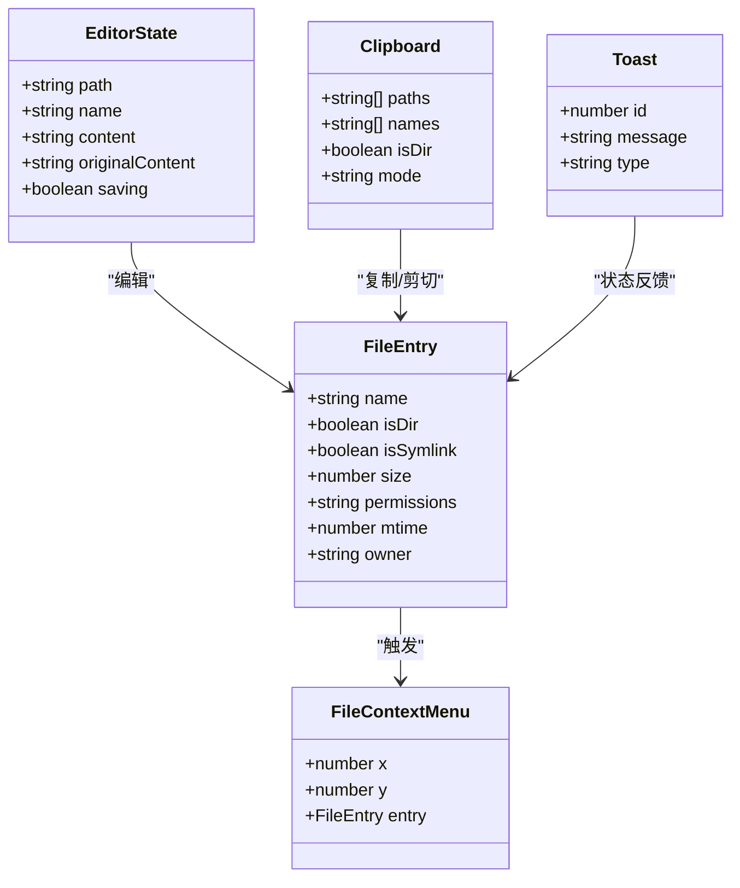
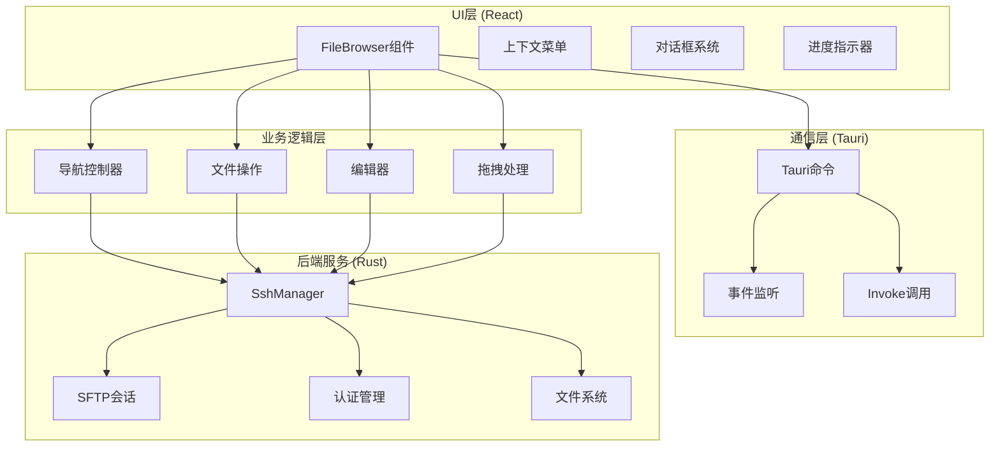
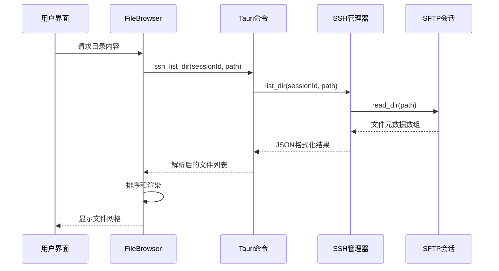
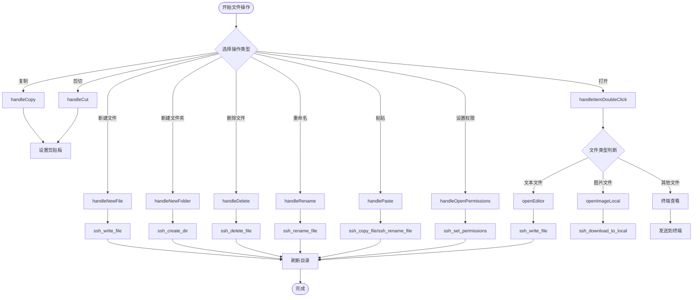
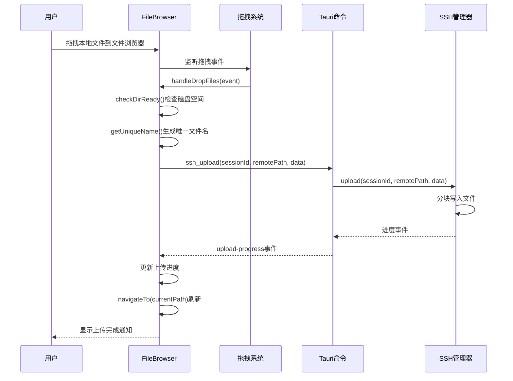
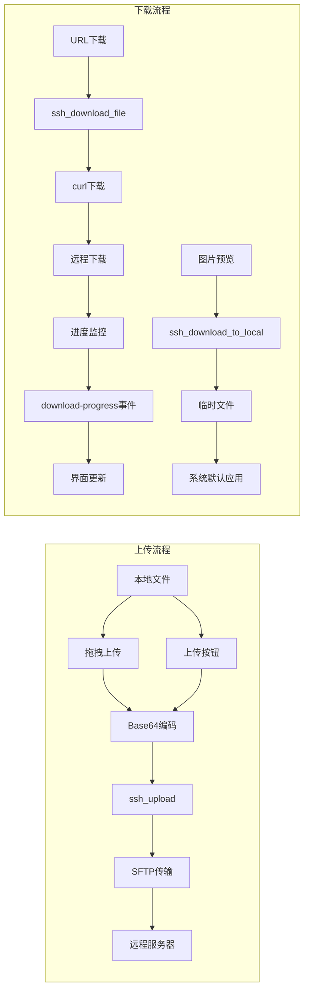

# 文件浏览器组件

<cite>
**本文档引用的文件**
- [FileBrowser.tsx](file://src/components/FileBrowser.tsx)
- [App.tsx](file://src/App.tsx)
- [lib.rs](file://src-tauri/src/lib.rs)
- [ssh.rs](file://src-tauri/src/ssh.rs)
- [main.rs](file://src-tauri/src/main.rs)
- [Cargo.toml](file://src-tauri/Cargo.toml)
- [tauri.conf.json](file://src-tauri/tauri.conf.json)
- [package.json](file://package.json)
- [App.css](file://src/App.css)
</cite>

## 目录
1. [简介](#简介)
2. [项目结构](#项目结构)
3. [核心组件](#核心组件)
4. [架构概览](#架构概览)
5. [详细组件分析](#详细组件分析)
6. [依赖关系分析](#依赖关系分析)
7. [性能考虑](#性能考虑)
8. [故障排除指南](#故障排除指南)
9. [结论](#结论)

## 简介

文件浏览器组件是SSH工具中的核心功能模块，提供了远程文件系统的完整浏览和管理能力。该组件实现了现代化的文件管理界面，支持拖拽操作、右键菜单、快捷键等用户友好特性，同时集成了文本编辑器和二进制文件处理功能。

该组件基于React构建，通过Tauri与Rust后端进行通信，实现了安全的SSH连接管理和SFTP文件传输功能。组件支持多种文件类型识别、权限管理、批量操作和实时进度反馈。

## 项目结构

项目采用前后端分离的架构设计，主要分为前端React应用和后端Tauri/Rust服务两部分：

```mermaid
graph TB
subgraph "前端应用 (React)"
FB[FileBrowser 组件]
APP[App 主应用]
CSS[样式系统]
end
subgraph "Tauri 桥接层"
LIB[lib.rs 命令定义]
MAIN[main.rs 应用入口]
end
subgraph "Rust 后端 (Tokio)"
SSH[ssh.rs SSH管理器]
RUSSH[Russh SSH库]
SFTP[Russh-SFTP客户端]
end
subgraph "外部依赖"
TAU[t@uri-api]
BASE64[Base64编码]
OPEN[Open系统应用]
end
FB --> LIB
APP --> FB
LIB --> SSH
SSH --> RUSSH
SSH --> SFTP
FB --> TAU
SSH --> BASE64
SSH --> OPEN
```

**图表来源**
- [FileBrowser.tsx:154-1301](file://src/components/FileBrowser.tsx#L154-L1301)
- [lib.rs:268-319](file://src-tauri/src/lib.rs#L268-L319)
- [ssh.rs:58-654](file://src-tauri/src/ssh.rs#L58-L654)

**章节来源**
- [package.json:1-28](file://package.json#L1-L28)
- [tauri.conf.json:1-41](file://src-tauri/tauri.conf.json#L1-L41)

## 核心组件

文件浏览器组件的核心功能围绕以下关键特性构建：

### 数据结构设计

组件定义了完整的文件条目数据模型：



**图表来源**
- [FileBrowser.tsx:15-65](file://src/components/FileBrowser.tsx#L15-L65)

### 文件类型识别系统

组件内置了全面的文件类型识别机制：

| 文件类别 | 支持扩展名 | 特征 |
|---------|-----------|------|
| 文本文件 | txt, md, log, json, xml, yaml, ini, cfg | 可直接编辑 |
| 编程语言 | js, ts, py, rb, go, rs, java, cpp, c | 高亮语法 |
| 样式文件 | css, scss, less, html | 代码格式化 |
| 脚本文件 | sh, bash, zsh, ps1, bat, cmd | 执行权限 |
| 配置文件 | dockerfile, makefile, env, gitignore | 结构化显示 |
| 图片文件 | png, jpg, jpeg, gif, bmp, webp | 预览支持 |

**章节来源**
- [FileBrowser.tsx:87-108](file://src/components/FileBrowser.tsx#L87-L108)

## 架构概览

文件浏览器组件采用分层架构设计，确保了良好的可维护性和扩展性：



**图表来源**
- [FileBrowser.tsx:154-1301](file://src/components/FileBrowser.tsx#L154-L1301)
- [lib.rs:268-319](file://src-tauri/src/lib.rs#L268-L319)

## 详细组件分析

### 文件列表渲染系统

文件浏览器实现了高性能的虚拟化文件列表渲染：



**图表来源**
- [FileBrowser.tsx:204-227](file://src/components/FileBrowser.tsx#L204-L227)
- [lib.rs:104-112](file://src-tauri/src/lib.rs#L104-L112)
- [ssh.rs:288-307](file://src-tauri/src/ssh.rs#L288-L307)

### 目录导航机制

组件支持多层级目录导航和路径快速跳转：

| 导航方式 | 实现方法 | 功能特点 |
|---------|----------|----------|
| 双击进入 | handleItemDoubleClick | 目录双击进入 |
| 上级目录 | goUp函数 | 返回父目录 |
| 面包屑导航 | breadcrumbParts | 可视化路径导航 |
| 快速跳转 | 路径编辑模式 | 直接输入目标路径 |
| 刷新操作 | navigateTo(currentPath) | 重新加载当前目录 |

**章节来源**
- [FileBrowser.tsx:511-524](file://src/components/FileBrowser.tsx#L511-L524)
- [FileBrowser.tsx:770-775](file://src/components/FileBrowser.tsx#L770-L775)

### 文件操作功能

文件浏览器提供了完整的文件管理操作集合：



**图表来源**
- [FileBrowser.tsx:589-678](file://src/components/FileBrowser.tsx#L589-L678)
- [FileBrowser.tsx:543-572](file://src/components/FileBrowser.tsx#L543-L572)

**章节来源**
- [FileBrowser.tsx:574-678](file://src/components/FileBrowser.tsx#L574-L678)

### 拖拽操作实现

组件实现了可靠的拖拽文件上传和文件间移动功能：



**图表来源**
- [FileBrowser.tsx:315-355](file://src/components/FileBrowser.tsx#L315-L355)
- [FileBrowser.tsx:408-509](file://src/components/FileBrowser.tsx#L408-L509)
- [lib.rs:77-91](file://src-tauri/src/lib.rs#L77-L91)
- [ssh.rs:520-583](file://src-tauri/src/ssh.rs#L520-L583)

### 右键菜单系统

组件提供了丰富的上下文菜单功能：

| 菜单项 | 功能描述 | 触发条件 |
|-------|----------|----------|
| 打开/编辑 | 目录进入或文件编辑 | 右键点击 |
| 复制/剪切 | 文件复制/移动准备 | 右键点击 |
| 粘贴 | 执行复制/移动操作 | 有剪贴板内容 |
| 重命名 | 修改文件名 | 右键点击 |
| 查看终端 | 在终端中查看文件 | 右键点击 |
| 文件信息 | 显示详细元数据 | 右键点击 |
| 设置权限 | 修改文件权限 | 右键点击 |
| 删除 | 永久删除文件 | 右键点击 |
| 刷新 | 重新加载目录 | 空白区域右键 |

**章节来源**
- [FileBrowser.tsx:990-1068](file://src/components/FileBrowser.tsx#L990-L1068)
- [FileBrowser.tsx:1070-1115](file://src/components/FileBrowser.tsx#L1070-L1115)

### 快捷键支持

组件实现了便捷的键盘快捷键操作：

| 快捷键 | 功能 | 说明 |
|-------|------|------|
| F5 | 刷新目录 | 重新加载当前目录内容 |
| Delete | 删除选中文件 | 删除确认后执行 |
| Ctrl+S | 保存编辑器 | 保存当前修改的文件 |
| Enter | 确认对话框 | 在提示框中确认操作 |
| Escape | 取消操作 | 关闭对话框或取消编辑 |

**章节来源**
- [FileBrowser.tsx:754-768](file://src/components/FileBrowser.tsx#L754-L768)

### 文件上传下载机制

组件支持多种文件传输方式：



**图表来源**
- [FileBrowser.tsx:685-715](file://src/components/FileBrowser.tsx#L685-L715)
- [FileBrowser.tsx:526-541](file://src/components/FileBrowser.tsx#L526-L541)
- [lib.rs:207-218](file://src-tauri/src/lib.rs#L207-L218)
- [ssh.rs:448-518](file://src-tauri/src/ssh.rs#L448-L518)

### 文本文件编辑器集成

组件集成了轻量级文本编辑器功能：

| 编辑器特性 | 实现方式 | 功能说明 |
|-----------|----------|----------|
| 单行编辑 | textarea元素 | 基础文本编辑 |
| 多行编辑 | textarea元素 | 支持换行和格式 |
| 自动保存 | 保存按钮 | 手动触发保存 |
| 快捷键 | Ctrl+S | 快速保存文件 |
| 内容验证 | 原始内容比较 | 检测未保存更改 |
| 错误处理 | 异常捕获 | 保存失败时提示 |

**章节来源**
- [FileBrowser.tsx:945-988](file://src/components/FileBrowser.tsx#L945-L988)
- [FileBrowser.tsx:560-572](file://src/components/FileBrowser.tsx#L560-L572)

### 二进制文件处理

对于无法直接编辑的二进制文件，组件提供了安全的处理方式：

| 处理方式 | 实现方法 | 安全措施 |
|---------|----------|----------|
| 本地预览 | ssh_download_to_local | 下载到临时目录 |
| 系统打开 | open::that | 使用系统默认应用 |
| 终端查看 | 发送cat命令 | 安全的命令执行 |
| 大文件警告 | 1MB限制 | 防止内存溢出 |

**章节来源**
- [FileBrowser.tsx:526-541](file://src/components/FileBrowser.tsx#L526-L541)
- [FileBrowser.tsx:543-558](file://src/components/FileBrowser.tsx#L543-L558)

## 依赖关系分析

文件浏览器组件的依赖关系体现了清晰的分层架构：

```mermaid
graph TB
subgraph "前端依赖"
REACT[React 19.2.7]
TAURI_API[@tauri-apps/api 2.11.0]
BASE64[Base64编码]
end
subgraph "后端依赖"
RUST[Rust 1.77.2]
RUSSH[russh 0.45]
RUSHSFTP[russh-sftp 2]
TOKIO[tokio 1]
SERDE[serde 1.0]
end
subgraph "系统依赖"
SSH[SSH协议]
SFTP[SFTP协议]
CURL[curl工具]
OPEN[系统应用]
end
REACT --> TAURI_API
TAURI_API --> RUSHSFTP
RUSHSFTP --> SFTP
RUSSH --> SSH
CURL --> SFTP
OPEN --> 系统应用
```

**图表来源**
- [package.json:15-26](file://package.json#L15-L26)
- [Cargo.toml:18-33](file://src-tauri/Cargo.toml#L18-L33)

**章节来源**
- [package.json:15-26](file://package.json#L15-L26)
- [Cargo.toml:18-33](file://src-tauri/Cargo.toml#L18-L33)

## 性能考虑

文件浏览器组件在设计时充分考虑了性能优化：

### 内存管理
- **文件列表缓存**：避免重复请求相同目录
- **图像预览缓存**：临时文件存储减少重复下载
- **编辑器状态管理**：只在需要时加载大文件内容

### 网络优化
- **分块上传**：32KB分块传输提高稳定性
- **进度回调**：实时进度反馈用户体验
- **超时控制**：60秒请求超时防止阻塞

### 渲染优化
- **虚拟滚动**：大量文件时的性能考虑
- **懒加载**：图标和预览按需加载
- **事件节流**：拖拽和滚动事件防抖

### 错误恢复
- **自动重连**：网络断开后的自动恢复
- **超时重试**：失败操作的重试机制
- **降级处理**：功能不可用时的替代方案

## 故障排除指南

### 常见问题及解决方案

| 问题类型 | 症状 | 解决方案 |
|---------|------|----------|
| 连接失败 | 无法建立SSH连接 | 检查主机、端口、凭据配置 |
| 权限不足 | 无法写入文件 | 使用chmod设置正确权限 |
| 传输中断 | 上传/下载失败 | 检查网络连接和磁盘空间 |
| 文件过大 | 编辑器无响应 | 使用终端查看大文件 |
| 拖拽无效 | 无法拖拽文件 | 确认WebView2兼容性 |

### 调试技巧

1. **启用日志**：在开发模式下查看详细错误信息
2. **检查事件**：监听download-progress和upload-progress事件
3. **验证路径**：确认远程路径的有效性
4. **测试权限**：使用check_space验证磁盘空间和写权限

**章节来源**
- [ssh.rs:419-446](file://src-tauri/src/ssh.rs#L419-L446)
- [FileBrowser.tsx:267-284](file://src/components/FileBrowser.tsx#L267-L284)

## 结论

文件浏览器组件是一个功能完整、性能优异的远程文件管理系统。它成功地将复杂的SSH/SFTP操作封装为直观易用的图形界面，为用户提供了类似本地文件管理器的体验。

组件的主要优势包括：
- **完整的功能覆盖**：从基础浏览到高级操作一应俱全
- **优秀的用户体验**：拖拽、右键菜单、快捷键等现代UI特性
- **可靠的安全性**：基于SSH的加密传输和权限管理
- **良好的性能表现**：优化的渲染和传输机制
- **强大的扩展性**：清晰的架构便于功能扩展

通过合理的架构设计和实现策略，该组件为SSH工具提供了坚实的文件管理基础，满足了专业用户对远程文件操作的各种需求。