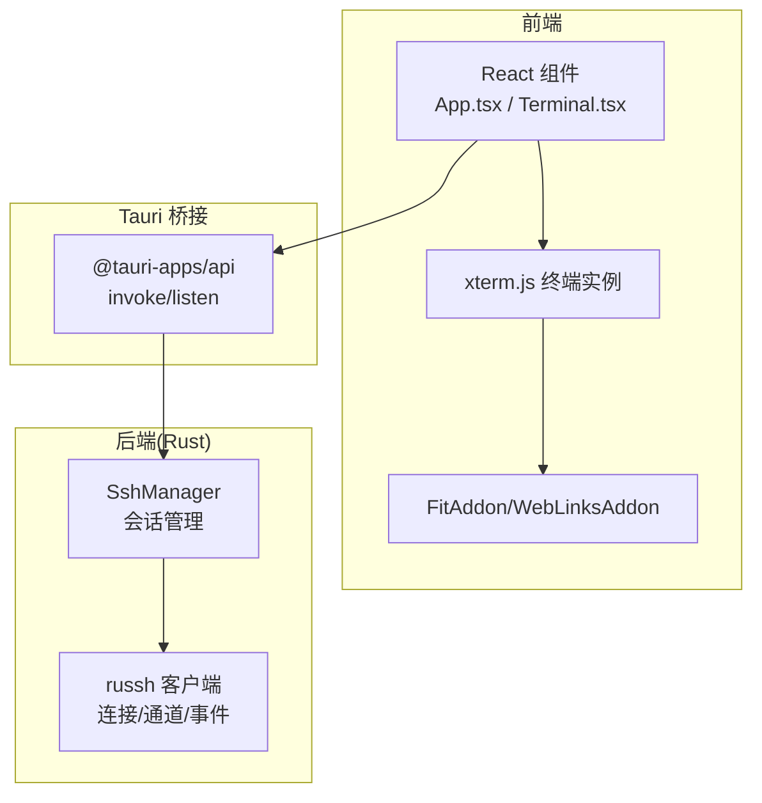
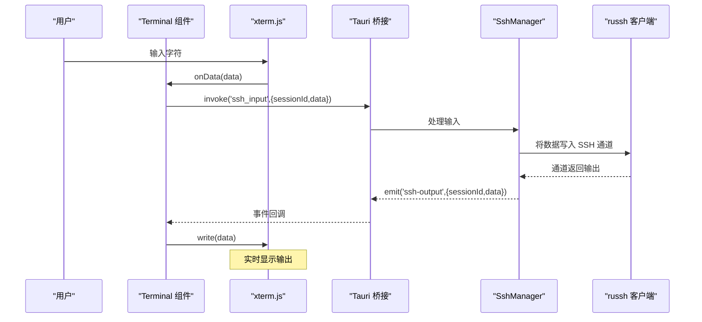
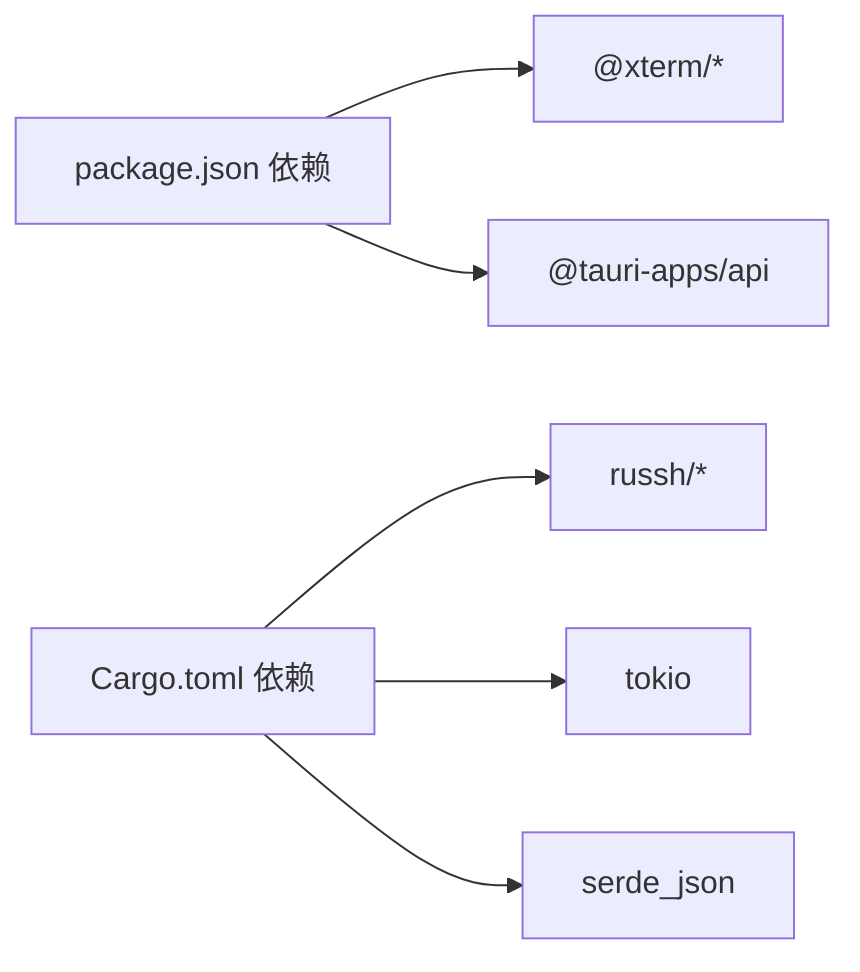

# 终端组件

<cite>
**本文档引用的文件**
- [Terminal.tsx](file://src/components/Terminal.tsx)
- [App.tsx](file://src/App.tsx)
- [main.tsx](file://src/main.tsx)
- [ssh.rs](file://src-tauri/src/ssh.rs)
- [lib.rs](file://src-tauri/src/lib.rs)
- [config.rs](file://src-tauri/src/config.rs)
- [Cargo.toml](file://src-tauri/Cargo.toml)
- [package.json](file://package.json)
</cite>

## 目录
1. [简介](#简介)
2. [项目结构](#项目结构)
3. [核心组件](#核心组件)
4. [架构总览](#架构总览)
5. [详细组件分析](#详细组件分析)
6. [依赖关系分析](#依赖关系分析)
7. [性能考虑](#性能考虑)
8. [故障排除指南](#故障排除指南)
9. [结论](#结论)
10. [附录](#附录)

## 简介
本文件系统性地解析基于 xterm.js 的终端组件实现，涵盖终端初始化、会话绑定、命令执行与实时输出处理、自适应调整、键盘事件与输入验证、配置与样式定制以及性能优化策略。文档同时提供完整的 API 使用说明与集成示例，帮助开发者在应用中无缝集成并控制终端功能。

## 项目结构
该应用采用前端（React + Tauri）与后端（Rust + russh）分层架构：
- 前端负责用户界面与交互，通过 @tauri-apps/api 调用后端命令，并监听事件进行实时更新。
- 后端负责 SSH 连接管理、会话生命周期、数据通道与事件广播。

图表来源
- [Terminal.tsx:28-121](file://src/components/Terminal.tsx#L28-L121)
- [lib.rs:268-318](file://src-tauri/src/lib.rs#L268-L318)
- [ssh.rs:58-653](file://src-tauri/src/ssh.rs#L58-L653)

章节来源
- [Terminal.tsx:1-150](file://src/components/Terminal.tsx#L1-L150)
- [App.tsx:340-412](file://src/App.tsx#L340-L412)
- [lib.rs:268-318](file://src-tauri/src/lib.rs#L268-L318)
- [ssh.rs:58-653](file://src-tauri/src/ssh.rs#L58-L653)

## 核心组件
- 终端组件 Terminal：封装 xterm.js 实例，加载适配与链接插件，处理输入/输出事件，暴露 sendCommand 方法供父组件调用。
- 应用主组件 App：维护会话 ID、自动重连逻辑、拖拽布局、状态提示等；将会话 ID 传递给 Terminal 并转发命令。
- 后端 SshManager：管理 SSH 会话、PTY 请求、数据通道、窗口大小变更、事件广播（输出、断开、重连）。

章节来源
- [Terminal.tsx:13-15](file://src/components/Terminal.tsx#L13-L15)
- [App.tsx:37-60](file://src/App.tsx#L37-L60)
- [ssh.rs:58-653](file://src-tauri/src/ssh.rs#L58-L653)

## 架构总览
终端组件通过 Tauri 桥接与 Rust 后端通信，形成“前端 xterm.js + 后端 russh”的完整链路。数据流如下：
- 用户输入触发 xterm onData，经 invoke('ssh_input') 发送到后端。
- 后端从 SSH 通道读取输出，通过 emit('ssh-output') 推送回前端。
- 前端收到事件后写入 xterm 实时显示。
- 窗口尺寸变化时，前端调用 FitAddon 自适应并 invoke('ssh_resize') 同步行列数。

图表来源
- [Terminal.tsx:68-87](file://src/components/Terminal.tsx#L68-L87)
- [lib.rs:44-52](file://src-tauri/src/lib.rs#L44-L52)
- [ssh.rs:135-178](file://src-tauri/src/ssh.rs#L135-L178)

## 详细组件分析

### 终端初始化与配置
- 初始化步骤
  - 创建 xterm 实例，设置光标闪烁、字体大小与字体族、主题色板与透明度。
  - 加载 FitAddon 用于自适应窗口尺寸，加载 WebLinksAddon 支持点击链接。
  - 打开容器并延时一次 fit，确保初始渲染正确。
- 主题与样式
  - 使用深色主题，定义前景、背景、光标、选择区及明暗色阶。
  - 容器内边距与背景色统一界面风格。
- 插件与事件
  - onData 回调通过 invoke('ssh_input') 将数据发送至后端。
  - 监听 'ssh-output' 事件，按会话 ID 写入终端。
  - 监听 'ssh-closed' 事件，在对应会话关闭时提示用户。

章节来源
- [Terminal.tsx:31-58](file://src/components/Terminal.tsx#L31-L58)
- [Terminal.tsx:60-67](file://src/components/Terminal.tsx#L60-L67)
- [Terminal.tsx:68-87](file://src/components/Terminal.tsx#L68-L87)
- [Terminal.tsx:143-149](file://src/components/Terminal.tsx#L143-L149)

### 会话绑定与命令执行机制
- 会话绑定
  - 通过 sessionId 属性与 App 组件关联，sidRef 保持当前会话引用。
  - 监听 'ssh-output' 事件时严格匹配 sessionId，避免跨会话污染。
- 命令发送流程
  - 终端输入 onData(data) -> invoke('ssh_input') -> 后端写入 SSH 通道。
  - 外部调用 sendCommand(cmd) -> 自动追加回车符 -> invoke('ssh_input')。
- 输出接收与显示
  - 后端通道 Data 事件转换为 UTF-8 文本，emit('ssh-output')。
  - 前端事件回调中仅写入当前会话的数据，保证隔离性。

章节来源
- [Terminal.tsx:17-25](file://src/components/Terminal.tsx#L17-L25)
- [Terminal.tsx:82-87](file://src/components/Terminal.tsx#L82-L87)
- [Terminal.tsx:123-130](file://src/components/Terminal.tsx#L123-L130)
- [lib.rs:44-52](file://src-tauri/src/lib.rs#L44-L52)
- [ssh.rs:139-144](file://src-tauri/src/ssh.rs#L139-L144)

### 实时输出处理与事件驱动
- 事件类型
  - 'ssh-output': 后端推送的终端输出，包含 sessionId 与 data。
  - 'ssh-closed': 后端检测到会话关闭时发出。
  - 'ssh-disconnected': 后端检测到连接断开或发送失败时发出。
- 前端处理
  - 仅处理与当前 sessionId 匹配的输出，写入 xterm。
  - 收到 'ssh-closed' 时在终端打印提示信息。
  - App 层监听 'ssh-disconnected' 实现自动重连策略。

章节来源
- [Terminal.tsx:82-111](file://src/components/Terminal.tsx#L82-L111)
- [App.tsx:124-164](file://src/App.tsx#L124-L164)

### 终端窗口自适应与尺寸同步
- 自适应流程
  - FitAddon.fit() 计算容器可容纳的列数与行数。
  - 调用 invoke('ssh_resize') 将 cols/rows 同步到后端，后端通过 window_change 更新远端 PTY。
- 触发时机
  - 窗口 resize 事件触发。
  - 切换会话后延时重新 fit 并清屏提示。

章节来源
- [Terminal.tsx:89-103](file://src/components/Terminal.tsx#L89-L103)
- [Terminal.tsx:133-141](file://src/components/Terminal.tsx#L133-L141)
- [ssh.rs:165-167](file://src-tauri/src/ssh.rs#L165-L167)

### 键盘事件处理与输入验证
- 键盘输入
  - xterm onData 直接捕获用户输入，无需额外键盘事件监听。
- 输入验证与安全
  - 前端未对输入内容做特殊校验，直接透传至后端。
  - 后端通过 russh 通道写入，遵循 SSH 协议语义。
- 会话切换与清理
  - 切换 sessionId 时清屏并提示“已连接”，避免历史残留。

章节来源
- [Terminal.tsx:68-73](file://src/components/Terminal.tsx#L68-L73)
- [Terminal.tsx:137-140](file://src/components/Terminal.tsx#L137-L140)

### 终端句柄(TerminalHandle)使用方法
- 暴露接口
  - 通过 useImperativeHandle 暴露 sendCommand(cmd: string) 方法。
- 调用方式
  - App 中通过 ref 引用调用，例如 FileBrowser 在打开编辑器时向终端发送命令以展示文件内容。
- 注意事项
  - 仅在存在有效 sessionId 且 xterm 已初始化时才发送命令。

章节来源
- [Terminal.tsx:123-130](file://src/components/Terminal.tsx#L123-L130)
- [App.tsx:336-338](file://src/App.tsx#L336-L338)

### 终端配置选项与样式定制
- 配置项
  - 光标闪烁、字体大小、字体族、主题色板、透明度。
- 主题设计
  - 深色背景与高对比度前景，支持明亮/暗淡色阶，便于代码阅读。
- 容器样式
  - 设置容器宽度与高度为 100%，并添加内边距与背景色，与整体界面一致。

章节来源
- [Terminal.tsx:31-58](file://src/components/Terminal.tsx#L31-L58)
- [Terminal.tsx:143-149](file://src/components/Terminal.tsx#L143-L149)

### 性能优化策略
- 前端优化
  - 使用 FitAddon 自适应减少重绘开销。
  - 事件监听在组件卸载时及时移除，避免内存泄漏。
  - 会话切换时延时 fit，避免频繁计算。
- 后端优化
  - 使用 mpsc 通道异步处理输入/窗口变更，避免阻塞主线程。
  - keepalive 与超时配置提升连接稳定性。
  - 对上传/下载进度事件进行节流式 emit，降低前端压力。

章节来源
- [Terminal.tsx:113-121](file://src/components/Terminal.tsx#L113-L121)
- [ssh.rs:82-87](file://src-tauri/src/ssh.rs#L82-L87)
- [ssh.rs:121-123](file://src-tauri/src/ssh.rs#L121-L123)

## 依赖关系分析
- 前端依赖
  - @xterm/xterm、@xterm/addon-fit、@xterm/addon-web-links 提供终端能力。
  - @tauri-apps/api 提供 invoke 与 listen 能力。
- 后端依赖
  - russh/russh-keys/russh-sftp 提供 SSH 客户端、密钥与 SFTP 功能。
  - tokio 异步运行时，mpsc 通道用于并发处理。
  - serde_json 用于事件与配置序列化。

图表来源
- [package.json:15-26](file://package.json#L15-L26)
- [Cargo.toml:18-32](file://src-tauri/Cargo.toml#L18-L32)

章节来源
- [package.json:15-26](file://package.json#L15-L26)
- [Cargo.toml:18-32](file://src-tauri/Cargo.toml#L18-L32)

## 性能考虑
- 渲染与布局
  - FitAddon 自适应窗口，减少不必要的重排。
  - 容器固定尺寸，避免频繁测量导致的抖动。
- 事件与网络
  - 仅在当前会话匹配时处理输出，避免跨会话渲染。
  - 后端使用 mpsc 控制队列长度，防止内存膨胀。
- 连接稳定性
  - keepalive 与 inactivity 超时配置，降低死连接占用。
  - 自动重连策略与最大尝试次数限制，平衡可用性与资源消耗。

[本节为通用指导，不直接分析具体文件]

## 故障排除指南
- 无法连接
  - 检查 sessionId 是否为空，确认 App 已成功发起 ssh_connect。
  - 查看后端日志与错误提示，确认主机、端口、凭据是否正确。
- 输入无响应
  - 确认 onData 事件是否触发，检查 invoke('ssh_input') 是否被调用。
  - 核对 sessionId 是否与当前会话一致。
- 输出不显示
  - 检查 'ssh-output' 事件是否到达，确认前端监听与过滤逻辑。
  - 验证后端通道 Data 事件是否正常产生。
- 断线与重连
  - App 监听 'ssh-disconnected'，根据设置执行自动重连。
  - 若手动断开，需设置标志位避免自动重连。

章节来源
- [App.tsx:124-164](file://src/App.tsx#L124-L164)
- [ssh.rs:139-151](file://src-tauri/src/ssh.rs#L139-L151)

## 结论
该终端组件通过 xterm.js 与 Tauri 桥接，结合 Rust 后端 russh，实现了稳定、可扩展的远程终端体验。其设计强调会话隔离、事件驱动与自适应布局，既满足日常运维场景，也为进一步扩展（如多标签页、命令历史、主题切换）提供了良好基础。

[本节为总结性内容，不直接分析具体文件]

## 附录

### API 文档与使用示例

- 终端组件 API
  - 属性
    - sessionId: string | null
  - 句柄方法
    - sendCommand(cmd: string): void
  - 使用示例
    - 在父组件中 ref 获取 TerminalHandle，调用 sendCommand 发送命令。
    - 切换 sessionId 时，终端会自动清屏并提示已连接。

章节来源
- [Terminal.tsx:9-15](file://src/components/Terminal.tsx#L9-L15)
- [Terminal.tsx:123-130](file://src/components/Terminal.tsx#L123-L130)
- [App.tsx:48](file://src/App.tsx#L48)
- [App.tsx:336-338](file://src/App.tsx#L336-L338)

- Tauri 命令与事件
  - 命令
    - ssh_connect(config): 返回 sessionId
    - ssh_input(sessionId, data): 发送输入
    - ssh_resize(sessionId, cols, rows): 同步窗口大小
    - ssh_disconnect(sessionId): 断开连接
    - ssh_reconnect(sessionId): 重连
  - 事件
    - ssh-output({ sessionId, data }): 输出事件
    - ssh-closed(sessionId): 会话关闭
    - ssh-disconnected({ sessionId, reason }): 连接断开

章节来源
- [lib.rs:21-74](file://src-tauri/src/lib.rs#L21-L74)
- [ssh.rs:139-151](file://src-tauri/src/ssh.rs#L139-L151)

- 后端会话管理
  - SshManager
    - connect(sessionId, host, port, username, password?, keyPath?, app): 建立连接并请求 PTY/Shell
    - input(sessionId, data): 写入通道
    - resize(sessionId, cols, rows): 调整窗口大小
    - reconnect(sessionId): 基于原配置重连
  - 事件广播
    - emit('ssh-output', { sessionId, data })
    - emit('ssh-disconnected', { sessionId, reason })

章节来源
- [ssh.rs:71-199](file://src-tauri/src/ssh.rs#L71-L199)
- [ssh.rs:139-151](file://src-tauri/src/ssh.rs#L139-L151)

- 自动重连机制
  - App 监听 'ssh-disconnected'，根据设置执行定时重连，最多尝试指定次数。
  - 手动断开时设置标志位，阻止自动重连。

章节来源
- [App.tsx:124-164](file://src/App.tsx#L124-L164)
- [ssh.rs:633-652](file://src-tauri/src/ssh.rs#L633-L652)