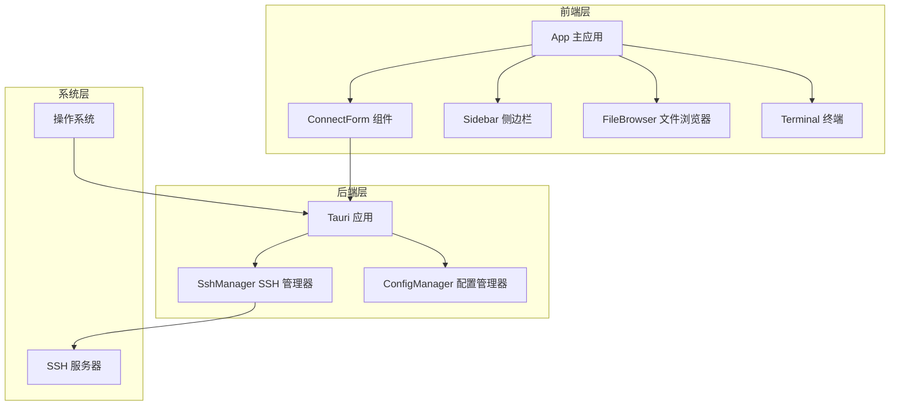
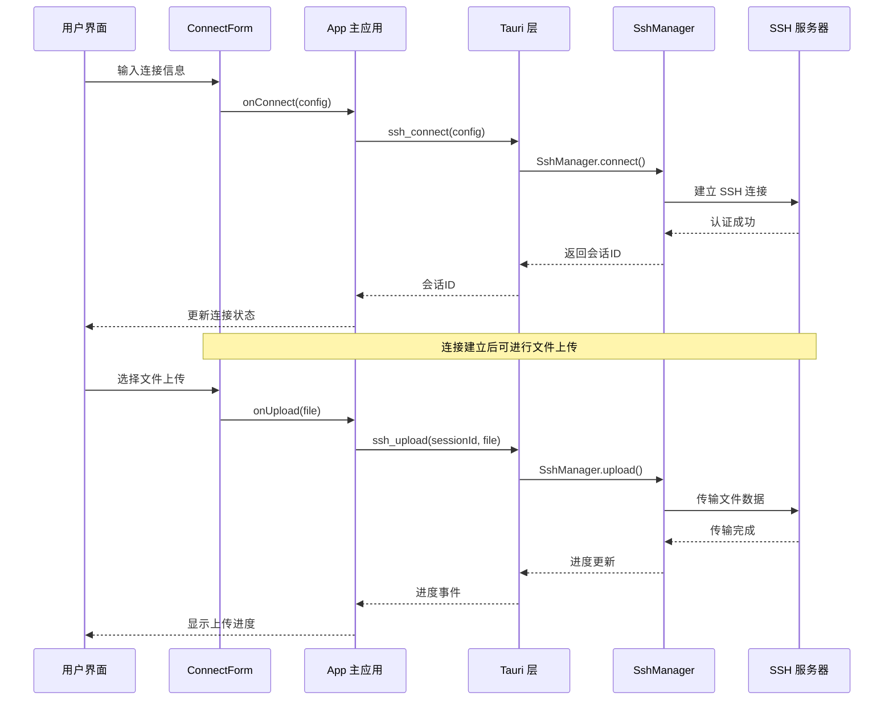
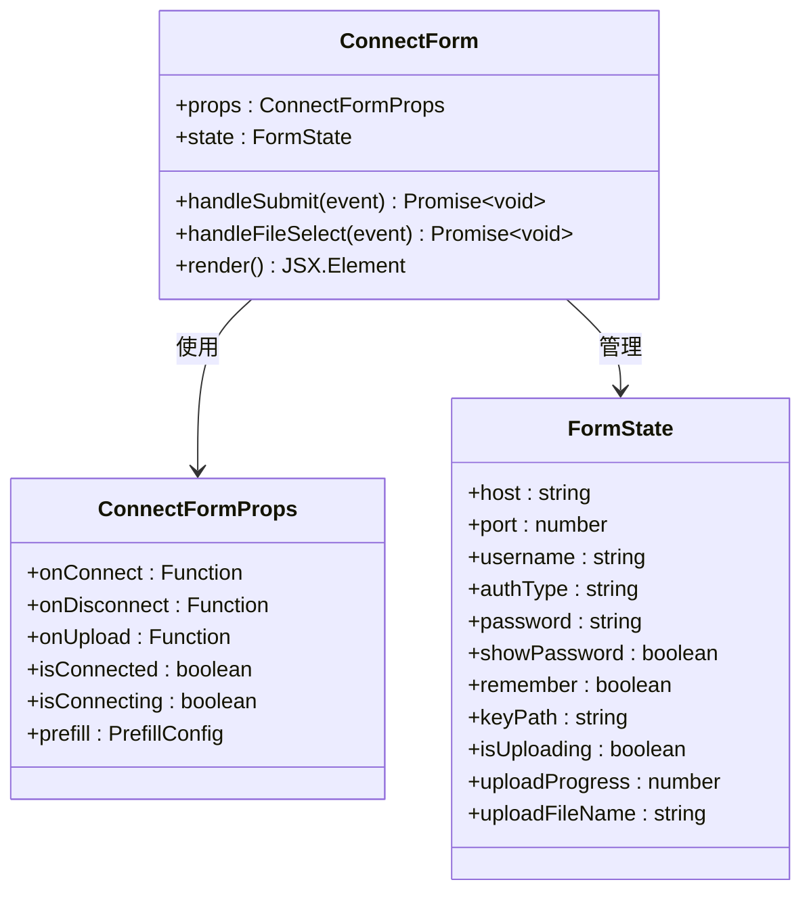
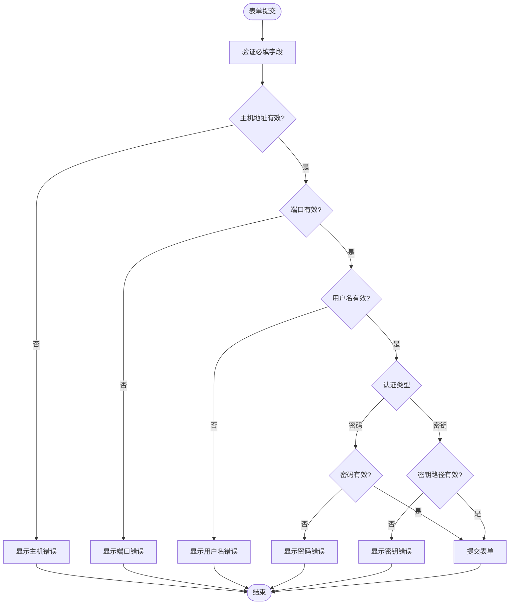
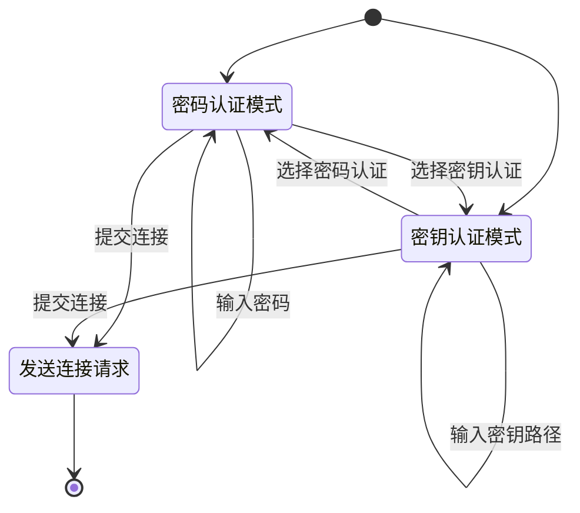
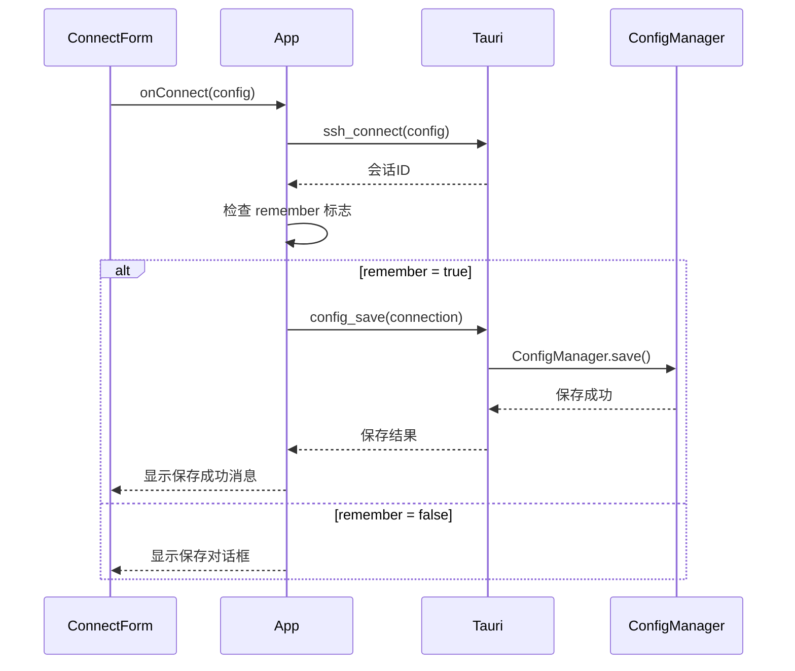
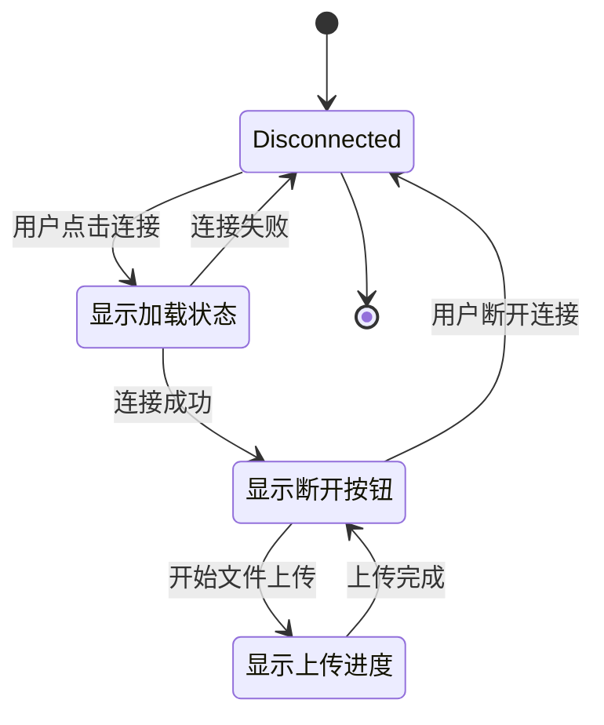
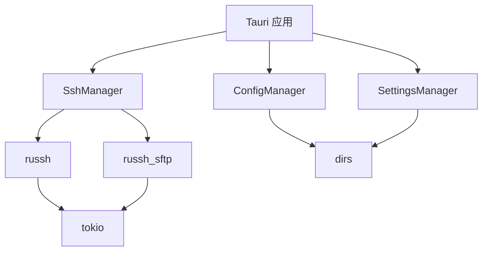

# 连接表单组件

<cite>
**本文档引用的文件**
- [ConnectForm.tsx](file://src/components/ConnectForm.tsx)
- [App.tsx](file://src/App.tsx)
- [ssh.rs](file://src-tauri/src/ssh.rs)
- [lib.rs](file://src-tauri/src/lib.rs)
- [config.rs](file://src-tauri/src/config.rs)
- [Sidebar.tsx](file://src/components/Sidebar.tsx)
- [App.css](file://src/App.css)
- [package.json](file://package.json)
</cite>

## 目录
1. [简介](#简介)
2. [项目结构](#项目结构)
3. [核心组件](#核心组件)
4. [架构概览](#架构概览)
5. [详细组件分析](#详细组件分析)
6. [依赖关系分析](#依赖关系分析)
7. [性能考虑](#性能考虑)
8. [故障排除指南](#故障排除指南)
9. [结论](#结论)
10. [附录](#附录)

## 简介
ConnectForm 是 SSH 连接表单组件，负责管理用户的连接配置、认证方式选择和连接状态。该组件实现了密码认证和密钥认证的切换逻辑，提供了表单预填充机制、连接状态管理和错误提示显示，并集成了自动保存功能和用户输入验证。

## 项目结构
该项目采用前后端分离的架构，前端使用 React + TypeScript，后端使用 Rust + Tauri，通过 IPC 通信实现 SSH 连接管理。



**图表来源**
- [ConnectForm.tsx:1-232](file://src/components/ConnectForm.tsx#L1-L232)
- [App.tsx:1-415](file://src/App.tsx#L1-L415)
- [ssh.rs:1-654](file://src-tauri/src/ssh.rs#L1-L654)
- [lib.rs:1-319](file://src-tauri/src/lib.rs#L1-L319)

**章节来源**
- [package.json:1-28](file://package.json#L1-L28)
- [App.tsx:37-415](file://src/App.tsx#L37-L415)

## 核心组件
ConnectForm 组件是整个 SSH 连接界面的核心，负责以下关键功能：

### 表单字段管理
- 主机地址 (Host): 支持 IPv4/IPv6 地址格式
- 端口号 (Port): 默认 22，支持自定义端口
- 用户名 (Username): 默认 root 用户
- 认证方式 (Auth Type): 密码认证或密钥认证切换
- 密码 (Password): 支持显示/隐藏切换
- 密钥路径 (Key Path): SSH 私钥文件路径
- 记住设置 (Remember): 自动保存到连接列表

### 连接状态管理
- 连接中状态 (isConnecting): 显示加载状态
- 已连接状态 (isConnected): 切换连接/断开按钮
- 断开连接: 触发 SSH 断开操作
- 连接控制: 防止重复连接请求

### 错误处理机制
- 连接失败错误提示
- 上传进度反馈
- 自动重连状态指示

**章节来源**
- [ConnectForm.tsx:3-24](file://src/components/ConnectForm.tsx#L3-L24)
- [ConnectForm.tsx:26-33](file://src/components/ConnectForm.tsx#L26-L33)

## 架构概览
ConnectForm 组件通过 Tauri IPC 与后端 SSH 管理器通信，实现安全的 SSH 连接管理。



**图表来源**
- [App.tsx:180-231](file://src/App.tsx#L180-L231)
- [lib.rs:21-41](file://src-tauri/src/lib.rs#L21-L41)
- [ssh.rs:71-199](file://src-tauri/src/ssh.rs#L71-L199)

## 详细组件分析

### ConnectForm 组件架构
ConnectForm 采用函数式组件设计，使用 React Hooks 管理状态和生命周期。



**图表来源**
- [ConnectForm.tsx:3-24](file://src/components/ConnectForm.tsx#L3-L24)
- [ConnectForm.tsx:26-33](file://src/components/ConnectForm.tsx#L26-L33)

### 表单验证机制
组件实现了多层次的表单验证：



**图表来源**
- [ConnectForm.tsx:59-73](file://src/components/ConnectForm.tsx#L59-L73)

### 认证方式切换逻辑
组件支持两种认证方式的动态切换：



**图表来源**
- [ConnectForm.tsx:126-133](file://src/components/ConnectForm.tsx#L126-L133)
- [ConnectForm.tsx:135-179](file://src/components/ConnectForm.tsx#L135-L179)

### 自动保存功能
当用户选择记住设置时，组件会自动保存连接配置到本地存储：



**图表来源**
- [App.tsx:197-217](file://src/App.tsx#L197-L217)
- [config.rs:40-57](file://src-tauri/src/config.rs#L40-L57)

### 连接状态管理
组件实现了完整的连接生命周期管理：



**图表来源**
- [ConnectForm.tsx:59-73](file://src/components/ConnectForm.tsx#L59-L73)
- [App.tsx:180-231](file://src/App.tsx#L180-L231)

**章节来源**
- [ConnectForm.tsx:47-57](file://src/components/ConnectForm.tsx#L47-L57)
- [ConnectForm.tsx:75-90](file://src/components/ConnectForm.tsx#L75-L90)

## 依赖关系分析

### 前端依赖关系
```mermaid
graph LR
CF[ConnectForm] --> React[React]
CF --> TauriAPI[@tauri-apps/api]
APP[App] --> CF
APP --> SB[Sidebar]
APP --> FT[FileBrowser]
APP --> TM[Terminal]
SB --> TauriAPI
FT --> TauriAPI
TM --> TauriAPI
```

**图表来源**
- [package.json:15-26](file://package.json#L15-L26)
- [ConnectForm.tsx:1](file://src/components/ConnectForm.tsx#L1)

### 后端依赖关系


**图表来源**
- [lib.rs:1-10](file://src-tauri/src/lib.rs#L1-L10)
- [ssh.rs:1-10](file://src-tauri/src/ssh.rs#L1-L10)

**章节来源**
- [package.json:15-26](file://package.json#L15-L26)
- [lib.rs:1-10](file://src-tauri/src/lib.rs#L1-L10)

## 性能考虑
ConnectForm 组件在设计时充分考虑了性能优化：

### 内存管理
- 使用 React.memo 优化渲染性能
- 合理的状态分割避免不必要的重渲染
- 及时清理事件监听器和定时器

### 网络优化
- 连接超时控制 (30秒)
- 保活机制防止连接空闲断开
- 进度条更新频率控制

### 安全性考虑
- 敏感信息（密码）不持久化存储
- 连接凭据在内存中安全处理
- 文件上传前的路径验证

## 故障排除指南

### 常见连接问题
1. **连接超时**: 检查网络连接和防火墙设置
2. **认证失败**: 验证用户名、密码或密钥文件权限
3. **端口不可达**: 确认 SSH 服务端口配置

### 调试方法
- 查看终端输出获取详细错误信息
- 检查系统日志了解底层错误
- 使用网络诊断工具测试连接

**章节来源**
- [ssh.rs:82-106](file://src-tauri/src/ssh.rs#L82-L106)
- [App.tsx:218-223](file://src/App.tsx#L218-L223)

## 结论
ConnectForm 组件提供了一个功能完整、用户体验良好的 SSH 连接界面。通过合理的架构设计和完善的错误处理机制，确保了连接的安全性和可靠性。组件支持多种认证方式、自动保存功能和实时进度反馈，满足了现代 SSH 客户端的各种需求。

## 附录

### API 文档

#### ConnectForm Props
| 属性名 | 类型 | 必需 | 描述 |
|--------|------|------|------|
| onConnect | `(config: ConnectionConfig) => Promise<void>` | 是 | 连接回调函数 |
| onDisconnect | `() => void` | 是 | 断开连接回调函数 |
| onUpload | `(file: File) => Promise<void>` | 是 | 文件上传回调函数 |
| isConnected | `boolean` | 是 | 当前连接状态 |
| isConnecting | `boolean` | 是 | 连接中状态 |
| prefill | `PrefillConfig \| null` | 否 | 预填充配置 |

#### ConnectionConfig 接口
| 字段名 | 类型 | 描述 |
|--------|------|------|
| host | `string` | SSH 主机地址 |
| port | `number` | SSH 端口号 |
| username | `string` | 用户名 |
| password | `string` | 密码（可选） |
| keyPath | `string` | 密钥文件路径（可选） |
| remember | `boolean` | 是否记住设置 |

### 最佳实践
1. **安全性**: 始终使用密钥认证替代密码认证
2. **性能**: 合理设置连接超时和保活间隔
3. **用户体验**: 提供清晰的错误提示和进度反馈
4. **可维护性**: 保持代码简洁，注释完整