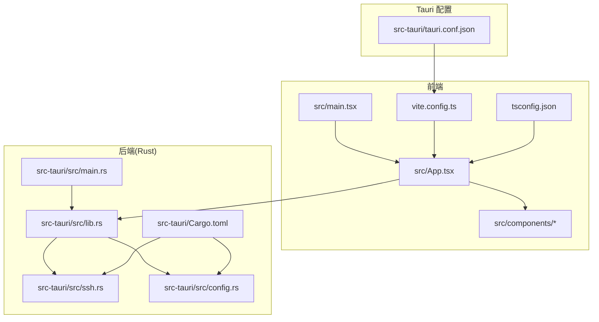
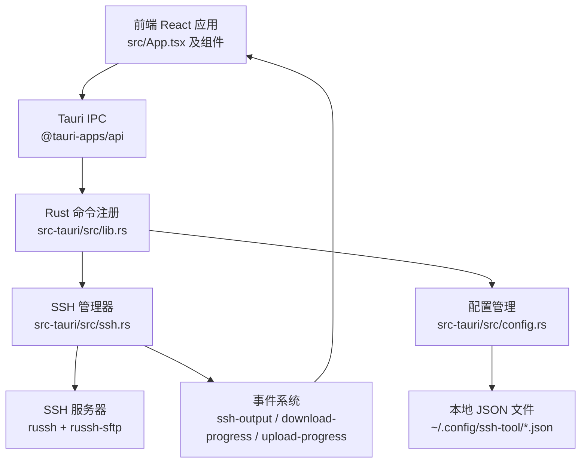
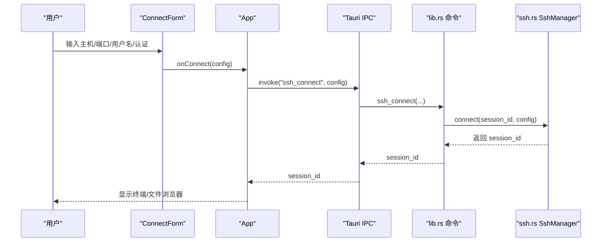
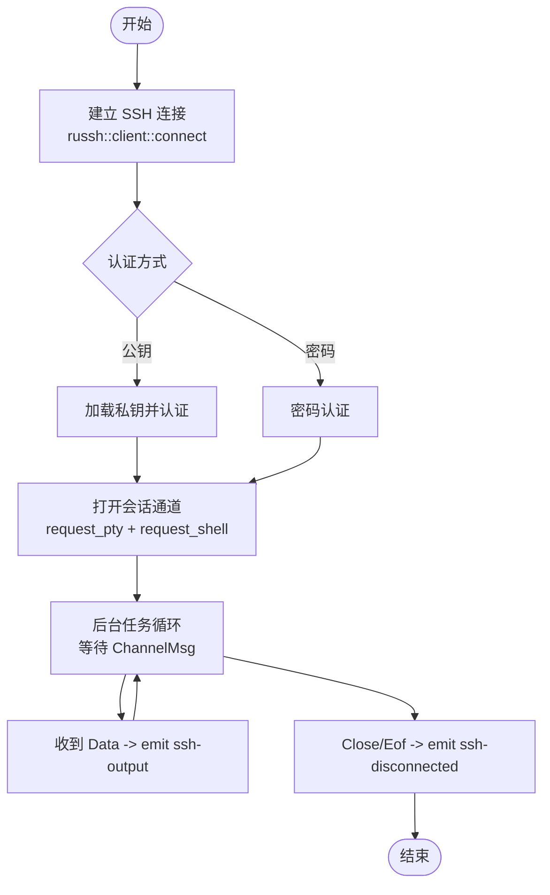
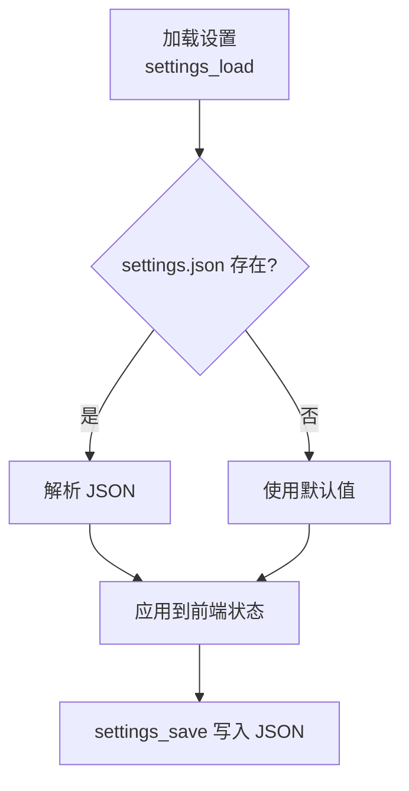
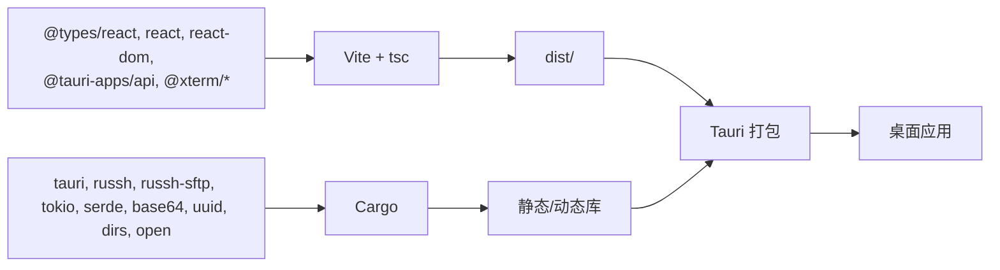

# 开发指南

<cite>
**本文引用的文件**
- [package.json](file://package.json)
- [vite.config.ts](file://vite.config.ts)
- [tsconfig.json](file://tsconfig.json)
- [README.md](file://README.md)
- [src-tauri/Cargo.toml](file://src-tauri/Cargo.toml)
- [src-tauri/tauri.conf.json](file://src-tauri/tauri.conf.json)
- [src-tauri/src/main.rs](file://src-tauri/src/main.rs)
- [src-tauri/src/lib.rs](file://src-tauri/src/lib.rs)
- [src-tauri/src/ssh.rs](file://src-tauri/src/ssh.rs)
- [src-tauri/src/config.rs](file://src-tauri/src/config.rs)
- [src/main.tsx](file://src/main.tsx)
- [src/App.tsx](file://src/App.tsx)
- [src/components/Terminal.tsx](file://src/components/Terminal.tsx)
- [src/components/ConnectForm.tsx](file://src/components/ConnectForm.tsx)
- [src/components/Sidebar.tsx](file://src/components/Sidebar.tsx)
</cite>

## 目录
1. [简介](#简介)
2. [项目结构](#项目结构)
3. [核心组件](#核心组件)
4. [架构总览](#架构总览)
5. [详细组件分析](#详细组件分析)
6. [依赖关系分析](#依赖关系分析)
7. [性能考虑](#性能考虑)
8. [故障排查指南](#故障排查指南)
9. [结论](#结论)
10. [附录](#附录)

## 简介
本指南面向参与 SSH 工具项目的开发者，提供从环境准备到构建、调试与性能优化的完整开发流程说明。项目采用 Tauri 2.x 打包桌面应用，前端基于 React + TypeScript + Vite，后端使用 Rust + russh + tokio 实现 SSH 连接与 SFTP 文件操作，并通过 Tauri IPC 与事件系统进行前后端通信。

## 项目结构
项目采用“前端 + Rust 后端 + Tauri 配置”的分层组织方式：
- 前端位于 src/ 与 public/，使用 Vite 构建与热更新；TypeScript 编译由 tsc 与 Vite 协同完成。
- Rust 后端位于 src-tauri/，包含 Tauri 应用入口、命令注册、SSH 管理器与配置管理。
- Tauri 配置位于 src-tauri/tauri.conf.json，定义窗口、打包与开发服务器联动。

图表来源
- [src/main.tsx:1-11](file://src/main.tsx#L1-L11)
- [src/App.tsx:1-415](file://src/App.tsx#L1-L415)
- [vite.config.ts:1-15](file://vite.config.ts#L1-L15)
- [tsconfig.json:1-26](file://tsconfig.json#L1-L26)
- [src-tauri/src/main.rs:1-7](file://src-tauri/src/main.rs#L1-L7)
- [src-tauri/src/lib.rs:1-319](file://src-tauri/src/lib.rs#L1-L319)
- [src-tauri/src/ssh.rs:1-654](file://src-tauri/src/ssh.rs#L1-L654)
- [src-tauri/src/config.rs:1-113](file://src-tauri/src/config.rs#L1-L113)
- [src-tauri/Cargo.toml:1-33](file://src-tauri/Cargo.toml#L1-L33)
- [src-tauri/tauri.conf.json:1-41](file://src-tauri/tauri.conf.json#L1-L41)

章节来源
- [README.md:1-74](file://README.md#L1-L74)
- [package.json:1-28](file://package.json#L1-L28)
- [vite.config.ts:1-15](file://vite.config.ts#L1-L15)
- [tsconfig.json:1-26](file://tsconfig.json#L1-L26)
- [src-tauri/tauri.conf.json:1-41](file://src-tauri/tauri.conf.json#L1-L41)

## 核心组件
- 前端应用入口与路由：React 根节点挂载于 index.html 的 #root，渲染主应用组件。
- 主界面与状态：App.tsx 负责连接状态、自动重连策略、拖拽分割布局、消息提示与事件监听。
- 终端组件：Terminal.tsx 使用 xterm.js + 插件，通过 Tauri IPC 发送输入与接收输出。
- 连接表单：ConnectForm.tsx 提供主机、端口、认证方式选择与上传功能。
- 侧边栏：Sidebar.tsx 列出已保存连接，支持上下文菜单与删除。
- Tauri 命令注册：lib.rs 将所有 SSH 与配置相关命令暴露给前端。
- SSH 管理器：ssh.rs 实现连接、会话通道、SFTP 文件操作、进度事件与断线重连。
- 配置管理：config.rs 负责连接配置与设置的 JSON 文件持久化。

章节来源
- [src/main.tsx:1-11](file://src/main.tsx#L1-L11)
- [src/App.tsx:1-415](file://src/App.tsx#L1-L415)
- [src/components/Terminal.tsx:1-150](file://src/components/Terminal.tsx#L1-L150)
- [src/components/ConnectForm.tsx:1-232](file://src/components/ConnectForm.tsx#L1-L232)
- [src/components/Sidebar.tsx:1-155](file://src/components/Sidebar.tsx#L1-L155)
- [src-tauri/src/lib.rs:1-319](file://src-tauri/src/lib.rs#L1-L319)
- [src-tauri/src/ssh.rs:1-654](file://src-tauri/src/ssh.rs#L1-L654)
- [src-tauri/src/config.rs:1-113](file://src-tauri/src/config.rs#L1-L113)

## 架构总览
Tauri 2.x 作为宿主，前端通过 @tauri-apps/api 调用后端注册的命令，后端通过 russh 与远程服务器交互，SFTP 用于文件操作，事件系统用于流式传输数据与进度反馈。

图表来源
- [src/App.tsx:1-415](file://src/App.tsx#L1-L415)
- [src-tauri/src/lib.rs:1-319](file://src-tauri/src/lib.rs#L1-L319)
- [src-tauri/src/ssh.rs:1-654](file://src-tauri/src/ssh.rs#L1-L654)
- [src-tauri/src/config.rs:1-113](file://src-tauri/src/config.rs#L1-L113)

## 详细组件分析

### 前端应用与组件
- 应用入口与渲染：React 根节点挂载，StrictMode 包裹，全局样式引入。
- 主界面逻辑：连接状态、错误提示、Toast、自动重连策略、拖拽分割布局、事件监听与命令调用。
- 终端组件：初始化 xterm.js，加载 Fit/WebLinks 插件，监听 ssh-output 事件写入终端，发送 ssh_input 与 ssh_resize。
- 连接表单：根据认证类型切换密码或密钥路径，支持“记住”选项与文件上传。
- 侧边栏：列出连接、右键菜单、删除确认、双击直连。

图表来源
- [src/components/ConnectForm.tsx:1-232](file://src/components/ConnectForm.tsx#L1-L232)
- [src/App.tsx:1-415](file://src/App.tsx#L1-L415)
- [src-tauri/src/lib.rs:1-319](file://src-tauri/src/lib.rs#L1-L319)
- [src-tauri/src/ssh.rs:1-654](file://src-tauri/src/ssh.rs#L1-L654)

章节来源
- [src/main.tsx:1-11](file://src/main.tsx#L1-L11)
- [src/App.tsx:1-415](file://src/App.tsx#L1-L415)
- [src/components/Terminal.tsx:1-150](file://src/components/Terminal.tsx#L1-L150)
- [src/components/ConnectForm.tsx:1-232](file://src/components/ConnectForm.tsx#L1-L232)
- [src/components/Sidebar.tsx:1-155](file://src/components/Sidebar.tsx#L1-L155)

### SSH 管理器与 SFTP
- 连接建立：russh 客户端配置 keepalive 与超时，支持公钥与密码认证，请求 PTY 并打开 shell。
- 会话通道：后台任务处理通道消息，转发 ssh-output 事件；支持输入队列与窗口大小调整。
- SFTP 操作：封装目录读取、文件读写、复制、重命名、权限设置、空间检查等。
- 下载/上传：下载使用 curl 输出解析进度事件；上传按 32KB 分块并上报进度。
- 断线重连：记录连接信息，超时控制，避免阻塞。

图表来源
- [src-tauri/src/ssh.rs:1-654](file://src-tauri/src/ssh.rs#L1-L654)

章节来源
- [src-tauri/src/ssh.rs:1-654](file://src-tauri/src/ssh.rs#L1-L654)

### 配置与设置持久化
- 连接配置：JSON 文件存储在用户配置目录下的 ssh-tool 文件夹中，支持增删改查。
- 设置项：自动重连开关、重连间隔与最大尝试次数，默认值在设置文件缺失时回退。

图表来源
- [src-tauri/src/config.rs:1-113](file://src-tauri/src/config.rs#L1-L113)

章节来源
- [src-tauri/src/config.rs:1-113](file://src-tauri/src/config.rs#L1-L113)

### Tauri 命令与事件
- 命令注册：lib.rs 中集中注册所有 SSH 与配置命令，统一注入到 Tauri Builder。
- 事件系统：后端通过 emit 发送 ssh-output、download-progress、upload-progress、ssh-disconnected 等事件，前端监听并更新 UI。

章节来源
- [src-tauri/src/lib.rs:1-319](file://src-tauri/src/lib.rs#L1-L319)

## 依赖关系分析
- 前端依赖：React、React DOM、@tauri-apps/api、@xterm/*、TypeScript、Vite。
- 后端依赖：tauri、tauri-plugin-log、russh、russh-keys、russh-sftp、tokio、serde、base64、uuid、dirs、open。
- 构建与打包：Vite 与 tsc 协作，Tauri 配置指定前端构建产物与开发服务器地址。

图表来源
- [package.json:1-28](file://package.json#L1-L28)
- [src-tauri/Cargo.toml:1-33](file://src-tauri/Cargo.toml#L1-L33)
- [src-tauri/tauri.conf.json:1-41](file://src-tauri/tauri.conf.json#L1-L41)

章节来源
- [package.json:1-28](file://package.json#L1-L28)
- [src-tauri/Cargo.toml:1-33](file://src-tauri/Cargo.toml#L1-L33)
- [src-tauri/tauri.conf.json:1-41](file://src-tauri/tauri.conf.json#L1-L41)

## 性能考虑
- 终端输入与窗口调整：通过 mpsc 队列异步发送输入与尺寸变更，避免阻塞事件循环。
- SFTP 写入：采用 32KB 分块写入并上报进度，降低大文件传输卡顿。
- 下载进度：解析 curl -# 的进度行，实时 emit 事件，前端即时更新进度条。
- 连接超时：断线重连与断开均设置超时，防止长时间阻塞。
- 日志级别：仅在调试构建启用日志插件，减少发布包体积与开销。

章节来源
- [src-tauri/src/ssh.rs:1-654](file://src-tauri/src/ssh.rs#L1-L654)
- [src-tauri/src/lib.rs:1-319](file://src-tauri/src/lib.rs#L1-L319)

## 故障排查指南
- 开发启动失败
  - 确认已安装 Node.js 与 Rust 工具链，执行 npx tauri dev 启动。
  - 若首次编译耗时较长属正常，后续增量编译更快。
- 前端无法热更新
  - 检查 vite.config.ts 的 server.port 与 beforeDevCommand 是否正确。
  - 确保忽略 src-tauri/** 防止重复监听导致冲突。
- SSH 连接问题
  - 检查认证方式（密码/公钥）是否匹配服务器配置。
  - 关注 ssh-disconnected 事件，结合日志定位断线原因。
- SFTP 操作异常
  - 确认远端 SFTP 子系统可用，关注 read/write/close 错误信息。
- 上传/下载进度不显示
  - 确认后端已 emit 对应事件，前端已监听相应事件名。

章节来源
- [README.md:1-74](file://README.md#L1-L74)
- [vite.config.ts:1-15](file://vite.config.ts#L1-L15)
- [src-tauri/src/ssh.rs:1-654](file://src-tauri/src/ssh.rs#L1-L654)
- [src-tauri/src/lib.rs:1-319](file://src-tauri/src/lib.rs#L1-L319)

## 结论
本项目通过 Tauri 将 React 前端与 Rust 后端无缝集成，利用 russh 与 SFTP 实现安全高效的远程服务器管理能力。遵循本文的开发与调试建议，可快速搭建稳定可靠的开发环境并高效迭代功能。

## 附录

### 开发环境配置
- Node.js
  - 使用包管理器安装 LTS 版本，确保 npm 可用。
- Rust 工具链
  - 安装 rustup 与目标平台（如 x86_64-pc-windows-msvc），安装 cargo。
- Tauri SDK
  - 安装 Tauri CLI：npm install -g @tauri-apps/cli
  - 安装系统依赖（Windows 上可使用 MSVC 工具链）
- 项目依赖
  - 在项目根目录执行 npm install 安装前端依赖与 @tauri-apps/cli
  - 在 src-tauri/ 目录执行 cargo tauri dev 或 npx tauri dev 启动开发

章节来源
- [README.md:1-74](file://README.md#L1-L74)
- [package.json:1-28](file://package.json#L1-L28)
- [src-tauri/Cargo.toml:1-33](file://src-tauri/Cargo.toml#L1-L33)

### 构建流程
- 开发模式
  - 前端：Vite 启动开发服务器（端口 5173），忽略 src-tauri/** 监听。
  - 后端：Tauri 自动触发 npm run dev，Rust 编译并运行桌面窗口。
- 生产构建
  - 前端：tsc 与 vite build 生成 dist/
  - 后端：cargo tauri build 生成各平台安装包与可执行文件

章节来源
- [vite.config.ts:1-15](file://vite.config.ts#L1-L15)
- [package.json:1-28](file://package.json#L1-L28)
- [src-tauri/tauri.conf.json:1-41](file://src-tauri/tauri.conf.json#L1-L41)

### 代码规范与最佳实践
- TypeScript
  - 使用严格模式与 bundler 模式，开启未使用变量/参数检查与 switch 不可贯穿检查。
  - JSX 使用 react-jsx，模块解析采用 bundler。
- React 组件
  - 使用函数组件与 Hooks，合理拆分职责，避免在组件内直接调用后端命令。
  - 事件监听与定时器需在卸载时清理，防止内存泄漏。
- Rust
  - 使用 async/await 与 tokio runtime，通道与锁保护共享状态。
  - 错误处理统一返回 Result<String, String>，便于前端捕获。
  - 事件名称与负载结构保持前后端一致。
- 组件设计
  - 通过 props 传递回调，避免跨组件直接访问状态。
  - 上传/下载进度与错误提示通过事件与状态驱动 UI 更新。

章节来源
- [tsconfig.json:1-26](file://tsconfig.json#L1-L26)
- [src/App.tsx:1-415](file://src/App.tsx#L1-L415)
- [src-tauri/src/lib.rs:1-319](file://src-tauri/src/lib.rs#L1-L319)
- [src-tauri/src/ssh.rs:1-654](file://src-tauri/src/ssh.rs#L1-L654)

### 调试技巧与性能优化
- 调试
  - 使用 Tauri Devtools（在调试构建中启用日志插件）查看日志与命令调用。
  - 前端通过 @tauri-apps/api 的 invoke 与 listen 辅助定位问题。
- 性能
  - 大文件传输采用分块写入与进度上报。
  - 合理设置 keepalive 与超时，提升连接稳定性。
  - 事件驱动的数据流避免频繁重绘，提升 UI 响应性。

章节来源
- [src-tauri/src/lib.rs:1-319](file://src-tauri/src/lib.rs#L1-L319)
- [src-tauri/src/ssh.rs:1-654](file://src-tauri/src/ssh.rs#L1-L654)

### 贡献指南与代码审查流程
- 提交前检查
  - 通过 TypeScript 编译与 ESLint（如配置）校验。
  - 运行单元测试（如有）与端到端验证。
- 提交流程
  - 新功能分支开发，提交 PR 至主分支，至少一名维护者审查。
- 代码审查要点
  - 前后端接口一致性（命令名、参数、事件名）。
  - 错误处理与日志记录完整性。
  - 异步与并发安全性（锁、通道、超时）。
  - 用户体验细节（进度、提示、断线重连策略）。

章节来源
- [src-tauri/src/ssh.rs:1-654](file://src-tauri/src/ssh.rs#L1-L654)
- [src-tauri/src/lib.rs:1-319](file://src-tauri/src/lib.rs#L1-L319)