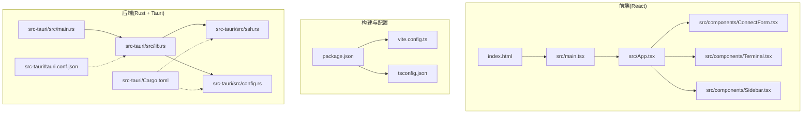
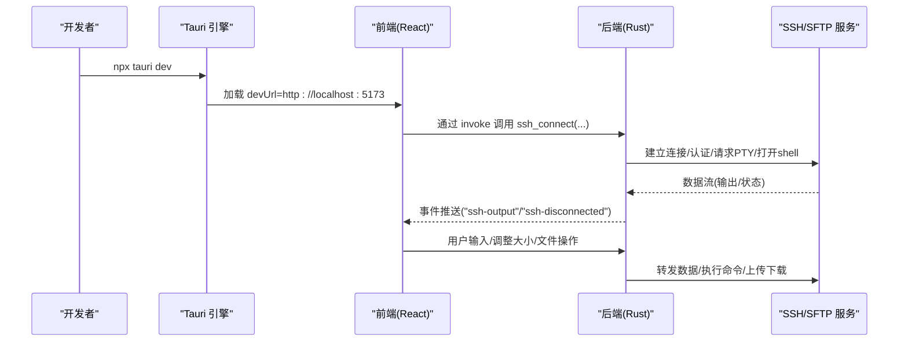
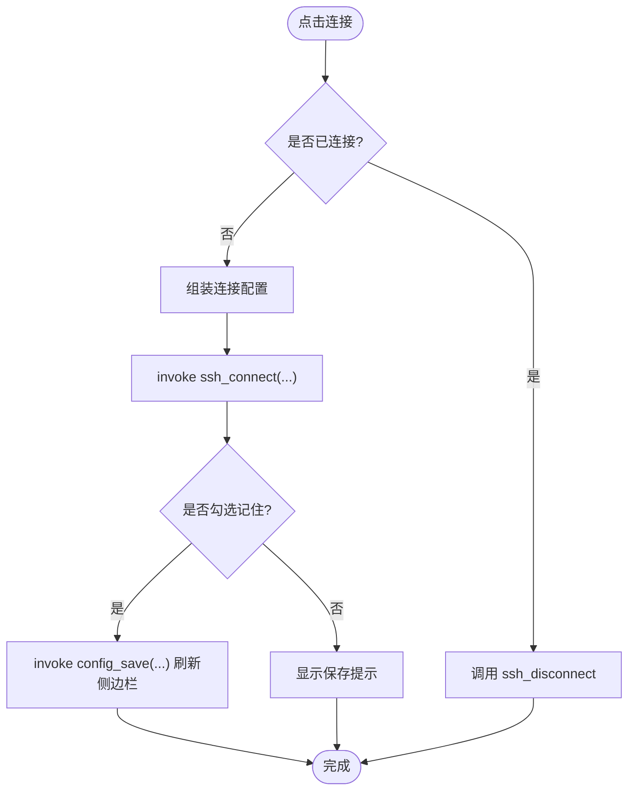
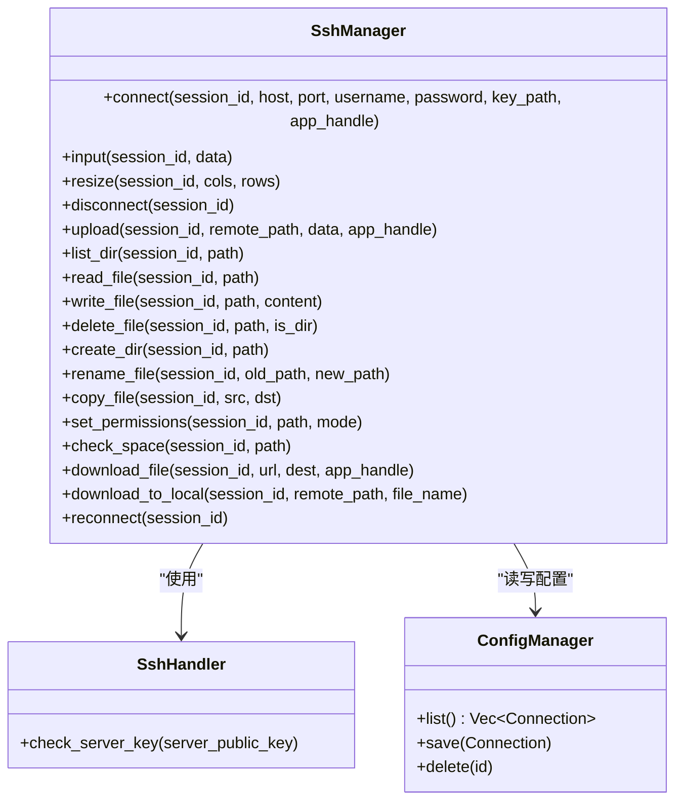
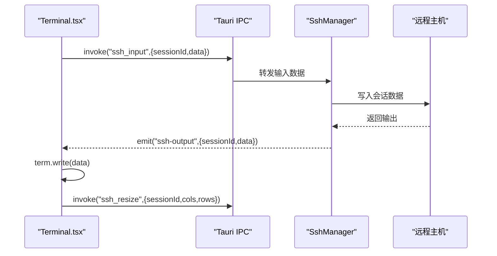
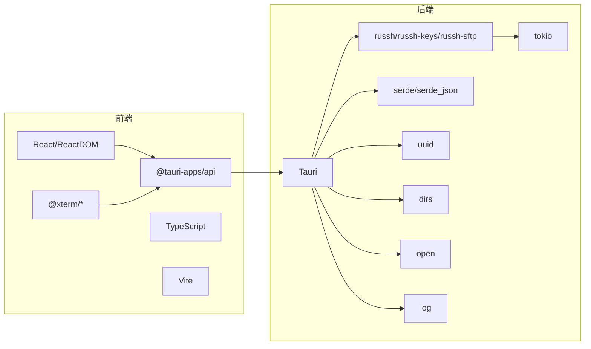

# 快速开始

<cite>
**本文引用的文件**
- [README.md](file://README.md)
- [package.json](file://package.json)
- [vite.config.ts](file://vite.config.ts)
- [src-tauri/tauri.conf.json](file://src-tauri/tauri.conf.json)
- [src-tauri/Cargo.toml](file://src-tauri/Cargo.toml)
- [src-tauri/src/main.rs](file://src-tauri/src/main.rs)
- [src-tauri/src/lib.rs](file://src-tauri/src/lib.rs)
- [src-tauri/src/ssh.rs](file://src-tauri/src/ssh.rs)
- [src-tauri/src/config.rs](file://src-tauri/src/config.rs)
- [src/App.tsx](file://src/App.tsx)
- [src/components/ConnectForm.tsx](file://src/components/ConnectForm.tsx)
- [src/components/Terminal.tsx](file://src/components/Terminal.tsx)
- [src/components/Sidebar.tsx](file://src/components/Sidebar.tsx)
- [src/main.tsx](file://src/main.tsx)
- [index.html](file://index.html)
- [tsconfig.json](file://tsconfig.json)
</cite>

## 目录
1. [简介](#简介)
2. [项目结构](#项目结构)
3. [核心组件](#核心组件)
4. [架构总览](#架构总览)
5. [详细组件分析](#详细组件分析)
6. [依赖关系分析](#依赖关系分析)
7. [性能与并发特性](#性能与并发特性)
8. [故障排查指南](#故障排查指南)
9. [结论](#结论)
10. [附录](#附录)

## 简介
本指南面向首次接触 SSH 工具项目的开发者，提供从环境准备到首次使用的完整流程，涵盖：
- 开发环境搭建（Node.js、Rust 工具链、Tauri 依赖）
- 启动开发服务器（npx tauri dev）及 Vite 前端与 Rust 后端协同机制
- 首次使用操作（连接表单、服务器信息输入、SSH 连接建立）
- 常见问题与调试技巧

## 项目结构
该项目采用“前端 React + 后端 Rust + Tauri 打包”的桌面应用架构，前端通过 Vite 开发服务器提供本地调试体验；后端 Rust 使用 russh 提供 SSH/SFTP 能力，并通过 Tauri 的命令系统与前端交互。

图表来源
- [src-tauri/src/main.rs:1-7](file://src-tauri/src/main.rs#L1-L7)
- [src-tauri/src/lib.rs:268-319](file://src-tauri/src/lib.rs#L268-L319)
- [src-tauri/src/ssh.rs:58-654](file://src-tauri/src/ssh.rs#L58-L654)
- [src-tauri/src/config.rs:1-113](file://src-tauri/src/config.rs#L1-L113)
- [src/App.tsx:1-415](file://src/App.tsx#L1-L415)
- [src/components/ConnectForm.tsx:1-232](file://src/components/ConnectForm.tsx#L1-L232)
- [src/components/Terminal.tsx:1-150](file://src/components/Terminal.tsx#L1-L150)
- [src/components/Sidebar.tsx:1-155](file://src/components/Sidebar.tsx#L1-L155)
- [package.json:1-28](file://package.json#L1-L28)
- [vite.config.ts:1-15](file://vite.config.ts#L1-L15)
- [tsconfig.json:1-26](file://tsconfig.json#L1-L26)
- [index.html:1-13](file://index.html#L1-L13)

章节来源
- [README.md:49-74](file://README.md#L49-L74)
- [package.json:1-28](file://package.json#L1-L28)
- [vite.config.ts:1-15](file://vite.config.ts#L1-L15)
- [src-tauri/tauri.conf.json:1-41](file://src-tauri/tauri.conf.json#L1-L41)
- [src-tauri/Cargo.toml:1-33](file://src-tauri/Cargo.toml#L1-L33)

## 核心组件
- 前端应用入口与主界面：负责连接表单、终端、文件浏览器、侧边栏等 UI 组合。
- 连接表单：收集主机、端口、用户名、认证方式（密码或密钥）、是否记住等信息。
- 终端组件：基于 xterm.js，负责渲染输出、接收输入并通过 IPC 发送到后端。
- 侧边栏：维护已保存的连接列表，支持上下文菜单、删除、直接连接等。
- 后端（Rust）：通过 Tauri 命令暴露 SSH/SFTP 能力，管理会话生命周期与事件推送。
- 配置管理：持久化连接配置与应用设置（如自动重连策略）。

章节来源
- [src/App.tsx:37-415](file://src/App.tsx#L37-L415)
- [src/components/ConnectForm.tsx:26-232](file://src/components/ConnectForm.tsx#L26-L232)
- [src/components/Terminal.tsx:17-150](file://src/components/Terminal.tsx#L17-L150)
- [src/components/Sidebar.tsx:28-155](file://src/components/Sidebar.tsx#L28-L155)
- [src-tauri/src/lib.rs:21-319](file://src-tauri/src/lib.rs#L21-L319)
- [src-tauri/src/ssh.rs:58-654](file://src-tauri/src/ssh.rs#L58-L654)
- [src-tauri/src/config.rs:27-113](file://src-tauri/src/config.rs#L27-L113)

## 架构总览
开发模式下，Tauri 在本地启动一个桌面窗口，并将前端开发服务器地址（http://localhost:5173）作为 devUrl 注入，实现热更新与实时调试。后端 Rust 以动态库形式被 Tauri 加载，注册命令并在后台异步处理 SSH 会话。

图表来源
- [src-tauri/tauri.conf.json:6-11](file://src-tauri/tauri.conf.json#L6-L11)
- [src-tauri/src/lib.rs:268-319](file://src-tauri/src/lib.rs#L268-L319)
- [src-tauri/src/ssh.rs:71-199](file://src-tauri/src/ssh.rs#L71-L199)
- [src/components/Terminal.tsx:68-87](file://src/components/Terminal.tsx#L68-L87)
- [src/App.tsx:180-223](file://src/App.tsx#L180-L223)

章节来源
- [README.md:9-24](file://README.md#L9-L24)
- [src-tauri/tauri.conf.json:6-11](file://src-tauri/tauri.conf.json#L6-L11)
- [src-tauri/src/lib.rs:268-319](file://src-tauri/src/lib.rs#L268-L319)

## 详细组件分析

### 前端：连接表单与会话控制
- 表单字段：主机、端口、用户、认证方式（密码/密钥）、记住选项。
- 行为逻辑：提交时根据当前连接状态决定连接或断开；连接成功后可选择自动保存至侧边栏。
- 上传能力：选择本地文件后，前端将二进制转为 Base64 并调用后端上传命令。

图表来源
- [src/components/ConnectForm.tsx:59-73](file://src/components/ConnectForm.tsx#L59-L73)
- [src/App.tsx:180-223](file://src/App.tsx#L180-L223)
- [src-tauri/src/lib.rs:21-41](file://src-tauri/src/lib.rs#L21-L41)

章节来源
- [src/components/ConnectForm.tsx:26-232](file://src/components/ConnectForm.tsx#L26-L232)
- [src/App.tsx:180-223](file://src/App.tsx#L180-L223)

### 后端：SSH 管理与命令注册
- 命令体系：集中于 lib.rs 中，统一注册所有 IPC 命令（连接、输入、调整大小、断开、文件操作、配置与设置等）。
- 会话管理：SshManager 负责建立会话、转发输入、监听输出、SFTP 文件操作、断线重连等。
- 事件推送：通过 emit 将 ssh-output、ssh-disconnected 等事件推送给前端。

图表来源
- [src-tauri/src/ssh.rs:58-654](file://src-tauri/src/ssh.rs#L58-L654)
- [src-tauri/src/config.rs:27-113](file://src-tauri/src/config.rs#L27-L113)

章节来源
- [src-tauri/src/lib.rs:21-319](file://src-tauri/src/lib.rs#L21-L319)
- [src-tauri/src/ssh.rs:58-654](file://src-tauri/src/ssh.rs#L58-L654)
- [src-tauri/src/config.rs:27-113](file://src-tauri/src/config.rs#L27-L113)

### 终端组件：xterm.js 与 IPC 协同
- 初始化：加载 Fit/WebLinks 插件，绑定 onData/onResize 事件。
- 输入转发：将用户输入通过 invoke('ssh_input') 发送至后端。
- 输出渲染：监听 ssh-output 事件，将远端输出写入终端。
- 自适应：窗口尺寸变化时计算 cols/rows 并调用 ssh_resize。

图表来源
- [src/components/Terminal.tsx:68-101](file://src/components/Terminal.tsx#L68-L101)
- [src-tauri/src/lib.rs:44-64](file://src-tauri/src/lib.rs#L44-L64)
- [src-tauri/src/ssh.rs:201-223](file://src-tauri/src/ssh.rs#L201-L223)

章节来源
- [src/components/Terminal.tsx:17-150](file://src/components/Terminal.tsx#L17-L150)
- [src-tauri/src/lib.rs:44-64](file://src-tauri/src/lib.rs#L44-L64)

### 侧边栏：连接列表与上下文菜单
- 功能：列出已保存连接、右键菜单（连接/编辑/删除）、双击直接连接。
- 数据来源：通过 invoke('config_list') 获取 JSON 列表；删除通过 invoke('config_delete') 更新。

章节来源
- [src/components/Sidebar.tsx:28-155](file://src/components/Sidebar.tsx#L28-L155)
- [src-tauri/src/config.rs:29-58](file://src-tauri/src/config.rs#L29-L58)

## 依赖关系分析
- 前端依赖：React、React DOM、@xterm/*、@tauri-apps/*、TypeScript、Vite。
- 后端依赖：Tauri、russh、russh-keys、russh-sftp、tokio、serde、uuid、dirs、open、log 等。
- 构建与打包：Vite 用于前端开发与构建；Tauri 负责桌面窗口与命令注册；Cargo 管理 Rust 依赖。

图表来源
- [package.json:11-26](file://package.json#L11-L26)
- [src-tauri/Cargo.toml:18-33](file://src-tauri/Cargo.toml#L18-L33)

章节来源
- [package.json:1-28](file://package.json#L1-L28)
- [src-tauri/Cargo.toml:1-33](file://src-tauri/Cargo.toml#L1-L33)

## 性能与并发特性
- 异步模型：后端使用 tokio 运行时，通道（mpsc/oneshot）在会话与后台任务间传递数据与控制消息。
- 事件驱动：通过 emit 推送输出与进度事件，避免轮询，降低 CPU 占用。
- 超时与健壮性：连接、重连、SFTP 操作均设置超时，防止阻塞；断线检测通过 keepalive 与空闲超时实现。
- 传输优化：SFTP 写入采用分块写入并上报进度；大文件读取限制返回长度，避免内存压力。

章节来源
- [src-tauri/src/ssh.rs:82-87](file://src-tauri/src/ssh.rs#L82-L87)
- [src-tauri/src/ssh.rs:520-583](file://src-tauri/src/ssh.rs#L520-L583)
- [src-tauri/src/ssh.rs:633-652](file://src-tauri/src/ssh.rs#L633-L652)

## 故障排查指南
- 开发服务器无法访问
  - 确认 Vite 端口未被占用，且 devUrl 与 Vite 配置一致。
  - 参考：[vite.config.ts:7-13](file://vite.config.ts#L7-L13)、[src-tauri/tauri.conf.json:8-9](file://src-tauri/tauri.conf.json#L8-L9)
- 首次编译耗时长
  - 首次构建需要编译大量 Rust 依赖，属正常现象；后续增量编译较快。
  - 参考：[README.md](file://README.md#L23)
- 连接失败
  - 检查主机、端口、用户名与认证方式（密码/密钥）是否正确。
  - 查看前端错误提示与后端日志（开发模式下启用插件日志）。
  - 参考：[src-tauri/src/lib.rs:268-278](file://src-tauri/src/lib.rs#L268-L278)、[src-tauri/src/ssh.rs:94-106](file://src-tauri/src/ssh.rs#L94-L106)
- 断线自动重连
  - 设置中可开启自动重连，配置重连间隔与最大尝试次数。
  - 参考：[src/App.tsx:124-164](file://src/App.tsx#L124-L164)、[src-tauri/src/config.rs:62-84](file://src-tauri/src/config.rs#L62-L84)
- 上传/下载卡顿或失败
  - 大文件建议分块传输；检查网络与目标路径权限。
  - 参考：[src-tauri/src/ssh.rs:520-583](file://src-tauri/src/ssh.rs#L520-L583)、[src-tauri/src/ssh.rs:448-518](file://src-tauri/src/ssh.rs#L448-L518)
- 终端显示异常
  - 调整窗口大小后触发 ssh_resize；确认 cols/rows 计算正确。
  - 参考：[src/components/Terminal.tsx:89-102](file://src/components/Terminal.tsx#L89-L102)

章节来源
- [README.md:9-24](file://README.md#L9-L24)
- [vite.config.ts:7-13](file://vite.config.ts#L7-L13)
- [src-tauri/tauri.conf.json:8-9](file://src-tauri/tauri.conf.json#L8-L9)
- [src-tauri/src/lib.rs:268-278](file://src-tauri/src/lib.rs#L268-L278)
- [src-tauri/src/ssh.rs:94-106](file://src-tauri/src/ssh.rs#L94-L106)
- [src/App.tsx:124-164](file://src/App.tsx#L124-L164)
- [src-tauri/src/config.rs:62-84](file://src-tauri/src/config.rs#L62-L84)
- [src-tauri/src/ssh.rs:520-583](file://src-tauri/src/ssh.rs#L520-L583)
- [src-tauri/src/ssh.rs:448-518](file://src-tauri/src/ssh.rs#L448-L518)
- [src/components/Terminal.tsx:89-102](file://src/components/Terminal.tsx#L89-L102)

## 结论
本项目以 Tauri 为桥梁，将高性能的 Rust SSH/SFTP 能力与现代化的前端体验结合，提供完整的桌面端 SSH 管理工具。遵循本文档的环境准备与启动流程，即可快速进入开发与使用阶段；遇到问题时，可依据故障排查章节定位并解决。

## 附录

### 开发环境搭建步骤
- 安装 Node.js 与 npm（用于前端开发与构建）
  - 参考：[package.json:1-28](file://package.json#L1-L28)
- 安装 Rust 工具链（稳定版）
  - 参考：[src-tauri/Cargo.toml](file://src-tauri/Cargo.toml#L9)
- 安装 Tauri 依赖（平台相关，参考 Tauri 官方文档）
  - 参考：[src-tauri/Cargo.toml](file://src-tauri/Cargo.toml#L22)
- 安装前端依赖
  - 在项目根目录执行安装命令（例如 npm install）

章节来源
- [package.json:1-28](file://package.json#L1-L28)
- [src-tauri/Cargo.toml](file://src-tauri/Cargo.toml#L9)

### 启动开发服务器
- 在项目根目录执行：npx tauri dev
  - 同时启动 Vite 前端开发服务器（http://localhost:5173）与 Rust 后端桌面窗口
  - 参考：[README.md:9-24](file://README.md#L9-L24)、[src-tauri/tauri.conf.json:8-9](file://src-tauri/tauri.conf.json#L8-L9)

章节来源
- [README.md:9-24](file://README.md#L9-L24)
- [src-tauri/tauri.conf.json:8-9](file://src-tauri/tauri.conf.json#L8-L9)

### 首次使用操作指南
- 连接表单
  - 输入 Host、Port、Username，选择 Password 或 Key File，必要时勾选 Remember
  - 点击 Connect 建立连接；连接成功后可进行上传、终端交互
  - 参考：[src/components/ConnectForm.tsx:26-232](file://src/components/ConnectForm.tsx#L26-L232)、[src/App.tsx:180-223](file://src/App.tsx#L180-L223)
- 服务器信息输入
  - 支持从侧边栏预填或直接输入；认证方式与凭据按需填写
  - 参考：[src/components/ConnectForm.tsx:47-57](file://src/components/ConnectForm.tsx#L47-L57)
- SSH 连接建立过程
  - 前端调用 ssh_connect → 后端建立会话/认证/请求 PTY/打开 shell → 事件推送输出
  - 参考：[src-tauri/src/lib.rs:21-41](file://src-tauri/src/lib.rs#L21-L41)、[src-tauri/src/ssh.rs:71-119](file://src-tauri/src/ssh.rs#L71-L119)

章节来源
- [src/components/ConnectForm.tsx:26-232](file://src/components/ConnectForm.tsx#L26-L232)
- [src/App.tsx:180-223](file://src/App.tsx#L180-L223)
- [src-tauri/src/lib.rs:21-41](file://src-tauri/src/lib.rs#L21-L41)
- [src-tauri/src/ssh.rs:71-119](file://src-tauri/src/ssh.rs#L71-L119)

### 常见开发问题与调试技巧
- Vite 端口冲突：调整 vite.config.ts 中的 port 或使用严格端口
  - 参考：[vite.config.ts:7-13](file://vite.config.ts#L7-L13)
- 日志查看：开发模式下启用日志插件，观察后端运行状态
  - 参考：[src-tauri/src/lib.rs:272-278](file://src-tauri/src/lib.rs#L272-L278)
- 断线重连：在设置中调整重连间隔与最大尝试次数
  - 参考：[src/App.tsx:124-164](file://src/App.tsx#L124-L164)、[src-tauri/src/config.rs:62-84](file://src-tauri/src/config.rs#L62-L84)
- 终端输入/输出：确保事件监听与尺寸同步正常
  - 参考：[src/components/Terminal.tsx:68-101](file://src/components/Terminal.tsx#L68-L101)

章节来源
- [vite.config.ts:7-13](file://vite.config.ts#L7-L13)
- [src-tauri/src/lib.rs:272-278](file://src-tauri/src/lib.rs#L272-L278)
- [src/App.tsx:124-164](file://src/App.tsx#L124-L164)
- [src-tauri/src/config.rs:62-84](file://src-tauri/src/config.rs#L62-L84)
- [src/components/Terminal.tsx:68-101](file://src/components/Terminal.tsx#L68-L101)