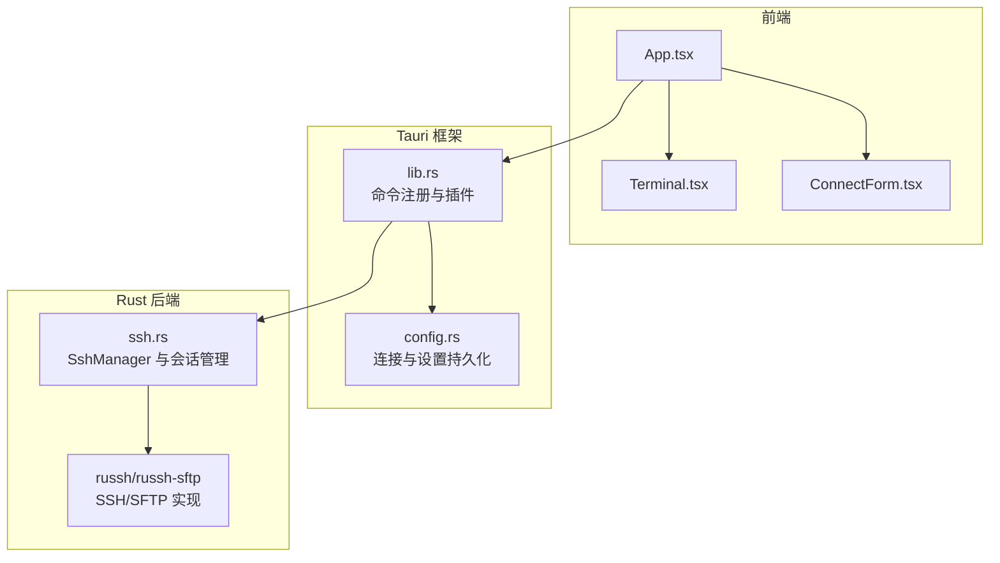
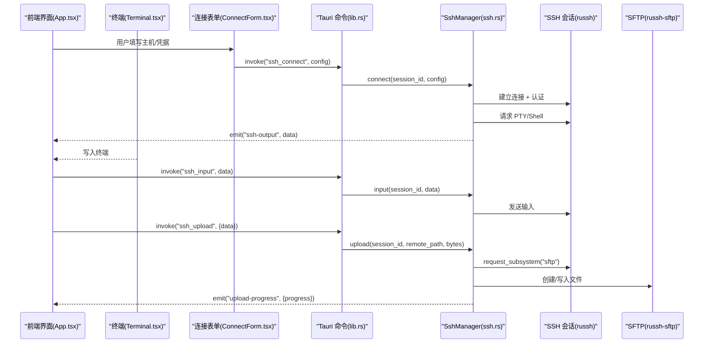
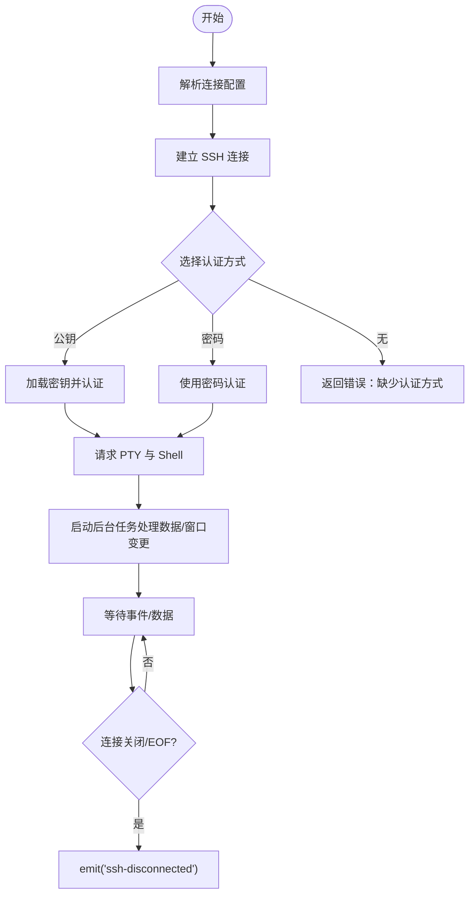
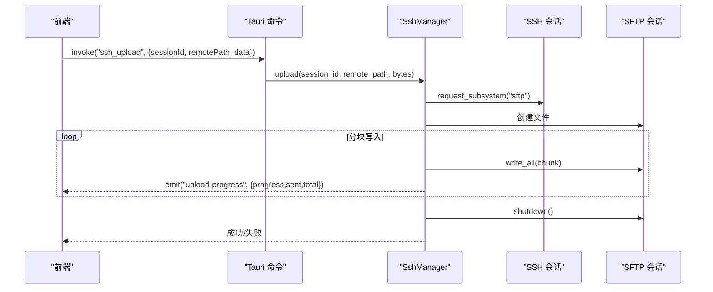
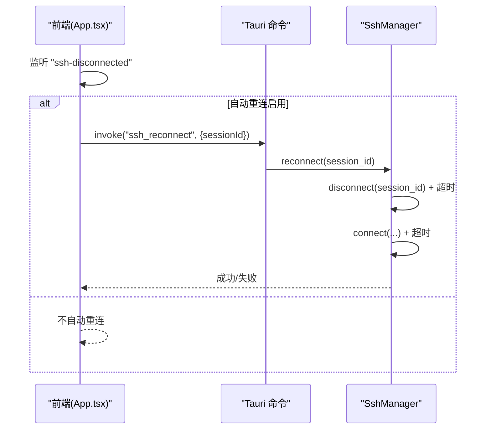
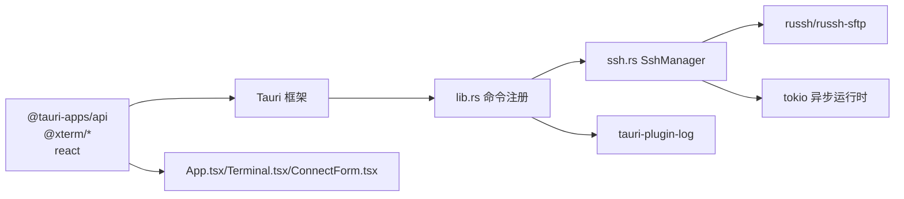

# 故障排除

<cite>
**本文引用的文件**
- [README.md](file://README.md)
- [main.rs](file://src-tauri/src/main.rs)
- [lib.rs](file://src-tauri/src/lib.rs)
- [ssh.rs](file://src-tauri/src/ssh.rs)
- [config.rs](file://src-tauri/src/config.rs)
- [Cargo.toml](file://src-tauri/Cargo.toml)
- [tauri.conf.json](file://src-tauri/tauri.conf.json)
- [package.json](file://package.json)
- [App.tsx](file://src/App.tsx)
- [Terminal.tsx](file://src/components/Terminal.tsx)
- [ConnectForm.tsx](file://src/components/ConnectForm.tsx)
</cite>

## 目录
1. [简介](#简介)
2. [项目结构](#项目结构)
3. [核心组件](#核心组件)
4. [架构总览](#架构总览)
5. [详细组件分析](#详细组件分析)
6. [依赖关系分析](#依赖关系分析)
7. [性能考虑](#性能考虑)
8. [故障排除指南](#故障排除指南)
9. [结论](#结论)
10. [附录](#附录)

## 简介
本指南面向使用与维护 SSH 工具桌面应用的用户与开发者，聚焦于常见问题的诊断与修复，包括 SSH 连接失败、认证错误、文件传输异常等；提供错误代码说明与日志分析技巧；解释性能问题的排查方法（内存泄漏检测、CPU 使用率监控、网络延迟分析）；介绍调试工具的使用（Tauri 开发者工具、浏览器调试器、Rust 调试器）；并给出系统兼容性问题的解决方案与环境配置检查清单。

## 项目结构
项目采用 Tauri 2.x + Rust 后端 + React 前端的混合架构：
- 前端：React 18 + TypeScript，使用 @xterm/xterm 提供终端能力，通过 @tauri-apps/api 与后端通信。
- 后端：Rust + russh 0.45 + tokio，负责 SSH 连接、SFTP 文件操作、事件推送与日志记录。
- 构建与打包：Vite + Tauri CLI，支持开发模式与生产构建。

**图表来源**
- [lib.rs:268-318](file://src-tauri/src/lib.rs#L268-L318)
- [ssh.rs:58-653](file://src-tauri/src/ssh.rs#L58-L653)
- [config.rs:27-112](file://src-tauri/src/config.rs#L27-L112)

**章节来源**
- [README.md:39-74](file://README.md#L39-L74)
- [tauri.conf.json:1-41](file://src-tauri/tauri.conf.json#L1-L41)
- [package.json:1-28](file://package.json#L1-L28)

## 核心组件
- SshManager：负责 SSH 会话生命周期、认证、PTY/Shell 请求、SFTP 文件操作、上传/下载进度事件、断线重连与超时控制。
- Tauri 命令层：将前端调用映射为后端操作，并通过事件向前端推送输出与状态。
- 配置管理：连接配置与应用设置的 JSON 持久化。
- 前端组件：连接表单、终端、文件浏览器与侧边栏，负责 UI 交互与事件监听。

**章节来源**
- [ssh.rs:58-653](file://src-tauri/src/ssh.rs#L58-L653)
- [lib.rs:21-318](file://src-tauri/src/lib.rs#L21-L318)
- [config.rs:27-112](file://src-tauri/src/config.rs#L27-L112)
- [App.tsx:37-415](file://src/App.tsx#L37-L415)

## 架构总览
前后端通过 Tauri IPC 通信，后端以 tokio 异步运行，使用 russh 与 russh-sftp 完成 SSH/SFTP 操作，并通过事件通道向前端推送数据流与进度。

**图表来源**
- [lib.rs:21-318](file://src-tauri/src/lib.rs#L21-L318)
- [ssh.rs:71-199](file://src-tauri/src/ssh.rs#L71-L199)
- [ssh.rs:520-583](file://src-tauri/src/ssh.rs#L520-L583)
- [Terminal.tsx:68-87](file://src/components/Terminal.tsx#L68-L87)
- [App.tsx:180-223](file://src/App.tsx#L180-L223)

## 详细组件分析

### SSH 连接与认证流程
- 连接建立：解析配置、发起连接、设置 keepalive 与空闲超时。
- 认证方式：公钥或密码；未提供认证方式时报错。
- 会话初始化：请求 PTY 与 Shell，启动后台任务处理数据流与窗口变更。
- 断线检测：基于 keepalive 与 inactivity 超时，关闭时带超时保护。

**图表来源**
- [ssh.rs:71-199](file://src-tauri/src/ssh.rs#L71-L199)

**章节来源**
- [ssh.rs:71-120](file://src-tauri/src/ssh.rs#L71-L120)
- [ssh.rs:132-178](file://src-tauri/src/ssh.rs#L132-L178)

### SFTP 文件操作与进度事件
- 列表/读取/写入/删除/重命名/复制/权限设置/空间检查/下载到本地等均通过 SFTP 子系统完成。
- 上传采用分块写入并上报进度；下载使用 curl 并解析进度条输出。

**图表来源**
- [ssh.rs:520-583](file://src-tauri/src/ssh.rs#L520-L583)

**章节来源**
- [ssh.rs:288-307](file://src-tauri/src/ssh.rs#L288-L307)
- [ssh.rs:309-336](file://src-tauri/src/ssh.rs#L309-L336)
- [ssh.rs:338-383](file://src-tauri/src/ssh.rs#L338-L383)
- [ssh.rs:385-417](file://src-tauri/src/ssh.rs#L385-L417)
- [ssh.rs:419-446](file://src-tauri/src/ssh.rs#L419-L446)
- [ssh.rs:449-518](file://src-tauri/src/ssh.rs#L449-L518)

### 断线重连机制
- 前端监听“ssh-disconnected”事件，按设置进行定时重连，最多尝试指定次数。
- 后端在重连前先断开旧会话并带超时保护，整体重连过程也设置超时。

**图表来源**
- [App.tsx:124-164](file://src/App.tsx#L124-L164)
- [lib.rs:248-255](file://src-tauri/src/lib.rs#L248-L255)
- [ssh.rs:633-652](file://src-tauri/src/ssh.rs#L633-L652)

**章节来源**
- [App.tsx:111-117](file://src/App.tsx#L111-L117)
- [ssh.rs:633-652](file://src-tauri/src/ssh.rs#L633-L652)

## 依赖关系分析
- 前端依赖：@tauri-apps/api、@xterm/xterm 及其插件、react、react-dom。
- 后端依赖：russh、russh-keys、russh-sftp、tokio、serde、log、tauri、tauri-plugin-log、uuid、dirs、open。
- 构建配置：Vite + Tauri CLI，开发与打包脚本由 package.json 管理。

**图表来源**
- [package.json:15-26](file://package.json#L15-L26)
- [Cargo.toml:18-33](file://src-tauri/Cargo.toml#L18-L33)
- [lib.rs:268-318](file://src-tauri/src/lib.rs#L268-L318)

**章节来源**
- [package.json:1-28](file://package.json#L1-L28)
- [Cargo.toml:1-33](file://src-tauri/Cargo.toml#L1-L33)

## 性能考虑
- 异步与并发：后端使用 tokio 的异步运行时与多通道（input/resize/channel_open）避免阻塞。
- 超时与保活：连接配置包含 keepalive 与空闲超时，断开时使用超时保护，防止挂起。
- 传输优化：SFTP 写入采用固定大小分块，上传/下载进度事件驱动 UI 更新，降低内存峰值。
- 日志级别：仅在调试构建中启用日志插件，避免发布版本产生过多 IO。

**章节来源**
- [ssh.rs:82-87](file://src-tauri/src/ssh.rs#L82-L87)
- [ssh.rs:617-627](file://src-tauri/src/ssh.rs#L617-L627)
- [lib.rs:268-278](file://src-tauri/src/lib.rs#L268-L278)

## 故障排除指南

### 一、SSH 连接失败
常见症状
- 连接超时或立即断开
- “无法建立连接”类错误
- 无输出或终端空白

可能原因与排查步骤
- 网络与防火墙
  - 检查目标主机端口可达性（默认 22），确认防火墙策略。
  - 在本地使用 telnet 或 nc 验证端口连通。
- 主机密钥校验
  - 当前实现接受任意主机密钥，若遇到主机密钥不匹配，建议临时调整客户端策略或手动导入已知主机。
- 认证方式
  - 若未提供密码或密钥路径，将直接报错；请确认凭据是否正确且可用。
- 超时与保活
  - 若网络不稳定，可适当增大 keepalive 间隔与空闲超时（当前已在代码中设置）。
- 日志定位
  - 开启开发者工具查看 Tauri 日志输出（仅调试构建）。

修复建议
- 使用正确的主机名/IP 与端口
- 确认凭据（密码或私钥路径）
- 在网络条件较差时，减少并发操作，避免长时间无响应导致超时

**章节来源**
- [ssh.rs:81-106](file://src-tauri/src/ssh.rs#L81-L106)
- [ssh.rs:82-87](file://src-tauri/src/ssh.rs#L82-L87)
- [lib.rs:271-278](file://src-tauri/src/lib.rs#L271-L278)

### 二、认证错误
常见症状
- “密码认证失败”
- “公钥认证失败”
- “未提供认证方式”

可能原因与排查步骤
- 密码认证
  - 确认用户名与密码正确；检查目标主机的登录策略（如 PAM、PAM 会话限制）。
- 公钥认证
  - 确认私钥路径存在且格式正确；检查私钥权限（通常需要 600）。
  - 确认公钥已添加至远端 authorized_keys。
- 凭据缺失
  - 若两者均未提供，将直接报错；请至少提供一种认证方式。

修复建议
- 使用 ssh -v 测试连接，观察认证阶段输出
- 使用 ssh-add 添加私钥到 ssh-agent（若使用代理）

**章节来源**
- [ssh.rs:94-106](file://src-tauri/src/ssh.rs#L94-L106)

### 三、文件传输异常
常见症状
- 上传卡住或进度停滞
- 下载失败或进度条异常
- 权限设置失败
- 空间不足或写权限被拒绝

可能原因与排查步骤
- 上传卡住
  - 检查远端磁盘空间与写权限；关注“upload-progress”事件是否持续触发。
  - 网络抖动可能导致传输中断，建议在网络稳定时重试。
- 下载失败
  - 检查远端 curl 可用性与 URL 正确性；关注“download-progress”事件中的状态与错误信息。
- 权限设置失败
  - 查看 chmod 的标准错误输出，确认命令执行结果。
- 空间与权限检查
  - 使用“check_space”命令输出的三段信息判断可用空间、写权限与目录内容。

修复建议
- 分块上传：保持较小文件或较短时间传输，避免一次性大文件
- 重试策略：在网络波动时允许自动重试
- 权限修正：根据错误提示调整远端文件权限

**章节来源**
- [ssh.rs:520-583](file://src-tauri/src/ssh.rs#L520-L583)
- [ssh.rs:449-518](file://src-tauri/src/ssh.rs#L449-L518)
- [ssh.rs:385-417](file://src-tauri/src/ssh.rs#L385-L417)
- [ssh.rs:419-446](file://src-tauri/src/ssh.rs#L419-L446)

### 四、断线与重连问题
常见症状
- 连接意外断开
- 重连循环或失败
- 重连次数超过上限

可能原因与排查步骤
- 前端监听“ssh-disconnected”事件，若启用自动重连，将按间隔与最大次数进行重试。
- 后端在重连前会断开旧会话并设置整体超时，避免长时间占用资源。
- 若手动断开，不会触发自动重连。

修复建议
- 调整“自动重连”设置（间隔与最大次数）
- 在网络不稳定时，适当增加重连间隔与最大次数
- 如需强制断开，确保标记为手动断开，避免误触自动重连

**章节来源**
- [App.tsx:124-164](file://src/App.tsx#L124-L164)
- [ssh.rs:633-652](file://src-tauri/src/ssh.rs#L633-L652)

### 五、终端显示与交互异常
常见症状
- 终端乱码或光标异常
- 输入无响应
- 窗口尺寸变化无效

可能原因与排查步骤
- 终端初始化与适配：检查终端初始化、fit 插件与窗口 resize 事件。
- 输入事件：确认 onData 事件是否正确转发到后端。
- 输出事件：确认“ssh-output”事件是否被监听并写入终端。

修复建议
- 触发一次终端适配（fit）以修正显示
- 检查窗口尺寸变化回调是否生效
- 确认事件监听在组件卸载时正确移除

**章节来源**
- [Terminal.tsx:27-121](file://src/components/Terminal.tsx#L27-L121)
- [Terminal.tsx:132-141](file://src/components/Terminal.tsx#L132-L141)

### 六、错误代码与日志分析
- 错误来源
  - 后端在连接、认证、SFTP 操作、命令执行等环节返回字符串错误信息。
  - 前端监听“ssh-disconnected”、“download-progress”、“upload-progress”等事件，用于定位问题阶段。
- 日志启用
  - 仅在调试构建中启用日志插件，便于定位问题。
- 常见错误类型
  - 连接失败：网络不可达、超时、主机密钥校验失败
  - 认证失败：密码错误、密钥不可用、授权失败
  - SFTP 失败：权限不足、路径不存在、IO 错误
  - 命令失败：chmod/stdout/stderr 返回非零或错误文本

建议的日志分析流程
- 打开开发者工具，查看 Tauri 控制台日志
- 关注“download-progress”与“upload-progress”的状态字段
- 结合“ssh-disconnected”事件的 reason 字段判断断线原因

**章节来源**
- [lib.rs:271-278](file://src-tauri/src/lib.rs#L271-L278)
- [ssh.rs:490-518](file://src-tauri/src/ssh.rs#L490-L518)
- [ssh.rs:565-575](file://src-tauri/src/ssh.rs#L565-L575)

### 七、性能问题排查
- 内存泄漏检测
  - 使用浏览器开发者工具的内存面板，录制快照对比，定位未释放的 DOM/事件监听器。
  - 确保组件卸载时移除所有事件监听（终端组件已做清理）。
- CPU 使用率监控
  - 在网络传输高峰期观察 CPU 占用，必要时降低并发或分块大小。
- 网络延迟分析
  - 使用 ping/tracepath/traceroute 检测链路质量
  - 在后端日志中观察连接与认证耗时（仅调试构建）

**章节来源**
- [Terminal.tsx:113-120](file://src/components/Terminal.tsx#L113-L120)
- [ssh.rs:520-583](file://src-tauri/src/ssh.rs#L520-L583)

### 八、调试工具使用
- Tauri 开发者工具
  - 开发模式下自动弹出窗口，可通过菜单打开开发者工具查看前端与后端日志。
- 浏览器调试器
  - 使用 Chrome DevTools 调试前端逻辑，检查事件监听、网络请求与终端渲染。
- Rust 调试器
  - 在 VS Code 中使用 Rust 调试扩展，设置断点于后端命令与 SshManager 方法，逐步跟踪执行流程。

**章节来源**
- [README.md:9-24](file://README.md#L9-L24)
- [lib.rs:268-278](file://src-tauri/src/lib.rs#L268-L278)

### 九、系统兼容性与环境配置检查清单
- 操作系统
  - Windows/Linux/macOS：确认 Tauri 支持的目标平台与权限要求。
- Rust 环境
  - 版本满足 Cargo.toml 中的最低版本要求。
- 前端依赖
  - 确认 Node.js 与 npm/yarn 可用，依赖安装完整。
- SSH 服务端
  - 确认目标主机开启 SSH 服务，支持所需认证方式与 SFTP 子系统。
- 文件权限
  - 私钥文件权限应严格（如 600），避免认证失败。
- 网络与安全
  - 防火墙放行端口；若使用代理，确保代理配置正确。

**章节来源**
- [Cargo.toml:1-10](file://src-tauri/Cargo.toml#L1-L10)
- [package.json:1-28](file://package.json#L1-L28)
- [tauri.conf.json:1-41](file://src-tauri/tauri.conf.json#L1-L41)

## 结论
本指南从架构与组件层面梳理了 SSH 工具的故障点与修复路径，结合日志与事件机制帮助快速定位问题。通过合理的超时与保活策略、分块传输与进度事件、以及完善的断线重连机制，可在复杂网络环境下提升稳定性。建议在开发与测试阶段充分利用 Tauri 与浏览器调试工具，在生产环境中谨慎开启日志并做好性能监控。

## 附录
- 快速参考
  - 连接命令：ssh_connect
  - 输入命令：ssh_input
  - 尺寸命令：ssh_resize
  - 断开命令：ssh_disconnect
  - 上传命令：ssh_upload
  - 下载命令：ssh_download_file
  - 重连命令：ssh_reconnect
  - 设置命令：settings_load/settings_save
  - 配置命令：config_list/config_save/config_delete

**章节来源**
- [lib.rs:21-318](file://src-tauri/src/lib.rs#L21-L318)