# 二进制文件处理

<cite>
**本文档引用的文件**
- [main.rs](file://src-tauri/src/main.rs)
- [lib.rs](file://src-tauri/src/lib.rs)
- [ssh.rs](file://src-tauri/src/ssh.rs)
- [config.rs](file://src-tauri/src/config.rs)
- [Cargo.toml](file://src-tauri/Cargo.toml)
- [tauri.conf.json](file://src-tauri/tauri.conf.json)
- [default.json](file://src-tauri/capabilities/default.json)
- [App.tsx](file://src/App.tsx)
- [FileBrowser.tsx](file://src/components/FileBrowser.tsx)
</cite>

## 目录
1. [简介](#简介)
2. [项目结构](#项目结构)
3. [核心组件](#核心组件)
4. [架构概览](#架构概览)
5. [详细组件分析](#详细组件分析)
6. [依赖关系分析](#依赖关系分析)
7. [性能考虑](#性能考虑)
8. [故障排除指南](#故障排除指南)
9. [结论](#结论)

## 简介

本项目是一个基于 Tauri 框架的 SSH 工具应用，提供了完整的文件管理功能，包括二进制文件处理能力。本文档专注于二进制文件处理的技术实现，涵盖文件识别机制、下载流程、图像预览、大文件处理策略以及安全检查等方面。

该应用通过 SSH 连接远程服务器，提供文件浏览、编辑、上传下载等功能，并特别针对二进制文件进行了优化处理，确保在各种场景下的稳定性和安全性。

## 项目结构

项目采用典型的 Tauri 应用结构，分为前端和后端两部分：

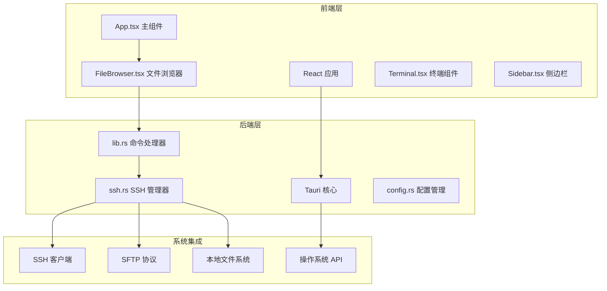

**图表来源**
- [App.tsx:1-415](file://src/App.tsx#L1-L415)
- [FileBrowser.tsx:1-1298](file://src/components/FileBrowser.tsx#L1-L1298)
- [lib.rs:1-319](file://src-tauri/src/lib.rs#L1-L319)
- [ssh.rs:1-654](file://src-tauri/src/ssh.rs#L1-L654)

**章节来源**
- [main.rs:1-7](file://src-tauri/src/main.rs#L1-L7)
- [tauri.conf.json:1-42](file://src-tauri/tauri.conf.json#L1-L42)

## 核心组件

### SSH 管理器 (SshManager)

SSH 管理器是整个二进制文件处理的核心组件，负责建立 SSH 连接、管理会话状态、执行文件操作等。

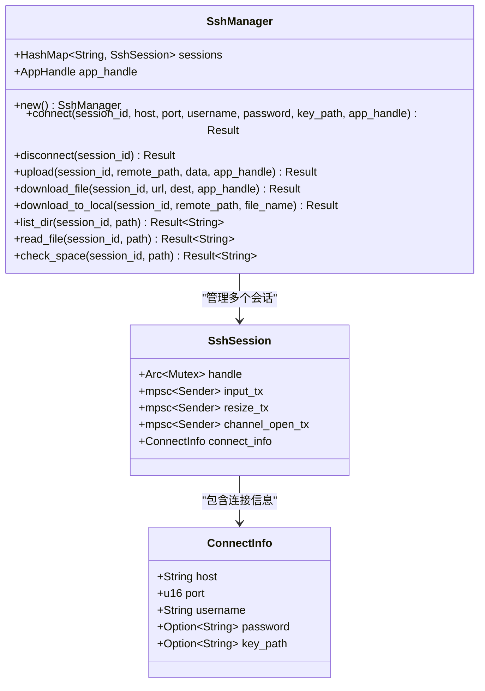

**图表来源**
- [ssh.rs:58-654](file://src-tauri/src/ssh.rs#L58-L654)

### 文件浏览器组件

文件浏览器组件提供了用户界面，支持拖拽上传、右键菜单、进度显示等功能。

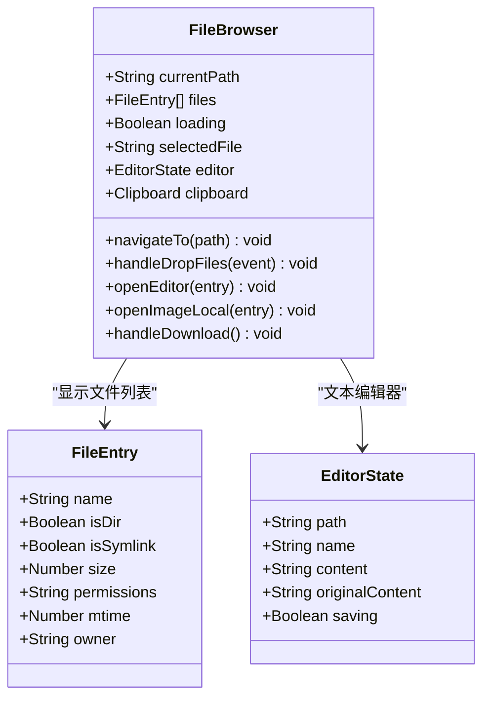

**图表来源**
- [FileBrowser.tsx:154-1298](file://src/components/FileBrowser.tsx#L154-L1298)

**章节来源**
- [ssh.rs:58-654](file://src-tauri/src/ssh.rs#L58-L654)
- [FileBrowser.tsx:154-1298](file://src/components/FileBrowser.tsx#L154-L1298)

## 架构概览

应用采用客户端-服务器架构，通过 Tauri 桥接前端 JavaScript 和 Rust 后端：

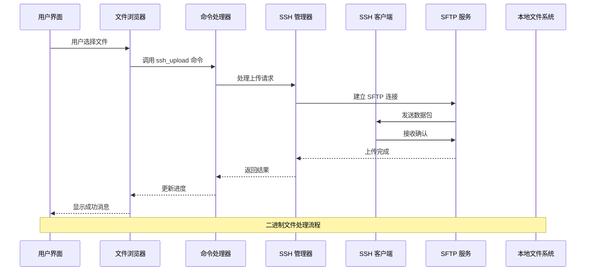

**图表来源**
- [lib.rs:77-91](file://src-tauri/src/lib.rs#L77-L91)
- [ssh.rs:520-583](file://src-tauri/src/ssh.rs#L520-L583)

## 详细组件分析

### 二进制文件识别机制

应用实现了多层文件识别机制来区分二进制文件和文本文件：

#### MIME 类型判断

虽然应用没有直接使用标准的 MIME 类型检测库，但通过文件扩展名进行智能识别：

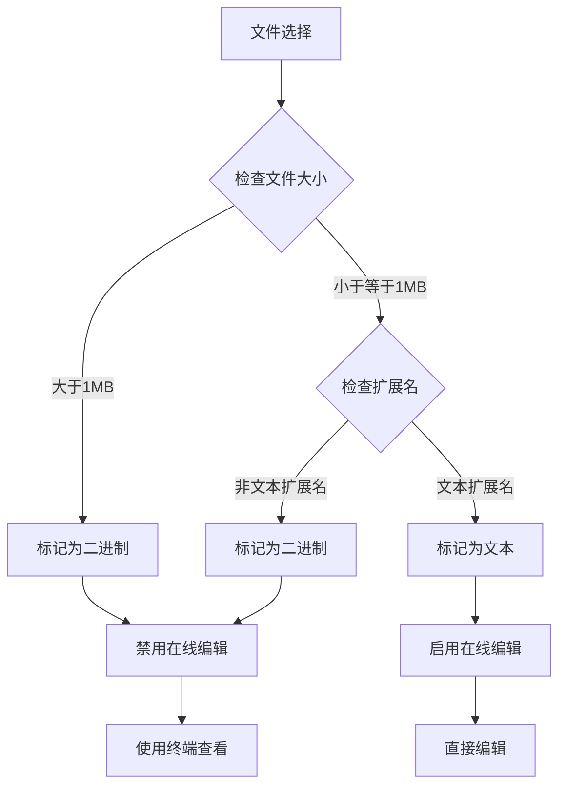

**图表来源**
- [FileBrowser.tsx:540-555](file://src/components/FileBrowser.tsx#L540-L555)

#### 文件大小限制

应用设置了合理的文件大小阈值：

- **文本文件编辑上限**: 1MB（1024 × 1024 字节）
- **SFTP 读取优化**: 自动截断超过 1MB 的内容以避免内存溢出

**章节来源**
- [FileBrowser.tsx:540-555](file://src/components/FileBrowser.tsx#L540-L555)
- [ssh.rs:318-323](file://src-tauri/src/ssh.rs#L318-L323)

### 二进制文件下载流程

应用提供了两种主要的二进制文件下载方式：

#### 远程到本地下载

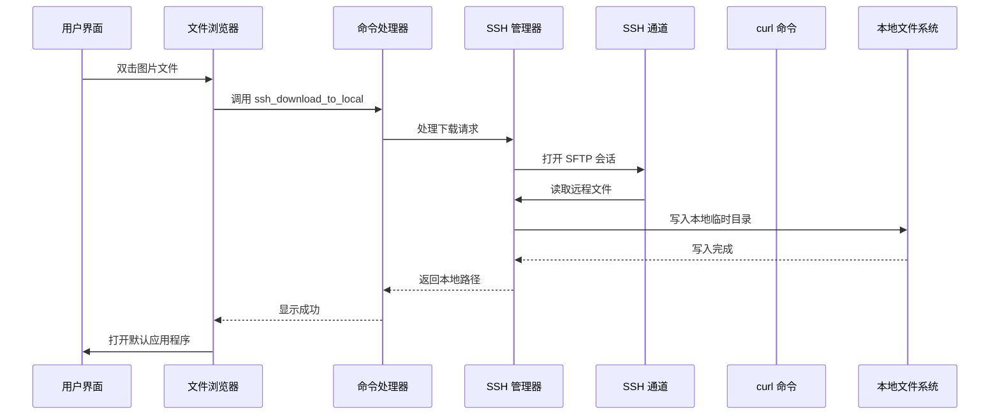

**图表来源**
- [ssh.rs:585-615](file://src-tauri/src/ssh.rs#L585-L615)
- [FileBrowser.tsx:523-538](file://src/components/FileBrowser.tsx#L523-L538)

#### URL 直接下载

对于从网络下载的文件，应用使用 curl 命令进行高效传输：

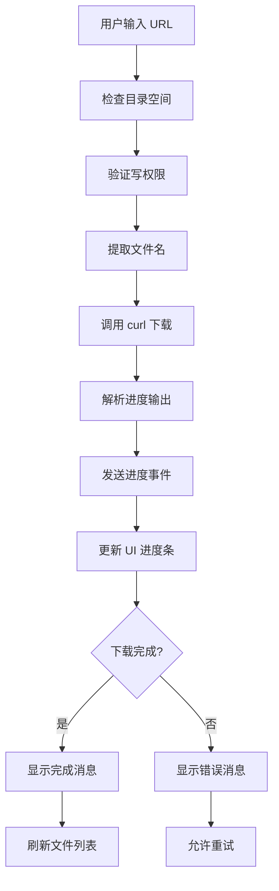

**图表来源**
- [ssh.rs:448-518](file://src-tauri/src/ssh.rs#L448-L518)
- [FileBrowser.tsx:682-712](file://src/components/FileBrowser.tsx#L682-L712)

**章节来源**
- [ssh.rs:448-518](file://src-tauri/src/ssh.rs#L448-L518)
- [FileBrowser.tsx:523-538](file://src/components/FileBrowser.tsx#L523-L538)

### 图像文件预览功能

应用提供了完整的图像文件预览功能，包括本地缓存和浏览器集成：

#### 本地缓存机制

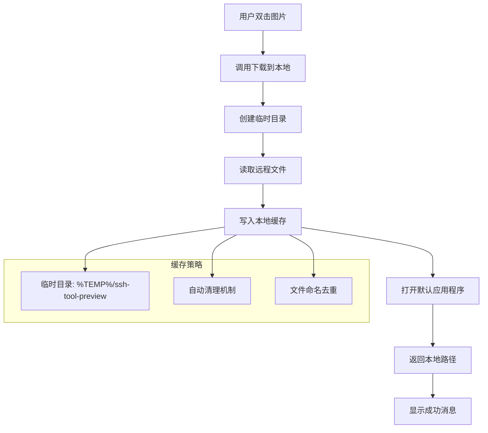

**图表来源**
- [ssh.rs:585-615](file://src-tauri/src/ssh.rs#L585-L615)

#### 缩略图生成

应用通过操作系统默认程序处理图像文件，确保最佳的显示效果：

- **跨平台兼容**: 使用 `open` crate 调用系统默认程序
- **格式支持**: 支持 PNG、JPG、GIF、BMP、WebP、SVG 等主流格式
- **性能优化**: 异步处理，不阻塞主界面

**章节来源**
- [ssh.rs:585-615](file://src-tauri/src/ssh.rs#L585-L615)
- [FileBrowser.tsx:102-108](file://src/components/FileBrowser.tsx#L102-L108)

### 大文件处理策略

应用针对大文件传输实施了多项优化策略：

#### 分块传输

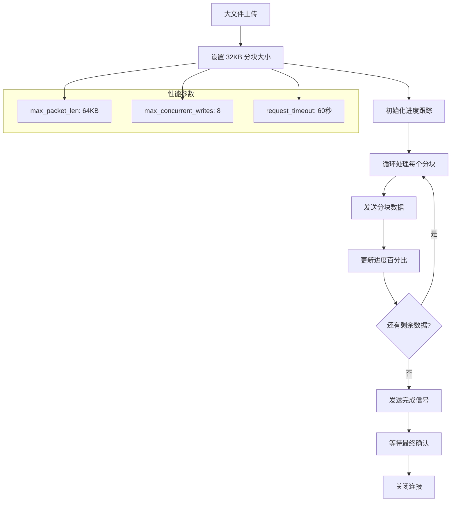

**图表来源**
- [ssh.rs:549-583](file://src-tauri/src/ssh.rs#L549-L583)

#### 内存优化

- **流式处理**: 使用 `tokio::io::AsyncReadExt` 进行流式读取
- **分块大小**: 32KB 的合理分块大小平衡了性能和内存使用
- **背压控制**: 通过 mpsc 通道实现生产者-消费者模式

**章节来源**
- [ssh.rs:549-583](file://src-tauri/src/ssh.rs#L549-L583)
- [ssh.rs:272-286](file://src-tauri/src/ssh.rs#L272-L286)

### 超时控制

应用实现了多层次的超时控制机制：

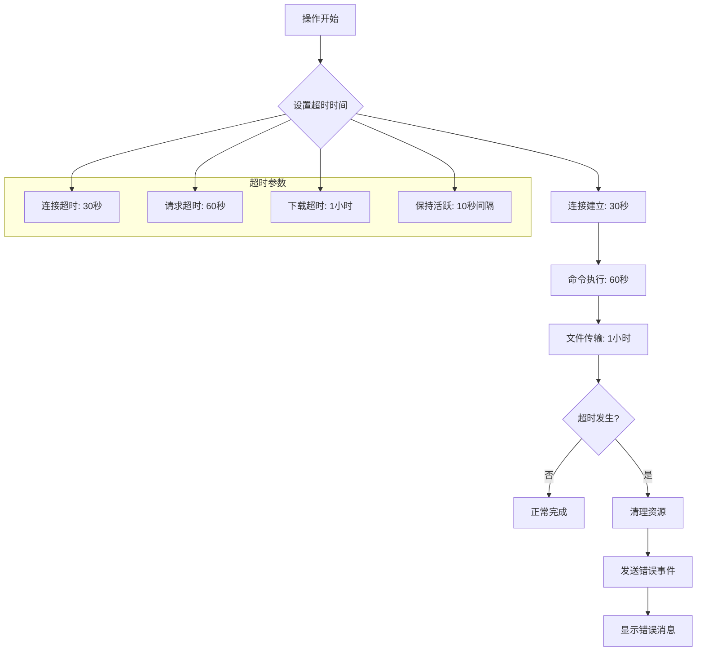

**图表来源**
- [ssh.rs:82-87](file://src-tauri/src/ssh.rs#L82-L87)
- [ssh.rs:280-285](file://src-tauri/src/ssh.rs#L280-L285)
- [ssh.rs:467-498](file://src-tauri/src/ssh.rs#L467-L498)

**章节来源**
- [ssh.rs:82-87](file://src-tauri/src/ssh.rs#L82-L87)
- [ssh.rs:467-498](file://src-tauri/src/ssh.rs#L467-L498)

## 依赖关系分析

应用的依赖关系体现了清晰的分层架构：

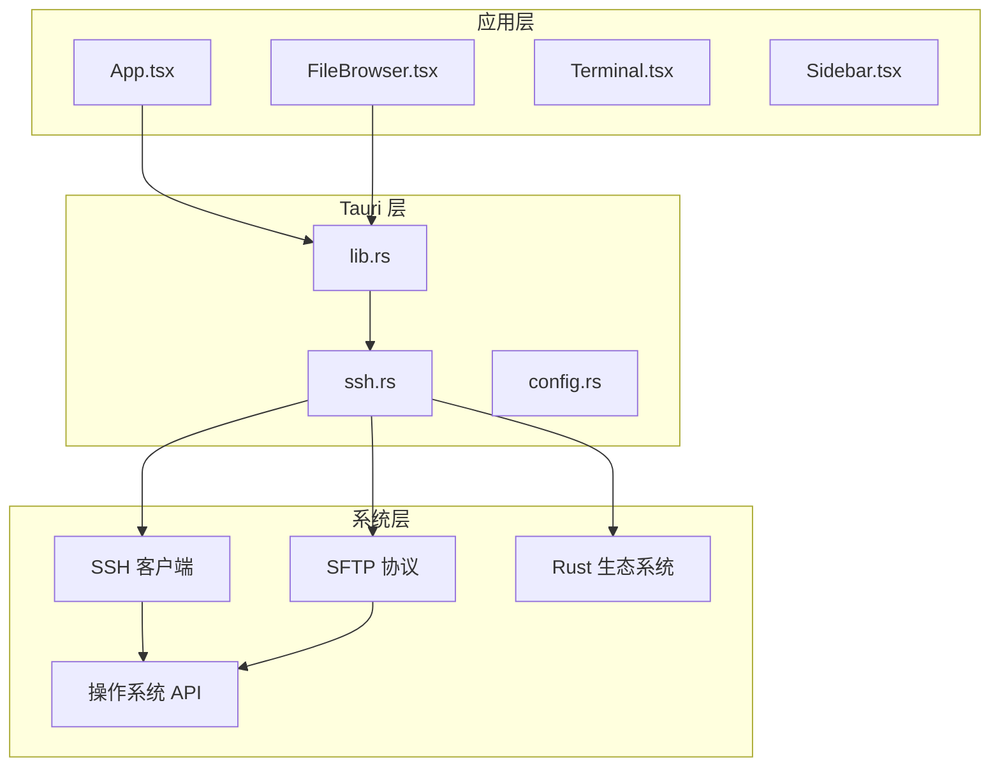

**图表来源**
- [Cargo.toml:18-33](file://src-tauri/Cargo.toml#L18-L33)
- [lib.rs:1-10](file://src-tauri/src/lib.rs#L1-L10)

**章节来源**
- [Cargo.toml:18-33](file://src-tauri/Cargo.toml#L18-L33)
- [lib.rs:1-10](file://src-tauri/src/lib.rs#L1-L10)

## 性能考虑

### 并发处理

应用使用 Tokio 异步运行时处理并发操作：

- **会话管理**: 每个 SSH 会话独立管理
- **通道通信**: 使用 mpsc 通道实现异步通信
- **任务隔离**: 后台任务独立运行，不影响主线程

### 内存管理

- **流式读取**: 大文件采用流式处理，避免内存溢出
- **分块传输**: 控制单次传输的数据量
- **及时释放**: 及时关闭文件句柄和连接

### 网络优化

- **keep-alive**: 10秒间隔的心跳检测
- **超时控制**: 多层次的超时机制
- **错误恢复**: 自动重连和错误处理

## 故障排除指南

### 常见问题及解决方案

#### 连接失败

**症状**: SSH 连接建立失败
**原因**: 网络问题、认证失败、服务器拒绝
**解决**: 检查网络连接、验证凭据、查看服务器日志

#### 传输中断

**症状**: 文件传输过程中断
**原因**: 网络不稳定、超时设置过短
**解决**: 增加超时时间、检查网络质量、使用稳定的连接

#### 内存不足

**症状**: 大文件处理时内存使用过高
**解决**: 减少同时进行的大文件数量、增加系统内存、优化分块大小

#### 权限错误

**症状**: 无法读取或写入文件
**解决**: 检查文件权限、验证用户权限、使用适当的权限模式

**章节来源**
- [ssh.rs:82-106](file://src-tauri/src/ssh.rs#L82-L106)
- [ssh.rs:490-517](file://src-tauri/src/ssh.rs#L490-L517)

## 结论

本项目在二进制文件处理方面实现了全面的功能覆盖，包括：

1. **智能文件识别**: 通过大小限制和扩展名判断实现准确的文件分类
2. **高效的下载机制**: 支持远程到本地和 URL 直接下载两种方式
3. **完善的预览功能**: 提供本地缓存和系统集成的图像预览
4. **大文件优化**: 实施分块传输、内存优化和超时控制策略
5. **安全考虑**: 通过权限检查和错误处理确保操作安全

通过合理的架构设计和性能优化，该应用能够稳定处理各种规模的二进制文件，为用户提供流畅的 SSH 文件管理体验。未来可以在病毒扫描集成和更精细的安全检查方面进一步增强。