# 文件操作功能

<cite>
**本文档引用的文件**
- [App.tsx](file://src/App.tsx)
- [FileBrowser.tsx](file://src/components/FileBrowser.tsx)
- [lib.rs](file://src-tauri/src/lib.rs)
- [ssh.rs](file://src-tauri/src/ssh.rs)
- [Cargo.toml](file://src-tauri/Cargo.toml)
- [package.json](file://package.json)
- [README.md](file://README.md)
</cite>

## 目录
1. [简介](#简介)
2. [项目结构](#项目结构)
3. [核心组件](#核心组件)
4. [架构概览](#架构概览)
5. [详细组件分析](#详细组件分析)
6. [依赖关系分析](#依赖关系分析)
7. [性能考虑](#性能考虑)
8. [故障排除指南](#故障排除指南)
9. [结论](#结论)

## 简介

SSH工具文件操作功能是一个基于Tauri框架构建的跨平台桌面应用程序，提供了完整的SSH文件管理系统。该系统支持文件上传、下载、删除、重命名等核心操作，以及高级功能如文件复制粘贴、拖拽操作、权限管理和批量操作。

该应用程序采用前后端分离架构：前端使用React和TypeScript构建用户界面，后端使用Rust和russh库处理SSH连接和文件操作。通过Tauri的IPC机制实现前后端通信，提供流畅的用户体验。

## 项目结构

项目采用模块化的双层架构设计：

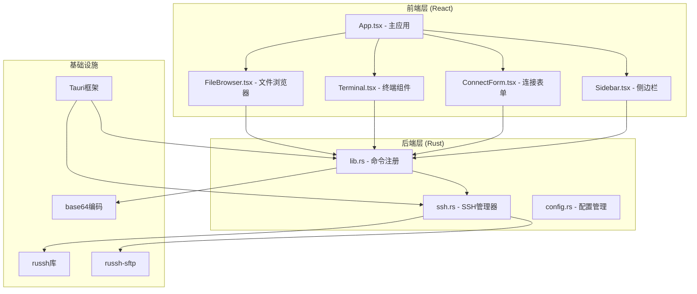

**图表来源**
- [App.tsx:1-415](file://src/App.tsx#L1-L415)
- [FileBrowser.tsx:1-800](file://src/components/FileBrowser.tsx#L1-L800)
- [lib.rs:1-319](file://src-tauri/src/lib.rs#L1-L319)
- [ssh.rs:1-654](file://src-tauri/src/ssh.rs#L1-L654)

**章节来源**
- [README.md:49-74](file://README.md#L49-L74)
- [package.json:1-28](file://package.json#L1-L28)
- [Cargo.toml:1-33](file://src-tauri/Cargo.toml#L1-L33)

## 核心组件

### 文件浏览器组件 (FileBrowser)

文件浏览器是整个文件操作功能的核心组件，负责：
- 文件列表显示和目录导航
- 用户交互事件处理（点击、右键菜单、拖拽）
- 剪贴板状态管理
- 进度跟踪和通知系统

### SSH管理器 (SshManager)

SSH管理器封装了所有SSH相关的操作：
- 连接建立和维护
- SFTP会话管理
- 文件操作执行
- 进度事件发送

### 命令处理器 (lib.rs)

命令处理器定义了前后端通信的接口：
- SSH连接命令
- 文件操作命令
- 配置管理命令
- 设置管理命令

**章节来源**
- [FileBrowser.tsx:154-800](file://src/components/FileBrowser.tsx#L154-L800)
- [ssh.rs:58-654](file://src-tauri/src/ssh.rs#L58-L654)
- [lib.rs:21-319](file://src-tauri/src/lib.rs#L21-L319)

## 架构概览

应用程序采用分层架构，确保职责分离和可维护性：

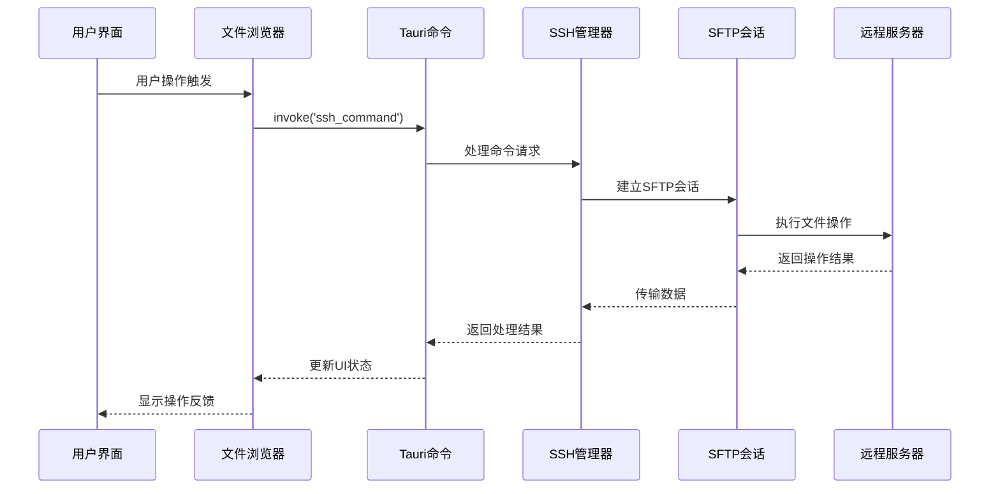

**图表来源**
- [lib.rs:77-91](file://src-tauri/src/lib.rs#L77-L91)
- [ssh.rs:520-583](file://src-tauri/src/ssh.rs#L520-L583)
- [FileBrowser.tsx:316-355](file://src/components/FileBrowser.tsx#L316-L355)

## 详细组件分析

### 文件上传功能

文件上传功能支持本地文件到远程服务器的传输，具有以下特性：

#### 上传流程

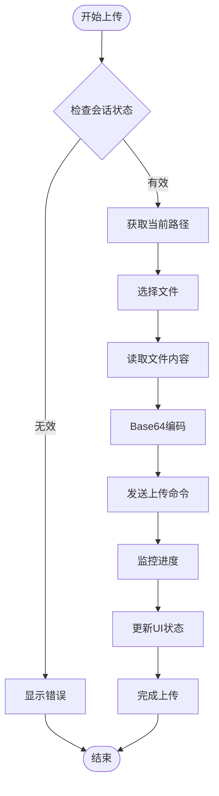

**图表来源**
- [App.tsx:302-334](file://src/App.tsx#L302-L334)
- [FileBrowser.tsx:316-355](file://src/components/FileBrowser.tsx#L316-L355)

#### 上传实现细节

上传功能通过以下步骤实现：

1. **会话验证**：确保SSH会话处于活跃状态
2. **路径解析**：获取当前工作目录作为默认目标路径
3. **文件读取**：异步读取本地文件内容
4. **数据编码**：使用Base64编码确保二进制数据传输安全
5. **进度监控**：实时监听上传进度事件
6. **错误处理**：捕获并报告上传过程中的任何异常

**章节来源**
- [App.tsx:302-334](file://src/App.tsx#L302-L334)
- [FileBrowser.tsx:316-355](file://src/components/FileBrowser.tsx#L316-L355)
- [ssh.rs:520-583](file://src-tauri/src/ssh.rs#L520-L583)

### 文件下载功能

文件下载功能支持从远程服务器到本地系统的文件传输：

#### 下载流程

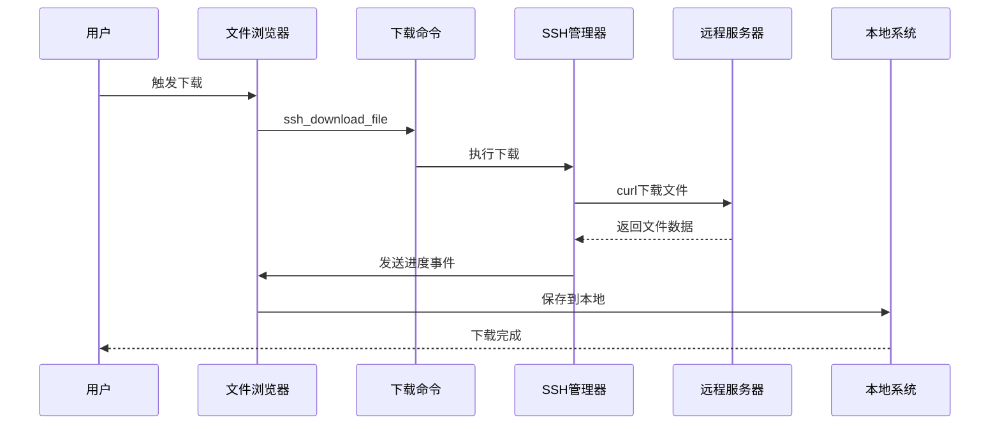

**图表来源**
- [lib.rs:208-218](file://src-tauri/src/lib.rs#L208-L218)
- [ssh.rs:449-518](file://src-tauri/src/ssh.rs#L449-L518)

#### 下载实现特点

下载功能具有以下特点：
- **进度跟踪**：实时显示下载百分比和状态
- **URL支持**：直接从HTTP/HTTPS链接下载
- **文件名处理**：自动提取URL中的文件名或生成唯一名称
- **错误恢复**：网络中断时的错误处理和用户提示

**章节来源**
- [FileBrowser.tsx:685-715](file://src/components/FileBrowser.tsx#L685-L715)
- [ssh.rs:449-518](file://src-tauri/src/ssh.rs#L449-L518)

### 文件删除功能

文件删除功能提供安全的文件和目录删除操作：

#### 删除流程

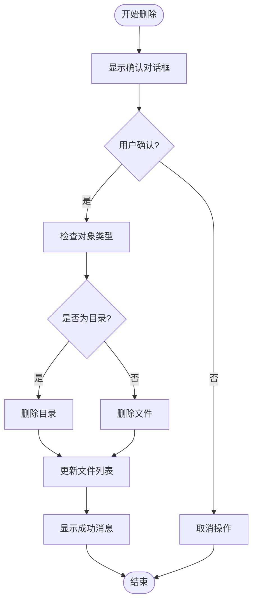

**图表来源**
- [FileBrowser.tsx:574-587](file://src/components/FileBrowser.tsx#L574-L587)

#### 删除实现机制

删除功能的安全机制包括：
- **确认对话框**：防止误删操作
- **类型检查**：区分文件和目录的删除方式
- **权限验证**：确保用户有删除权限
- **错误处理**：捕获并报告删除失败的原因

**章节来源**
- [FileBrowser.tsx:574-587](file://src/components/FileBrowser.tsx#L574-L587)
- [ssh.rs:338-357](file://src-tauri/src/ssh.rs#L338-L357)

### 文件重命名功能

文件重命名功能支持单个文件和目录的重命名操作：

#### 重命名流程

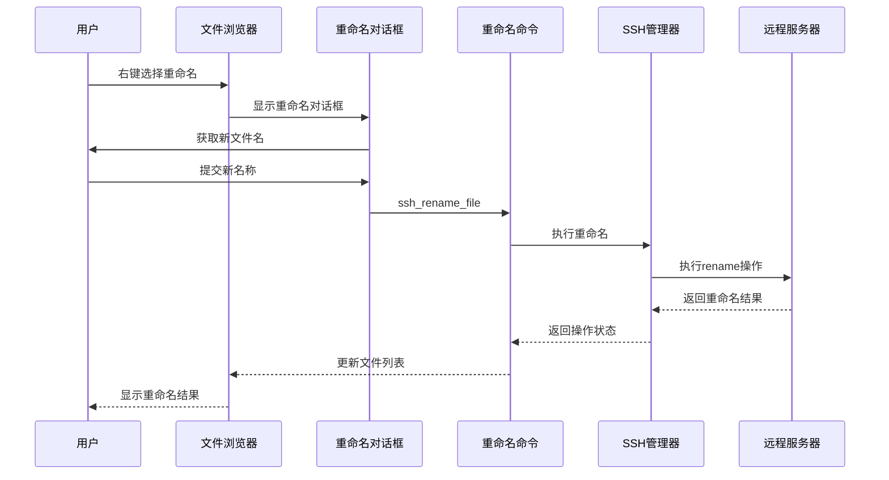

**图表来源**
- [FileBrowser.tsx:665-678](file://src/components/FileBrowser.tsx#L665-L678)

#### 重命名实现特性

重命名功能的特点：
- **名称验证**：检查新名称的有效性和唯一性
- **路径处理**：正确处理相对和绝对路径
- **原子操作**：确保重命名操作的原子性
- **回滚机制**：重命名失败时的错误恢复

**章节来源**
- [FileBrowser.tsx:665-678](file://src/components/FileBrowser.tsx#L665-L678)
- [ssh.rs:359-365](file://src-tauri/src/ssh.rs#L359-L365)

### 文件复制粘贴功能

文件复制粘贴功能实现了类似操作系统剪贴板的文件操作机制：

#### 剪贴板状态管理

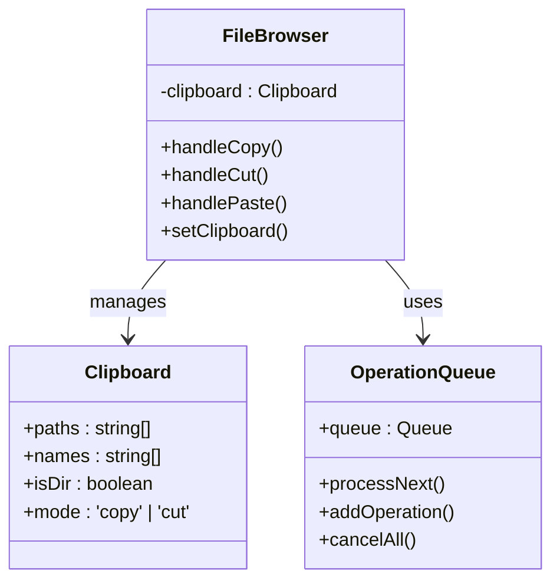

**图表来源**
- [FileBrowser.tsx:44-49](file://src/components/FileBrowser.tsx#L44-L49)
- [FileBrowser.tsx:617-663](file://src/components/FileBrowser.tsx#L617-L663)

#### 复制粘贴实现机制

复制粘贴功能的实现机制：

1. **剪贴板状态**：维护当前复制/剪切的文件信息
2. **冲突检测**：检查目标位置是否存在同名文件
3. **名称生成**：自动生成唯一的文件名避免覆盖
4. **操作执行**：根据模式执行复制或移动操作
5. **状态同步**：更新文件列表和剪贴板状态

**章节来源**
- [FileBrowser.tsx:617-663](file://src/components/FileBrowser.tsx#L617-L663)
- [ssh.rs:367-383](file://src-tauri/src/ssh.rs#L367-L383)

### 拖拽操作实现

拖拽操作提供了直观的文件管理体验：

#### 拖拽流程

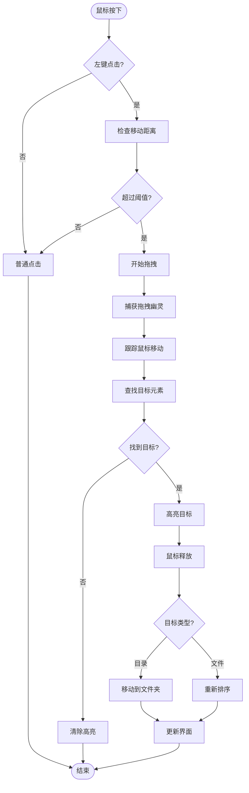

**图表来源**
- [FileBrowser.tsx:408-509](file://src/components/FileBrowser.tsx#L408-L509)

#### 拖拽实现特性

拖拽功能的实现特性：
- **距离检测**：避免意外拖拽
- **幽灵效果**：视觉反馈拖拽对象
- **目标识别**：准确识别拖放目标
- **状态管理**：维护拖拽过程中的各种状态

**章节来源**
- [FileBrowser.tsx:408-509](file://src/components/FileBrowser.tsx#L408-L509)

### 新文件和文件夹创建

新文件和文件夹创建功能提供了便捷的文件系统管理：

#### 创建流程

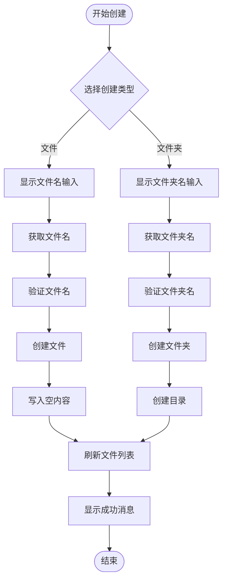

**图表来源**
- [FileBrowser.tsx:589-615](file://src/components/FileBrowser.tsx#L589-L615)

#### 创建实现机制

创建功能的安全机制：
- **名称验证**：检查文件名和路径的有效性
- **权限检查**：确保用户有创建权限
- **冲突处理**：避免创建已存在的文件
- **错误恢复**：创建失败时的状态回滚

**章节来源**
- [FileBrowser.tsx:589-615](file://src/components/FileBrowser.tsx#L589-L615)
- [ssh.rs:325-357](file://src-tauri/src/ssh.rs#L325-L357)

### 批量操作功能

批量操作功能支持多个文件的协调处理：

#### 批量操作流程

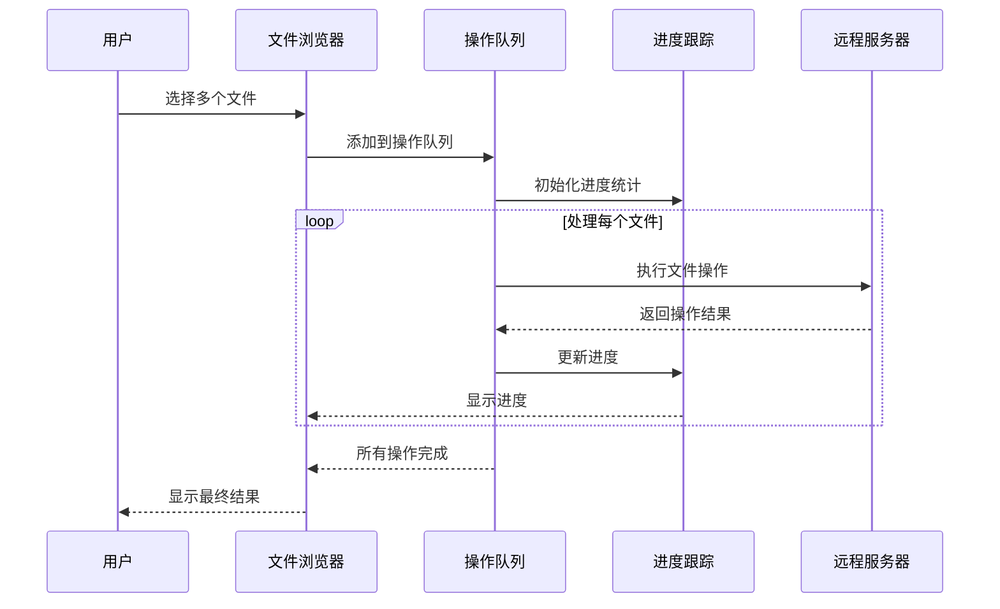

**图表来源**
- [FileBrowser.tsx:328-351](file://src/components/FileBrowser.tsx#L328-L351)

#### 批量操作特性

批量操作的功能特性：
- **队列管理**：有序处理多个文件操作
- **进度跟踪**：实时显示整体进度
- **错误隔离**：单个文件失败不影响其他文件
- **状态同步**：保持文件列表与实际状态一致

**章节来源**
- [FileBrowser.tsx:328-351](file://src/components/FileBrowser.tsx#L328-L351)

### 文件权限管理

文件权限管理功能提供了细粒度的文件访问控制：

#### 权限管理流程

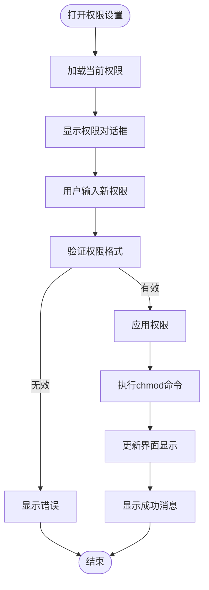

**图表来源**
- [FileBrowser.tsx:717-732](file://src/components/FileBrowser.tsx#L717-L732)

#### 权限实现机制

权限管理的安全机制：
- **格式验证**：确保权限字符串符合标准格式
- **命令注入防护**：对用户输入进行安全处理
- **错误处理**：捕获并报告权限设置失败
- **即时反馈**：权限变更后的状态更新

**章节来源**
- [FileBrowser.tsx:717-732](file://src/components/FileBrowser.tsx#L717-L732)
- [ssh.rs:385-417](file://src-tauri/src/ssh.rs#L385-L417)

### 安全检查和操作日志

系统内置了多重安全检查和日志记录机制：

#### 安全检查机制

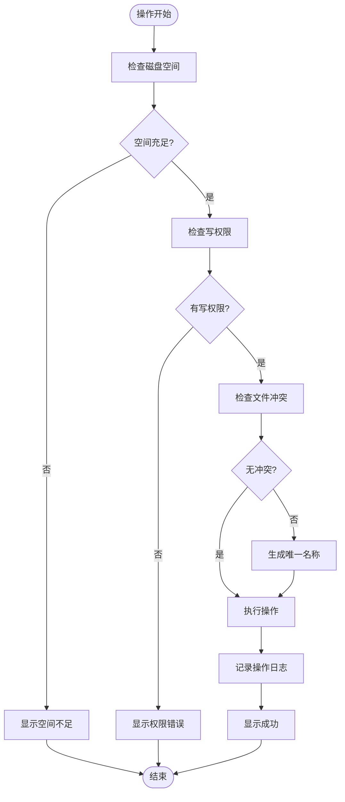

**图表来源**
- [FileBrowser.tsx:243-265](file://src/components/FileBrowser.tsx#L243-L265)

#### 日志记录实现

日志记录功能包括：
- **操作审计**：记录所有文件操作的详细信息
- **错误追踪**：捕获和记录操作失败的原因
- **性能监控**：跟踪操作耗时和资源使用
- **用户行为**：记录用户的关键操作行为

**章节来源**
- [FileBrowser.tsx:243-265](file://src/components/FileBrowser.tsx#L243-L265)
- [ssh.rs:419-446](file://src-tauri/src/ssh.rs#L419-L446)

## 依赖关系分析

应用程序的依赖关系体现了清晰的分层架构：

```mermaid
graph TB
subgraph "前端依赖"
A[React 19.2.7]
B[@tauri-apps/api 2.11.0]
C[xterm.js 6.0.0]
D[TypeScript ~6.0.2]
end
subgraph "后端依赖"
E[Rust 1.77.2]
F[russh 0.45]
G[russh-sftp 2.0]
H[tokio 1.0]
I[serde 1.0]
end
subgraph "基础设施"
J[Tauri 2.11.2]
K[Base64 0.22]
L[UUID 1.0]
M[Open 5.0]
end
A --> B
B --> J
J --> F
F --> G
F --> H
G --> K
H --> I
J --> L
J --> M
```

**图表来源**
- [package.json:15-26](file://package.json#L15-L26)
- [Cargo.toml:18-33](file://src-tauri/Cargo.toml#L18-L33)

**章节来源**
- [package.json:15-26](file://package.json#L15-L26)
- [Cargo.toml:18-33](file://src-tauri/Cargo.toml#L18-L33)

## 性能考虑

### 并发处理

系统采用了多线程并发处理机制：
- **Tokio运行时**：提供异步I/O和任务调度
- **SFTP会话池**：复用SFTP连接减少开销
- **事件驱动**：基于事件的非阻塞通信

### 内存管理

内存使用优化策略：
- **流式处理**：大文件采用流式读写避免内存峰值
- **Base64编码**：按需编码减少内存占用
- **垃圾回收**：及时清理临时对象和缓存

### 网络优化

网络传输优化：
- **分块传输**：大文件分块传输提高稳定性
- **进度反馈**：实时进度显示提升用户体验
- **超时控制**：合理的超时设置防止资源泄露

## 故障排除指南

### 常见问题及解决方案

#### 连接问题
- **症状**：无法建立SSH连接
- **原因**：网络问题、认证失败、服务器拒绝
- **解决**：检查网络连接、验证凭据、查看服务器日志

#### 上传失败
- **症状**：文件上传中断或失败
- **原因**：磁盘空间不足、权限问题、网络中断
- **解决**：清理磁盘空间、检查权限、重试上传

#### 下载错误
- **症状**：远程文件下载失败
- **原因**：URL无效、网络超时、服务器错误
- **解决**：验证URL格式、检查网络连接、查看服务器状态

#### 权限设置失败
- **症状**：文件权限无法修改
- **原因**：权限不足、语法错误、系统限制
- **解决**：获取管理员权限、检查权限格式、查看系统日志

**章节来源**
- [ssh.rs:419-446](file://src-tauri/src/ssh.rs#L419-L446)
- [FileBrowser.tsx:243-265](file://src/components/FileBrowser.tsx#L243-L265)

## 结论

SSH工具文件操作功能是一个功能完整、架构清晰的跨平台桌面应用程序。通过前后端分离的设计，结合Rust的高性能特性和React的现代化UI框架，实现了稳定可靠的文件管理功能。

该系统的主要优势包括：
- **安全性**：多重安全检查和权限控制
- **可靠性**：完善的错误处理和恢复机制
- **易用性**：直观的用户界面和丰富的交互功能
- **扩展性**：模块化的架构便于功能扩展

未来可以考虑的功能增强方向：
- 支持更多文件格式的预览
- 增强批量操作的性能优化
- 添加文件版本管理和历史记录
- 实现更智能的冲突解决策略