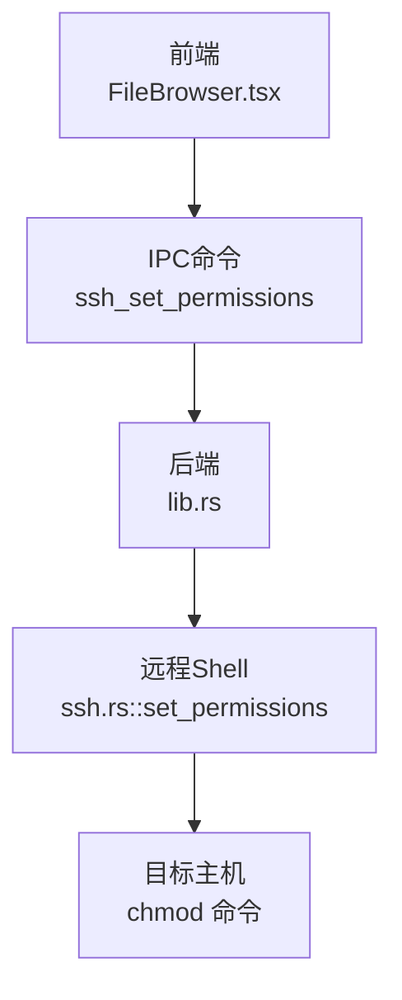
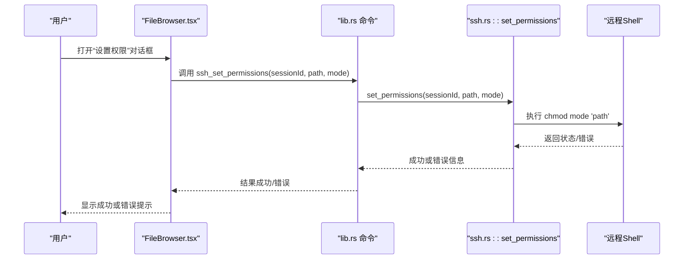
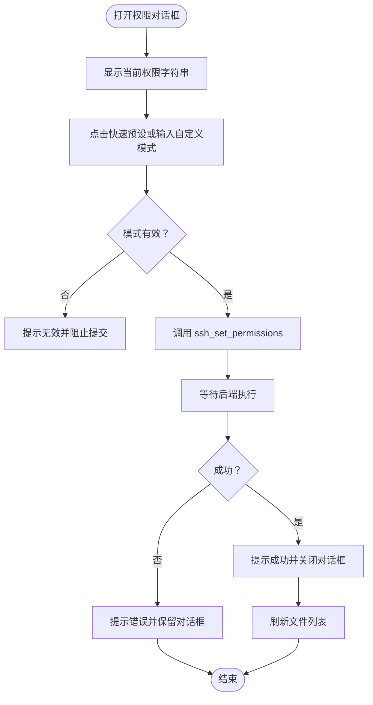
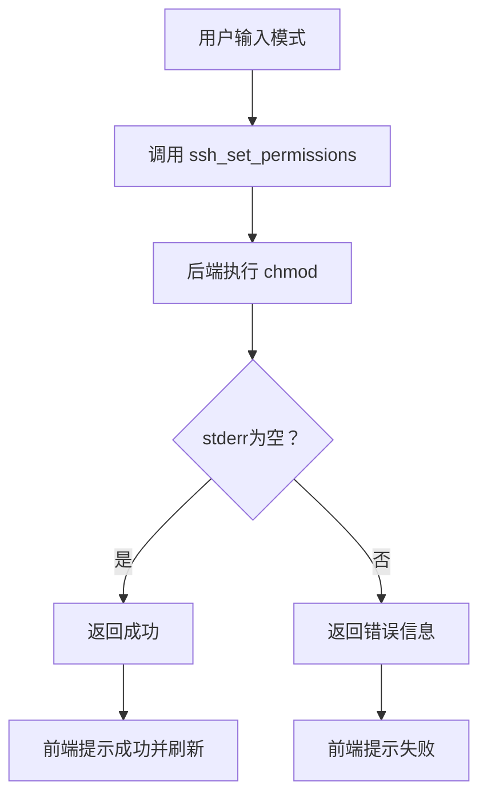
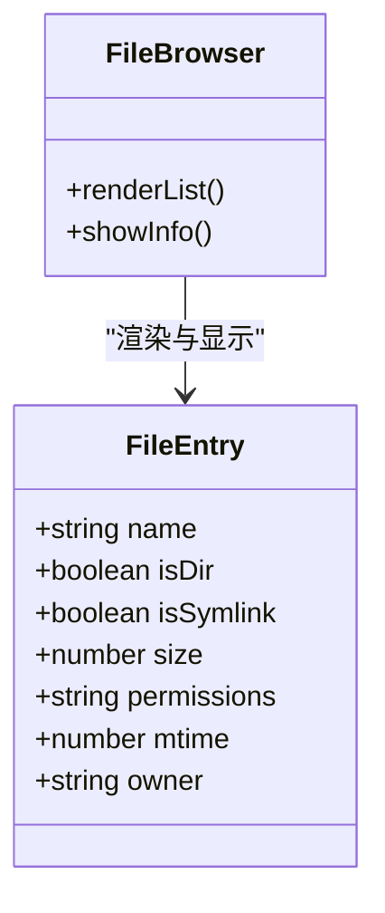

# 文件权限管理

<cite>
**本文档引用的文件**
- [README.md](file://README.md)
- [App.tsx](file://src/App.tsx)
- [FileBrowser.tsx](file://src/components/FileBrowser.tsx)
- [lib.rs](file://src-tauri/src/lib.rs)
- [ssh.rs](file://src-tauri/src/ssh.rs)
- [config.rs](file://src-tauri/src/config.rs)
- [Cargo.toml](file://src-tauri/Cargo.toml)
- [default.json](file://src-tauri/capabilities/default.json)
</cite>

## 目录
1. [简介](#简介)
2. [项目结构](#项目结构)
3. [核心组件](#核心组件)
4. [架构总览](#架构总览)
5. [详细组件分析](#详细组件分析)
6. [依赖关系分析](#依赖关系分析)
7. [性能考量](#性能考量)
8. [故障排查指南](#故障排查指南)
9. [结论](#结论)
10. [附录](#附录)

## 简介
本文件围绕SSH工具中的“文件权限管理”能力进行系统化技术说明，覆盖以下方面：
- Unix权限模型与当前实现边界：基于后端通过远程shell执行chmod命令实现权限变更，前端提供权限对话框与快速预设。
- ACL支持与权限继承：当前仓库未实现ACL或继承策略，仅支持标准数字权限模式（如755、644等）。
- 权限对话框实现：包含权限模式选择、快速预设、输入校验与批量应用提示。
- 权限修改流程：从前端发起到后端执行chmod，包含错误捕获与用户反馈。
- 权限信息显示：文件列表中展示权限字符串，属性面板中显示当前值。
- 最佳实践、安全考虑与兼容性：结合现有实现给出建议。

## 项目结构
该项目采用Tauri桌面应用架构，前端使用React+TypeScript，后端使用Rust+russh。文件权限管理涉及：
- 前端组件：FileBrowser.tsx负责文件浏览、上下文菜单、权限对话框与权限应用。
- 后端模块：lib.rs注册命令ssh_set_permissions；ssh.rs实现set_permissions通过远程shell执行chmod，并收集stderr返回错误信息。
- 配置与能力：config.rs负责连接配置持久化；capabilities/default.json定义默认权限集。

**图表来源**
- [FileBrowser.tsx:714-729](file://src/components/FileBrowser.tsx#L714-L729)
- [lib.rs:184-194](file://src-tauri/src/lib.rs#L184-L194)
- [ssh.rs:384-417](file://src-tauri/src/ssh.rs#L384-L417)

**章节来源**
- [README.md:39-74](file://README.md#L39-L74)
- [Cargo.toml:18-33](file://src-tauri/Cargo.toml#L18-L33)
- [default.json:1-11](file://src-tauri/capabilities/default.json#L1-L11)

## 核心组件
- 前端权限对话框
  - 打开入口：右键菜单“🔒 设置权限”，或文件项上下文菜单触发。
  - 功能：显示当前权限字符串、提供常用快速预设（如644、755等）、允许手动输入数字模式（如755），点击“应用”后调用IPC命令。
- 后端权限命令
  - 命名：ssh_set_permissions。
  - 行为：在远程会话中执行chmod命令，读取stderr以判断是否成功，失败时返回错误信息。
- 文件列表与属性显示
  - 列表：文件条目包含permissions字段（权限字符串）。
  - 属性：文件信息面板显示当前权限值。

**章节来源**
- [FileBrowser.tsx:166-167](file://src/components/FileBrowser.tsx#L166-L167)
- [FileBrowser.tsx:714-729](file://src/components/FileBrowser.tsx#L714-L729)
- [FileBrowser.tsx:1191-1227](file://src/components/FileBrowser.tsx#L1191-L1227)
- [lib.rs:184-194](file://src-tauri/src/lib.rs#L184-L194)
- [ssh.rs:288-307](file://src-tauri/src/ssh.rs#L288-L307)
- [ssh.rs:299-300](file://src-tauri/src/ssh.rs#L299-L300)

## 架构总览
权限管理从UI到远端执行的完整链路如下：

**图表来源**
- [FileBrowser.tsx:714-729](file://src/components/FileBrowser.tsx#L714-L729)
- [lib.rs:184-194](file://src-tauri/src/lib.rs#L184-L194)
- [ssh.rs:384-417](file://src-tauri/src/ssh.rs#L384-L417)

## 详细组件分析

### 权限对话框实现
- 打开方式：右键文件项或文件夹项，选择“🔒 设置权限”。
- 当前权限显示：对话框顶部显示“当前权限”字符串。
- 快速预设：提供常见模式（如644、755、600、700、777、400），点击即选中。
- 自定义输入：支持直接输入数字模式（如755），按回车或点击“应用”提交。
- 应用流程：调用IPC命令ssh_set_permissions，等待后端返回结果并刷新文件列表。

**图表来源**
- [FileBrowser.tsx:1191-1227](file://src/components/FileBrowser.tsx#L1191-L1227)
- [FileBrowser.tsx:714-729](file://src/components/FileBrowser.tsx#L714-L729)

**章节来源**
- [FileBrowser.tsx:166-167](file://src/components/FileBrowser.tsx#L166-L167)
- [FileBrowser.tsx:1191-1227](file://src/components/FileBrowser.tsx#L1191-L1227)
- [FileBrowser.tsx:714-729](file://src/components/FileBrowser.tsx#L714-L729)

### 权限修改流程与错误处理
- 前端职责：收集用户输入、调用IPC命令、展示进度与结果。
- 后端职责：在远程会话中执行chmod，捕获stderr作为错误依据，返回成功或错误信息。
- 错误处理：若stderr非空，则视为chmod失败并返回错误；成功则返回空。
- 回滚机制：当前实现未提供自动回滚；建议在需要时由上层业务在失败时提示用户或记录日志。

**图表来源**
- [lib.rs:184-194](file://src-tauri/src/lib.rs#L184-L194)
- [ssh.rs:384-417](file://src-tauri/src/ssh.rs#L384-L417)

**章节来源**
- [lib.rs:184-194](file://src-tauri/src/lib.rs#L184-L194)
- [ssh.rs:384-417](file://src-tauri/src/ssh.rs#L384-L417)

### 权限信息显示
- 文件列表：每个条目包含permissions字段（权限字符串），用于在网格/列表中展示。
- 属性面板：文件信息对话框中显示当前权限值，便于核对。
- 数字权限转换：当前实现直接使用后端返回的权限字符串；如需数字模式转换，可在前端进行格式解析（例如将rwxr-xr-x转换为755），但当前仓库未实现该逻辑。

**图表来源**
- [FileBrowser.tsx:15-28](file://src/components/FileBrowser.tsx#L15-L28)
- [FileBrowser.tsx:1128-1129](file://src/components/FileBrowser.tsx#L1128-L1129)

**章节来源**
- [FileBrowser.tsx:15-28](file://src/components/FileBrowser.tsx#L15-L28)
- [FileBrowser.tsx:1128-1129](file://src/components/FileBrowser.tsx#L1128-L1129)
- [ssh.rs:288-307](file://src-tauri/src/ssh.rs#L288-L307)

### ACL支持与权限继承
- 当前实现：仅支持标准数字权限模式（如755、644等），通过chmod命令设置。
- ACL支持：未发现ACL相关命令或接口实现。
- 权限继承：未发现针对目录的递归继承或默认ACL策略实现。

**章节来源**
- [ssh.rs:384-417](file://src-tauri/src/ssh.rs#L384-L417)

## 依赖关系分析
- 前端依赖后端命令ssh_set_permissions完成权限变更。
- 后端依赖russh建立SSH会话，通过远程shell执行chmod。
- Cargo.toml声明了russh、russh-keys、russh-sftp等依赖，为SSH与SFTP能力提供基础。

**图表来源**
- [App.tsx:1-415](file://src/App.tsx#L1-L415)
- [lib.rs:268-318](file://src-tauri/src/lib.rs#L268-L318)
- [ssh.rs:58-61](file://src-tauri/src/ssh.rs#L58-L61)

**章节来源**
- [Cargo.toml:18-33](file://src-tauri/Cargo.toml#L18-L33)
- [lib.rs:268-318](file://src-tauri/src/lib.rs#L268-L318)

## 性能考量
- 远程执行chmod为轻量级操作，通常瞬时完成；前端已通过对话框与提示反馈用户。
- 若未来扩展批量权限应用，建议：
  - 在前端进行本地校验（如模式合法性、范围检查）。
  - 后端合并多次chmod请求为脚本执行，减少往返次数。
  - 对大目录递归应用权限时，增加进度反馈与取消机制。

## 故障排查指南
- 常见问题
  - 权限设置失败：检查目标路径是否存在、当前用户是否有足够权限（如sudo要求）。
  - 模式无效：确保输入为三位数字（如755、644），避免包含非法字符。
  - 远端环境限制：某些系统可能禁用chmod或限制特定模式。
- 排查步骤
  - 前端：查看“设置权限”对话框的错误提示。
  - 后端：关注stderr输出，确认chmod命令返回的错误信息。
  - 网络：确认SSH连接稳定，避免超时导致命令未执行。
- 建议
  - 记录失败原因（可扩展后端返回更详细的错误码）。
  - 提供“撤销/重试”按钮，增强用户体验。

**章节来源**
- [ssh.rs:412-417](file://src-tauri/src/ssh.rs#L412-L417)
- [FileBrowser.tsx:726-728](file://src/components/FileBrowser.tsx#L726-L728)

## 结论
- 本项目实现了基于chmod的标准Unix权限管理模式，具备直观的前端权限对话框与即时反馈。
- 当前未实现ACL与继承策略，若需更细粒度的权限控制，可在现有基础上扩展命令与UI。
- 建议在生产环境中加强输入校验、错误分类与回滚提示，提升安全性与可用性。

## 附录

### 最佳实践与安全考虑
- 输入校验
  - 前端：限制输入为三位数字，禁止特殊字符；提供常用模式快速选择。
  - 后端：对路径进行转义，防止注入；对模式进行范围检查（如0-777）。
- 权限最小化
  - 默认优先使用最小必要权限（如644用于文本文件，755用于可执行文件）。
- 审计与回滚
  - 记录每次权限变更（时间、用户、路径、前后权限），必要时提供回滚。
- 兼容性
  - 不同操作系统/Shell对chmod的支持略有差异，建议在多平台测试。
  - 对于只读文件系统或受限环境，提前检测写权限并提示用户。

### 兼容性处理
- 当前实现依赖远程shell执行chmod，适用于大多数类Unix系统。
- 若目标系统禁用chmod或限制权限范围，需在前端提示并引导用户调整策略。