# 文件管理系统

<cite>
**本文档引用的文件**
- [App.tsx](file://src/App.tsx)
- [main.tsx](file://src/main.tsx)
- [FileBrowser.tsx](file://src/components/FileBrowser.tsx)
- [ConnectForm.tsx](file://src/components/ConnectForm.tsx)
- [Sidebar.tsx](file://src/components/Sidebar.tsx)
- [Terminal.tsx](file://src/components/Terminal.tsx)
- [lib.rs](file://src-tauri/src/lib.rs)
- [ssh.rs](file://src-tauri/src/ssh.rs)
- [config.rs](file://src-tauri/src/config.rs)
- [Cargo.toml](file://src-tauri/Cargo.toml)
- [tauri.conf.json](file://src-tauri/tauri.conf.json)
- [App.css](file://src/App.css)
- [package.json](file://package.json)
</cite>

## 目录
1. [项目概述](#项目概述)
2. [系统架构](#系统架构)
3. [核心组件](#核心组件)
4. [SFTP协议实现](#sftp协议实现)
5. [文件浏览器功能](#文件浏览器功能)
6. [文件操作功能](#文件操作功能)
7. [文本编辑器集成](#文本编辑器集成)
8. [二进制文件处理](#二进制文件处理)
9. [文件权限管理](#文件权限管理)
10. [文件属性显示](#文件属性显示)
11. [批量操作功能](#批量操作功能)
12. [文件系统缓存策略](#文件系统缓存策略)
13. [进度跟踪机制](#进度跟踪机制)
14. [错误恢复机制](#错误恢复机制)
15. [性能优化](#性能优化)
16. [故障排除指南](#故障排除指南)
17. [总结](#总结)

## 项目概述

SSH工具文件管理系统是一个基于Tauri框架构建的跨平台桌面应用程序，提供SSH连接管理和远程文件系统浏览功能。该系统集成了SFTP协议支持，允许用户在本地界面中直接管理远程服务器上的文件和目录。

### 主要特性
- **安全连接**：支持密码认证和密钥文件认证
- **文件浏览**：直观的网格视图和面包屑导航
- **文件操作**：上传、下载、删除、重命名、复制粘贴
- **文本编辑**：内置文本文件编辑器
- **终端集成**：实时SSH终端会话
- **自动重连**：智能连接恢复机制
- **权限管理**：文件权限设置和查看

## 系统架构

该系统采用分层架构设计，分为前端界面层、后端服务层和底层网络通信层。

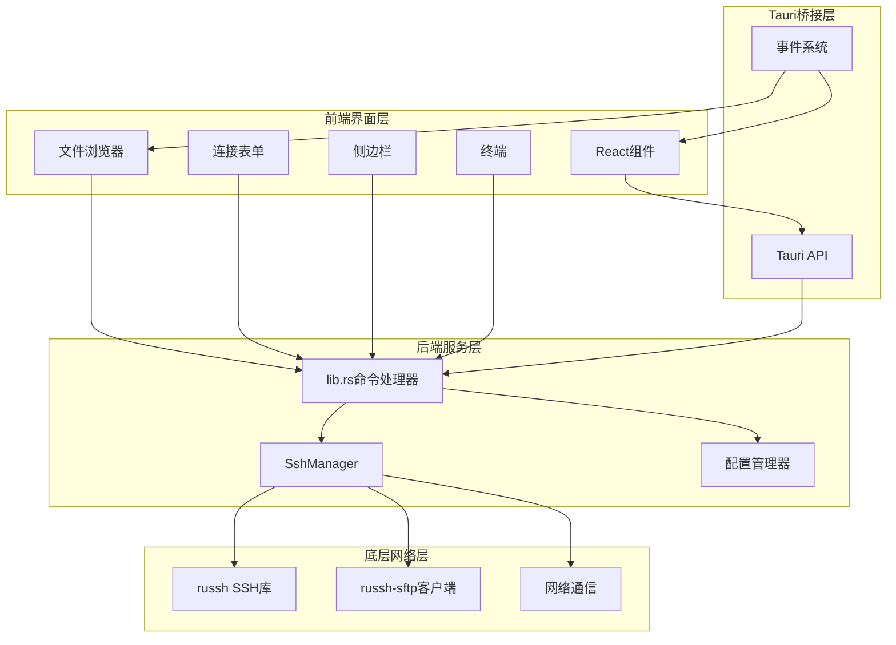

**图表来源**
- [lib.rs:268-318](file://src-tauri/src/lib.rs#L268-L318)
- [ssh.rs:58-653](file://src-tauri/src/ssh.rs#L58-L653)

**章节来源**
- [lib.rs:1-319](file://src-tauri/src/lib.rs#L1-L319)
- [ssh.rs:1-654](file://src-tauri/src/ssh.rs#L1-L654)

## 核心组件

### 应用主组件 (App.tsx)

应用主组件负责协调各个子组件的工作，管理全局状态和事件处理。

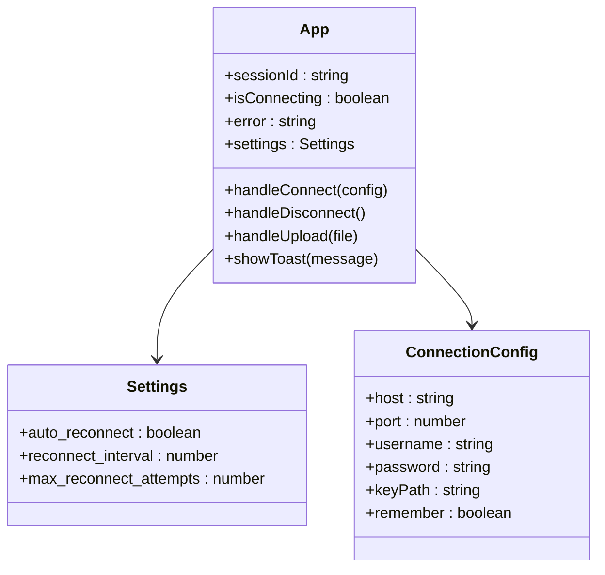

**图表来源**
- [App.tsx:11-35](file://src/App.tsx#L11-L35)
- [App.tsx:51-53](file://src/App.tsx#L51-L53)

### SFTP管理器 (SshManager)

SshManager是系统的核心组件，负责所有SSH和SFTP操作。

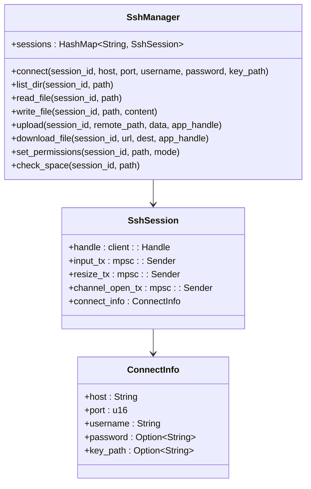

**图表来源**
- [ssh.rs:58-653](file://src-tauri/src/ssh.rs#L58-L653)
- [ssh.rs:50-56](file://src-tauri/src/ssh.rs#L50-L56)

**章节来源**
- [App.tsx:37-415](file://src/App.tsx#L37-L415)
- [ssh.rs:63-653](file://src-tauri/src/ssh.rs#L63-L653)

## SFTP协议实现

### SFTP会话建立

系统使用russh-sftp客户端库实现SFTP协议支持，提供完整的文件系统操作能力。

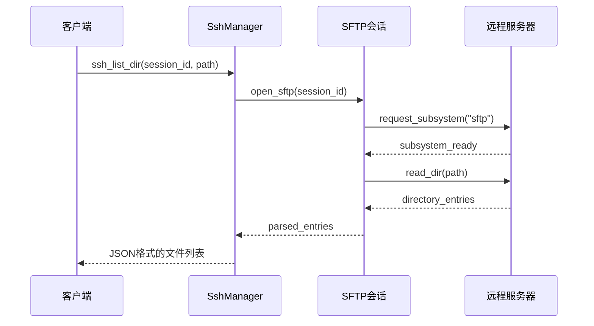

**图表来源**
- [ssh.rs:272-307](file://src-tauri/src/ssh.rs#L272-L307)

### 文件传输机制

系统实现了高效的文件传输机制，支持大文件的分块传输和进度跟踪。

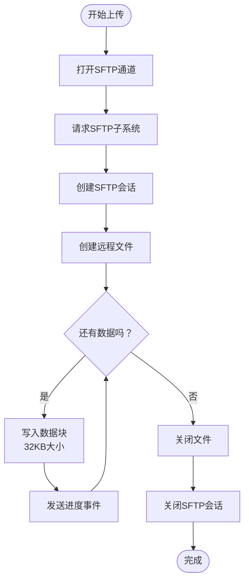

**图表来源**
- [ssh.rs:520-583](file://src-tauri/src/ssh.rs#L520-L583)

**章节来源**
- [ssh.rs:272-583](file://src-tauri/src/ssh.rs#L272-L583)

## 文件浏览器功能

### 文件列表获取

文件浏览器通过SFTP协议获取远程目录内容，并进行排序和格式化。

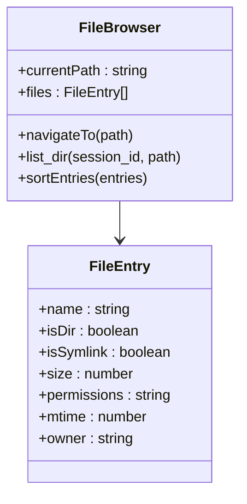

**图表来源**
- [FileBrowser.tsx:15-23](file://src/components/FileBrowser.tsx#L15-L23)
- [FileBrowser.tsx:204-227](file://src/components/FileBrowser.tsx#L204-L227)

### 目录导航

系统支持多种导航方式，包括面包屑导航、路径输入框和上下级目录切换。

**章节来源**
- [FileBrowser.tsx:154-800](file://src/components/FileBrowser.tsx#L154-L800)

## 文件操作功能

### 文件上传

系统支持单个文件和拖拽上传两种方式，具有进度跟踪和错误处理机制。

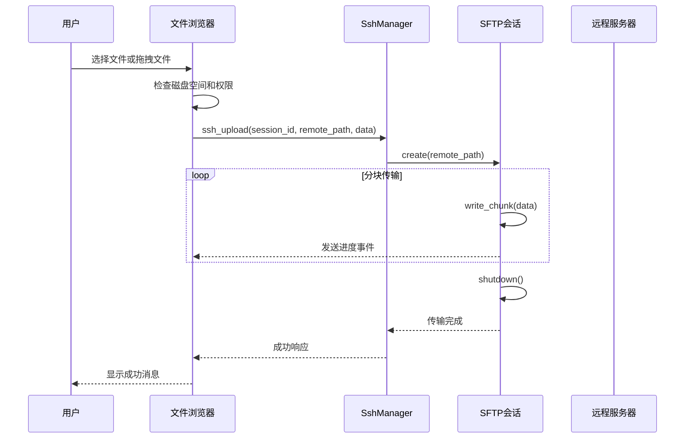

**图表来源**
- [FileBrowser.tsx:298-337](file://src/components/FileBrowser.tsx#L298-L337)
- [ssh.rs:520-583](file://src-tauri/src/ssh.rs#L520-L583)

### 文件下载

系统支持从URL下载文件到远程服务器，具有进度条和错误恢复功能。

**章节来源**
- [FileBrowser.tsx:567-693](file://src/components/FileBrowser.tsx#L567-L693)
- [ssh.rs:449-518](file://src-tauri/src/ssh.rs#L449-L518)

### 文件删除和重命名

系统提供安全的文件删除确认机制和智能重命名功能。

**章节来源**
- [FileBrowser.tsx:552-656](file://src/components/FileBrowser.tsx#L552-L656)

## 文本编辑器集成

### 编辑器状态管理

系统为文本文件提供了完整的编辑器功能，支持语法高亮和自动保存。

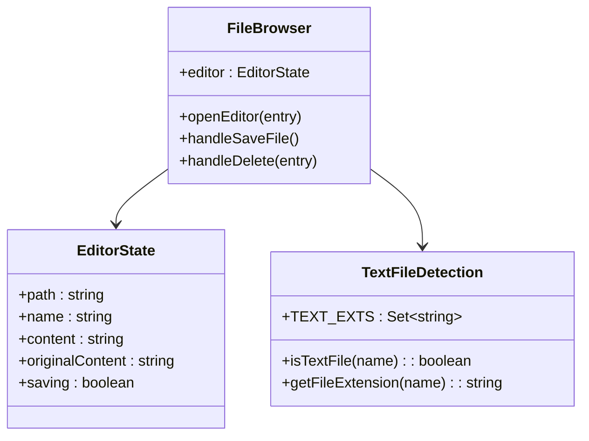

**图表来源**
- [FileBrowser.tsx:36-42](file://src/components/FileBrowser.tsx#L36-L42)
- [FileBrowser.tsx:87-100](file://src/components/FileBrowser.tsx#L87-L100)
- [FileBrowser.tsx:521-550](file://src/components/FileBrowser.tsx#L521-L550)

### 大文件处理

对于超过1MB的大文件，系统会限制读取大小以避免内存问题。

**章节来源**
- [FileBrowser.tsx:521-536](file://src/components/FileBrowser.tsx#L521-L536)
- [ssh.rs:309-323](file://src-tauri/src/ssh.rs#L309-L323)

## 二进制文件处理

### 图片文件预览

系统支持图片文件的本地预览功能，通过临时文件实现。

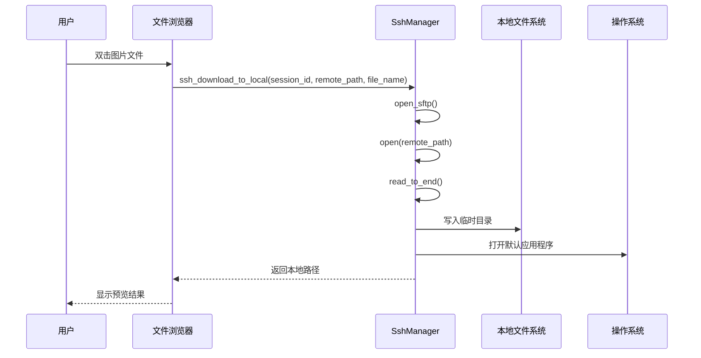

**图表来源**
- [FileBrowser.tsx:504-519](file://src/components/FileBrowser.tsx#L504-L519)
- [ssh.rs:585-615](file://src-tauri/src/ssh.rs#L585-L615)

### 文件类型检测

系统维护了一个扩展名列表来识别文本文件和二进制文件。

**章节来源**
- [FileBrowser.tsx:87-108](file://src/components/FileBrowser.tsx#L87-L108)

## 文件权限管理

### 权限设置机制

系统通过执行chmod命令来修改文件权限，并提供权限对话框界面。

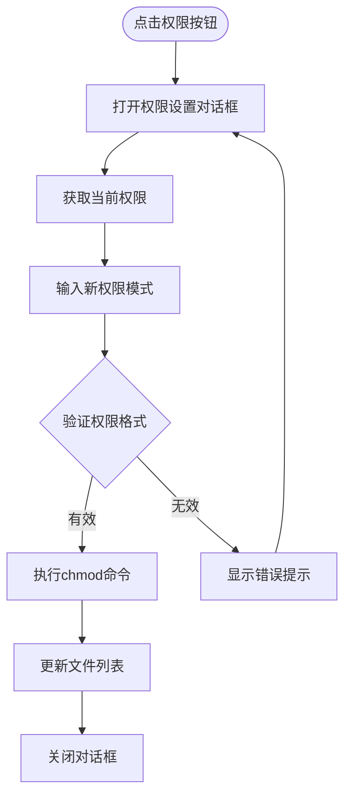

**图表来源**
- [FileBrowser.tsx:695-710](file://src/components/FileBrowser.tsx#L695-L710)
- [ssh.rs:385-417](file://src-tauri/src/ssh.rs#L385-L417)

**章节来源**
- [FileBrowser.tsx:695-710](file://src/components/FileBrowser.tsx#L695-L710)
- [ssh.rs:385-417](file://src-tauri/src/ssh.rs#L385-L417)

## 文件属性显示

### 属性信息展示

系统提供详细的文件属性信息，包括文件大小、修改时间、所有者和权限。

**章节来源**
- [FileBrowser.tsx:658-661](file://src/components/FileBrowser.tsx#L658-L661)

## 批量操作功能

### 剪贴板机制

系统实现了基于剪贴板的文件操作，支持复制和移动操作。

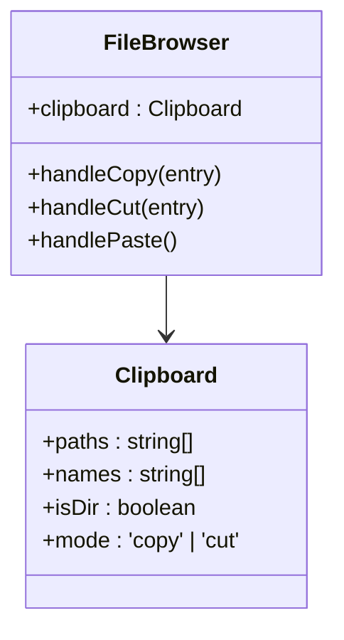

**图表来源**
- [FileBrowser.tsx:44-49](file://src/components/FileBrowser.tsx#L44-L49)
- [FileBrowser.tsx:595-641](file://src/components/FileBrowser.tsx#L595-L641)

### 拖拽操作

系统支持原生拖拽操作，提供视觉反馈和目标高亮。

**章节来源**
- [FileBrowser.tsx:386-487](file://src/components/FileBrowser.tsx#L386-L487)

## 文件系统缓存策略

### 本地缓存机制

系统采用多层缓存策略来提高性能：

1. **会话缓存**：保持SSH会话连接
2. **目录缓存**：缓存最近访问的目录内容
3. **权限缓存**：缓存文件权限信息
4. **配置缓存**：缓存连接配置和设置

### 缓存失效策略

- **超时失效**：长时间未使用的会话自动断开
- **手动刷新**：用户按F5强制刷新目录内容
- **错误恢复**：遇到错误时自动重新建立连接

**章节来源**
- [ssh.rs:63-69](file://src-tauri/src/ssh.rs#L63-L69)

## 进度跟踪机制

### 上传进度跟踪

系统通过事件驱动的方式实现精确的进度跟踪。

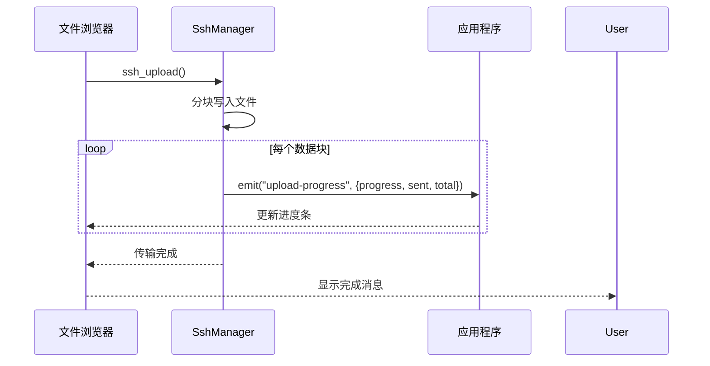

**图表来源**
- [ssh.rs:566-574](file://src-tauri/src/ssh.rs#L566-L574)
- [FileBrowser.tsx:287-295](file://src/components/FileBrowser.tsx#L287-L295)

### 下载进度跟踪

系统支持从URL下载文件的进度跟踪，使用curl的进度输出解析。

**章节来源**
- [ssh.rs:449-518](file://src-tauri/src/ssh.rs#L449-L518)
- [FileBrowser.tsx:268-284](file://src/components/FileBrowser.tsx#L268-L284)

## 错误恢复机制

### 自动重连机制

系统实现了智能的自动重连功能，确保连接稳定性。

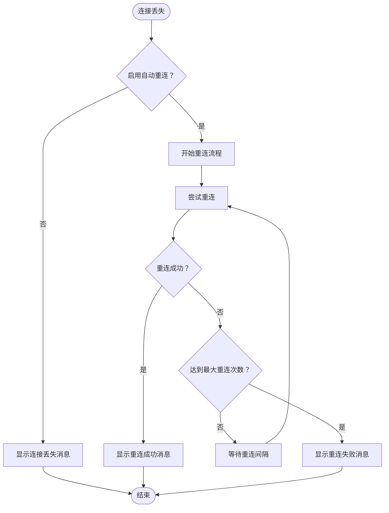

**图表来源**
- [App.tsx:124-164](file://src/App.tsx#L124-L164)
- [ssh.rs:633-652](file://src-tauri/src/ssh.rs#L633-L652)

### 错误处理策略

- **连接错误**：自动重连和用户通知
- **文件操作错误**：提供具体的错误信息和解决方案
- **网络中断**：优雅降级和状态恢复
- **权限不足**：提供权限设置指导

**章节来源**
- [App.tsx:124-164](file://src/App.tsx#L124-L164)
- [ssh.rs:617-627](file://src-tauri/src/ssh.rs#L617-L627)

## 性能优化

### 并发控制

系统使用Tokio异步运行时和MPSC通道实现高效的并发处理。

### 内存管理

- **流式读取**：大文件采用流式读取避免内存溢出
- **分块传输**：上传下载使用固定大小的数据块
- **及时释放**：及时关闭SFTP会话和文件句柄

### 网络优化

- **Keep-alive**：定期发送keep-alive包维持连接
- **超时控制**：合理的超时设置避免资源占用
- **连接池**：复用SSH会话减少连接开销

**章节来源**
- [ssh.rs:82-87](file://src-tauri/src/ssh.rs#L82-L87)
- [ssh.rs:539-547](file://src-tauri/src/ssh.rs#L539-L547)

## 故障排除指南

### 常见问题及解决方案

| 问题类型 | 症状 | 解决方案 |
|---------|------|----------|
| 连接失败 | 提示"连接失败" | 检查主机地址、端口和认证信息 |
| 认证失败 | 提示"认证失败" | 验证密码或密钥文件路径 |
| 权限不足 | 文件操作被拒绝 | 使用sudo或修改文件权限 |
| 传输中断 | 上传/下载失败 | 检查网络连接和磁盘空间 |

### 调试方法

1. **启用日志**：在开发模式下查看详细日志信息
2. **检查事件**：监听SSH事件了解连接状态
3. **验证配置**：确认Tauri配置和依赖版本

**章节来源**
- [App.tsx:175-178](file://src/App.tsx#L175-L178)

## 总结

SSH工具文件管理系统是一个功能完整、性能优异的跨平台桌面应用程序。它通过以下关键技术实现了稳定的远程文件管理：

- **可靠的SFTP协议实现**：基于russh和russh-sftp库，提供完整的文件系统操作
- **智能的连接管理**：支持自动重连、超时控制和错误恢复
- **丰富的用户界面**：直观的文件浏览器、终端集成和配置管理
- **高效的数据传输**：分块传输、进度跟踪和内存优化
- **完善的错误处理**：多层次的错误捕获和用户友好的错误提示

该系统适用于需要频繁管理远程服务器文件的开发者和技术人员，提供了比传统SSH客户端更便捷的图形化操作体验。