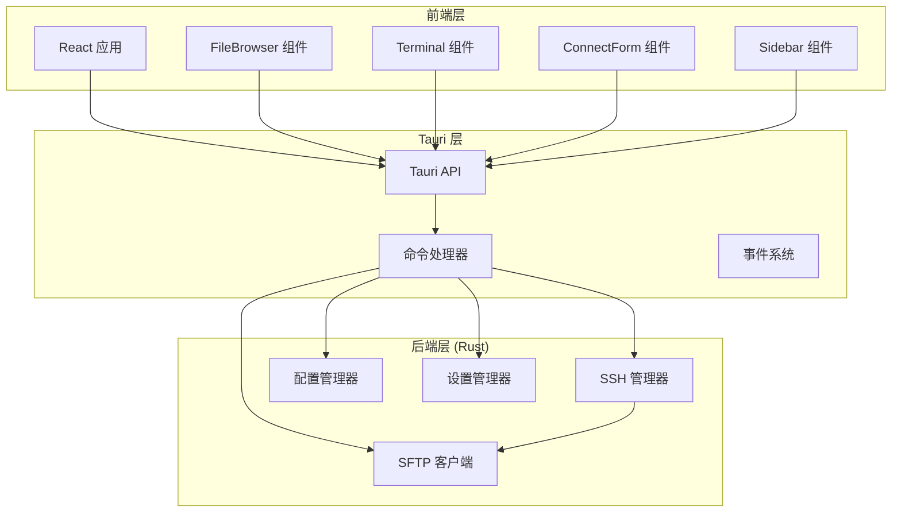
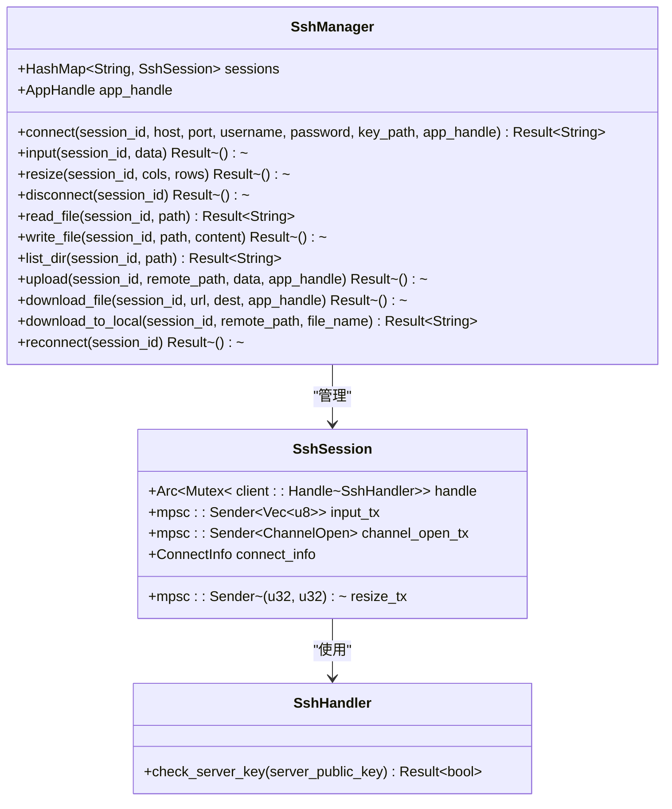
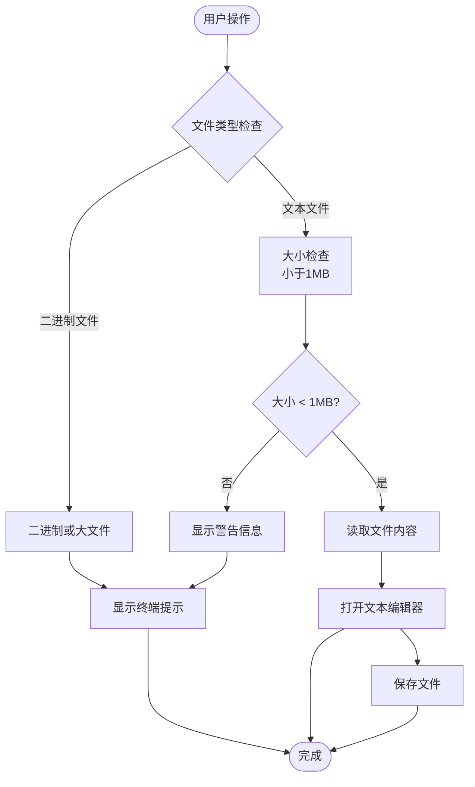
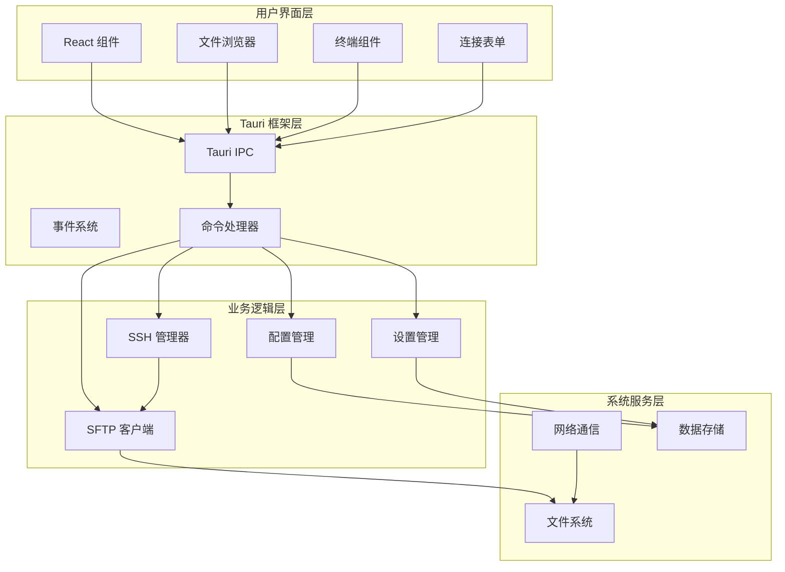
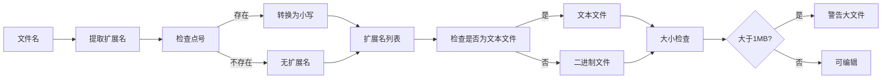
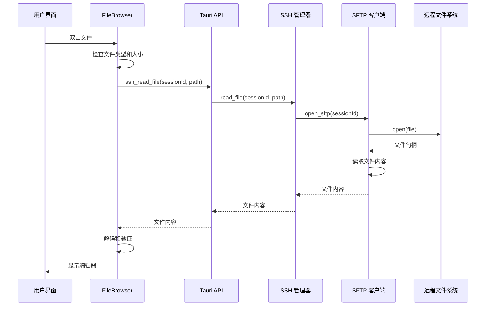
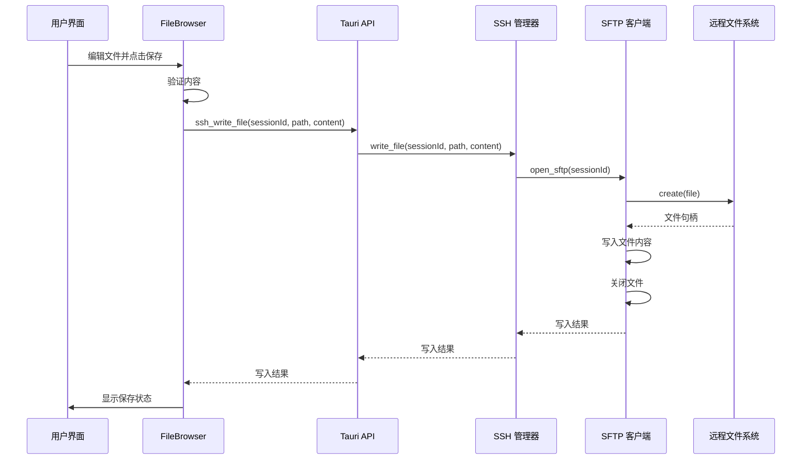
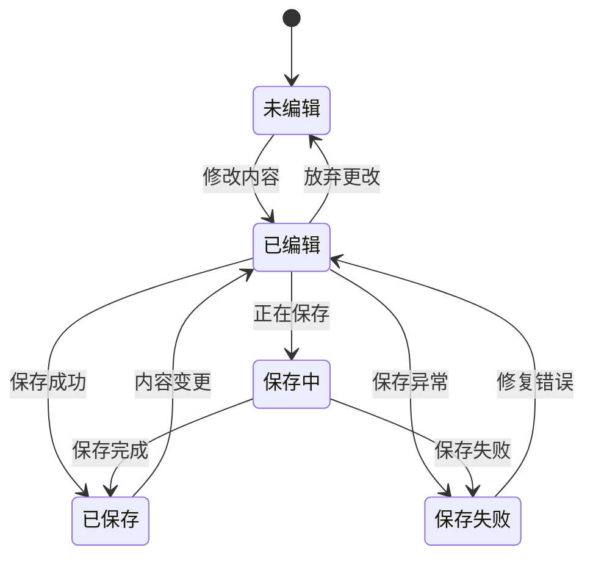
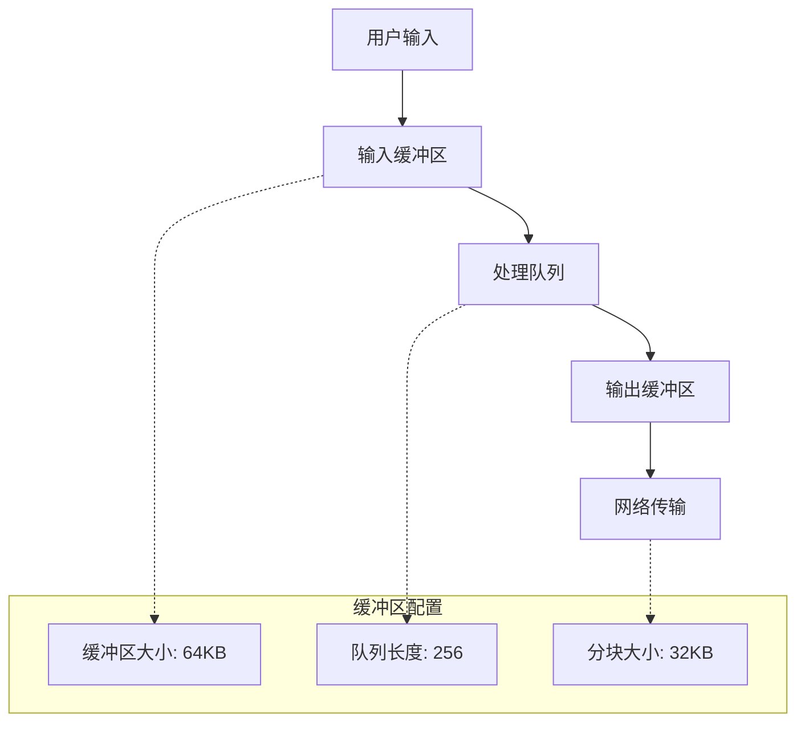
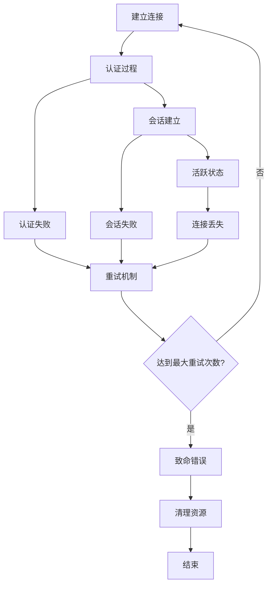

# 文本编辑器集成

<cite>
**本文档引用的文件**
- [App.tsx](file://src/App.tsx)
- [main.tsx](file://src/main.tsx)
- [lib.rs](file://src-tauri/src/lib.rs)
- [main.rs](file://src-tauri/src/main.rs)
- [ssh.rs](file://src-tauri/src/ssh.rs)
- [config.rs](file://src-tauri/src/config.rs)
- [FileBrowser.tsx](file://src/components/FileBrowser.tsx)
- [Terminal.tsx](file://src/components/Terminal.tsx)
- [App.css](file://src/App.css)
- [package.json](file://package.json)
- [Cargo.toml](file://src-tauri/Cargo.toml)
- [README.md](file://README.md)
</cite>

## 目录
1. [简介](#简介)
2. [项目结构](#项目结构)
3. [核心组件](#核心组件)
4. [架构概览](#架构概览)
5. [详细组件分析](#详细组件分析)
6. [依赖关系分析](#依赖关系分析)
7. [性能考虑](#性能考虑)
8. [故障排除指南](#故障排除指南)
9. [结论](#结论)

## 简介

SSH Tool 是一个基于 Tauri 框架构建的跨平台 SSH 管理工具，集成了文本编辑器功能，允许用户通过 SSH 连接远程服务器并在本地进行文件编辑。该工具提供了完整的文件浏览器、终端交互和文本编辑功能，支持多种文件类型的检测和处理。

## 项目结构

该项目采用前后端分离的架构设计，前端使用 React + TypeScript 构建用户界面，后端使用 Rust + Tauri 提供系统级功能和 SSH 连接管理。



**图表来源**
- [main.tsx:1-11](file://src/main.tsx#L1-L11)
- [lib.rs:268-318](file://src-tauri/src/lib.rs#L268-L318)
- [ssh.rs:58-653](file://src-tauri/src/ssh.rs#L58-L653)

**章节来源**
- [README.md:49-74](file://README.md#L49-L74)
- [package.json:1-28](file://package.json#L1-L28)
- [Cargo.toml:1-33](file://src-tauri/Cargo.toml#L1-L33)

## 核心组件

### SSH 管理器 (SshManager)

SSH 管理器是整个系统的核心组件，负责管理 SSH 连接、处理文件操作和提供事件通知。



**图表来源**
- [ssh.rs:58-653](file://src-tauri/src/ssh.rs#L58-L653)

### 文件浏览器组件

文件浏览器组件提供了完整的文件管理功能，包括文件列表显示、拖拽操作、上下文菜单和编辑功能。



**图表来源**
- [FileBrowser.tsx:543-572](file://src/components/FileBrowser.tsx#L543-L572)

**章节来源**
- [FileBrowser.tsx:154-800](file://src/components/FileBrowser.tsx#L154-L800)
- [ssh.rs:309-336](file://src-tauri/src/ssh.rs#L309-L336)

## 架构概览

系统采用分层架构设计，实现了清晰的职责分离和良好的可扩展性。



**图表来源**
- [lib.rs:291-315](file://src-tauri/src/lib.rs#L291-L315)
- [ssh.rs:272-286](file://src-tauri/src/ssh.rs#L272-L286)

## 详细组件分析

### 文件检测机制

系统实现了多层文件检测机制，确保正确识别和处理不同类型的文件。

#### 文件扩展名识别



**图表来源**
- [FileBrowser.tsx:82-108](file://src/components/FileBrowser.tsx#L82-L108)

系统支持的文本文件扩展名包括：
- 编程语言：JavaScript、TypeScript、Python、Java、C/C++、Go、Rust 等
- 标记语言：HTML、CSS、XML、Markdown 等
- 配置文件：JSON、YAML、INI、Dockerfile 等
- Shell 脚本：Bash、Zsh、PowerShell 等

**章节来源**
- [FileBrowser.tsx:87-100](file://src/components/FileBrowser.tsx#L87-L100)

#### MIME 类型判断

虽然当前实现主要依赖扩展名判断，但系统具备扩展 MIME 类型检测的能力。建议在未来版本中集成更精确的 MIME 类型检测机制。

#### 大文件处理策略

系统对大文件实施了严格的限制策略：

1. **大小阈值**：超过 1MB 的文件被标记为大文件
2. **自动拒绝**：大文件不会自动打开编辑器
3. **用户提示**：显示警告信息建议使用终端工具
4. **安全考虑**：防止内存溢出和性能问题

**章节来源**
- [FileBrowser.tsx:544-548](file://src/components/FileBrowser.tsx#L544-L548)
- [ssh.rs:318-322](file://src-tauri/src/ssh.rs#L318-L322)

### 文件读取和写入流程

#### 读取流程



**图表来源**
- [FileBrowser.tsx:550-558](file://src/components/FileBrowser.tsx#L550-L558)
- [ssh.rs:309-323](file://src-tauri/src/ssh.rs#L309-L323)

#### 写入流程



**图表来源**
- [FileBrowser.tsx:560-572](file://src/components/FileBrowser.tsx#L560-L572)
- [ssh.rs:325-336](file://src-tauri/src/ssh.rs#L325-L336)

**章节来源**
- [FileBrowser.tsx:550-572](file://src/components/FileBrowser.tsx#L550-L572)
- [ssh.rs:309-336](file://src-tauri/src/ssh.rs#L309-L336)

### 编辑器状态管理

系统实现了完整的编辑器状态管理机制，包括内容变更跟踪、撤销重做功能和保存状态指示。

#### 状态跟踪机制



**图表来源**
- [FileBrowser.tsx:36-42](file://src/components/FileBrowser.tsx#L36-L42)

#### 编辑器状态属性

- **path**: 当前编辑文件的完整路径
- **name**: 文件名称
- **content**: 当前编辑内容
- **originalContent**: 原始内容（用于比较）
- **saving**: 保存状态标志

**章节来源**
- [FileBrowser.tsx:36-42](file://src/components/FileBrowser.tsx#L36-L42)

### 文件类型支持

#### 语法高亮

系统当前实现支持基本的文本文件编辑功能。对于需要语法高亮的场景，建议集成专业的编辑器组件如 Monaco Editor 或 CodeMirror。

#### 智能提示

系统目前不提供智能提示功能。可以通过以下方式扩展：
- 集成语言服务器协议 (LSP)
- 实现基于文件类型的代码补全
- 添加文件关联规则

#### 格式化功能

系统当前不包含代码格式化功能。可以考虑：
- 集成 Prettier 或类似工具
- 实现基本的缩进和格式化规则
- 支持多种编程语言的格式化

### 性能优化

#### 内存管理

系统采用了多项内存优化策略：

1. **流式读取**：大文件采用流式读取避免一次性加载到内存
2. **分块上传**：文件上传采用分块传输减少内存占用
3. **连接池**：SSH 连接复用避免频繁建立新连接
4. **异步处理**：所有 I/O 操作采用异步模式

#### 编码处理

系统实现了统一的编码处理机制：

- **UTF-8 编码**：默认使用 UTF-8 编码处理文本文件
- **二进制保护**：二进制文件采用 Base64 编码传输
- **字符集检测**：支持多种字符集的自动检测

#### 缓冲区管理



**图表来源**
- [ssh.rs:121-123](file://src-tauri/src/ssh.rs#L121-L123)
- [ssh.rs:550-551](file://src-tauri/src/ssh.rs#L550-L551)

**章节来源**
- [ssh.rs:121-123](file://src-tauri/src/ssh.rs#L121-L123)
- [ssh.rs:550-551](file://src-tauri/src/ssh.rs#L550-L551)

### 错误处理

系统实现了多层次的错误处理机制：

#### 连接错误处理



**图表来源**
- [App.tsx:138-157](file://src/App.tsx#L138-L157)

#### 文件操作错误处理

系统对文件操作提供了详细的错误反馈：

- **读取失败**：显示具体的错误信息和可能的原因
- **写入失败**：提供重试选项和错误详情
- **权限错误**：提示用户检查文件权限
- **空间不足**：显示磁盘空间相关信息

**章节来源**
- [App.tsx:138-157](file://src/App.tsx#L138-L157)
- [FileBrowser.tsx:554-557](file://src/components/FileBrowser.tsx#L554-L557)

## 依赖关系分析

系统依赖关系清晰明确，各组件职责分工明确。

```mermaid
graph TB
subgraph "前端依赖"
React[React 19.2.7]
TS[TypeScript 6.0.2]
XTerm[xterm.js 6.0.0]
TauriAPI[@tauri-apps/api 2.11.0]
end
subgraph "后端依赖"
Tauri[Tauri 2.11.2]
Russh[russh 0.45]
Tokio[tokio 1.0]
Serde[serde 1.0]
end
subgraph "系统依赖"
SSH[SSH 协议]
SFTP[SFTP 协议]
Base64[Base64 编解码]
UUID[UUID 生成]
end
React --> TauriAPI
XTerm --> TauriAPI
TauriAPI --> Tauri
Tauri --> Russh
Russh --> SSH
Russh --> SFTP
Tauri --> Tokio
Tauri --> Serde
Serde --> Base64
Serde --> UUID
```

**图表来源**
- [package.json:15-26](file://package.json#L15-L26)
- [Cargo.toml:18-33](file://src-tauri/Cargo.toml#L18-L33)

**章节来源**
- [package.json:15-26](file://package.json#L15-L26)
- [Cargo.toml:18-33](file://src-tauri/Cargo.toml#L18-L33)

## 性能考虑

### 内存使用优化

系统在内存使用方面采取了多项优化措施：

1. **流式处理**：所有文件操作都采用流式处理模式
2. **分块传输**：大文件上传采用 32KB 分块传输
3. **连接复用**：SSH 连接在多个操作间复用
4. **异步 I/O**：避免阻塞主线程

### 网络性能

- **Keep-Alive**：启用 SSH keep-alive 机制防止连接超时
- **超时控制**：合理的超时设置避免资源泄露
- **并发控制**：限制并发 SFTP 操作数量

### 用户体验优化

- **进度反馈**：文件操作提供实时进度显示
- **状态指示**：清晰的状态变化提示
- **错误恢复**：自动重连和错误恢复机制

## 故障排除指南

### 常见问题及解决方案

#### 连接问题

**问题**：无法建立 SSH 连接
**原因**：
- 网络连接不稳定
- 认证凭据错误
- 服务器配置问题

**解决方案**：
1. 检查网络连接状态
2. 验证用户名和密码/密钥
3. 确认服务器 SSH 服务正常运行

#### 文件操作问题

**问题**：文件读取或写入失败
**原因**：
- 权限不足
- 磁盘空间不足
- 文件被其他进程占用

**解决方案**：
1. 检查文件权限设置
2. 清理磁盘空间
3. 关闭占用文件的进程

#### 性能问题

**问题**：大文件处理缓慢
**原因**：
- 网络带宽限制
- 服务器性能瓶颈
- 客户端内存不足

**解决方案**：
1. 优化网络连接
2. 考虑使用专用传输工具
3. 增加客户端内存

**章节来源**
- [ssh.rs:82-106](file://src-tauri/src/ssh.rs#L82-L106)
- [ssh.rs:419-446](file://src-tauri/src/ssh.rs#L419-L446)

## 结论

SSH Tool 的文本编辑器集成功现了现代化的文件管理功能，通过合理的架构设计和性能优化，为用户提供了稳定可靠的远程文件编辑体验。系统的主要优势包括：

1. **架构清晰**：前后端分离，职责明确
2. **性能优秀**：流式处理和异步 I/O 优化
3. **用户体验好**：直观的界面和及时的反馈
4. **安全性强**：完善的错误处理和安全机制

未来可以进一步增强的功能包括：
- 集成专业编辑器组件提供语法高亮
- 实现智能提示和代码补全
- 添加撤销重做功能
- 支持更多文件格式的直接预览