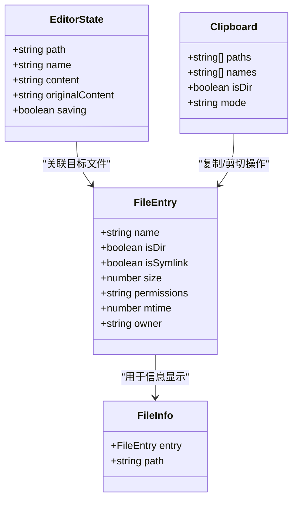
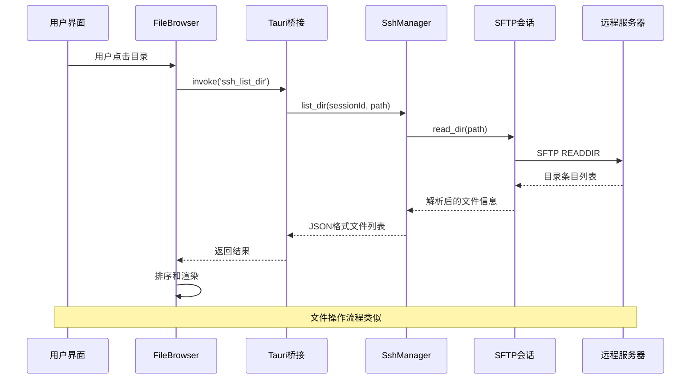
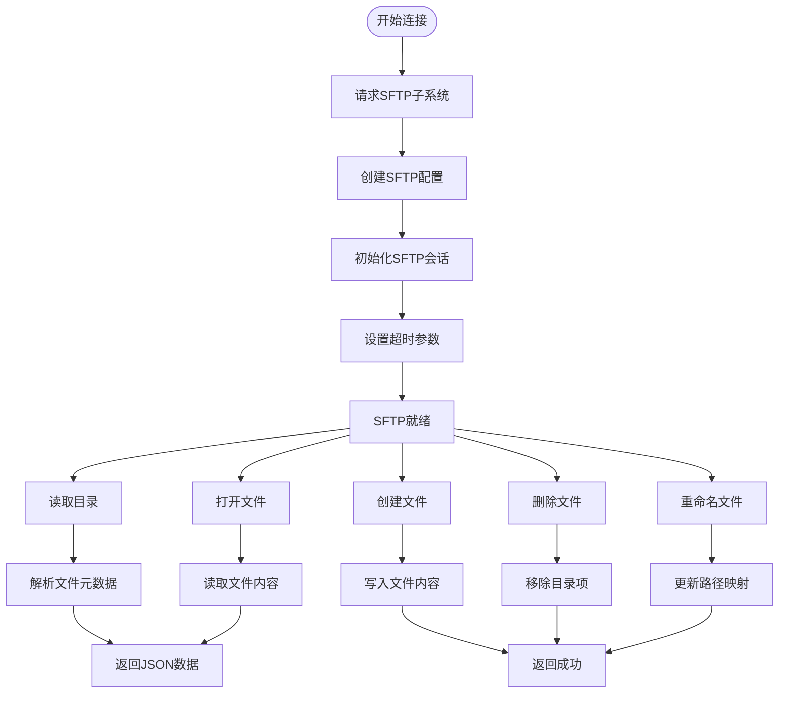
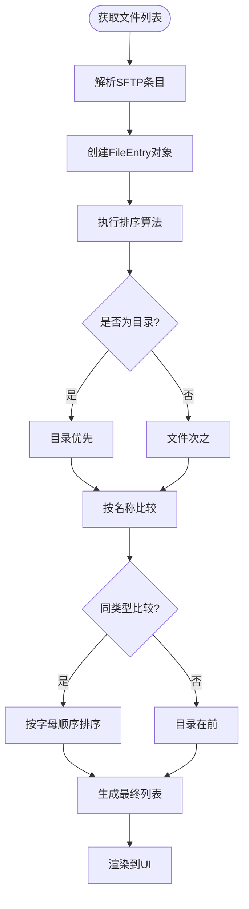
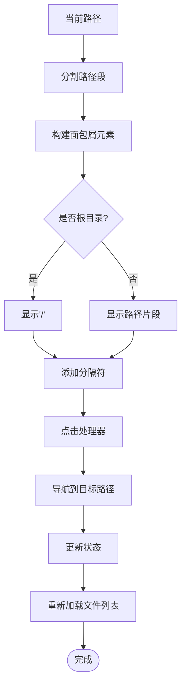
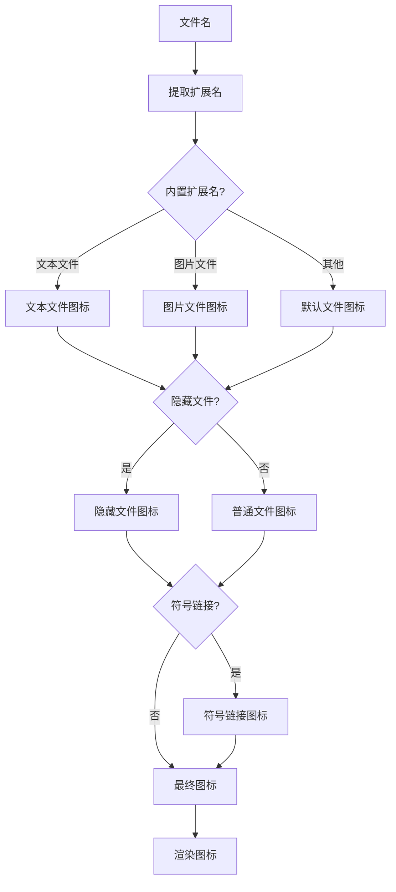
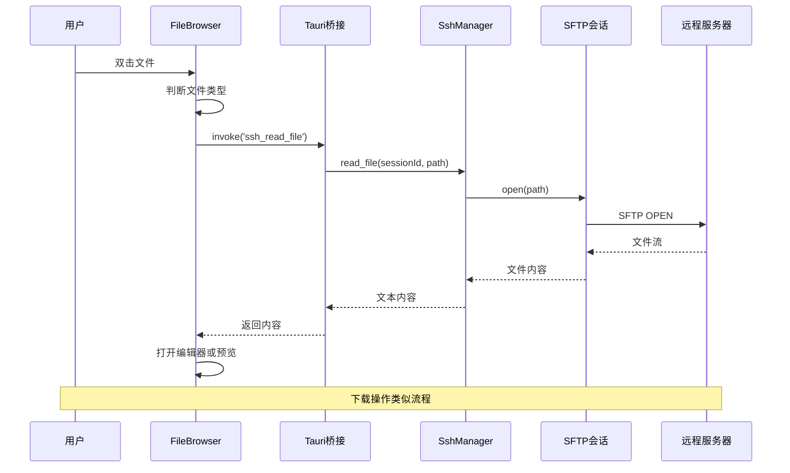
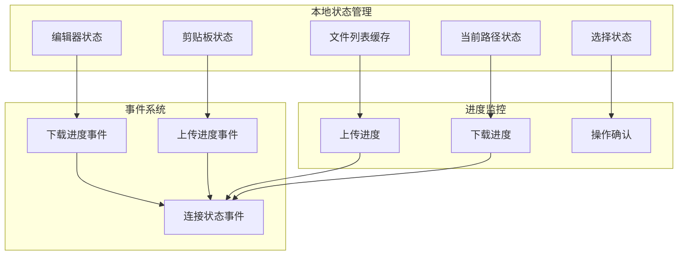
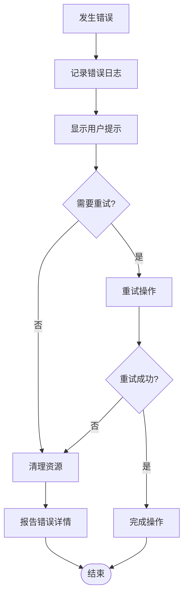

# 远程文件浏览

<cite>
**本文档引用的文件**
- [FileBrowser.tsx](file://src/components/FileBrowser.tsx)
- [ssh.rs](file://src-tauri/src/ssh.rs)
- [lib.rs](file://src-tauri/src/lib.rs)
- [App.tsx](file://src/App.tsx)
- [README.md](file://README.md)
- [Cargo.toml](file://src-tauri/Cargo.toml)
- [package.json](file://package.json)
- [App.css](file://src/App.css)
- [Sidebar.tsx](file://src/components/Sidebar.tsx)
- [Terminal.tsx](file://src/components/Terminal.tsx)
</cite>

## 目录
1. [简介](#简介)
2. [项目结构](#项目结构)
3. [核心组件](#核心组件)
4. [架构概览](#架构概览)
5. [详细组件分析](#详细组件分析)
6. [依赖关系分析](#依赖关系分析)
7. [性能考虑](#性能考虑)
8. [故障排除指南](#故障排除指南)
9. [结论](#结论)

## 简介

SSH工具是一个基于Tauri框架构建的跨平台桌面应用程序，提供SSH连接管理和远程文件浏览功能。该工具使用Rust实现高性能的SSH客户端，通过SFTP协议进行文件传输，并提供直观的图形界面用于远程文件管理。

本项目的核心功能包括：
- SSH连接管理（密码认证和密钥认证）
- SFTP协议支持的远程文件浏览
- 文件列表获取、排序和显示
- 目录导航和面包屑导航
- 文件图标系统和类型识别
- 文件操作（上传、下载、编辑、删除）
- 进度监控和错误处理

## 项目结构

该项目采用前后端分离的架构设计，前端使用React 18 + TypeScript构建用户界面，后端使用Rust + russh实现SSH连接管理。

```mermaid
graph TB
subgraph "前端层 (React)"
A[App.tsx] --> B[FileBrowser.tsx]
A --> C[Terminal.tsx]
A --> D[Sidebar.tsx]
B --> E[文件列表组件]
B --> F[上下文菜单]
B --> G[拖拽操作]
C --> H[xterm.js终端]
D --> I[连接管理]
end
subgraph "后端层 (Rust)"
J[lib.rs] --> K[ssh.rs]
K --> L[russh SSH客户端]
K --> M[russh_sftp SFTP]
K --> N[tokio异步运行时]
end
subgraph "通信层"
O[Tauri IPC]
P[事件系统]
end
A <- --> O
J <- --> P
K <- --> P
```

**图表来源**
- [App.tsx:1-415](file://src/App.tsx#L1-L415)
- [FileBrowser.tsx:1-1266](file://src/components/FileBrowser.tsx#L1-L1266)
- [ssh.rs:1-654](file://src-tauri/src/ssh.rs#L1-L654)

**章节来源**
- [README.md:49-74](file://README.md#L49-L74)
- [Cargo.toml:18-33](file://src-tauri/Cargo.toml#L18-L33)
- [package.json:15-28](file://package.json#L15-L28)

## 核心组件

### 文件浏览器组件 (FileBrowser)

文件浏览器是整个应用的核心组件，负责远程文件系统的可视化展示和交互操作。

**主要功能特性：**
- 文件列表显示和排序
- 目录导航和面包屑导航
- 文件图标系统和类型识别
- 上下文菜单和快捷操作
- 拖拽上传和本地下载
- 编辑器集成和文件预览

**文件条目数据模型：**



**图表来源**
- [FileBrowser.tsx:15-60](file://src/components/FileBrowser.tsx#L15-L60)

**章节来源**
- [FileBrowser.tsx:154-800](file://src/components/FileBrowser.tsx#L154-L800)

### SSH管理器 (SshManager)

SSH管理器负责建立和维护SSH连接，处理SFTP会话和各种文件操作请求。

**核心功能：**
- SSH连接建立和认证
- SFTP会话管理
- 文件系统操作（读写、删除、重命名）
- 进度监控和事件通知
- 自动重连机制

**章节来源**
- [ssh.rs:58-654](file://src-tauri/src/ssh.rs#L58-L654)

### 前端应用容器 (App)

主应用组件协调各个子组件的工作，处理全局状态管理和事件监听。

**主要职责：**
- 连接生命周期管理
- 设置和配置持久化
- 自动重连逻辑
- 窗口布局和分割

**章节来源**
- [App.tsx:37-415](file://src/App.tsx#L37-L415)

## 架构概览

系统采用分层架构设计，确保前后端分离和职责明确。



**图表来源**
- [lib.rs:104-112](file://src-tauri/src/lib.rs#L104-L112)
- [ssh.rs:288-307](file://src-tauri/src/ssh.rs#L288-L307)

## 详细组件分析

### SFTP协议实现

SFTP（SSH File Transfer Protocol）是SSH协议的一个子系统，专门用于安全的文件传输和管理。

**SFTP会话建立流程：**



**图表来源**
- [ssh.rs:272-286](file://src-tauri/src/ssh.rs#L272-L286)
- [ssh.rs:288-307](file://src-tauri/src/ssh.rs#L288-L307)

**章节来源**
- [ssh.rs:272-307](file://src-tauri/src/ssh.rs#L272-L307)

### 文件列表获取与排序

文件列表获取是文件浏览功能的核心，涉及SFTP目录读取和数据处理。

**排序算法实现：**



**图表来源**
- [FileBrowser.tsx:215-218](file://src/components/FileBrowser.tsx#L215-L218)

**章节来源**
- [FileBrowser.tsx:204-227](file://src/components/FileBrowser.tsx#L204-L227)

### 目录导航机制

目录导航系统提供了多种方式来浏览远程文件系统。

**面包屑导航实现：**



**图表来源**
- [FileBrowser.tsx:755-753](file://src/components/FileBrowser.tsx#L755-L753)

**章节来源**
- [FileBrowser.tsx:748-753](file://src/components/FileBrowser.tsx#L748-L753)

### 文件图标系统

文件图标系统通过文件扩展名和属性来识别文件类型并选择相应的图标。

**文件类型识别流程：**



**图表来源**
- [FileBrowser.tsx:82-108](file://src/components/FileBrowser.tsx#L82-L108)

**章节来源**
- [FileBrowser.tsx:110-133](file://src/components/FileBrowser.tsx#L110-L133)

### 文件操作实现

文件操作涵盖了远程文件系统的主要功能，包括基本的CRUD操作和高级功能。

**文件操作序列图：**



**图表来源**
- [lib.rs:115-123](file://src-tauri/src/lib.rs#L115-L123)
- [ssh.rs:309-323](file://src-tauri/src/ssh.rs#L309-L323)

**章节来源**
- [FileBrowser.tsx:521-536](file://src/components/FileBrowser.tsx#L521-L536)

### 缓存策略与状态管理

系统实现了多层次的状态管理和缓存策略来优化用户体验。

**状态管理架构：**



**图表来源**
- [FileBrowser.tsx:155-178](file://src/components/FileBrowser.tsx#L155-L178)

**章节来源**
- [FileBrowser.tsx:267-295](file://src/components/FileBrowser.tsx#L267-L295)

## 依赖关系分析

项目的技术栈和依赖关系体现了现代化的桌面应用开发模式。

```mermaid
graph TB
subgraph "前端依赖"
A[React 18]
B[TypeScript]
C[@xterm/xterm]
D[@tauri-apps/api]
E[React DOM]
end
subgraph "后端依赖"
F[russh 0.45]
G[russh-sftp 2]
H[tokio 1]
I[serde_json 1.0]
J[base64 0.22]
end
subgraph "构建工具"
K[Vite]
L[Tauri 2.x]
M[Cargo]
end
A --> C
A --> D
F --> G
H --> F
M --> L
K --> L
```

**图表来源**
- [Cargo.toml:18-33](file://src-tauri/Cargo.toml#L18-L33)
- [package.json:15-28](file://package.json#L15-L28)

**章节来源**
- [Cargo.toml:1-33](file://src-tauri/Cargo.toml#L1-L33)
- [package.json:1-28](file://package.json#L1-L28)

## 性能考虑

系统在多个层面进行了性能优化以确保流畅的用户体验。

### 异步处理和并发控制

- **Tokio异步运行时**：使用Tokio作为异步运行时，支持高并发的SSH连接
- **SFTP会话池**：每个连接维护独立的SFTP会话，避免阻塞
- **背压控制**：上传下载操作使用背压机制防止内存溢出

### 内存管理优化

- **流式读取**：大文件采用流式读取，避免一次性加载到内存
- **分块传输**：上传下载使用32KB分块，平衡速度和内存占用
- **及时释放**：操作完成后及时释放SFTP会话和文件句柄

### 网络优化

- **Keep-alive机制**：每10秒发送一次keep-alive探测
- **超时控制**：所有网络操作设置合理超时时间
- **自动重连**：断线检测和自动重连机制

## 故障排除指南

### 常见问题及解决方案

**连接失败**
- 检查SSH服务状态和防火墙设置
- 验证认证凭据（用户名、密码或私钥）
- 确认端口可达性和网络连通性

**文件列表为空**
- 检查用户权限和目录访问权限
- 验证SFTP子系统是否启用
- 确认路径是否存在且可访问

**上传下载失败**
- 检查磁盘空间和写权限
- 验证文件大小限制
- 监控网络连接稳定性

**章节来源**
- [ssh.rs:448-518](file://src-tauri/src/ssh.rs#L448-L518)
- [FileBrowser.tsx:243-265](file://src/components/FileBrowser.tsx#L243-L265)

### 错误处理机制

系统实现了多层次的错误处理机制：



**图表来源**
- [FileBrowser.tsx:186-191](file://src/components/FileBrowser.tsx#L186-L191)

**章节来源**
- [FileBrowser.tsx:552-565](file://src/components/FileBrowser.tsx#L552-L565)

## 结论

SSH工具远程文件浏览功能展现了现代桌面应用开发的最佳实践。通过Rust + Tauri的技术组合，系统在保证安全性的同时实现了高性能的文件管理体验。

**主要优势：**
- **安全性**：完整的SSH协议支持，包括密钥认证和加密传输
- **性能**：异步架构设计，支持高并发操作
- **用户体验**：直观的图形界面和丰富的交互功能
- **可靠性**：完善的错误处理和自动重连机制

**未来改进方向：**
- 支持更多文件类型预览
- 增强搜索和过滤功能
- 添加文件同步和备份功能
- 优化大文件传输性能

该系统为开发者提供了一个优秀的参考实现，展示了如何在桌面应用中集成复杂的网络协议和文件管理系统。