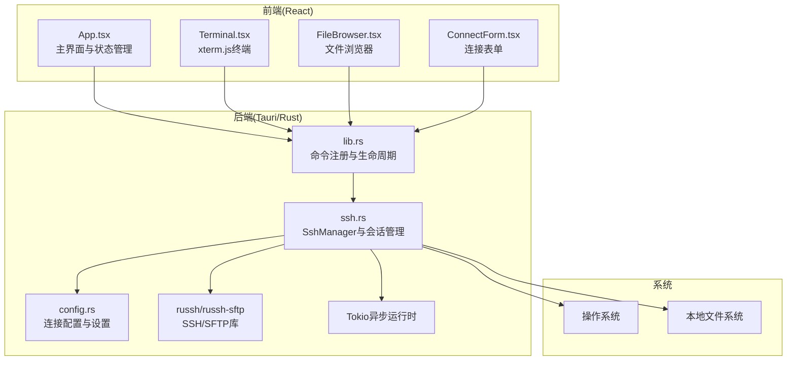
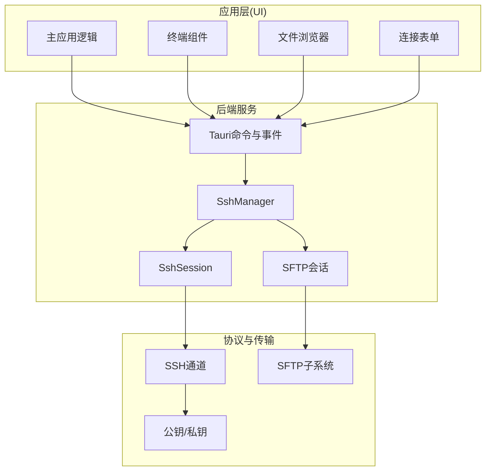
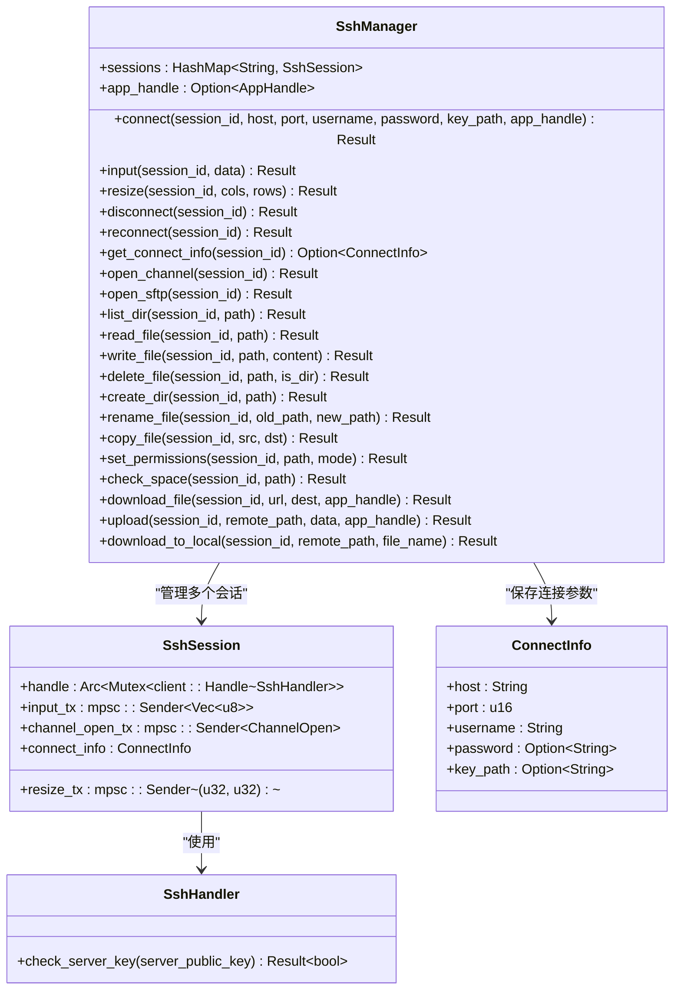
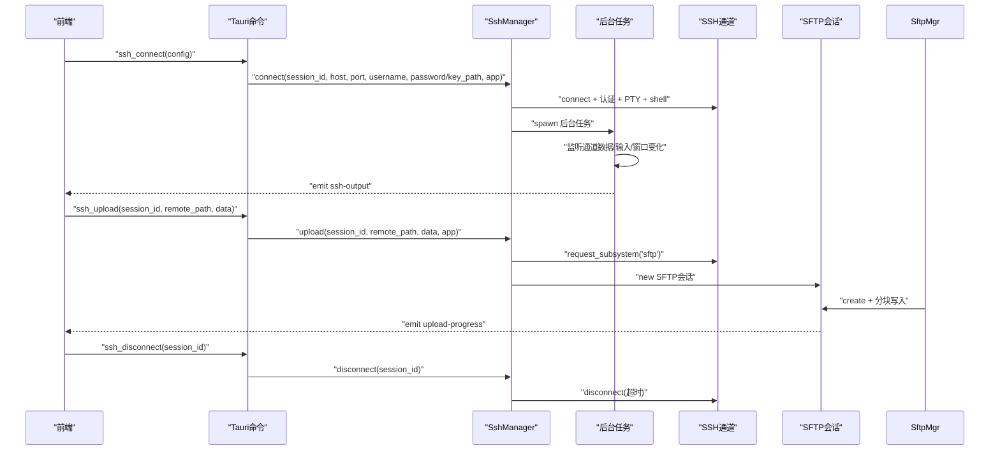
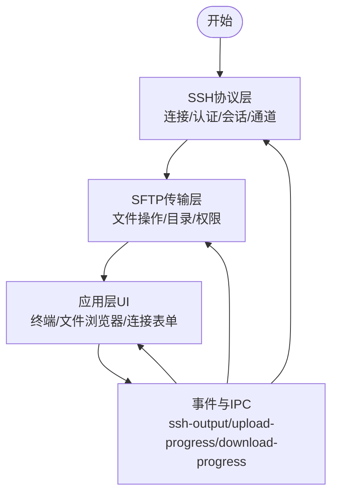
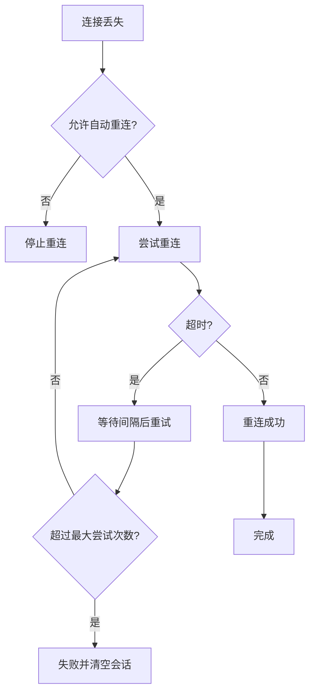
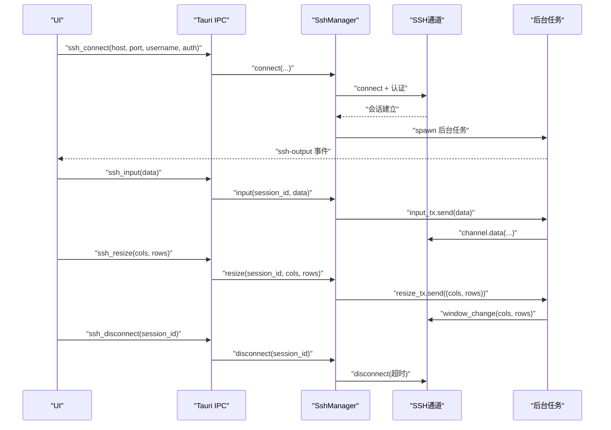
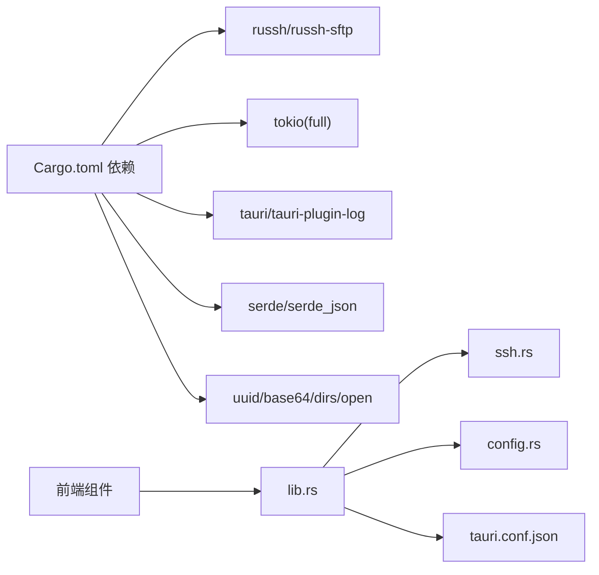

# SSH架构设计

<cite>
**本文档引用的文件**
- [src-tauri/src/main.rs](file://src-tauri/src/main.rs)
- [src-tauri/src/lib.rs](file://src-tauri/src/lib.rs)
- [src-tauri/src/ssh.rs](file://src-tauri/src/ssh.rs)
- [src-tauri/src/config.rs](file://src-tauri/src/config.rs)
- [src-tauri/Cargo.toml](file://src-tauri/Cargo.toml)
- [src-tauri/tauri.conf.json](file://src-tauri/tauri.conf.json)
- [src/App.tsx](file://src/App.tsx)
- [src/components/Terminal.tsx](file://src/components/Terminal.tsx)
- [src/components/FileBrowser.tsx](file://src/components/FileBrowser.tsx)
- [src/components/ConnectForm.tsx](file://src/components/ConnectForm.tsx)
- [README.md](file://README.md)
</cite>

## 目录
1. [简介](#简介)
2. [项目结构](#项目结构)
3. [核心组件](#核心组件)
4. [架构总览](#架构总览)
5. [详细组件分析](#详细组件分析)
6. [依赖关系分析](#依赖关系分析)
7. [性能考虑](#性能考虑)
8. [故障排除指南](#故障排除指南)
9. [结论](#结论)
10. [附录](#附录)

## 简介
本项目是一个基于Tauri + React的跨平台桌面SSH工具，采用纯Rust实现SSH连接与SFTP文件传输，结合Tokio异步运行时和russh库，提供终端交互、文件浏览、断线重连等能力。本文档聚焦于SSH连接管理架构设计，包括SshManager的设计模式、会话生命周期管理、并发控制机制、Russh库集成、Tokio异步运行时应用以及内存安全保证；并阐述SSH协议层、SFTP文件传输层与应用层的分层架构，给出完整的连接建立、维护与销毁流程图，提供具体代码实现示例与架构图表。

## 项目结构
项目采用前后端分离的桌面应用架构：
- 前端：React + TypeScript，负责UI交互、事件监听与用户操作
- 后端：Rust + Tauri，负责SSH连接管理、SFTP文件传输与系统事件
- 数据持久化：本地JSON文件存储连接配置与设置

**图表来源**
- [src-tauri/src/lib.rs:268-318](file://src-tauri/src/lib.rs#L268-L318)
- [src-tauri/src/ssh.rs:58-653](file://src-tauri/src/ssh.rs#L58-L653)
- [src-tauri/src/config.rs:1-113](file://src-tauri/src/config.rs#L1-L113)
- [src/App.tsx:1-415](file://src/App.tsx#L1-L415)
- [src/components/Terminal.tsx:1-150](file://src/components/Terminal.tsx#L1-L150)
- [src/components/FileBrowser.tsx:1-800](file://src/components/FileBrowser.tsx#L1-L800)

**章节来源**
- [README.md:39-74](file://README.md#L39-L74)
- [src-tauri/tauri.conf.json:1-41](file://src-tauri/tauri.conf.json#L1-L41)

## 核心组件
- SshManager：SSH会话的统一管理器，负责连接建立、输入转发、窗口大小调整、SFTP子系统请求、文件读写与下载上传、断开与重连等
- SshHandler：russh客户端Handler实现，用于密钥校验等回调
- SshSession：单个会话的封装，包含通道句柄、输入/尺寸变更/通道打开请求的发送端
- ConnectInfo：连接参数快照，用于重连
- ConfigManager/SettingsManager：连接配置与应用设置的持久化
- Tauri命令：前端通过Tauri IPC调用后端命令，后端通过事件向前端推送数据

**章节来源**
- [src-tauri/src/ssh.rs:23-653](file://src-tauri/src/ssh.rs#L23-L653)
- [src-tauri/src/config.rs:1-113](file://src-tauri/src/config.rs#L1-L113)
- [src-tauri/src/lib.rs:1-319](file://src-tauri/src/lib.rs#L1-L319)

## 架构总览
系统分为三层：
- 协议层（SSH）：使用russh库进行握手、认证、会话与通道管理
- 传输层（SFTP）：基于SSH通道的SFTP子系统，支持文件读写、目录遍历、权限设置等
- 应用层（UI）：React组件负责终端显示、文件浏览、连接表单与事件处理

**图表来源**
- [src-tauri/src/ssh.rs:58-653](file://src-tauri/src/ssh.rs#L58-L653)
- [src-tauri/src/lib.rs:21-318](file://src-tauri/src/lib.rs#L21-L318)
- [src/App.tsx:1-415](file://src/App.tsx#L1-L415)

## 详细组件分析

### SshManager 设计模式与并发控制
- 单例管理：通过Tauri的`.manage(Arc::new(Mutex::new(SshManager::new())))`在应用生命周期内共享
- 会话映射：HashMap按session_id管理SshSession，支持并发访问
- 并发模型：
  - 使用tokio::sync::Mutex保护SshManager内部状态
  - 使用tokio::sync::mpsc通道传递输入、窗口尺寸变更与通道打开请求
  - 后台任务持有通道句柄，持续监听数据流并通过事件推送至前端
- 生命周期：
  - connect：建立SSH连接、认证、申请PTY与shell，启动后台任务
  - input/resize：通过通道发送输入与窗口变化
  - disconnect：超时断开，避免阻塞
  - reconnect：基于ConnectInfo重连，带整体超时

**图表来源**
- [src-tauri/src/ssh.rs:23-653](file://src-tauri/src/ssh.rs#L23-L653)

**章节来源**
- [src-tauri/src/ssh.rs:58-653](file://src-tauri/src/ssh.rs#L58-L653)
- [src-tauri/src/lib.rs:268-318](file://src-tauri/src/lib.rs#L268-L318)

### 会话生命周期管理与并发控制机制
- 连接建立：connect方法中创建russh客户端配置、发起连接、认证（密码或公钥）、申请PTY与shell，随后启动后台任务
- 输入与窗口调整：通过mpsc通道将输入与窗口尺寸变更投递到后台任务，由后台任务写入通道
- 通道打开：通过oneshot通道请求后台任务打开新会话通道，确保通道创建的串行化
- 断开与重连：disconnect使用超时断开，reconnect基于ConnectInfo重连，整体超时控制

**图表来源**
- [src-tauri/src/lib.rs:21-318](file://src-tauri/src/lib.rs#L21-L318)
- [src-tauri/src/ssh.rs:71-653](file://src-tauri/src/ssh.rs#L71-L653)

**章节来源**
- [src-tauri/src/ssh.rs:71-653](file://src-tauri/src/ssh.rs#L71-L653)

### Russh库集成与Tokio异步运行时
- Russh集成：使用russh::client::Config与client::connect建立连接；通过SshHandler实现check_server_key回调；使用russh_sftp::client::SftpSession进行SFTP操作
- Tokio运行时：启用full特性，使用spawn、select、timeout等异步原语；mpsc通道用于后台任务与主线程间通信
- 内存安全：所有共享状态通过Arc+Mutex保护；通道使用所有权转移避免竞态；事件通过AppHandle安全地从后台任务发出

**章节来源**
- [src-tauri/Cargo.toml:18-32](file://src-tauri/Cargo.toml#L18-L32)
- [src-tauri/src/ssh.rs:5-653](file://src-tauri/src/ssh.rs#L5-L653)

### SSH协议层、SFTP文件传输层与应用层分层设计
- 协议层（SSH）：握手、认证、会话与通道管理
- 传输层（SFTP）：目录读取、文件读写、权限设置、重命名、复制、删除、空间检查、远程下载
- 应用层（UI）：终端渲染、文件浏览、连接表单、事件监听与自动重连

**图表来源**
- [src-tauri/src/ssh.rs:272-653](file://src-tauri/src/ssh.rs#L272-L653)
- [src-tauri/src/lib.rs:21-318](file://src-tauri/src/lib.rs#L21-L318)
- [src/App.tsx:124-164](file://src/App.tsx#L124-L164)

**章节来源**
- [src-tauri/src/ssh.rs:272-653](file://src-tauri/src/ssh.rs#L272-L653)
- [src-tauri/src/lib.rs:21-318](file://src-tauri/src/lib.rs#L21-L318)

### 自动重连机制与错误恢复策略
- 前端监听ssh-disconnected事件，根据设置决定是否自动重连
- 重连策略：指数退避或固定间隔，最大尝试次数限制
- 后端重连：基于ConnectInfo重连，整体超时控制，失败时清理旧会话并返回错误

**图表来源**
- [src/App.tsx:124-164](file://src/App.tsx#L124-L164)
- [src-tauri/src/ssh.rs:633-652](file://src-tauri/src/ssh.rs#L633-L652)

**章节来源**
- [src/App.tsx:124-164](file://src/App.tsx#L124-L164)
- [src-tauri/src/ssh.rs:633-652](file://src-tauri/src/ssh.rs#L633-L652)

### SSH连接建立、维护与销毁流程

**图表来源**
- [src-tauri/src/lib.rs:21-74](file://src-tauri/src/lib.rs#L21-L74)
- [src-tauri/src/ssh.rs:71-199](file://src-tauri/src/ssh.rs#L71-L199)

**章节来源**
- [src-tauri/src/lib.rs:21-74](file://src-tauri/src/lib.rs#L21-L74)
- [src-tauri/src/ssh.rs:71-199](file://src-tauri/src/ssh.rs#L71-L199)

## 依赖关系分析
- 外部依赖：russh、russh-keys、russh-sftp、tokio(full)、tauri、serde、uuid、dirs、open、base64
- 内部模块：lib.rs注册命令，ssh.rs实现SshManager，config.rs实现配置与设置管理
- 前后端通信：Tauri IPC命令与事件，前端通过@tauri-apps/api调用

**图表来源**
- [src-tauri/Cargo.toml:18-32](file://src-tauri/Cargo.toml#L18-L32)
- [src-tauri/src/lib.rs:1-319](file://src-tauri/src/lib.rs#L1-L319)
- [src-tauri/src/ssh.rs:1-654](file://src-tauri/src/ssh.rs#L1-L654)
- [src-tauri/src/config.rs:1-113](file://src-tauri/src/config.rs#L1-L113)
- [src-tauri/tauri.conf.json:1-41](file://src-tauri/tauri.conf.json#L1-L41)

**章节来源**
- [src-tauri/Cargo.toml:18-32](file://src-tauri/Cargo.toml#L18-L32)
- [src-tauri/src/lib.rs:1-319](file://src-tauri/src/lib.rs#L1-L319)

## 性能考虑
- 异步I/O：使用Tokio与russh的异步接口，避免阻塞
- 分块上传：SFTP上传采用32KB分块，配合进度事件提升用户体验
- 超时控制：连接、断开、SFTP操作均设置超时，防止长时间挂起
- 缓冲与背压：输入/尺寸通道设置合理容量，避免内存膨胀
- 事件驱动：通过事件推送输出，减少轮询

[本节为通用指导，无需特定文件来源]

## 故障排除指南
- 连接失败：检查主机地址、端口、用户名与认证方式；查看后端日志
- 认证失败：确认密码或私钥路径正确；检查私钥权限
- SFTP操作异常：确认目标路径存在且有写权限；检查磁盘空间
- 断线重连：检查网络稳定性与自动重连设置；观察重连日志
- 前端无输出：确认ssh-output事件监听正常；检查会话ID一致性

**章节来源**
- [src-tauri/src/ssh.rs:94-106](file://src-tauri/src/ssh.rs#L94-L106)
- [src-tauri/src/ssh.rs:449-518](file://src-tauri/src/ssh.rs#L449-L518)
- [src/App.tsx:124-164](file://src/App.tsx#L124-L164)

## 结论
本项目以SshManager为核心，结合russh与Tokio实现了高性能、可扩展的SSH/SFTP桌面工具。通过明确的分层架构、严格的并发控制与完善的错误恢复策略，系统在保证内存安全的同时提供了良好的用户体验。自动重连与事件驱动的UI交互进一步提升了可用性。

[本节为总结，无需特定文件来源]

## 附录
- 代码实现示例路径：
  - [SshManager::connect:71-199](file://src-tauri/src/ssh.rs#L71-L199)
  - [SshManager::upload:520-583](file://src-tauri/src/ssh.rs#L520-L583)
  - [SshManager::download_file:449-518](file://src-tauri/src/ssh.rs#L449-L518)
  - [SshManager::reconnect:633-652](file://src-tauri/src/ssh.rs#L633-L652)
  - [Tauri命令注册:268-318](file://src-tauri/src/lib.rs#L268-L318)
  - [前端事件监听与自动重连:124-164](file://src/App.tsx#L124-L164)

[本节为补充信息，无需特定文件来源]