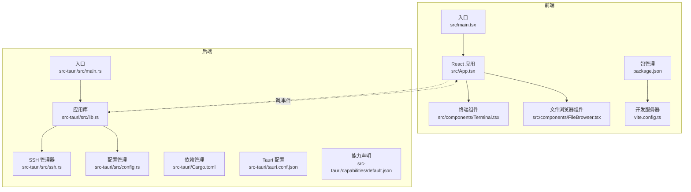
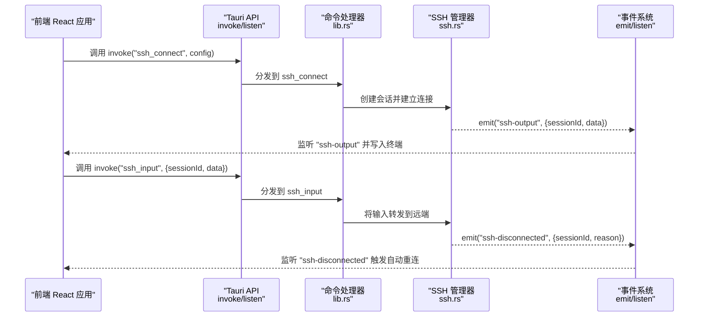
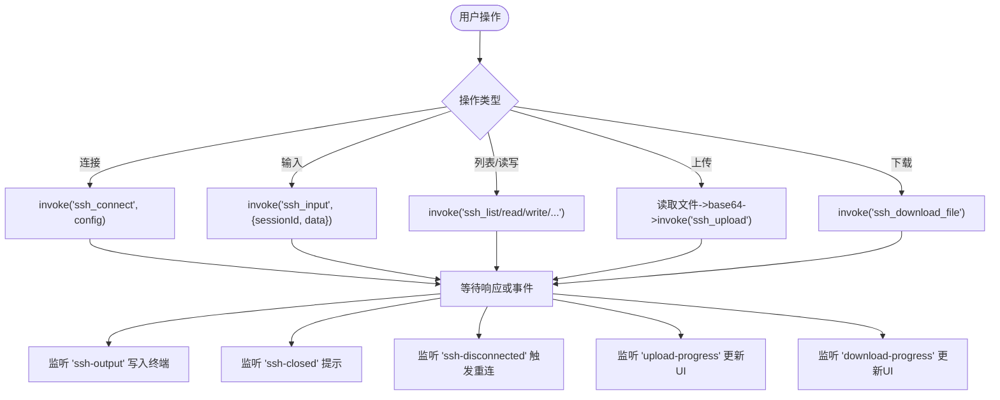
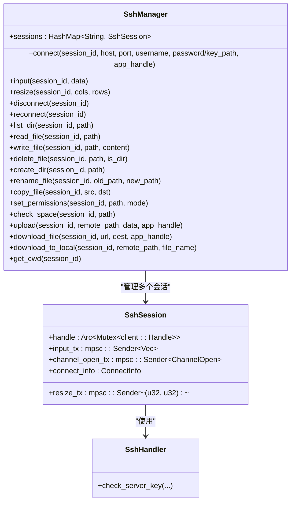
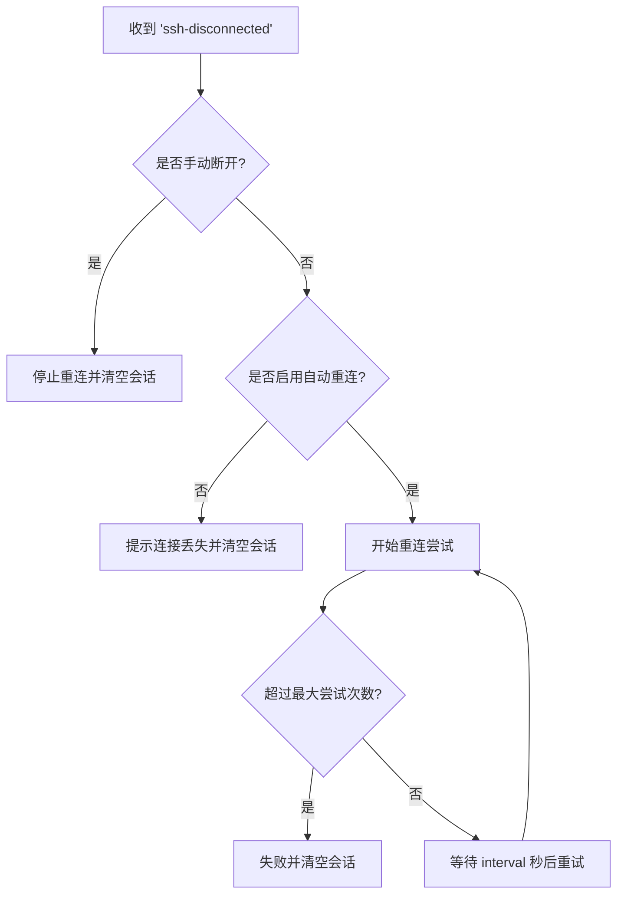
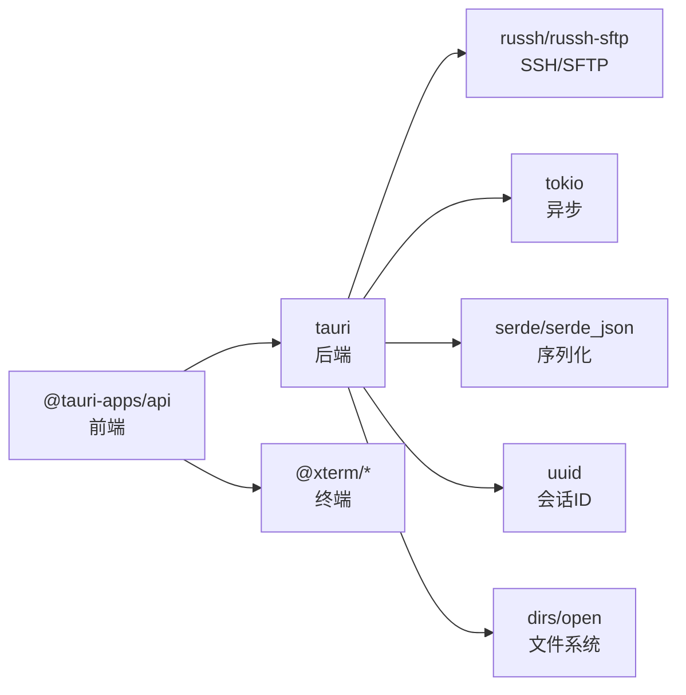

# 前后端分离架构

<cite>
**本文档引用的文件**
- [src-tauri/src/main.rs](file://src-tauri/src/main.rs)
- [src-tauri/src/lib.rs](file://src-tauri/src/lib.rs)
- [src-tauri/src/ssh.rs](file://src-tauri/src/ssh.rs)
- [src-tauri/src/config.rs](file://src-tauri/src/config.rs)
- [src-tauri/tauri.conf.json](file://src-tauri/tauri.conf.json)
- [src-tauri/Cargo.toml](file://src-tauri/Cargo.toml)
- [src-tauri/capabilities/default.json](file://src-tauri/capabilities/default.json)
- [src/App.tsx](file://src/App.tsx)
- [src/components/Terminal.tsx](file://src/components/Terminal.tsx)
- [src/components/FileBrowser.tsx](file://src/components/FileBrowser.tsx)
- [package.json](file://package.json)
- [vite.config.ts](file://vite.config.ts)
- [src/main.tsx](file://src/main.tsx)
</cite>

## 目录
1. [简介](#简介)
2. [项目结构](#项目结构)
3. [核心组件](#核心组件)
4. [架构总览](#架构总览)
5. [详细组件分析](#详细组件分析)
6. [依赖关系分析](#依赖关系分析)
7. [性能考虑](#性能考虑)
8. [故障排除指南](#故障排除指南)
9. [结论](#结论)

## 简介
本项目采用前后端分离架构，前端使用 React + TypeScript 构建用户界面，后端使用 Rust + Tauri 提供系统级能力与安全边界内的原生功能。通过 Tauri 的 IPC（进程间通信）机制，前端以命令调用的方式与后端交互，后端通过事件系统向前端推送状态更新。该架构在保证用户体验的同时，充分利用 Rust 的高性能与安全性，以及 Tauri 在桌面应用中的原生能力集成优势。

## 项目结构
项目采用典型的“前端 Vite + 后端 Tauri”组织方式：
- 前端：src 目录包含 React 应用、组件与入口文件，使用 Vite 进行开发与构建。
- 后端：src-tauri 目录包含 Tauri 应用的 Rust 代码、配置与能力声明，Cargo.toml 定义依赖。
- 配置：tauri.conf.json 指定窗口、安全策略、构建脚本等；capabilities/default.json 声明默认权限。

**图表来源**
- [src-tauri/src/main.rs:1-7](file://src-tauri/src/main.rs#L1-L7)
- [src-tauri/src/lib.rs:267-319](file://src-tauri/src/lib.rs#L267-L319)
- [src-tauri/src/ssh.rs:58-654](file://src-tauri/src/ssh.rs#L58-L654)
- [src-tauri/src/config.rs:27-113](file://src-tauri/src/config.rs#L27-L113)
- [src/App.tsx:1-415](file://src/App.tsx#L1-L415)
- [src/components/Terminal.tsx:1-150](file://src/components/Terminal.tsx#L1-L150)
- [src/components/FileBrowser.tsx:1-800](file://src/components/FileBrowser.tsx#L1-L800)

**章节来源**
- [src-tauri/src/main.rs:1-7](file://src-tauri/src/main.rs#L1-L7)
- [src-tauri/src/lib.rs:267-319](file://src-tauri/src/lib.rs#L267-L319)
- [src-tauri/tauri.conf.json:1-41](file://src-tauri/tauri.conf.json#L1-L41)
- [src-tauri/Cargo.toml:1-33](file://src-tauri/Cargo.toml#L1-L33)
- [src-tauri/capabilities/default.json:1-12](file://src-tauri/capabilities/default.json#L1-L12)
- [src/App.tsx:1-415](file://src/App.tsx#L1-L415)
- [src/components/Terminal.tsx:1-150](file://src/components/Terminal.tsx#L1-L150)
- [src/components/FileBrowser.tsx:1-800](file://src/components/FileBrowser.tsx#L1-L800)
- [package.json:1-28](file://package.json#L1-L28)
- [vite.config.ts:1-15](file://vite.config.ts#L1-L15)
- [src/main.tsx:1-11](file://src/main.tsx#L1-L11)

## 核心组件
- 前端应用与组件
  - 主应用：负责全局状态、设置、自动重连逻辑与事件监听。
  - 终端组件：基于 xterm.js 实现交互式终端，通过 invoke 与事件与后端通信。
  - 文件浏览器组件：提供目录浏览、文件操作、拖拽上传、下载进度与权限管理。
- 后端服务与管理器
  - 应用库：注册所有命令处理器、初始化窗口尺寸、设置日志插件。
  - SSH 管理器：维护会话、执行命令、SFTP 文件操作、事件发射。
  - 配置管理器：连接配置与应用设置的本地持久化。

**章节来源**
- [src/App.tsx:37-415](file://src/App.tsx#L37-L415)
- [src/components/Terminal.tsx:17-150](file://src/components/Terminal.tsx#L17-L150)
- [src/components/FileBrowser.tsx:154-800](file://src/components/FileBrowser.tsx#L154-L800)
- [src-tauri/src/lib.rs:267-319](file://src-tauri/src/lib.rs#L267-L319)
- [src-tauri/src/ssh.rs:58-654](file://src-tauri/src/ssh.rs#L58-L654)
- [src-tauri/src/config.rs:27-113](file://src-tauri/src/config.rs#L27-L113)

## 架构总览
Tauri 将前端 Web 页面嵌入到原生窗口中，通过内置的 IPC 通道实现命令调用与事件订阅。前端通过 @tauri-apps/api 的 invoke 与 listen 与后端交互，后端通过 tauri::Emitter 发射事件，前端监听并更新 UI。

**图表来源**
- [src-tauri/src/lib.rs:21-41](file://src-tauri/src/lib.rs#L21-L41)
- [src-tauri/src/ssh.rs:132-199](file://src-tauri/src/ssh.rs#L132-L199)
- [src-tauri/src/lib.rs:291-315](file://src-tauri/src/lib.rs#L291-L315)
- [src/App.tsx:123-164](file://src/App.tsx#L123-L164)
- [src/components/Terminal.tsx:81-87](file://src/components/Terminal.tsx#L81-L87)

## 详细组件分析

### 前端组件与 IPC 使用
- 应用层（App）
  - 使用 invoke 调用后端命令：连接、断开、文件操作、配置读写、设置保存。
  - 使用 listen 订阅后端事件：ssh-disconnected、ssh-closed、download-progress、upload-progress 等。
  - 自动重连逻辑：根据设置与事件触发指数退避重连。
- 终端组件（Terminal）
  - 初始化 xterm.js，加载 Fit/WebLinks 插件。
  - onData 时通过 invoke("ssh_input") 将用户输入发送至后端。
  - 监听 "ssh-output" 事件，将远端输出写入终端。
  - 监听 "ssh-closed" 事件，提示连接已关闭。
- 文件浏览器组件（FileBrowser）
  - 列举目录、读取/写入文件、删除/新建/重命名/复制/移动文件。
  - 上传：将本地文件转为 base64，调用 ssh_upload；监听 upload-progress 更新进度。
  - 下载：调用 ssh_download_file，监听 download-progress 获取进度；支持从 URL 下载。
  - 权限变更：调用 ssh_set_permissions；磁盘空间检查：ssh_check_space。

**图表来源**
- [src/App.tsx:180-223](file://src/App.tsx#L180-L223)
- [src/App.tsx:302-334](file://src/App.tsx#L302-L334)
- [src/App.tsx:123-164](file://src/App.tsx#L123-L164)
- [src/components/Terminal.tsx:68-73](file://src/components/Terminal.tsx#L68-L73)
- [src/components/Terminal.tsx:81-87](file://src/components/Terminal.tsx#L81-L87)
- [src/components/FileBrowser.tsx:315-355](file://src/components/FileBrowser.tsx#L315-L355)
- [src/components/FileBrowser.tsx:267-284](file://src/components/FileBrowser.tsx#L267-L284)

**章节来源**
- [src/App.tsx:103-121](file://src/App.tsx#L103-L121)
- [src/App.tsx:180-223](file://src/App.tsx#L180-L223)
- [src/App.tsx:302-334](file://src/App.tsx#L302-L334)
- [src/components/Terminal.tsx:17-150](file://src/components/Terminal.tsx#L17-L150)
- [src/components/FileBrowser.tsx:154-800](file://src/components/FileBrowser.tsx#L154-L800)

### 后端命令注册与状态管理
- 命令注册
  - 在 lib.rs 中通过 invoke_handler 注册所有命令，包括 ssh_*、config_*、settings_* 等。
  - 每个命令函数接收 AppHandle 或 State 引用，访问共享的 SshManager。
- 状态管理
  - SshManager 使用 HashMap 存储会话，每个会话包含 handle、输入/调整大小通道与连接信息。
  - 通过 tokio::spawn 启动后台任务，监听通道消息，将远端输出通过 emit 推送至前端。
- 事件系统
  - emit("ssh-output")：远端输出。
  - emit("ssh-disconnected")：连接断开或发送失败。
  - emit("ssh-closed")：会话关闭。
  - emit("upload-progress"/"download-progress")：文件传输进度。

**图表来源**
- [src-tauri/src/ssh.rs:58-654](file://src-tauri/src/ssh.rs#L58-L654)

**章节来源**
- [src-tauri/src/lib.rs:267-319](file://src-tauri/src/lib.rs#L267-L319)
- [src-tauri/src/ssh.rs:58-654](file://src-tauri/src/ssh.rs#L58-L654)

### 通信协议与数据传递
- 命令调用模式
  - 前端通过 invoke(commandName, payload) 调用后端命令，返回 Promise。
  - 后端命令函数签名统一：接收 AppHandle（可选）、State（共享状态）、参数，返回 Result<T, String>。
- 数据传递
  - 字符串与 JSON：如 ssh_output、upload-progress、download-progress 等事件负载。
  - Base64 编码：文件上传时将二进制数据编码为字符串传递。
  - 结构体参数：如 ssh_connect 的 ConnectConfig。
- 错误处理
  - 命令返回 Result，前端捕获异常并显示提示。
  - 后端内部错误转换为字符串返回，前端统一处理。

**章节来源**
- [src-tauri/src/lib.rs:21-41](file://src-tauri/src/lib.rs#L21-L41)
- [src-tauri/src/ssh.rs:520-583](file://src-tauri/src/ssh.rs#L520-L583)
- [src/App.tsx:218-222](file://src/App.tsx#L218-L222)

### 自动重连与事件驱动
- 事件监听
  - 前端监听 "ssh-disconnected"，根据设置决定是否自动重连。
- 重连策略
  - 指数退避：间隔 settings.reconnect_interval 秒，最多尝试 settings.max_reconnect_attempts 次。
  - 手动断开标记：避免用户手动断开后仍自动重连。
- 后端触发
  - 连接断开或发送失败时，后端 emit("ssh-disconnected")。

**图表来源**
- [src/App.tsx:123-164](file://src/App.tsx#L123-L164)
- [src-tauri/src/ssh.rs:146-151](file://src-tauri/src/ssh.rs#L146-L151)

**章节来源**
- [src/App.tsx:111-164](file://src/App.tsx#L111-L164)
- [src-tauri/src/ssh.rs:633-652](file://src-tauri/src/ssh.rs#L633-L652)

## 依赖关系分析
- 前端依赖
  - @tauri-apps/api：提供 invoke 与 listen。
  - @xterm/*：终端渲染与插件。
  - react/react-dom：应用框架。
- 后端依赖
  - tauri：IPC、事件、窗口管理。
  - russh/russh-sftp：SSH/SFTP 客户端。
  - tokio：异步运行时。
  - serde/serde_json：序列化与事件负载。
  - uuid：生成会话 ID。
  - dirs/open：配置路径与打开本地文件。

**图表来源**
- [package.json:15-26](file://package.json#L15-L26)
- [src-tauri/Cargo.toml:18-33](file://src-tauri/Cargo.toml#L18-L33)

**章节来源**
- [package.json:15-26](file://package.json#L15-L26)
- [src-tauri/Cargo.toml:18-33](file://src-tauri/Cargo.toml#L18-L33)

## 性能考虑
- 传输优化
  - 文件上传采用分块写入并上报进度，减少单次大对象传输带来的阻塞。
  - SFTP 配置包含并发写入限制与请求超时，平衡吞吐与稳定性。
- 异步与并发
  - 后台任务独立处理通道消息，避免阻塞主线程。
  - 多会话共享同一 AppHandle，事件广播高效。
- 资源管理
  - 会话断开时使用超时控制，防止死锁。
  - 连接保活与不活动超时，提升网络波动下的健壮性。
- 前端渲染
  - 终端按需重绘，窗口变化时仅触发 fit 与 resize 调用。
  - 文件列表排序与懒加载，避免一次性渲染大量节点。

[本节为通用性能建议，无需特定文件引用]

## 故障排除指南
- 连接失败
  - 检查认证方式：密钥或密码是否正确。
  - 查看后端日志（调试模式下启用 tauri-plugin-log）。
- 传输中断
  - 监听 download-progress/upload-progress 事件，确认进度与错误信息。
  - 检查磁盘空间与写权限（check_space 返回值）。
- 事件未到达
  - 确认前端已正确 listen 对应事件名。
  - 检查会话 ID 是否匹配。
- 自动重连无效
  - 确认 settings.auto_reconnect 已开启且未被手动断开标记覆盖。
  - 检查重连间隔与最大尝试次数设置。

**章节来源**
- [src-tauri/src/lib.rs:271-278](file://src-tauri/src/lib.rs#L271-L278)
- [src-tauri/src/ssh.rs:448-518](file://src-tauri/src/ssh.rs#L448-L518)
- [src-tauri/src/ssh.rs:633-652](file://src-tauri/src/ssh.rs#L633-L652)
- [src/App.tsx:111-164](file://src/App.tsx#L111-L164)

## 结论
本项目通过 Tauri 将 React 前端与 Rust 后端有效解耦，利用命令调用与事件系统实现稳定高效的 IPC 通信。后端以 SshManager 为核心，统一管理会话与文件操作，前端组件通过标准化的 API 与事件完成丰富的交互体验。该架构在性能、安全与可维护性之间取得良好平衡，适合构建高性能的桌面 SSH 管理工具。