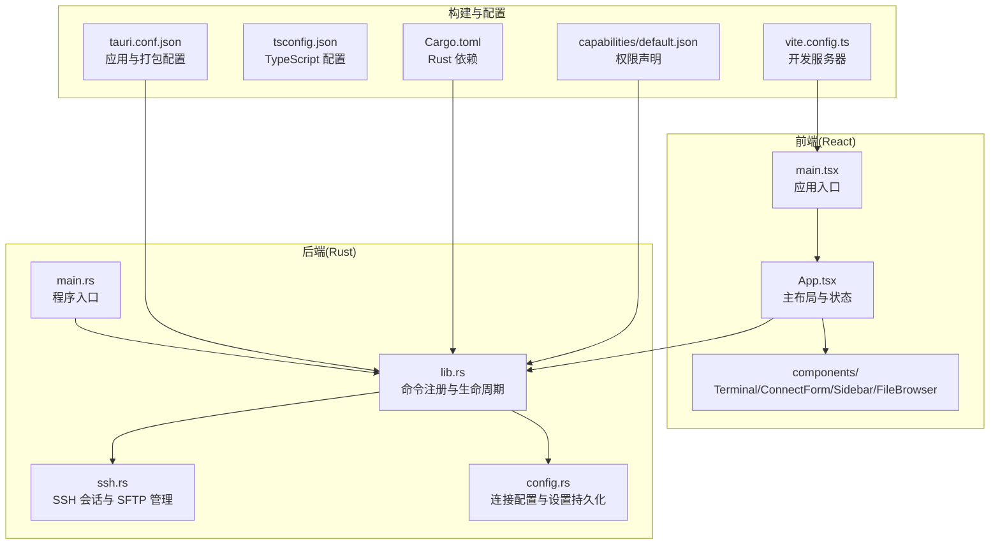
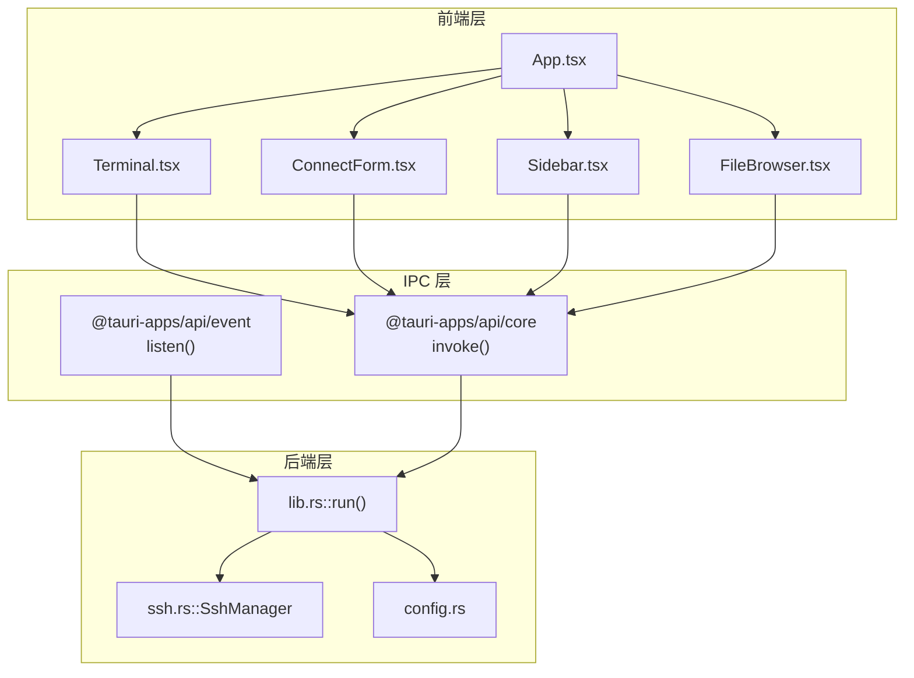
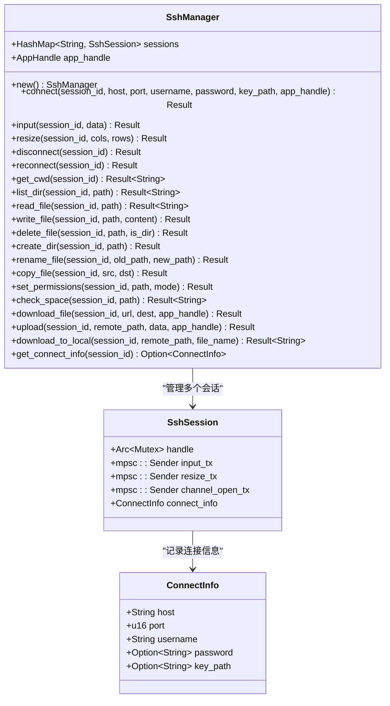
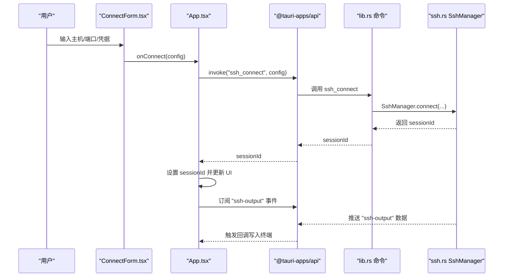
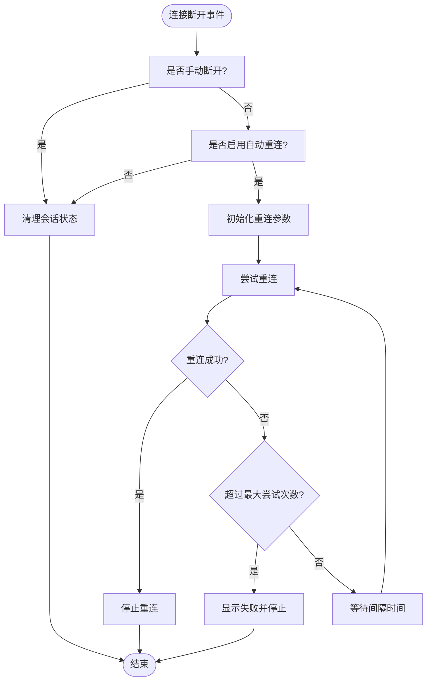
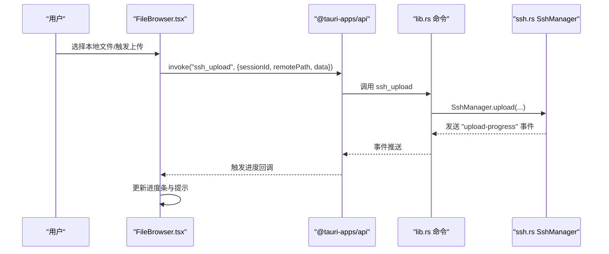
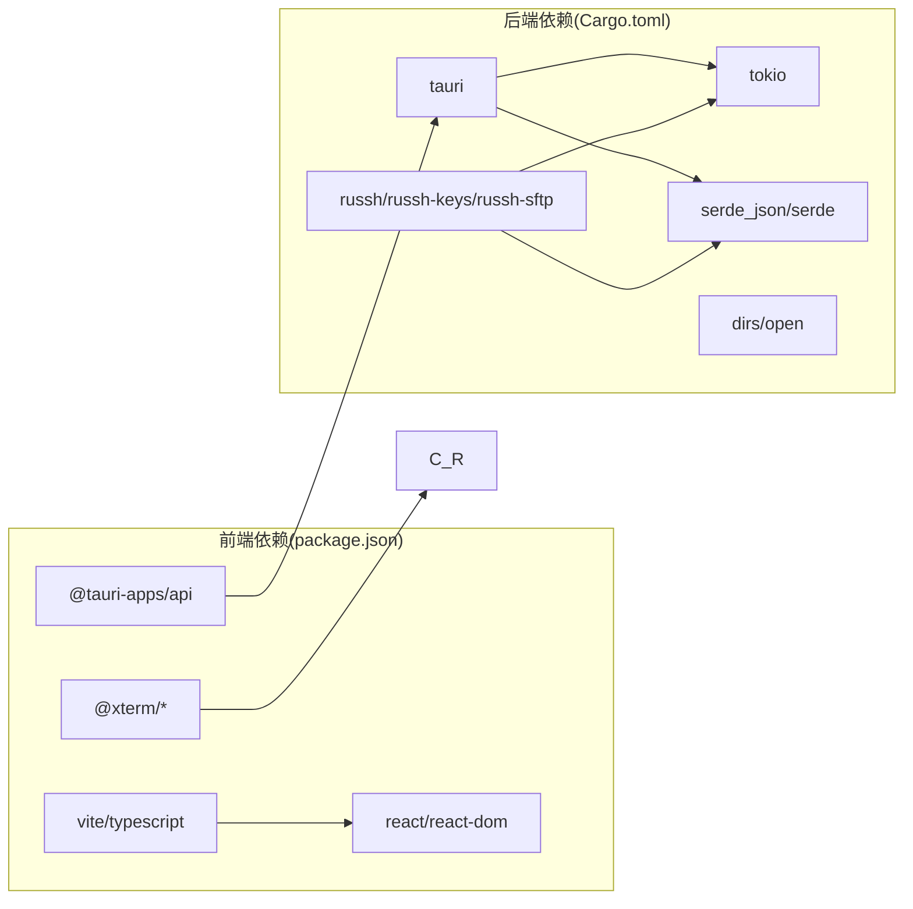

# 整体架构概览

<cite>
**本文档引用的文件**
- [README.md](file://README.md)
- [package.json](file://package.json)
- [Cargo.toml](file://src-tauri/Cargo.toml)
- [tauri.conf.json](file://src-tauri/tauri.conf.json)
- [main.rs](file://src-tauri/src/main.rs)
- [lib.rs](file://src-tauri/src/lib.rs)
- [ssh.rs](file://src-tauri/src/ssh.rs)
- [config.rs](file://src-tauri/src/config.rs)
- [App.tsx](file://src/App.tsx)
- [main.tsx](file://src/main.tsx)
- [Terminal.tsx](file://src/components/Terminal.tsx)
- [ConnectForm.tsx](file://src/components/ConnectForm.tsx)
- [Sidebar.tsx](file://src/components/Sidebar.tsx)
- [FileBrowser.tsx](file://src/components/FileBrowser.tsx)
- [vite.config.ts](file://vite.config.ts)
- [tsconfig.json](file://tsconfig.json)
- [default.json](file://src-tauri/capabilities/default.json)
</cite>

## 目录
1. [引言](#引言)
2. [项目结构](#项目结构)
3. [核心组件](#核心组件)
4. [架构总览](#架构总览)
5. [详细组件分析](#详细组件分析)
6. [依赖关系分析](#依赖关系分析)
7. [性能考量](#性能考量)
8. [故障排除指南](#故障排除指南)
9. [结论](#结论)

## 引言
本项目是一个基于 Tauri 框架的桌面 SSH 工具应用，采用前后端分离架构：前端使用 React 18 + TypeScript 构建用户界面，后端使用 Rust + russh 提供 SSH 连接、终端交互与文件管理能力。通过 Tauri 的 IPC 机制实现前端与后端的命令调用与事件推送，结合 xterm.js 提供高性能的终端模拟体验。

该架构具备以下优势：
- 安全隔离：Rust 后端负责敏感的网络与文件操作，前端仅处理 UI 逻辑，降低攻击面
- 性能优化：Rust 异步运行时与 russh 提供高并发、低延迟的 SSH 会话；xterm.js 在浏览器中高效渲染终端
- 跨平台兼容：Tauri 将应用打包为原生可执行文件，支持 Windows/Mac/Linux

## 项目结构
项目采用“前端 + 后端”双层结构，前端位于 src 目录，后端位于 src-tauri 目录，并通过 Tauri 配置进行集成。

**图示来源**
- [main.tsx:1-11](file://src/main.tsx#L1-L11)
- [App.tsx:1-415](file://src/App.tsx#L1-L415)
- [main.rs:1-7](file://src-tauri/src/main.rs#L1-L7)
- [lib.rs:267-319](file://src-tauri/src/lib.rs#L267-L319)
- [ssh.rs:58-654](file://src-tauri/src/ssh.rs#L58-L654)
- [config.rs:1-113](file://src-tauri/src/config.rs#L1-L113)
- [vite.config.ts:1-15](file://vite.config.ts#L1-L15)
- [tsconfig.json:1-26](file://tsconfig.json#L1-L26)
- [tauri.conf.json:1-41](file://src-tauri/tauri.conf.json#L1-L41)
- [Cargo.toml:1-33](file://src-tauri/Cargo.toml#L1-L33)
- [default.json:1-12](file://src-tauri/capabilities/default.json#L1-L12)

**章节来源**
- [README.md:39-74](file://README.md#L39-L74)
- [tauri.conf.json:1-41](file://src-tauri/tauri.conf.json#L1-L41)
- [Cargo.toml:1-33](file://src-tauri/Cargo.toml#L1-L33)

## 核心组件
- 前端应用
  - 应用入口与路由：main.tsx 创建根节点并挂载 App
  - 主布局与状态：App.tsx 管理会话 ID、连接状态、设置、拖拽分割等
  - 终端组件：Terminal.tsx 使用 xterm.js 渲染与交互，监听后端输出事件
  - 连接表单：ConnectForm.tsx 支持密码/密钥认证、记住连接、上传文件
  - 侧边栏：Sidebar.tsx 列出已保存连接，支持上下文菜单与直接连接
  - 文件浏览器：FileBrowser.tsx 提供目录浏览、编辑、复制/剪切粘贴、下载/上传、权限管理等

- 后端服务
  - 程序入口：main.rs 调用 lib.rs::run 启动 Tauri 应用
  - 命令注册：lib.rs::run 注册所有 IPC 命令与事件监听
  - SSH 管理：ssh.rs::SshManager 管理多会话、输入/输出、SFTP、文件操作、断线重连
  - 配置管理：config.rs 提供连接配置与应用设置的读写

**章节来源**
- [main.tsx:1-11](file://src/main.tsx#L1-L11)
- [App.tsx:1-415](file://src/App.tsx#L1-L415)
- [Terminal.tsx:1-150](file://src/components/Terminal.tsx#L1-L150)
- [ConnectForm.tsx:1-232](file://src/components/ConnectForm.tsx#L1-L232)
- [Sidebar.tsx:1-155](file://src/components/Sidebar.tsx#L1-L155)
- [FileBrowser.tsx:1-800](file://src/components/FileBrowser.tsx#L1-L800)
- [main.rs:1-7](file://src-tauri/src/main.rs#L1-L7)
- [lib.rs:267-319](file://src-tauri/src/lib.rs#L267-L319)
- [ssh.rs:58-654](file://src-tauri/src/ssh.rs#L58-L654)
- [config.rs:1-113](file://src-tauri/src/config.rs#L1-L113)

## 架构总览
应用采用“前端 UI + 后端服务”的分层架构，通过 Tauri IPC 实现命令调用与事件推送。前端负责用户交互与可视化，后端负责网络协议、文件系统与系统资源访问。

**图示来源**
- [App.tsx:1-415](file://src/App.tsx#L1-L415)
- [Terminal.tsx:1-150](file://src/components/Terminal.tsx#L1-L150)
- [ConnectForm.tsx:1-232](file://src/components/ConnectForm.tsx#L1-L232)
- [Sidebar.tsx:1-155](file://src/components/Sidebar.tsx#L1-L155)
- [FileBrowser.tsx:1-800](file://src/components/FileBrowser.tsx#L1-L800)
- [lib.rs:291-315](file://src-tauri/src/lib.rs#L291-L315)
- [ssh.rs:58-654](file://src-tauri/src/ssh.rs#L58-L654)
- [config.rs:1-113](file://src-tauri/src/config.rs#L1-L113)

## 详细组件分析

### SSH 管理器组件分析
SshManager 是后端的核心组件，负责 SSH 会话生命周期、输入输出、SFTP 文件操作与断线重连。

**图示来源**
- [ssh.rs:58-654](file://src-tauri/src/ssh.rs#L58-L654)

**章节来源**
- [ssh.rs:58-654](file://src-tauri/src/ssh.rs#L58-L654)

### 前端组件交互序列
以“连接并打开终端”为例，展示前端到后端的调用链路。

**图示来源**
- [ConnectForm.tsx:1-232](file://src/components/ConnectForm.tsx#L1-L232)
- [App.tsx:180-223](file://src/App.tsx#L180-L223)
- [lib.rs:21-41](file://src-tauri/src/lib.rs#L21-L41)
- [ssh.rs:71-199](file://src-tauri/src/ssh.rs#L71-L199)

**章节来源**
- [App.tsx:180-223](file://src/App.tsx#L180-L223)
- [lib.rs:21-41](file://src-tauri/src/lib.rs#L21-L41)
- [ssh.rs:71-199](file://src-tauri/src/ssh.rs#L71-L199)

### 断线重连流程
应用支持自动重连，当检测到连接断开时按配置间隔重试。

**图示来源**
- [App.tsx:124-164](file://src/App.tsx#L124-L164)
- [ssh.rs:633-652](file://src-tauri/src/ssh.rs#L633-L652)

**章节来源**
- [App.tsx:124-164](file://src/App.tsx#L124-L164)
- [ssh.rs:633-652](file://src-tauri/src/ssh.rs#L633-L652)

### 文件操作与进度反馈
文件上传/下载通过事件驱动的方式向前端反馈进度。

**图示来源**
- [FileBrowser.tsx:297-337](file://src/components/FileBrowser.tsx#L297-L337)
- [lib.rs:77-91](file://src-tauri/src/lib.rs#L77-L91)
- [ssh.rs:520-583](file://src-tauri/src/ssh.rs#L520-L583)

**章节来源**
- [FileBrowser.tsx:297-337](file://src/components/FileBrowser.tsx#L297-L337)
- [lib.rs:77-91](file://src-tauri/src/lib.rs#L77-L91)
- [ssh.rs:520-583](file://src-tauri/src/ssh.rs#L520-L583)

## 依赖关系分析
- 前端依赖
  - @tauri-apps/api：用于 IPC 调用与事件监听
  - @xterm/*：终端渲染与插件
  - react/react-dom：UI 框架
  - vite：开发服务器与构建工具
  - typescript：类型系统

- 后端依赖
  - tauri：桌面应用框架与 IPC
  - russh/russh-keys/russh-sftp：SSH 协议与 SFTP
  - tokio：异步运行时
  - serde_json/serde：数据序列化
  - dirs/open：配置目录与系统打开

**图示来源**
- [package.json:15-26](file://package.json#L15-L26)
- [Cargo.toml:18-33](file://src-tauri/Cargo.toml#L18-L33)

**章节来源**
- [package.json:1-28](file://package.json#L1-L28)
- [Cargo.toml:1-33](file://src-tauri/Cargo.toml#L1-L33)

## 性能考量
- 异步与并发
  - 后端使用 tokio::task 处理 SSH 通道与事件循环，避免阻塞
  - SFTP 写入采用分块传输与并发控制，提升大文件上传效率
- 终端渲染
  - xterm.js 通过 FitAddon 自适应窗口大小，减少重绘开销
- 事件驱动
  - 下载/上传进度通过事件流推送，避免轮询带来的 CPU 占用
- 配置持久化
  - 连接与设置存储于用户配置目录，避免频繁 IO

[本节为通用性能建议，无需特定文件引用]

## 故障排除指南
- 连接失败
  - 检查主机名/端口/凭据是否正确
  - 查看后端日志（开发模式下启用 tauri-plugin-log）
- 断线重连异常
  - 确认设置中的自动重连开关与重试间隔
  - 检查网络波动与远端服务器策略
- 文件操作失败
  - 检查目标目录权限与磁盘空间
  - 对于大文件，确认上传/下载超时设置
- 终端无输出
  - 确认已订阅 "ssh-output" 事件且会话 ID 正确
  - 检查窗口大小变化是否触发了 resize 事件

**章节来源**
- [lib.rs:267-278](file://src-tauri/src/lib.rs#L267-L278)
- [App.tsx:124-164](file://src/App.tsx#L124-L164)
- [ssh.rs:448-518](file://src-tauri/src/ssh.rs#L448-L518)

## 结论
本项目通过 Tauri 将 React 前端与 Rust 后端有机结合，实现了高性能、安全可靠的桌面 SSH 工具。前后端分离的设计在保证用户体验的同时，强化了安全性与可维护性。借助 russh 与 xterm.js，应用在功能与性能上均达到生产级水平。未来可进一步扩展为多标签页会话、批量任务队列与更丰富的文件管理能力。