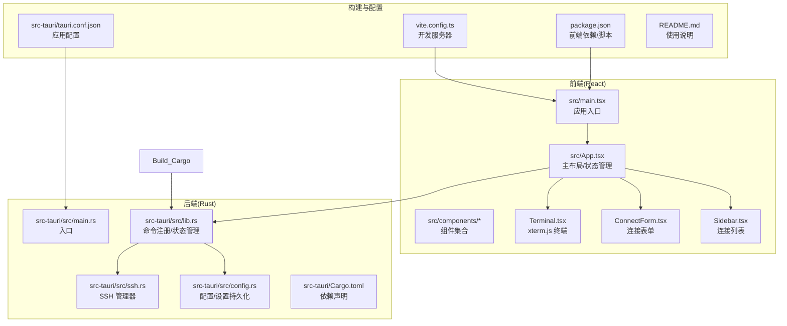
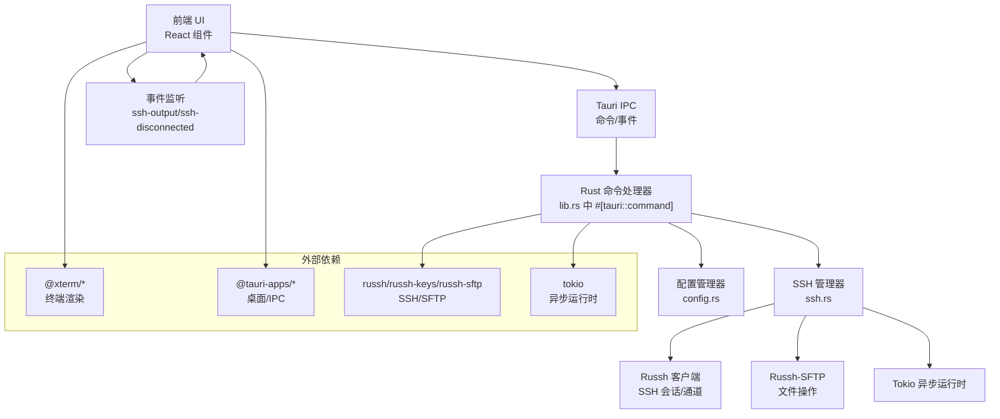
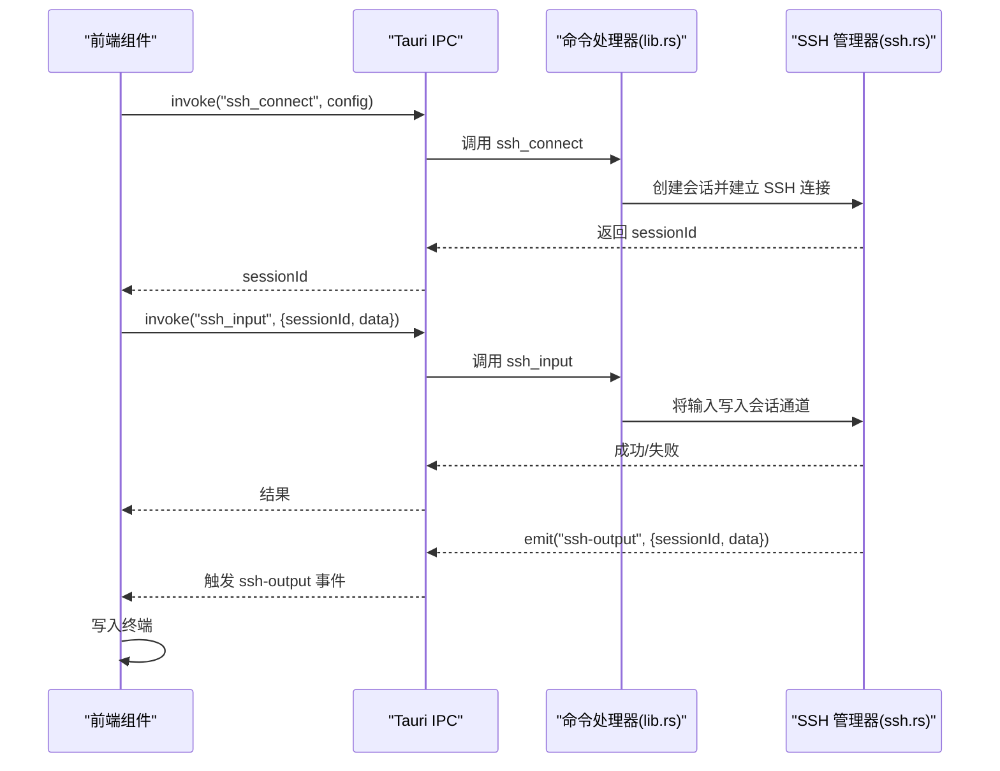
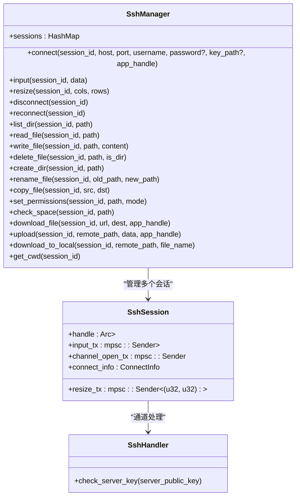
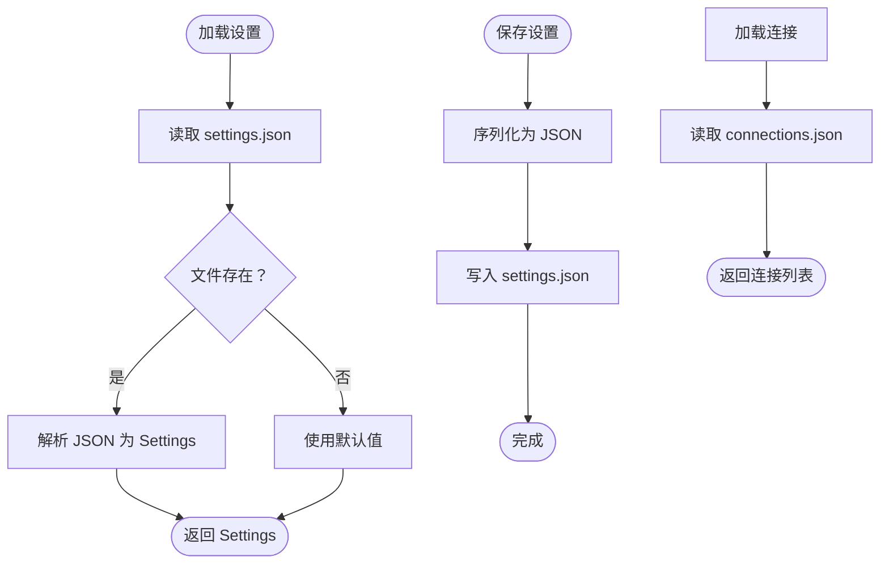
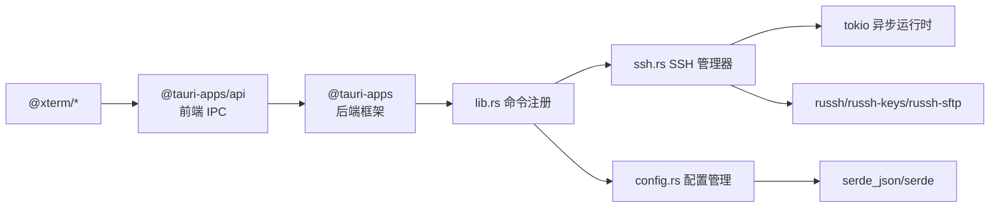

# 架构设计

<cite>
**本文档引用的文件**
- [README.md](file://README.md)
- [package.json](file://package.json)
- [vite.config.ts](file://vite.config.ts)
- [src-tauri/tauri.conf.json](file://src-tauri/tauri.conf.json)
- [src-tauri/Cargo.toml](file://src-tauri/Cargo.toml)
- [src/main.tsx](file://src/main.tsx)
- [src/App.tsx](file://src/App.tsx)
- [src/components/Terminal.tsx](file://src/components/Terminal.tsx)
- [src/components/ConnectForm.tsx](file://src/components/ConnectForm.tsx)
- [src/components/Sidebar.tsx](file://src/components/Sidebar.tsx)
- [src-tauri/src/lib.rs](file://src-tauri/src/lib.rs)
- [src-tauri/src/main.rs](file://src-tauri/src/main.rs)
- [src-tauri/src/ssh.rs](file://src-tauri/src/ssh.rs)
- [src-tauri/src/config.rs](file://src-tauri/src/config.rs)
</cite>

## 目录
1. [引言](#引言)
2. [项目结构](#项目结构)
3. [核心组件](#核心组件)
4. [架构总览](#架构总览)
5. [详细组件分析](#详细组件分析)
6. [依赖关系分析](#依赖关系分析)
7. [性能考虑](#性能考虑)
8. [故障排除指南](#故障排除指南)
9. [结论](#结论)

## 引言
本项目是一个基于 Tauri 2.x 的跨平台桌面 SSH 工具，采用前后端分离架构：前端使用 React 18 + TypeScript + Vite，后端使用 Rust + Tokio 异步运行时，通过 Tauri IPC 与前端进行命令调用和事件通信。后端集成了 Russh 库实现 SSH 连接管理，并通过 Russh-SFTP 提供文件操作能力；终端渲染使用 xterm.js，支持 PTY 会话、实时输出流、自动重连等特性。

## 项目结构
项目采用典型的 Tauri 项目分层组织方式：
- 前端层：src 目录包含 React 应用入口、全局样式与组件集合
- 后端层：src-tauri 目录包含 Tauri 应用配置、Rust 命令注册、SSH 管理器与配置管理
- 构建与打包：Vite 作为前端开发服务器，Tauri 负责桌面窗口与 IPC

**图示来源**
- [src/main.tsx:1-11](file://src/main.tsx#L1-L11)
- [src/App.tsx:1-415](file://src/App.tsx#L1-L415)
- [src-tauri/src/lib.rs:1-319](file://src-tauri/src/lib.rs#L1-L319)
- [src-tauri/src/ssh.rs:1-654](file://src-tauri/src/ssh.rs#L1-L654)
- [src-tauri/src/config.rs:1-113](file://src-tauri/src/config.rs#L1-L113)
- [vite.config.ts:1-15](file://vite.config.ts#L1-L15)
- [src-tauri/tauri.conf.json:1-41](file://src-tauri/tauri.conf.json#L1-L41)
- [package.json:1-28](file://package.json#L1-L28)
- [README.md:1-74](file://README.md#L1-L74)

**章节来源**
- [README.md:49-74](file://README.md#L49-L74)
- [src-tauri/tauri.conf.json:1-41](file://src-tauri/tauri.conf.json#L1-L41)
- [vite.config.ts:1-15](file://vite.config.ts#L1-L15)

## 核心组件
- 前端应用入口与主布局：负责应用初始化、全局状态管理、组件协调与 IPC 通信
- 终端组件：封装 xterm.js，处理用户输入、输出显示、自适应布局与事件监听
- 连接表单：提供主机、端口、认证方式选择与连接/断开控制
- 侧边栏：维护连接历史列表，支持上下文菜单与直接连接
- 后端命令注册：集中暴露所有 IPC 命令，包括 SSH 连接、文件传输、配置管理与设置持久化
- SSH 管理器：基于 Russh 的会话生命周期管理、SFTP 文件操作、进度事件推送
- 配置管理器：本地 JSON 文件存储连接配置与应用设置

**章节来源**
- [src/main.tsx:1-11](file://src/main.tsx#L1-L11)
- [src/App.tsx:1-415](file://src/App.tsx#L1-L415)
- [src/components/Terminal.tsx:1-150](file://src/components/Terminal.tsx#L1-L150)
- [src/components/ConnectForm.tsx:1-232](file://src/components/ConnectForm.tsx#L1-L232)
- [src/components/Sidebar.tsx:1-155](file://src/components/Sidebar.tsx#L1-L155)
- [src-tauri/src/lib.rs:1-319](file://src-tauri/src/lib.rs#L1-L319)
- [src-tauri/src/ssh.rs:1-654](file://src-tauri/src/ssh.rs#L1-L654)
- [src-tauri/src/config.rs:1-113](file://src-tauri/src/config.rs#L1-L113)

## 架构总览
系统采用“前端 React + 后端 Rust”的桌面应用架构，通过 Tauri IPC 实现命令调用与事件驱动的数据流。前端负责 UI 渲染与用户交互，后端负责网络协议处理、会话管理与文件操作。

**图示来源**
- [src-tauri/src/lib.rs:268-319](file://src-tauri/src/lib.rs#L268-L319)
- [src-tauri/src/ssh.rs:58-654](file://src-tauri/src/ssh.rs#L58-L654)
- [src-tauri/src/config.rs:27-113](file://src-tauri/src/config.rs#L27-L113)
- [src-tauri/Cargo.toml:18-32](file://src-tauri/Cargo.toml#L18-L32)

## 详细组件分析

### 前端组件职责与数据流
- App.tsx：应用主控制器，管理会话 ID、连接状态、错误提示、自动重连策略与拖拽分割布局；通过 invoke 调用后端命令，通过 listen 订阅事件
- Terminal.tsx：封装 xterm.js，监听 ssh-output 事件写入终端，转发用户输入到 ssh_input，响应窗口大小变化触发 ssh_resize
- ConnectForm.tsx：表单校验与提交，根据认证类型切换密码或密钥路径，支持文件上传（Base64 编码）与进度反馈
- Sidebar.tsx：加载本地连接配置，支持右键菜单执行连接、编辑与删除操作

**图示来源**
- [src/App.tsx:180-223](file://src/App.tsx#L180-L223)
- [src-tauri/src/lib.rs:21-41](file://src-tauri/src/lib.rs#L21-L41)
- [src-tauri/src/ssh.rs:201-211](file://src-tauri/src/ssh.rs#L201-L211)

**章节来源**
- [src/App.tsx:1-415](file://src/App.tsx#L1-L415)
- [src/components/Terminal.tsx:1-150](file://src/components/Terminal.tsx#L1-L150)
- [src/components/ConnectForm.tsx:1-232](file://src/components/ConnectForm.tsx#L1-L232)
- [src/components/Sidebar.tsx:1-155](file://src/components/Sidebar.tsx#L1-L155)

### SSH 连接管理架构
- 会话生命周期：每个连接生成唯一 sessionId，后端以 HashMap 存储会话句柄与通道，后台任务负责监听通道数据、处理输入队列与窗口调整
- 认证与会话：支持密钥认证与密码认证，建立 PTY 并请求 shell，确保兼容性
- SFTP 文件操作：通过 subsystem 请求 SFTP，封装读写、列出目录、权限变更、复制/重命名/删除等操作
- 事件推送：下载/上传过程通过事件向前端发送进度，断线时发出 ssh-disconnected 事件，配合前端自动重连逻辑

**图示来源**
- [src-tauri/src/ssh.rs:58-654](file://src-tauri/src/ssh.rs#L58-L654)

**章节来源**
- [src-tauri/src/ssh.rs:71-199](file://src-tauri/src/ssh.rs#L71-L199)
- [src-tauri/src/ssh.rs:288-307](file://src-tauri/src/ssh.rs#L288-L307)
- [src-tauri/src/ssh.rs:520-583](file://src-tauri/src/ssh.rs#L520-L583)

### 配置与设置持久化
- 连接配置：使用 JSON 文件保存连接列表，支持增删改查
- 应用设置：保存自动重连开关、重连间隔与最大尝试次数
- 路径：使用 dirs crate 获取系统配置目录，避免跨平台差异

**图示来源**
- [src-tauri/src/config.rs:60-113](file://src-tauri/src/config.rs#L60-L113)

**章节来源**
- [src-tauri/src/config.rs:27-58](file://src-tauri/src/config.rs#L27-L58)
- [src-tauri/src/config.rs:94-113](file://src-tauri/src/config.rs#L94-L113)

## 依赖关系分析
- 前端依赖：@tauri-apps/api 提供 IPC 能力，@xterm/* 提供终端渲染，React 生态提供组件化开发
- 后端依赖：Tauri 提供桌面窗口与命令注册，Tokio 提供异步运行时，Russh/Russh-SFTP 提供 SSH/SFTP 协议实现，Serde 支持 JSON 序列化

**图示来源**
- [package.json:15-26](file://package.json#L15-L26)
- [src-tauri/Cargo.toml:18-32](file://src-tauri/Cargo.toml#L18-L32)

**章节来源**
- [package.json:1-28](file://package.json#L1-28)
- [src-tauri/Cargo.toml:1-33](file://src-tauri/Cargo.toml#L1-L33)

## 性能考虑
- 异步并发：Tokio 提供高并发 I/O 处理能力，通道与多生产者队列保证输入/输出与窗口调整的低延迟
- 事件驱动：通过事件推送上传/下载进度，避免轮询带来的 CPU 占用
- SFTP 参数优化：合理设置 packet 大小与并发写入数，平衡吞吐与稳定性
- 自动重连：结合超时与最大尝试次数，防止长时间阻塞影响用户体验
- 前端渲染：xterm.js 使用适配插件，按需刷新与清理资源，减少内存占用

## 故障排除指南
- 连接失败：检查认证方式（密码/密钥）、主机地址与端口；查看后端日志（调试模式启用）
- 断线重连：确认自动重连设置，观察 ssh-disconnected 事件触发与重连尝试次数
- 文件传输异常：检查远程路径权限与磁盘空间，关注 download-progress/upload-progress 事件
- 设置未生效：确认 settings.json 是否正确写入，必要时重置为默认值

**章节来源**
- [src-tauri/src/lib.rs:268-319](file://src-tauri/src/lib.rs#L268-L319)
- [src-tauri/src/ssh.rs:448-518](file://src-tauri/src/ssh.rs#L448-L518)
- [src-tauri/src/config.rs:94-113](file://src-tauri/src/config.rs#L94-L113)

## 结论
本项目通过 Tauri 将 React 前端与 Rust 后端有机结合，借助 Tokio 与 Russh 实现高性能、可扩展的 SSH 管理能力。前端组件职责清晰、数据流明确，后端命令与事件模型完善，适合进一步扩展更多运维场景（如批量任务、审计日志等）。建议持续关注异步资源清理与错误恢复策略，提升长期运行稳定性。