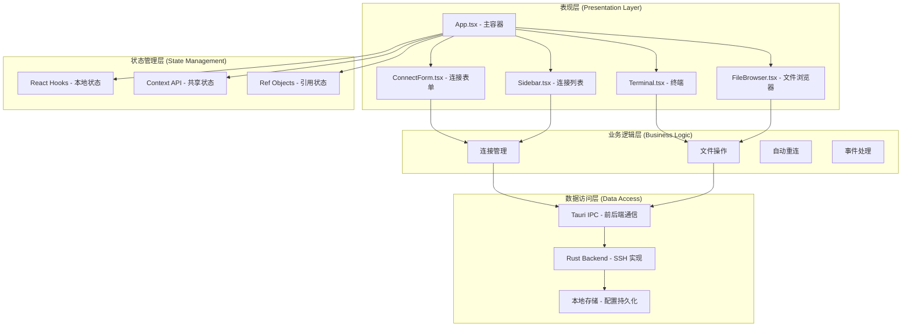
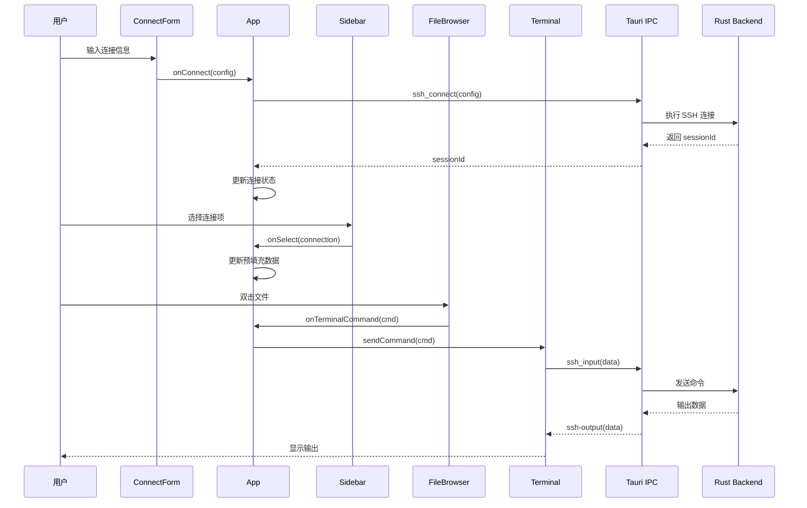
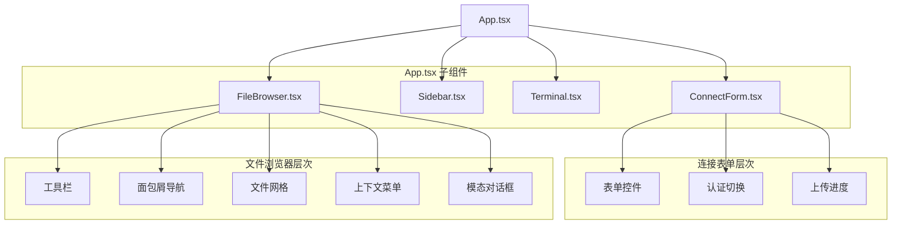
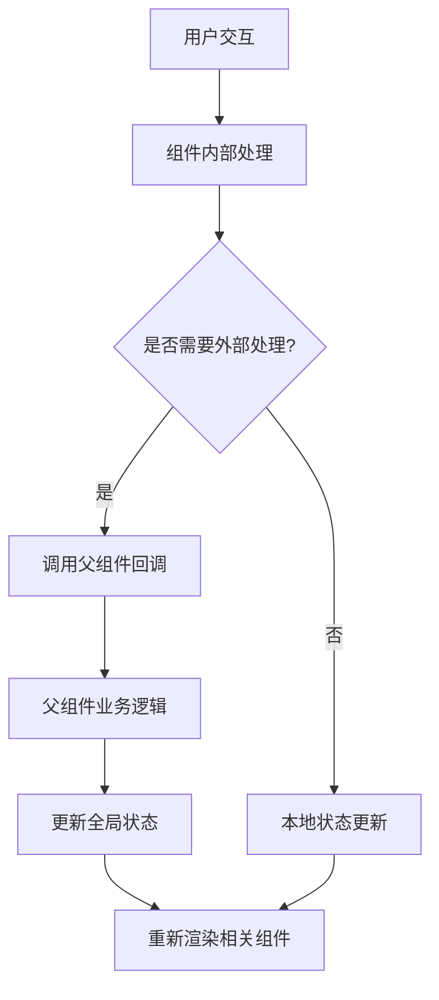
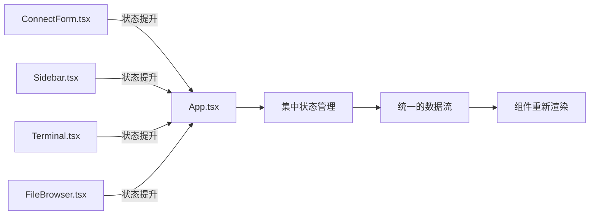
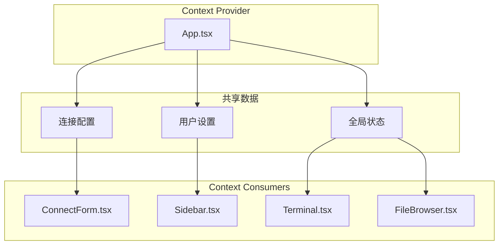

# 组件架构设计

<cite>
**本文档引用的文件**
- [App.tsx](file://src/App.tsx)
- [ConnectForm.tsx](file://src/components/ConnectForm.tsx)
- [Sidebar.tsx](file://src/components/Sidebar.tsx)
- [Terminal.tsx](file://src/components/Terminal.tsx)
- [FileBrowser.tsx](file://src/components/FileBrowser.tsx)
- [main.tsx](file://src/main.tsx)
- [package.json](file://package.json)
- [README.md](file://README.md)
</cite>

## 目录
1. [简介](#简介)
2. [项目结构](#项目结构)
3. [核心组件](#核心组件)
4. [架构概览](#架构概览)
5. [详细组件分析](#详细组件分析)
6. [依赖关系分析](#依赖关系分析)
7. [性能考虑](#性能考虑)
8. [故障排除指南](#故障排除指南)
9. [结论](#结论)

## 简介

SSH Tool 是一个基于 React 和 Tauri 的跨平台 SSH 客户端工具，提供了图形化的 SSH 连接管理、终端交互和文件浏览器功能。该项目采用现代化的前端技术栈，结合 Rust 后端实现，为用户提供了一个功能完整且用户友好的 SSH 客户端解决方案。

本项目的核心特点包括：
- **模块化组件架构**：清晰的组件职责分离和状态管理模式
- **实时数据流**：通过 Tauri IPC 实现前后端双向通信
- **响应式设计**：支持拖拽调整布局和动态重连机制
- **丰富的文件操作**：完整的文件浏览、编辑、上传下载功能

## 项目结构

项目采用典型的 React + TypeScript 结构，主要分为前端组件层和 Tauri 后端层：

```mermaid
graph TB
subgraph "前端层"
A[main.tsx] --> B[App.tsx]
B --> C[ConnectForm.tsx]
B --> D[Sidebar.tsx]
B --> E[Terminal.tsx]
B --> F[FileBrowser.tsx]
end
subgraph "样式层"
G[App.css]
end
subgraph "后端层 (Tauri)"
H[src-tauri/src/main.rs]
I[src-tauri/src/lib.rs]
J[src-tauri/src/ssh.rs]
K[src-tauri/src/config.rs]
end
subgraph "外部依赖"
L[@tauri-apps/api]
M[@xterm/xterm]
N[russh]
end
A --> G
B --> L
C --> L
D --> L
E --> M
F --> L
B --> N
C --> N
D --> N
E --> N
F --> N
```

**图表来源**
- [main.tsx:1-11](file://src/main.tsx#L1-L11)
- [App.tsx:1-415](file://src/App.tsx#L1-L415)
- [package.json:15-26](file://package.json#L15-L26)

**章节来源**
- [README.md:49-74](file://README.md#L49-L74)
- [package.json:1-28](file://package.json#L1-L28)

## 核心组件

### 应用主组件 (App.tsx)

App.tsx 作为整个应用的根组件，承担着以下关键职责：

**状态管理**
- 连接状态管理：`sessionId`、`isConnecting`、`error`
- 用户界面状态：`menuOpen`、`reconnecting`、`toast`、`showSave`
- 设置管理：`settings` 对象及其引用版本
- 布局控制：`sidebarWidth`、`splitRatio`、拖拽状态

**业务逻辑协调**
- SSH 连接生命周期管理
- 自动重连机制
- 文件上传处理
- 组件间通信协调

**事件监听与处理**
- 监听 SSH 断开事件进行自动重连
- 处理 SSH 会话关闭事件
- 管理拖拽调整布局功能

**章节来源**
- [App.tsx:37-415](file://src/App.tsx#L37-L415)

### 连接表单组件 (ConnectForm.tsx)

ConnectForm.tsx 提供了 SSH 连接的用户界面，具有以下特性：

**表单状态管理**
- 连接参数：主机、端口、用户名、认证类型
- 认证方式切换：密码或密钥文件
- 记住凭据选项
- 上传文件进度显示

**交互功能**
- 表单验证和预填充
- 连接/断开按钮状态管理
- 文件选择和上传处理
- 实时上传进度反馈

**章节来源**
- [ConnectForm.tsx:26-232](file://src/components/ConnectForm.tsx#L26-L232)

### 侧边栏组件 (Sidebar.tsx)

Sidebar.tsx 实现了连接列表的管理和操作：

**数据管理**
- 连接配置列表加载和显示
- 上下文菜单实现
- 动态刷新机制

**用户交互**
- 连接项点击选择
- 双击直接连接
- 右键菜单操作
- 删除确认对话框

**章节来源**
- [Sidebar.tsx:28-155](file://src/components/Sidebar.tsx#L28-L155)

### 终端组件 (Terminal.tsx)

Terminal.tsx 基于 xterm.js 构建，提供完整的终端功能：

**终端集成**
- xterm.js 初始化和配置
- 终端大小自适应
- 链接识别和点击处理
- 主题定制

**事件处理**
- 用户输入转发到后端
- SSH 输出接收和显示
- 连接状态变化处理
- 窗口大小变化监听

**章节来源**
- [Terminal.tsx:17-150](file://src/components/Terminal.tsx#L17-L150)

### 文件浏览器组件 (FileBrowser.tsx)

FileBrowser.tsx 提供了完整的文件管理系统：

**文件操作**
- 目录浏览和导航
- 文件上传下载
- 文本文件编辑
- 权限设置

**高级功能**
- 拖拽文件操作
- 剪贴板复制粘贴
- 文件信息查看
- 进度条显示

**章节来源**
- [FileBrowser.tsx:154-1298](file://src/components/FileBrowser.tsx#L154-L1298)

## 架构概览

SSH Tool 采用了分层架构设计，实现了清晰的关注点分离：



**图表来源**
- [App.tsx:37-415](file://src/App.tsx#L37-L415)
- [ConnectForm.tsx:26-232](file://src/components/ConnectForm.tsx#L26-L232)
- [Sidebar.tsx:28-155](file://src/components/Sidebar.tsx#L28-L155)
- [Terminal.tsx:17-150](file://src/components/Terminal.tsx#L17-L150)
- [FileBrowser.tsx:154-1298](file://src/components/FileBrowser.tsx#L154-L1298)

### 数据流向设计

系统采用单向数据流设计，确保数据的一致性和可预测性：



**图表来源**
- [App.tsx:180-338](file://src/App.tsx#L180-L338)
- [ConnectForm.tsx:59-73](file://src/components/ConnectForm.tsx#L59-L73)
- [Sidebar.tsx:86-111](file://src/components/Sidebar.tsx#L86-L111)
- [FileBrowser.tsx:512-521](file://src/components/FileBrowser.tsx#L512-L521)
- [Terminal.tsx:68-87](file://src/components/Terminal.tsx#L68-L87)

## 详细组件分析

### 组件树结构



**图表来源**
- [App.tsx:340-411](file://src/App.tsx#L340-L411)
- [ConnectForm.tsx:92-230](file://src/components/ConnectForm.tsx#L92-L230)
- [FileBrowser.tsx:807-940](file://src/components/FileBrowser.tsx#L807-L940)

### 组件通信机制

#### Props 传递模式

每个子组件都通过明确的 props 接口接收数据和回调函数：

**App.tsx 向子组件传递的 props：**

| 组件 | Props 名称 | 类型 | 描述 |
|------|------------|------|------|
| ConnectForm | onConnect | `(config) => Promise<void>` | 连接请求处理器 |
| ConnectForm | onDisconnect | `() => void` | 断开连接处理器 |
| ConnectForm | onUpload | `(file) => Promise<void>` | 文件上传处理器 |
| ConnectForm | isConnected | `boolean` | 连接状态 |
| ConnectForm | isConnecting | `boolean` | 连接中状态 |
| ConnectForm | prefill | `Object` | 预填充数据 |

**章节来源**
- [App.tsx:377-384](file://src/App.tsx#L377-L384)
- [ConnectForm.tsx:3-24](file://src/components/ConnectForm.tsx#L3-L24)

#### 事件处理模式

组件采用回调函数模式进行事件处理，确保了松耦合的设计：



**图表来源**
- [ConnectForm.tsx:59-73](file://src/components/ConnectForm.tsx#L59-L73)
- [Sidebar.tsx:69-72](file://src/components/Sidebar.tsx#L69-L72)

### 状态管理模式

#### 本地状态管理

每个组件维护自己的本地状态，使用 React Hooks 进行管理：

**状态类型分类：**

1. **简单状态**：`useState` 管理的基本数据类型
2. **复杂状态**：对象和数组形式的状态
3. **引用状态**：`useRef` 用于不需要触发重渲染的值

**状态提升策略：**

当多个组件需要共享同一份状态时，采用状态提升到最近的共同祖先组件：



**图表来源**
- [App.tsx:37-60](file://src/App.tsx#L37-L60)
- [ConnectForm.tsx:34-45](file://src/components/ConnectForm.tsx#L34-L45)

#### 生命周期管理

组件遵循标准的 React 生命周期模式：

**初始化阶段：**
- 组件挂载时执行必要的初始化逻辑
- 设置事件监听器
- 加载初始数据

**更新阶段：**
- 响应 props 变化
- 处理用户交互
- 更新本地状态

**清理阶段：**
- 移除事件监听器
- 清理定时器
- 释放资源

**章节来源**
- [App.tsx:68-95](file://src/App.tsx#L68-L95)
- [Terminal.tsx:113-121](file://src/components/Terminal.tsx#L113-L121)

### 上下文共享策略

虽然当前实现主要依赖 props 传递，但可以扩展为使用 React Context 进行更复杂的上下文共享：



## 依赖关系分析

### 外部依赖管理

项目使用了多种关键依赖来实现不同的功能：

```mermaid
graph TB
subgraph "前端依赖"
A[React 19.2.7]
B[React DOM 19.2.7]
C[@xterm/xterm 6.0.0]
D[@xterm/addon-fit 0.11.0]
E[@xterm/addon-web-links 0.12.0]
F[@tauri-apps/api 2.11.0]
end
subgraph "开发依赖"
G[TypeScript 6.0.2]
H[Vite 8.0.12]
I[@types/react 19.2.17]
J[@types/react-dom 19.2.3]
end
subgraph "后端依赖"
K[Rust 1.x]
L[russh 0.45]
M[tokio]
N[Tauri 2.x]
end
A --> C
A --> F
C --> D
C --> E
F --> N
N --> L
L --> M
```

**图表来源**
- [package.json:15-26](file://package.json#L15-L26)

### 组件间依赖关系

```mermaid
graph TD
A[App.tsx] --> B[ConnectForm.tsx]
A --> C[Sidebar.tsx]
A --> D[Terminal.tsx]
A --> E[FileBrowser.tsx]
F[ConnectForm.tsx] --> G[@tauri-apps/api]
C --> G
D --> H[@xterm/xterm]
E --> G
I[Terminal.tsx] --> H
J[FileBrowser.tsx] --> G
G --> K[Tauri IPC]
H --> L[xterm.js]
K --> M[Rust Backend]
M --> N[SSH 连接]
```

**图表来源**
- [App.tsx:1-9](file://src/App.tsx#L1-L9)
- [ConnectForm.tsx:1](file://src/components/ConnectForm.tsx#L1)
- [Terminal.tsx:1-8](file://src/components/Terminal.tsx#L1-L8)
- [FileBrowser.tsx:1-4](file://src/components/FileBrowser.tsx#L1-L4)

**章节来源**
- [package.json:15-26](file://package.json#L15-L26)

## 性能考虑

### 渲染优化

1. **组件拆分**：将大型组件拆分为多个小组件，提高渲染效率
2. **状态最小化**：只在必要时更新组件状态
3. **引用优化**：使用 `useCallback` 和 `useMemo` 优化回调和计算

### 内存管理

1. **事件监听器清理**：在组件卸载时移除所有事件监听器
2. **定时器清理**：及时清理定时器和异步操作
3. **资源释放**：确保终端实例和其他资源正确释放

### 网络性能

1. **批量操作**：合并多个文件操作请求
2. **进度反馈**：提供实时进度显示，改善用户体验
3. **错误处理**：优雅处理网络异常和超时情况

## 故障排除指南

### 常见问题及解决方案

**连接失败**
- 检查网络连接和防火墙设置
- 验证 SSH 服务端配置
- 查看错误日志获取详细信息

**终端显示异常**
- 确认 xterm.js 版本兼容性
- 检查字体配置和主题设置
- 验证终端大小自适应功能

**文件操作失败**
- 检查目标目录权限
- 验证磁盘空间充足
- 确认文件路径有效性

**章节来源**
- [App.tsx:218-223](file://src/App.tsx#L218-L223)
- [Terminal.tsx:113-121](file://src/components/Terminal.tsx#L113-L121)

### 调试技巧

1. **开发者工具**：使用浏览器开发者工具监控组件状态
2. **日志记录**：在关键节点添加日志输出
3. **错误边界**：实现错误边界组件捕获异常
4. **性能监控**：使用 React Profiler 分析性能瓶颈

## 结论

SSH Tool 项目展现了现代 React 应用的良好实践，通过清晰的组件架构设计、合理的状态管理模式和高效的组件通信机制，构建了一个功能完整且易于维护的 SSH 客户端工具。

**主要优势：**
- **模块化设计**：每个组件职责明确，便于维护和测试
- **状态管理**：采用 React Hooks 实现灵活的状态管理
- **通信机制**：通过 props 和回调实现组件间解耦通信
- **性能优化**：合理的渲染策略和资源管理

**改进建议：**
- 考虑引入 Redux 或 Zustand 进行全局状态管理
- 实现组件懒加载以提升首屏性能
- 添加更多的单元测试和集成测试
- 考虑使用 TypeScript 更严格的类型检查

这个项目为类似的桌面应用开发提供了良好的参考模板，展示了如何在 React 生态系统中构建高质量的跨平台应用。