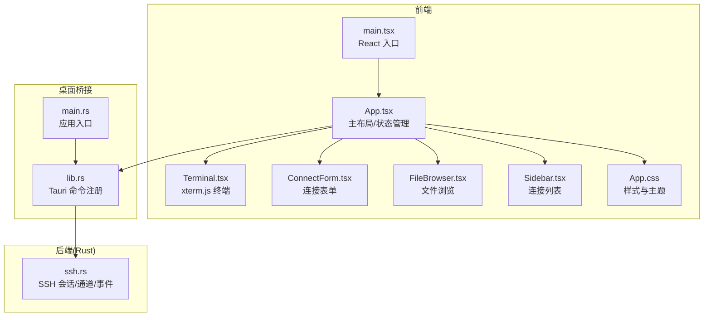
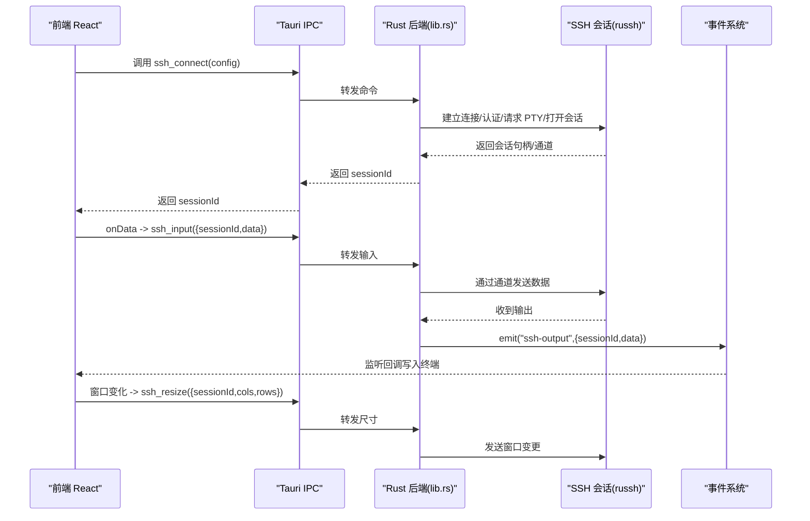
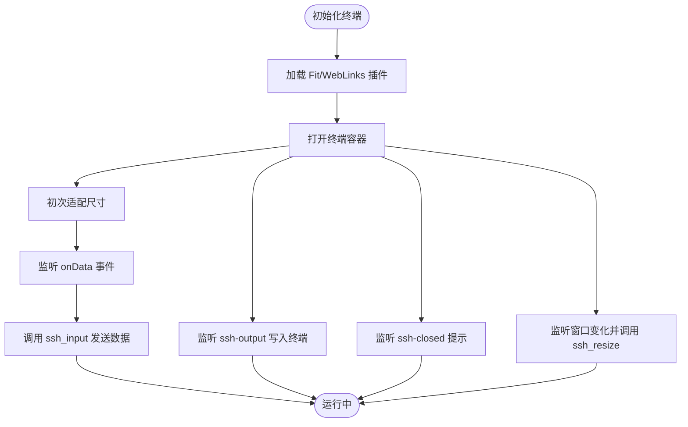
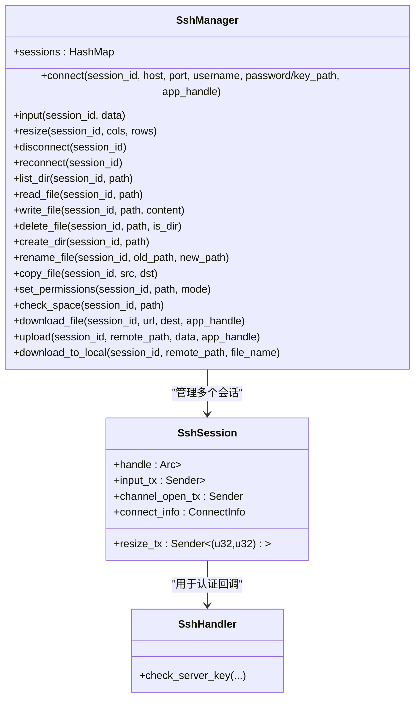
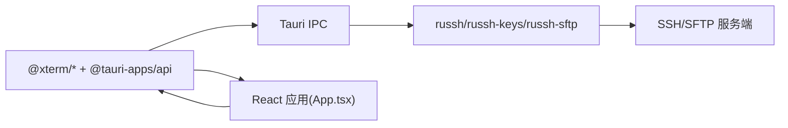

# 终端交互系统

<cite>
**本文引用的文件**
- [main.tsx](file://src/main.tsx)
- [App.tsx](file://src/App.tsx)
- [Terminal.tsx](file://src/components/Terminal.tsx)
- [lib.rs](file://src-tauri/src/lib.rs)
- [ssh.rs](file://src-tauri/src/ssh.rs)
- [main.rs](file://src-tauri/src/main.rs)
- [Cargo.toml](file://src-tauri/Cargo.toml)
- [package.json](file://package.json)
- [App.css](file://src/App.css)
- [ConnectForm.tsx](file://src/components/ConnectForm.tsx)
- [FileBrowser.tsx](file://src/components/FileBrowser.tsx)
- [Sidebar.tsx](file://src/components/Sidebar.tsx)
- [README.md](file://README.md)
</cite>

## 目录
1. [简介](#简介)
2. [项目结构](#项目结构)
3. [核心组件](#核心组件)
4. [架构总览](#架构总览)
5. [详细组件分析](#详细组件分析)
6. [依赖关系分析](#依赖关系分析)
7. [性能考虑](#性能考虑)
8. [故障排查指南](#故障排查指南)
9. [结论](#结论)
10. [附录](#附录)

## 简介
本项目是一个基于 Tauri + React 的跨平台桌面 SSH 工具，提供图形化的连接管理、文件浏览与终端交互能力。终端部分采用 xterm.js，通过 Tauri IPC 与 Rust 后端进行双向通信，实现安全的 SSH 会话管理、实时数据流处理与终端渲染。系统支持自动重连、窗口自适应、样式定制、快捷键与拖拽等用户体验优化。

## 项目结构
前端使用 React + TypeScript，后端使用 Rust + Tauri，终端渲染由 xterm.js 提供。主要模块划分如下：
- 前端入口与主应用：src/main.tsx、src/App.tsx
- 终端组件：src/components/Terminal.tsx
- 文件浏览器与连接表单：src/components/FileBrowser.tsx、src/components/ConnectForm.tsx、src/components/Sidebar.tsx
- 桌面桥接与命令注册：src-tauri/src/lib.rs
- SSH 会话与通道管理：src-tauri/src/ssh.rs
- 应用入口与构建配置：src-tauri/src/main.rs、src-tauri/Cargo.toml、package.json
- 样式与主题：src/App.css

图表来源
- [main.tsx:1-11](file://src/main.tsx#L1-L11)
- [App.tsx:1-415](file://src/App.tsx#L1-L415)
- [Terminal.tsx:1-150](file://src/components/Terminal.tsx#L1-L150)
- [ConnectForm.tsx:1-232](file://src/components/ConnectForm.tsx#L1-L232)
- [FileBrowser.tsx:1-800](file://src/components/FileBrowser.tsx#L1-L800)
- [Sidebar.tsx:1-155](file://src/components/Sidebar.tsx#L1-L155)
- [lib.rs:1-319](file://src-tauri/src/lib.rs#L1-L319)
- [ssh.rs:1-654](file://src-tauri/src/ssh.rs#L1-L654)
- [main.rs:1-7](file://src-tauri/src/main.rs#L1-L7)

章节来源
- [README.md:49-74](file://README.md#L49-L74)
- [package.json:1-28](file://package.json#L1-L28)
- [Cargo.toml:1-33](file://src-tauri/Cargo.toml#L1-L33)

## 核心组件
- 终端组件 Terminal：封装 xterm.js 初始化、插件加载、事件监听、窗口自适应与数据流回显。
- SSH 管理器 SshManager：负责连接建立、认证、PTY 请求、会话通道、窗口尺寸变更、数据收发与断线事件。
- Tauri 命令层：将前端调用映射为后端操作，如 ssh_connect、ssh_input、ssh_resize、ssh_disconnect、ssh_upload 等。
- 主应用 App：协调连接状态、自动重连、事件监听、分屏布局与拖拽调整。

章节来源
- [Terminal.tsx:17-150](file://src/components/Terminal.tsx#L17-L150)
- [ssh.rs:58-654](file://src-tauri/src/ssh.rs#L58-L654)
- [lib.rs:21-319](file://src-tauri/src/lib.rs#L21-L319)
- [App.tsx:37-415](file://src/App.tsx#L37-L415)

## 架构总览
系统采用“前端 React + Tauri IPC + Rust 后端”的三层架构。前端通过 @tauri-apps/api 发起命令调用与事件订阅；后端通过 Tauri 注册命令，使用 russh 建立 SSH 会话，维护通道与事件，向前端推送输出事件。

图表来源
- [lib.rs:21-74](file://src-tauri/src/lib.rs#L21-L74)
- [ssh.rs:71-199](file://src-tauri/src/ssh.rs#L71-L199)
- [Terminal.tsx:68-101](file://src/components/Terminal.tsx#L68-L101)

## 详细组件分析

### 终端组件 Terminal（xterm.js 集成）
- 初始化与配置
  - 创建 XTerm 实例，启用光标闪烁、字体族与透明背景。
  - 加载 FitAddon 自动适配容器尺寸，WebLinksAddon 支持点击链接。
  - 设置主题色板，覆盖默认配色以适配暗色界面。
- 数据流与事件
  - onData 回调通过 invoke('ssh_input') 将用户输入转发给后端。
  - 监听 'ssh-output' 事件，将远端输出写入终端。
  - 监听 'ssh-closed' 事件，提示会话已关闭。
- 窗口自适应
  - 初始化后延时触发 fitAddon.fit()，随后监听 window.resize 事件，动态计算 cols/rows 并调用 ssh_resize。
- 生命周期
  - 组件卸载时移除事件监听、清理定时器、释放终端实例。

图表来源
- [Terminal.tsx:27-121](file://src/components/Terminal.tsx#L27-L121)

章节来源
- [Terminal.tsx:17-150](file://src/components/Terminal.tsx#L17-L150)

### SSH 会话管理（SshManager）
- 连接与认证
  - 使用 russh::client::connect 建立连接，支持公钥与密码两种认证方式。
  - 请求 PTY 并启动 shell 会话，准备交互环境。
- 通道与后台任务
  - 通过 mpsc 队列接收输入、窗口尺寸变更与通道打开请求。
  - 后台任务循环处理通道消息：收到 Data 则转为 UTF-8 文本并通过事件系统 emit('ssh-output') 推送给前端；收到 Close/Eof 则发出 'ssh-disconnected'。
- 输入与尺寸
  - input/resize 方法通过通道发送数据与窗口变更。
- SFTP 与文件操作
  - 通过 request_subsystem("sftp") 初始化 SFTP 会话，支持列出目录、读写文件、删除、重命名、复制、权限设置、下载到本地等。
- 断开与重连
  - disconnect 使用超时避免阻塞；reconnect 复用原连接信息重新建立。

图表来源
- [ssh.rs:58-654](file://src-tauri/src/ssh.rs#L58-L654)

章节来源
- [ssh.rs:58-654](file://src-tauri/src/ssh.rs#L58-L654)

### Tauri 命令层（lib.rs）
- 命令注册
  - 通过 #[tauri::command] 宏注册 ssh_connect、ssh_input、ssh_resize、ssh_disconnect、ssh_upload、ssh_get_cwd、ssh_list_dir、ssh_read_file、ssh_write_file、ssh_delete_file、ssh_create_dir、ssh_rename_file、ssh_copy_file、ssh_set_permissions、ssh_check_space、ssh_download_file、ssh_download_to_local、ssh_reconnect、config_list、config_save、config_delete、settings_load、settings_save。
- 事件发射
  - 在 ssh 输出与断开时通过 app_handle.emit 触发前端事件，供 Terminal 与 App 订阅。
- 应用初始化
  - setup 中设置窗口尺寸与居中，便于首次体验。

章节来源
- [lib.rs:21-319](file://src-tauri/src/lib.rs#L21-L319)

### 主应用 App（状态与交互）
- 连接生命周期
  - 通过 invoke('ssh_connect') 建立会话，记录 sessionId；disconnect 清理状态。
- 自动重连
  - 监听 'ssh-disconnected' 事件，按配置周期尝试重连，支持最大次数限制与手动断开标记。
- 文件上传
  - 选择本地文件后转为 Base64，调用 ssh_upload，监听 upload-progress 事件更新进度。
- 分屏与拖拽
  - 侧栏宽度与上下区域比例可拖拽调整，提升多视图协作效率。
- 快捷提示与菜单
  - 顶部菜单支持自动重连开关与参数展示，底部 toast 提示连接状态与错误信息。

章节来源
- [App.tsx:37-415](file://src/App.tsx#L37-L415)

### 文件浏览器与连接表单
- 文件浏览器
  - 通过 ssh_list_dir 获取目录内容，支持拖拽上传、剪贴板复制/剪切/粘贴、重命名、删除、权限设置、远程下载到本地等。
  - 监听 download-progress 与 upload-progress 事件，实时反馈进度。
- 连接表单
  - 支持主机、端口、用户名、认证类型（密码/密钥）与“记住”选项；连接成功后显示上传按钮与进度条。

章节来源
- [FileBrowser.tsx:1-800](file://src/components/FileBrowser.tsx#L1-L800)
- [ConnectForm.tsx:1-232](file://src/components/ConnectForm.tsx#L1-L232)

## 依赖关系分析
- 前端依赖
  - @xterm/xterm、@xterm/addon-fit、@xterm/addon-web-links：终端渲染与适配。
  - @tauri-apps/api：命令调用与事件监听。
- 后端依赖
  - russh、russh-keys、russh-sftp：SSH 与 SFTP 协议实现。
  - tokio：异步运行时。
  - tauri、tauri-plugin-log：桌面桥接与日志。
  - serde_json、uuid、open：序列化、标识符与打开外部程序。

图表来源
- [package.json:15-26](file://package.json#L15-L26)
- [Cargo.toml:18-33](file://src-tauri/Cargo.toml#L18-L33)

章节来源
- [package.json:15-26](file://package.json#L15-L26)
- [Cargo.toml:18-33](file://src-tauri/Cargo.toml#L18-L33)

## 性能考虑
- 异步与背压
  - 后端使用 mpsc 队列承载输入与尺寸变更，避免阻塞事件循环；通道消息通过 select! 并发处理，减少延迟。
- 字节到文本转换
  - 输出统一转为 UTF-8 字符串再通过事件推送，确保跨语言边界的一致性。
- 传输优化
  - SFTP 写入采用 32KB 分块，结合进度事件，兼顾吞吐与可观测性。
- 终端适配
  - FitAddon 动态计算行列数，减少重绘与滚动抖动；resize 事件去抖动，避免频繁请求。
- UI 响应
  - 上传/下载进度通过事件驱动，避免阻塞主线程；Toast 与分屏拖拽提升交互流畅度。

## 故障排查指南
- 连接失败
  - 检查认证方式是否正确（密码或密钥路径），确认主机、端口与用户名。
  - 查看后端日志（Tauri 日志插件）定位 russh 错误。
- 会话断开
  - App 监听 'ssh-disconnected' 事件，若未开启自动重连，需手动重新连接。
  - 若为网络波动导致，可调整自动重连间隔与最大尝试次数。
- 终端无输出
  - 确认 Terminal 已监听 'ssh-output' 事件且 sessionId 匹配当前会话。
  - 检查后端通道是否正常，是否存在 EOF/Close。
- 上传/下载异常
  - 检查磁盘空间与写权限（check_space），确认目标路径存在且可写。
  - 监听 upload-progress/download-progress 事件，定位卡顿阶段。
- 窗口不自适应
  - 确认 FitAddon 已初始化，window.resize 是否触发；检查 ssh_resize 是否被调用。

章节来源
- [App.tsx:123-174](file://src/App.tsx#L123-L174)
- [Terminal.tsx:81-111](file://src/components/Terminal.tsx#L81-L111)
- [ssh.rs:135-178](file://src-tauri/src/ssh.rs#L135-L178)

## 结论
该系统通过 Tauri 将前端 React 与 Rust 后端无缝整合，借助 xterm.js 提供高质量终端渲染，配合 russh 实现安全可靠的 SSH 会话管理。系统具备完善的事件驱动模型、自动重连与进度反馈、灵活的样式与交互设计，适合在桌面环境中进行高效的远程运维与文件管理。

## 附录
- 开发与构建
  - 开发：npx tauri dev
  - 打包：npx tauri build
- 技术栈概览
  - 前端：React + TypeScript + xterm.js
  - 后端：Rust + russh + tokio
  - 桌面：Tauri
  - 通信：Tauri IPC + 事件

章节来源
- [README.md:9-38](file://README.md#L9-L38)