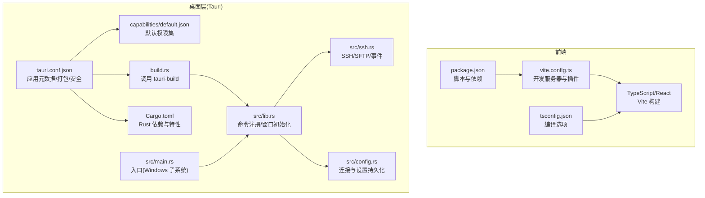
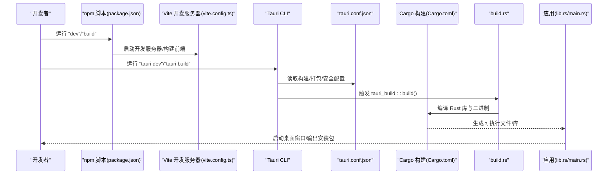
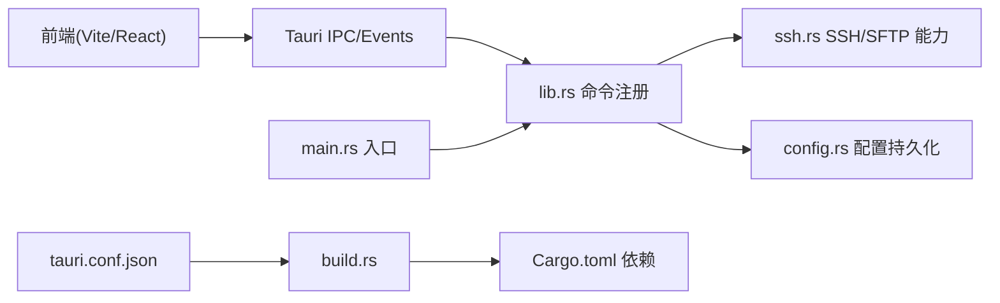

# 部署与打包

<cite>
**本文引用的文件**
- [package.json](file://package.json)
- [vite.config.ts](file://vite.config.ts)
- [tsconfig.json](file://tsconfig.json)
- [src-tauri/Cargo.toml](file://src-tauri/Cargo.toml)
- [src-tauri/tauri.conf.json](file://src-tauri/tauri.conf.json)
- [src-tauri/build.rs](file://src-tauri/build.rs)
- [src-tauri/capabilities/default.json](file://src-tauri/capabilities/default.json)
- [src-tauri/src/main.rs](file://src-tauri/src/main.rs)
- [src-tauri/src/lib.rs](file://src-tauri/src/lib.rs)
- [src-tauri/src/ssh.rs](file://src-tauri/src/ssh.rs)
- [src-tauri/src/config.rs](file://src-tauri/src/config.rs)
- [README.md](file://README.md)
</cite>

## 目录
1. [简介](#简介)
2. [项目结构](#项目结构)
3. [核心组件](#核心组件)
4. [架构总览](#架构总览)
5. [详细组件分析](#详细组件分析)
6. [依赖关系分析](#依赖关系分析)
7. [性能考虑](#性能考虑)
8. [故障排查指南](#故障排查指南)
9. [结论](#结论)
10. [附录](#附录)

## 简介
本指南面向SSH工具项目的部署与打包，覆盖开发构建与生产构建差异、Tauri打包配置（应用元数据、图标、权限与安全策略）、跨平台发布（Windows、macOS、Linux）以及安装包制作（MSI、NSIS、便携版）。同时提供版本管理、更新机制与发布流程的最佳实践建议，帮助团队高效、稳定地交付产品。

## 项目结构
该项目采用“前端React + TypeScript + Vite”与“后端Rust + Tauri”的混合架构：
- 前端位于 src/，使用 React 19 与 TypeScript，通过 Vite 构建与开发。
- 桌面层由 Tauri 2.x 提供，Rust 代码位于 src-tauri/，包含命令注册、SSH/SFTP 能力与配置持久化。
- 包管理与脚本由 package.json 管理；Tauri 配置集中在 tauri.conf.json；Rust 依赖在 Cargo.toml 中定义。

图表来源
- [package.json:1-28](file://package.json#L1-L28)
- [vite.config.ts:1-15](file://vite.config.ts#L1-L15)
- [tsconfig.json:1-26](file://tsconfig.json#L1-L26)
- [src-tauri/tauri.conf.json:1-41](file://src-tauri/tauri.conf.json#L1-L41)
- [src-tauri/capabilities/default.json:1-12](file://src-tauri/capabilities/default.json#L1-L12)
- [src-tauri/build.rs:1-4](file://src-tauri/build.rs#L1-L4)
- [src-tauri/Cargo.toml:1-33](file://src-tauri/Cargo.toml#L1-L33)
- [src-tauri/src/main.rs:1-7](file://src-tauri/src/main.rs#L1-L7)
- [src-tauri/src/lib.rs:1-319](file://src-tauri/src/lib.rs#L1-L319)
- [src-tauri/src/ssh.rs:1-654](file://src-tauri/src/ssh.rs#L1-L654)
- [src-tauri/src/config.rs:1-113](file://src-tauri/src/config.rs#L1-L113)

章节来源
- [README.md:1-74](file://README.md#L1-L74)

## 核心组件
- 前端构建与开发
  - 使用 Vite 作为开发服务器与打包工具，React + TypeScript，支持热重载与严格端口控制。
  - 开发脚本与预览脚本分别用于启动开发服务器与本地预览。
- 桌面层与命令桥接
  - Tauri Builder 注册大量 SSH/SFTP/文件操作命令，并在 setup 阶段初始化日志插件与窗口尺寸。
  - 通过 IPC 与事件实现前端与后端的双向通信。
- SSH/SFTP 能力
  - 基于 russh 与 russh-sftp 实现连接、交互、SFTP 文件操作、进度事件与断线重连等。
- 配置持久化
  - 连接配置与应用设置存储在用户配置目录中，支持增删改查与默认值。

章节来源
- [vite.config.ts:1-15](file://vite.config.ts#L1-L15)
- [package.json:6-10](file://package.json#L6-L10)
- [src-tauri/src/lib.rs:267-318](file://src-tauri/src/lib.rs#L267-L318)
- [src-tauri/src/ssh.rs:1-654](file://src-tauri/src/ssh.rs#L1-L654)
- [src-tauri/src/config.rs:1-113](file://src-tauri/src/config.rs#L1-L113)

## 架构总览
下图展示从开发到打包的关键流程与组件交互。

图表来源
- [package.json:6-10](file://package.json#L6-L10)
- [vite.config.ts:7-12](file://vite.config.ts#L7-L12)
- [src-tauri/tauri.conf.json:6-11](file://src-tauri/tauri.conf.json#L6-L11)
- [src-tauri/build.rs:1-4](file://src-tauri/build.rs#L1-L4)
- [src-tauri/Cargo.toml:1-33](file://src-tauri/Cargo.toml#L1-L33)
- [src-tauri/src/lib.rs:267-318](file://src-tauri/src/lib.rs#L267-L318)
- [src-tauri/src/main.rs:4-6](file://src-tauri/src/main.rs#L4-L6)

## 详细组件分析

### 开发构建与生产构建
- 开发构建
  - 前端：Vite 在本地启动开发服务器，监听指定端口，忽略 src-tauri 目录以避免重复编译。
  - 桌面：Tauri 通过 beforeDevCommand 调用 npm run dev，启动前端开发服务器，再启动 Rust 应用。
- 生产构建
  - 前端：先执行 TypeScript 编译，再进行 Vite 构建，产物输出至 dist 目录。
  - 桌面：Tauri 通过 beforeBuildCommand 调用 npm run build，随后进行打包。

章节来源
- [vite.config.ts:7-12](file://vite.config.ts#L7-L12)
- [src-tauri/tauri.conf.json:6-11](file://src-tauri/tauri.conf.json#L6-L11)
- [package.json:7-9](file://package.json#L7-L9)

### Tauri 打包配置详解
- 应用元数据与标识
  - 产品名称、版本、标识符在 tauri.conf.json 中定义，确保跨平台一致的品牌识别。
- 前端资源与开发URL
  - 前端构建产物目录与开发URL在 tauri.conf.json 的 build 字段中声明，保证开发与打包时的路径一致性。
- 窗口与安全策略
  - 窗口尺寸、可调整性、全屏等属性在 app.windows 中配置。
  - 安全策略中的 CSP 设置为 null，表示不强制 CSP，便于开发调试；生产环境建议明确设置或启用默认策略。
- 图标与多目标打包
  - bundle.icon 指定多分辨率图标，包含 Windows ICO 与 macOS ICNS，满足不同平台要求。
  - bundle.targets 设置为 all，表示同时生成多个平台的目标包。
- 能力与权限
  - capabilities/default.json 定义默认权限集，当前启用 core:default 并限定窗口 main。
  - 可根据需要扩展能力集，限制敏感 API 访问范围，遵循最小权限原则。

章节来源
- [src-tauri/tauri.conf.json:1-41](file://src-tauri/tauri.conf.json#L1-L41)
- [src-tauri/capabilities/default.json:1-12](file://src-tauri/capabilities/default.json#L1-L12)

### 跨平台发布流程
- Windows
  - 使用 NSIS 或 MSI 安装包；NSIS 安装包与 MSI 安装包路径在 README 中给出。
  - Windows 子系统在发布版本中被启用，避免额外控制台窗口。
- macOS
  - 通过 bundle.icon 中的 icns 图标生成 DMG 安装包；注意签名与公证流程以满足 App Store 或 Gatekeeper 要求。
- Linux
  - 支持多目标打包；具体包类型（如 AppImage、deb、rpm）取决于 Tauri CLI 版本与平台工具链配置。

章节来源
- [README.md:25-38](file://README.md#L25-L38)
- [src-tauri/src/main.rs:1-2](file://src-tauri/src/main.rs#L1-L2)
- [src-tauri/tauri.conf.json:26-39](file://src-tauri/tauri.conf.json#L26-L39)

### 安装包制作指南
- MSI（Windows）
  - 使用 Tauri CLI 执行打包，生成 MSI 安装包；安装包路径参考 README。
- NSIS（Windows）
  - 生成 NSIS 安装包，适合传统安装体验；安装包路径参考 README。
- 便携版（Portable）
  - 可直接使用 release 目录下的可执行文件与 dist 资源，配合便携式配置目录实现免安装运行。

章节来源
- [README.md:25-38](file://README.md#L25-L38)

### 版本管理策略与发布流程
- 版本号管理
  - 建议在 package.json 与 src-tauri/Cargo.toml 中统一维护版本号，保持前后端一致。
- 发布流程
  - 建议在 CI 中执行“构建 + 打包 + 上传制品”，并生成变更日志与签名校验文件。
  - 对 Windows 安装包进行数字签名，macOS 进行公证，Linux 包提交至分发渠道或提供签名校验。

章节来源
- [package.json:4](file://package.json#L4)
- [src-tauri/Cargo.toml:3](file://src-tauri/Cargo.toml#L3)

### 更新机制最佳实践
- 自动更新
  - 可结合 Tauri 的 Updater 插件，配置更新源与签名验证，实现静默更新。
- 手动更新
  - 提供下载链接与版本说明，引导用户手动升级。
- 渐进式发布
  - 通过灰度通道或测试版渠道收集反馈，降低风险。

（本节为通用实践建议，未直接分析具体文件）

## 依赖关系分析
- 前端到桌面层
  - 前端通过 Tauri 的 invoke 与事件系统调用后端命令，后端通过命令处理器完成 SSH/SFTP 操作。
- 桌面层内部
  - lib.rs 注册命令并初始化窗口；ssh.rs 实现 SSH/SFTP 能力；config.rs 负责配置持久化。
- 构建链路
  - tauri.conf.json 决定前端产物路径与打包目标；build.rs 调用 tauri-build；Cargo.toml 管理 Rust 依赖。

图表来源
- [src-tauri/src/lib.rs:267-318](file://src-tauri/src/lib.rs#L267-L318)
- [src-tauri/src/ssh.rs:1-654](file://src-tauri/src/ssh.rs#L1-L654)
- [src-tauri/src/config.rs:1-113](file://src-tauri/src/config.rs#L1-L113)
- [src-tauri/tauri.conf.json:6-11](file://src-tauri/tauri.conf.json#L6-L11)
- [src-tauri/build.rs:1-4](file://src-tauri/build.rs#L1-L4)
- [src-tauri/Cargo.toml:18-32](file://src-tauri/Cargo.toml#L18-L32)
- [src-tauri/src/main.rs:4-6](file://src-tauri/src/main.rs#L4-L6)

章节来源
- [src-tauri/src/lib.rs:267-318](file://src-tauri/src/lib.rs#L267-L318)
- [src-tauri/src/ssh.rs:1-654](file://src-tauri/src/ssh.rs#L1-L654)
- [src-tauri/src/config.rs:1-113](file://src-tauri/src/config.rs#L1-L113)
- [src-tauri/tauri.conf.json:1-41](file://src-tauri/tauri.conf.json#L1-L41)
- [src-tauri/build.rs:1-4](file://src-tauri/build.rs#L1-L4)
- [src-tauri/Cargo.toml:1-33](file://src-tauri/Cargo.toml#L1-L33)
- [src-tauri/src/main.rs:1-7](file://src-tauri/src/main.rs#L1-L7)

## 性能考虑
- 前端性能
  - 使用 Vite 的按需加载与严格的模块解析配置，减少打包体积与提升冷启动速度。
- 桌面层性能
  - SSH/SFTP 操作采用流式事件与分块写入，避免大文件阻塞 UI；合理设置超时与重连策略。
- 打包体积
  - 通过最小权限能力集与精简图标资源，降低安装包大小；在生产构建中禁用不必要的日志与调试信息。

（本节提供一般性指导，未直接分析具体文件）

## 故障排查指南
- 开发阶段无法访问前端
  - 检查 vite.config.ts 的 server.port 与 strictPort 配置，确认未被占用。
- 打包失败或路径错误
  - 确认 tauri.conf.json 的 frontendDist 与 beforeBuildCommand 指向正确的前端构建产物。
- 权限不足导致功能异常
  - 检查 capabilities/default.json 的权限集是否满足需求；必要时添加更细粒度的能力。
- 安全策略问题
  - 生产环境建议设置明确的 CSP；若仍出现安全相关报错，检查内容安全策略与资源加载方式。
- Windows 控制台窗口
  - 确认发布版本已启用 windows_subsystem；避免在调试版本中误用。

章节来源
- [vite.config.ts:7-12](file://vite.config.ts#L7-L12)
- [src-tauri/tauri.conf.json:6-11](file://src-tauri/tauri.conf.json#L6-L11)
- [src-tauri/capabilities/default.json:8-10](file://src-tauri/capabilities/default.json#L8-L10)
- [src-tauri/src/main.rs:1-2](file://src-tauri/src/main.rs#L1-L2)

## 结论
本指南基于现有配置与代码，梳理了 SSH 工具项目的开发与打包流程、Tauri 配置要点、跨平台发布与安装包制作方法，并提供了版本管理与更新机制的实践建议。建议在 CI 中固化构建与打包步骤，完善签名与公证流程，持续优化性能与安全性，确保高质量交付。

## 附录
- 快速命令
  - 开发：npx tauri dev
  - 生产构建：npx tauri build
- 关键配置定位
  - 前端：package.json、vite.config.ts、tsconfig.json
  - 桌面：tauri.conf.json、capabilities/default.json、build.rs、Cargo.toml
  - 应用入口：src-tauri/src/main.rs、src-tauri/src/lib.rs
  - 能力与命令：src-tauri/src/ssh.rs、src-tauri/src/config.rs

章节来源
- [README.md:9-29](file://README.md#L9-L29)
- [package.json:6-10](file://package.json#L6-L10)
- [vite.config.ts:1-15](file://vite.config.ts#L1-L15)
- [tsconfig.json:1-26](file://tsconfig.json#L1-L26)
- [src-tauri/tauri.conf.json:1-41](file://src-tauri/tauri.conf.json#L1-L41)
- [src-tauri/capabilities/default.json:1-12](file://src-tauri/capabilities/default.json#L1-L12)
- [src-tauri/build.rs:1-4](file://src-tauri/build.rs#L1-L4)
- [src-tauri/Cargo.toml:1-33](file://src-tauri/Cargo.toml#L1-L33)
- [src-tauri/src/main.rs:1-7](file://src-tauri/src/main.rs#L1-L7)
- [src-tauri/src/lib.rs:1-319](file://src-tauri/src/lib.rs#L1-L319)
- [src-tauri/src/ssh.rs:1-654](file://src-tauri/src/ssh.rs#L1-L654)
- [src-tauri/src/config.rs:1-113](file://src-tauri/src/config.rs#L1-L113)