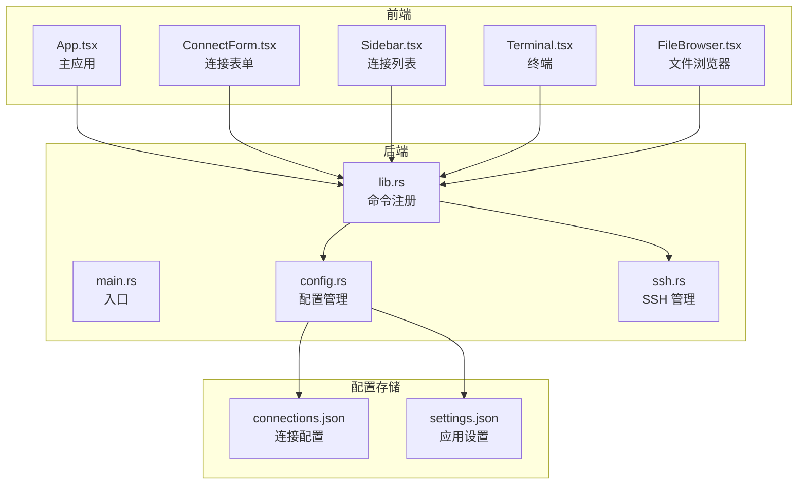
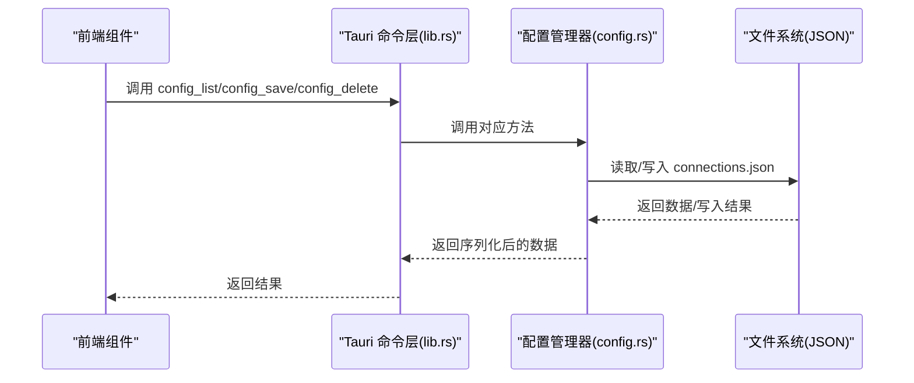
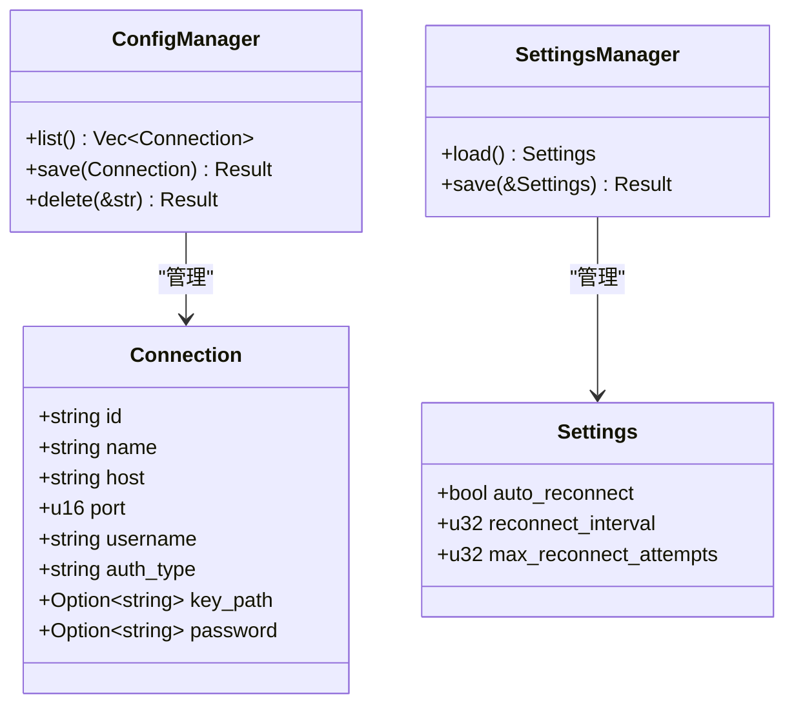
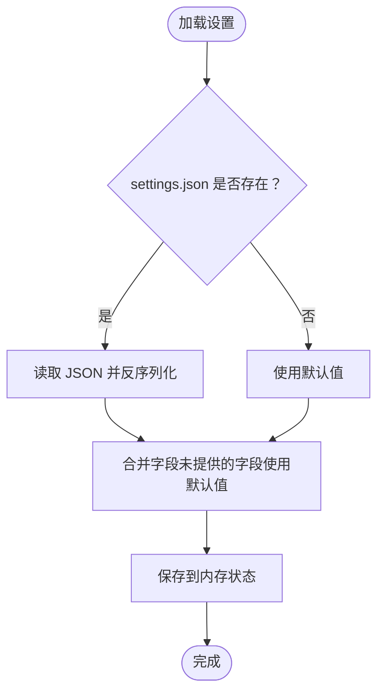
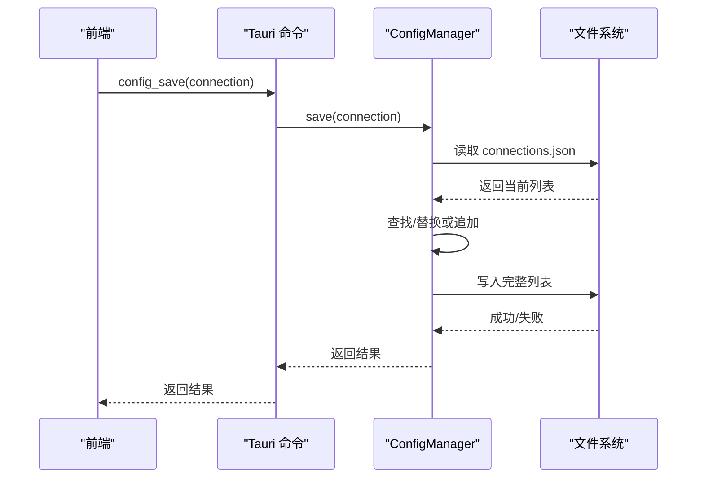
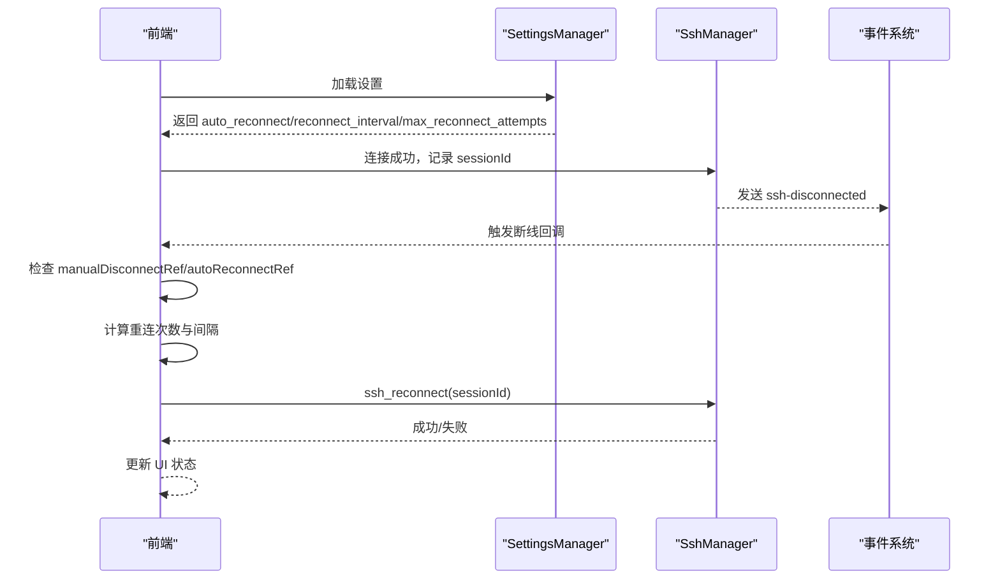
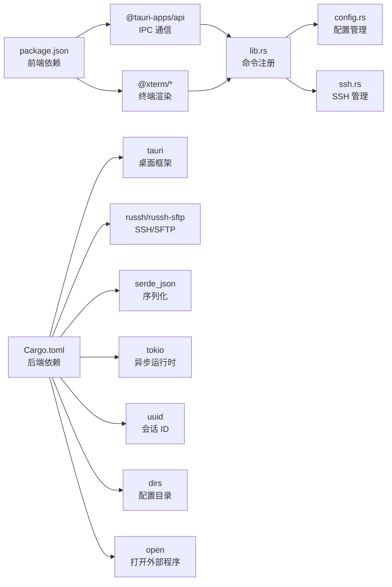

# 配置管理系统

<cite>
**本文档引用的文件**
- [config.rs](file://src-tauri/src/config.rs)
- [lib.rs](file://src-tauri/src/lib.rs)
- [ssh.rs](file://src-tauri/src/ssh.rs)
- [App.tsx](file://src/App.tsx)
- [ConnectForm.tsx](file://src/components/ConnectForm.tsx)
- [Sidebar.tsx](file://src/components/Sidebar.tsx)
- [Terminal.tsx](file://src/components/Terminal.tsx)
- [FileBrowser.tsx](file://src/components/FileBrowser.tsx)
- [main.rs](file://src-tauri/src/main.rs)
- [tauri.conf.json](file://src-tauri/tauri.conf.json)
- [Cargo.toml](file://src-tauri/Cargo.toml)
- [package.json](file://package.json)
- [README.md](file://README.md)
</cite>

## 目录
1. [简介](#简介)
2. [项目结构](#项目结构)
3. [核心组件](#核心组件)
4. [架构总览](#架构总览)
5. [详细组件分析](#详细组件分析)
6. [依赖关系分析](#依赖关系分析)
7. [性能考虑](#性能考虑)
8. [故障排查指南](#故障排查指南)
9. [结论](#结论)
10. [附录](#附录)

## 简介
本项目为一个基于 Tauri + React 的桌面 SSH 工具，提供连接配置与应用设置的本地持久化管理。配置系统采用 JSON 文件作为存储介质，分别管理“连接配置”和“应用设置”。系统通过 Tauri 命令桥接前端与后端，实现配置的读取、保存、删除等操作；同时提供自动重连、断线检测、文件传输等高级功能。

## 项目结构
项目采用前后端分离的桌面应用架构：
- 前端使用 React + TypeScript，负责 UI 交互与事件监听
- 后端使用 Rust + Tauri，负责 SSH 连接、文件传输、配置持久化
- 配置文件位于用户配置目录下的专用子目录中

**图表来源**
- [main.rs:1-7](file://src-tauri/src/main.rs#L1-L7)
- [lib.rs:268-318](file://src-tauri/src/lib.rs#L268-L318)
- [config.rs:19-25](file://src-tauri/src/config.rs#L19-L25)
- [ssh.rs:58-61](file://src-tauri/src/ssh.rs#L58-L61)

**章节来源**
- [README.md:49-73](file://README.md#L49-L73)
- [tauri.conf.json:1-41](file://src-tauri/tauri.conf.json#L1-L41)

## 核心组件
- 配置管理器（ConfigManager）：负责连接配置的增删改查与持久化
- 设置管理器（SettingsManager）：负责应用设置的加载与保存
- SSH 管理器（SshManager）：负责 SSH 会话生命周期、事件分发与文件操作
- 前端组件：连接表单、侧边栏、终端、文件浏览器等

**章节来源**
- [config.rs:27-58](file://src-tauri/src/config.rs#L27-L58)
- [config.rs:94-112](file://src-tauri/src/config.rs#L94-L112)
- [ssh.rs:58-61](file://src-tauri/src/ssh.rs#L58-L61)
- [lib.rs:268-318](file://src-tauri/src/lib.rs#L268-L318)

## 架构总览
系统通过 Tauri 命令桥接前端与后端，前端通过 invoke 调用后端命令，后端执行业务逻辑并将结果返回给前端。配置文件采用 JSON 格式存储于用户配置目录，避免跨平台兼容问题。

**图表来源**
- [lib.rs:221-233](file://src-tauri/src/lib.rs#L221-L233)
- [config.rs:29-58](file://src-tauri/src/config.rs#L29-L58)

**章节来源**
- [lib.rs:291-315](file://src-tauri/src/lib.rs#L291-L315)
- [config.rs:19-25](file://src-tauri/src/config.rs#L19-L25)

## 详细组件分析

### 连接配置管理（Connection）
- 数据模型：包含连接标识、名称、主机、端口、用户名、认证类型及可选的密钥路径或密码
- 存储位置：用户配置目录下的 ssh-tool/connections.json
- 持久化策略：每次保存时先读取现有列表，若存在相同 ID 则替换，否则追加，最后整体写回

**图表来源**
- [config.rs:5-17](file://src-tauri/src/config.rs#L5-L17)
- [config.rs:27-58](file://src-tauri/src/config.rs#L27-L58)
- [config.rs:62-84](file://src-tauri/src/config.rs#L62-L84)
- [config.rs:94-112](file://src-tauri/src/config.rs#L94-L112)

**章节来源**
- [config.rs:5-17](file://src-tauri/src/config.rs#L5-L17)
- [config.rs:29-58](file://src-tauri/src/config.rs#L29-L58)

### 应用设置管理（Settings）
- 默认值：自动重连开启、重连间隔 5 秒、最大尝试次数 10 次
- 存储位置：用户配置目录下的 ssh-tool/settings.json
- 加载策略：若文件不存在则使用默认值

**图表来源**
- [config.rs:96-112](file://src-tauri/src/config.rs#L96-L112)

**章节来源**
- [config.rs:62-84](file://src-tauri/src/config.rs#L62-L84)
- [config.rs:96-112](file://src-tauri/src/config.rs#L96-L112)

### 配置读取、写入与更新流程
- 读取：直接从 JSON 文件解析为对象列表
- 写入：先读取现有列表，定位目标 ID 替换或新增，再整体序列化写回
- 删除：过滤掉指定 ID 的条目后整体写回

**图表来源**
- [lib.rs:225-228](file://src-tauri/src/lib.rs#L225-L228)
- [config.rs:40-50](file://src-tauri/src/config.rs#L40-L50)

**章节来源**
- [lib.rs:225-228](file://src-tauri/src/lib.rs#L225-L228)
- [config.rs:40-50](file://src-tauri/src/config.rs#L40-L50)

### 并发访问控制与数据一致性
- 当前实现：配置文件采用一次性读取与整体写回的方式，未引入锁或原子写入
- 风险：多进程或多实例同时写入可能导致覆盖或丢失
- 建议改进：引入文件锁或临时文件 + 原子替换，确保写入过程不可中断

**章节来源**
- [config.rs:30-57](file://src-tauri/src/config.rs#L30-L57)

### 自动重连与断线处理
- 断线检测：SSH 通道关闭或 EOF 触发断线事件
- 自动重连：根据设置的间隔与最大尝试次数进行指数退避或固定间隔重试
- 用户手动断开：标记手动断开，避免触发自动重连

**图表来源**
- [App.tsx:124-164](file://src/App.tsx#L124-L164)
- [App.tsx:180-223](file://src/App.tsx#L180-L223)
- [lib.rs:248-255](file://src-tauri/src/lib.rs#L248-L255)
- [ssh.rs:146-151](file://src-tauri/src/ssh.rs#L146-L151)

**章节来源**
- [App.tsx:104-164](file://src/App.tsx#L104-L164)
- [lib.rs:248-255](file://src-tauri/src/lib.rs#L248-L255)
- [ssh.rs:633-652](file://src-tauri/src/ssh.rs#L633-L652)

### 配置迁移、默认值与兼容性
- 默认值：设置模块提供默认值函数与 Default 实现，确保新字段具备合理初始值
- 兼容性：反序列化时若 JSON 缺失字段，使用默认值填充，避免崩溃
- 迁移策略：建议在版本升级时增加版本号字段，读取时判断版本并执行迁移脚本

**章节来源**
- [config.rs:76-84](file://src-tauri/src/config.rs#L76-L84)
- [config.rs:96-112](file://src-tauri/src/config.rs#L96-L112)

### 备份、导入导出与故障恢复
- 备份：建议定期复制配置目录中的 JSON 文件作为备份
- 导入导出：可通过编辑 JSON 文件实现批量导入导出
- 故障恢复：当配置损坏时，删除 JSON 文件以恢复默认值；或从备份恢复

**章节来源**
- [config.rs:19-25](file://src-tauri/src/config.rs#L19-L25)
- [config.rs:86-92](file://src-tauri/src/config.rs#L86-L92)

## 依赖关系分析
- 前端依赖：React、@tauri-apps/api、xterm.js 及其插件
- 后端依赖：Tauri、russh、tokio、serde_json、uuid、dirs、open 等
- 命令注册：所有配置与 SSH 相关命令均在 lib.rs 中集中注册

**图表来源**
- [package.json:15-26](file://package.json#L15-L26)
- [Cargo.toml:18-32](file://src-tauri/Cargo.toml#L18-L32)
- [lib.rs:291-315](file://src-tauri/src/lib.rs#L291-L315)

**章节来源**
- [package.json:15-26](file://package.json#L15-L26)
- [Cargo.toml:18-32](file://src-tauri/Cargo.toml#L18-L32)

## 性能考虑
- JSON 读写：整体读取与写回，适合小规模配置；大规模配置建议分页或增量更新
- SSH 会话：使用 tokio 异步通道与后台任务，避免阻塞 UI
- 终端与文件传输：终端使用 xterm.js 插件，文件传输采用 SFTP 并分块写入，支持进度事件

[本节为通用指导，无需特定文件来源]

## 故障排查指南
- 配置无法保存：检查配置目录权限与磁盘空间；确认 JSON 格式正确
- 断线不重连：检查设置中的自动重连开关与重连间隔；查看断线事件是否被手动断开标记阻止
- SSH 连接失败：检查主机名、端口、认证方式；查看日志输出与错误提示
- 文件传输异常：确认远程路径存在且有写权限；检查网络稳定性与超时设置

**章节来源**
- [config.rs:30-57](file://src-tauri/src/config.rs#L30-L57)
- [ssh.rs:146-151](file://src-tauri/src/ssh.rs#L146-L151)
- [App.tsx:124-164](file://src/App.tsx#L124-L164)

## 结论
本配置管理系统以 JSON 文件为核心存储，结合 Tauri 命令桥实现了前后端协同的配置管理能力。系统在易用性与可维护性方面表现良好，但在并发写入与大规模配置场景下仍有优化空间。建议引入文件锁与原子写入、分页读写以及版本化迁移策略，进一步提升可靠性与扩展性。

[本节为总结，无需特定文件来源]

## 附录

### 配置文件格式与字段说明
- 连接配置（connections.json）
  - 字段：id、name、host、port、username、auth_type、key_path（可选）、password（可选）
  - 用途：保存用户常用连接，便于快速选择与一键连接
- 应用设置（settings.json）
  - 字段：auto_reconnect（布尔）、reconnect_interval（秒）、max_reconnect_attempts（次数）
  - 用途：控制自动重连行为与用户体验参数

**章节来源**
- [config.rs:5-17](file://src-tauri/src/config.rs#L5-L17)
- [config.rs:62-70](file://src-tauri/src/config.rs#L62-L70)

### 前端组件与配置交互
- 连接表单（ConnectForm.tsx）：收集连接参数，支持密码与密钥两种认证方式
- 侧边栏（Sidebar.tsx）：展示连接列表，支持上下文菜单与删除操作
- 终端（Terminal.tsx）：接收 SSH 输出并转发键盘输入
- 文件浏览器（FileBrowser.tsx）：提供目录浏览、文件编辑、上传下载等功能

**章节来源**
- [ConnectForm.tsx:3-24](file://src/components/ConnectForm.tsx#L3-L24)
- [Sidebar.tsx:4-20](file://src/components/Sidebar.tsx#L4-L20)
- [Terminal.tsx:9-15](file://src/components/Terminal.tsx#L9-L15)
- [FileBrowser.tsx:15-28](file://src/components/FileBrowser.tsx#L15-L28)