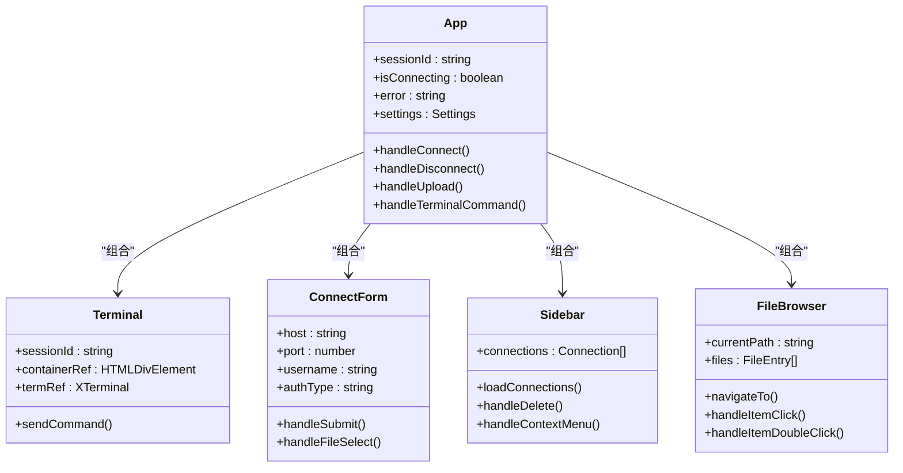
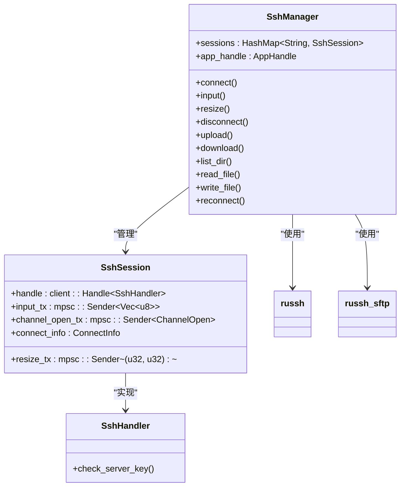
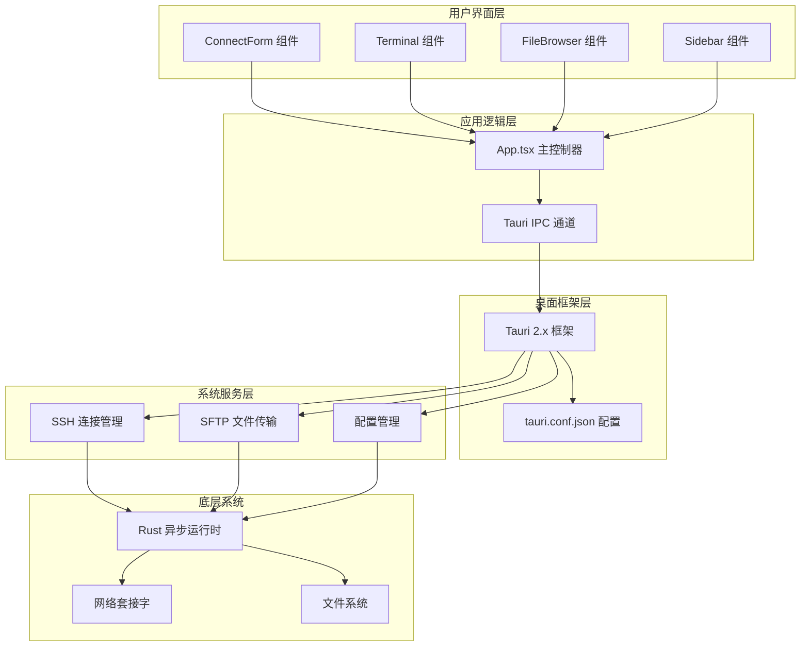
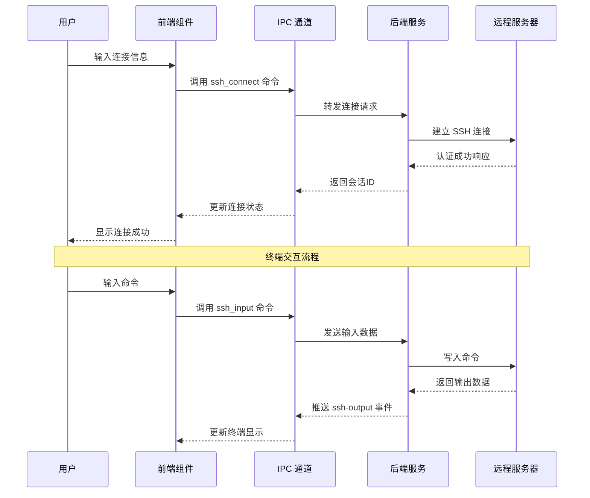
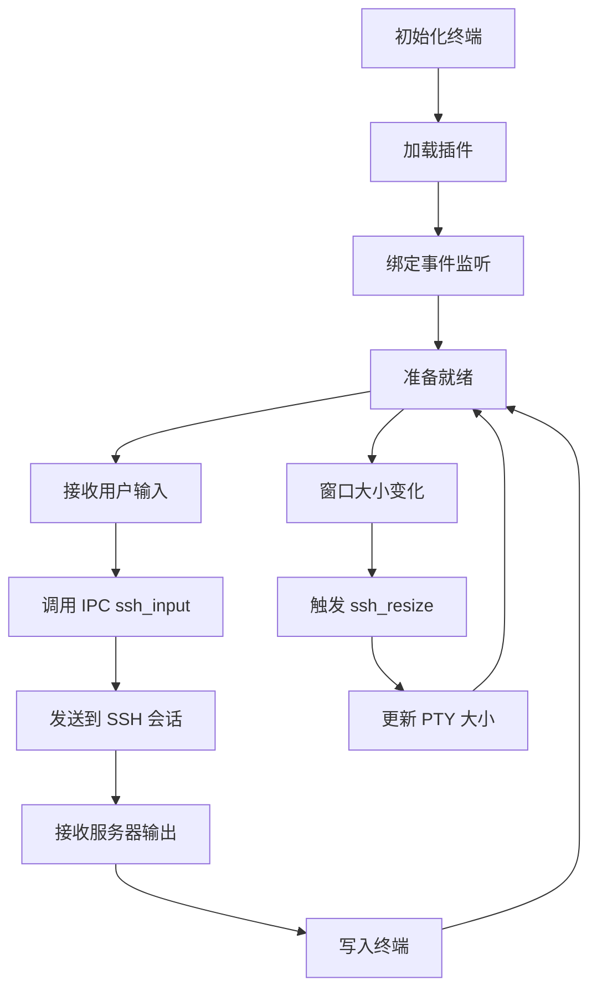
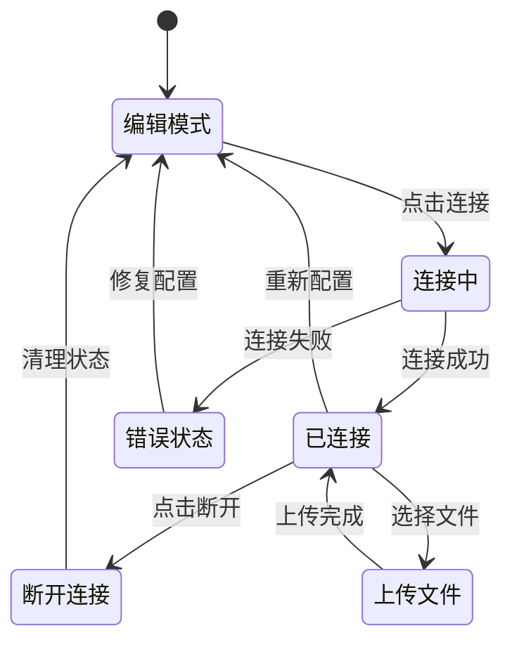
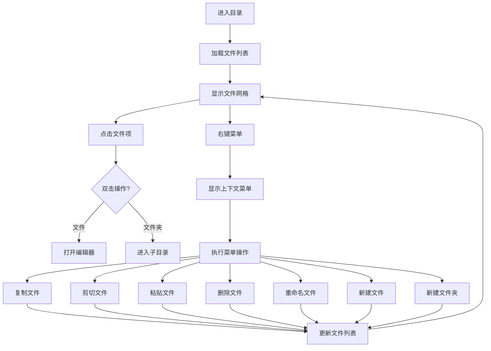
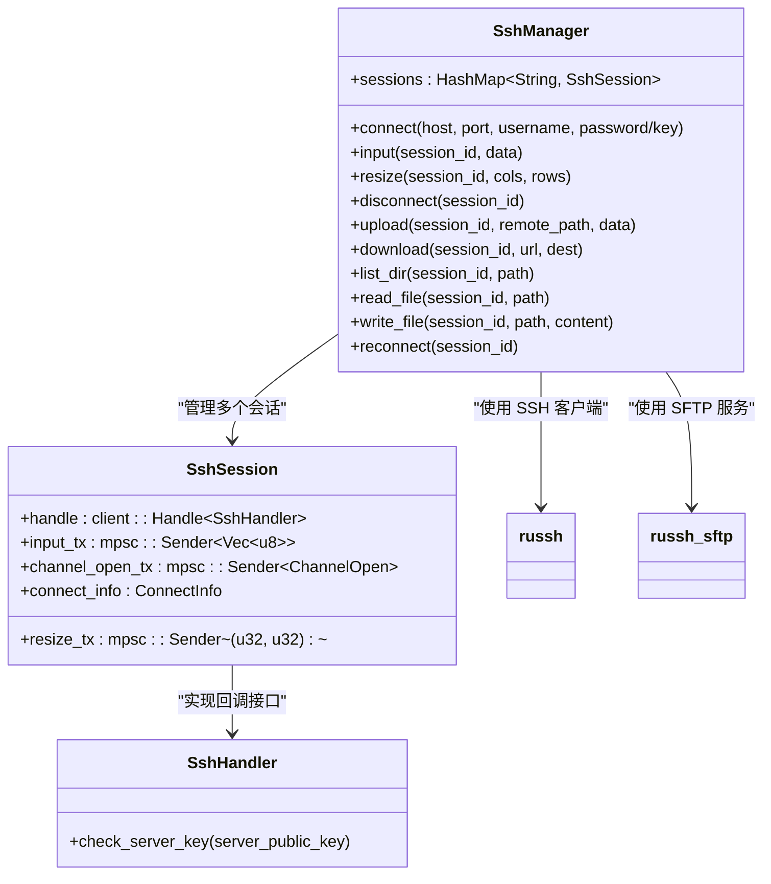
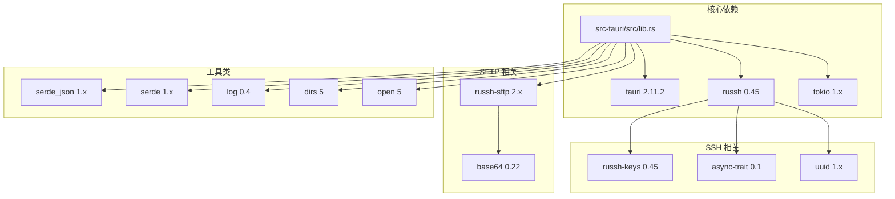

# 项目概述

<cite>
**本文档引用的文件**
- [README.md](file://README.md)
- [package.json](file://package.json)
- [src-tauri/Cargo.toml](file://src-tauri/Cargo.toml)
- [src-tauri/tauri.conf.json](file://src-tauri/tauri.conf.json)
- [src/main.tsx](file://src/main.tsx)
- [src/App.tsx](file://src/App.tsx)
- [src-tauri/src/lib.rs](file://src-tauri/src/lib.rs)
- [src-tauri/src/main.rs](file://src-tauri/src/main.rs)
- [src-tauri/src/ssh.rs](file://src-tauri/src/ssh.rs)
- [src-tauri/src/config.rs](file://src-tauri/src/config.rs)
- [src/components/Terminal.tsx](file://src/components/Terminal.tsx)
- [src/components/ConnectForm.tsx](file://src/components/ConnectForm.tsx)
- [src/components/Sidebar.tsx](file://src/components/Sidebar.tsx)
- [src/components/FileBrowser.tsx](file://src/components/FileBrowser.tsx)
- [vite.config.ts](file://vite.config.ts)
- [tsconfig.json](file://tsconfig.json)
</cite>

## 目录
1. [项目简介](#项目简介)
2. [项目结构](#项目结构)
3. [核心组件](#核心组件)
4. [架构总览](#架构总览)
5. [详细组件分析](#详细组件分析)
6. [依赖关系分析](#依赖关系分析)
7. [性能考虑](#性能考虑)
8. [故障排除指南](#故障排除指南)
9. [结论](#结论)

## 项目简介

SSH Tool 是一个基于 Tauri 2.x 桌面框架构建的跨平台 SSH 客户端桌面应用程序。该项目巧妙地结合了 React 18 + TypeScript 的现代前端技术栈与 Rust 后端的强大性能优势，为用户提供了一个功能丰富且高效的远程服务器管理工具。

### 核心目标

- **统一的桌面体验**：通过 Tauri 将 Web 技术与原生桌面应用能力融合，提供接近原生应用的使用体验
- **安全可靠的连接管理**：支持密码认证和密钥认证两种主要方式，确保远程连接的安全性
- **一体化的文件管理**：集成 SFTP 文件传输功能，支持文件浏览、编辑、上传下载等操作
- **实时终端交互**：基于 xterm.js 的终端模拟器，提供流畅的命令行交互体验

### 主要特性

- **SSH 连接管理**：支持多种认证方式，连接状态监控，自动重连机制
- **终端交互**：完整的 xterm.js 终端模拟，支持 PTY 请求和窗口大小调整
- **文件管理系统**：基于 SFTP 的完整文件操作，包括浏览、编辑、复制、移动、删除等
- **配置持久化**：本地 JSON 文件存储连接配置和用户设置
- **拖拽式文件操作**：直观的拖拽界面，支持文件夹间拖放和重命名
- **进度反馈**：上传下载进度显示，错误信息提示

## 项目结构

该项目采用典型的前后端分离架构，通过 Tauri 提供的 IPC 机制实现前端与后端的无缝通信。

```mermaid
graph TB
subgraph "前端层 (React 18 + TypeScript)"
A[src/main.tsx] --> B[src/App.tsx]
B --> C[src/components/]
C --> C1[src/components/Terminal.tsx]
C --> C2[src/components/ConnectForm.tsx]
C --> C3[src/components/Sidebar.tsx]
C --> C4[src/components/FileBrowser.tsx]
end
subgraph "桌面框架 (Tauri 2.x)"
D[tauri.conf.json] --> E[src-tauri/src/lib.rs]
E --> F[src-tauri/src/ssh.rs]
E --> G[src-tauri/src/config.rs]
end
subgraph "后端层 (Rust)"
F --> H[russh 0.45]
F --> I[tokio 1.x]
F --> J[russh-sftp 2.x]
G --> K[serde_json]
G --> L[dirs 5]
end
subgraph "外部依赖"
M[xterm.js 6.x] --> C1
N[@tauri-apps/api] --> B
O[React 19.x] --> A
end
A -.-> D
B -.-> E
```

**图表来源**
- [src/main.tsx:1-11](file://src/main.tsx#L1-L11)
- [src/App.tsx:1-415](file://src/App.tsx#L1-L415)
- [src-tauri/src/lib.rs:1-319](file://src-tauri/src/lib.rs#L1-L319)
- [src-tauri/src/ssh.rs:1-654](file://src-tauri/src/ssh.rs#L1-L654)

### 技术栈概览

| 层级 | 技术 | 版本 | 说明 |
|------|------|------|------|
| 前端 | React | 19.2.7 | 用户界面框架 |
| 前端 | TypeScript | ~6.0.2 | 类型安全保障 |
| 前端 | Vite | ^8.0.12 | 构建工具 |
| 前端 | xterm.js | ^6.0.0 | 终端模拟器 |
| 前端 | @tauri-apps/api | ^2.11.0 | 桌面桥接 |
| 桌面 | Tauri | 2.11.2 | 跨平台框架 |
| 后端 | Rust | 1.77.2 | 系统编程语言 |
| 后端 | russh | 0.45 | SSH 协议实现 |
| 后端 | tokio | 1.x | 异步运行时 |
| 后端 | russh-sftp | 2 | SFTP 文件传输 |

**章节来源**
- [README.md:39-47](file://README.md#L39-L47)
- [package.json:15-26](file://package.json#L15-L26)
- [src-tauri/Cargo.toml:18-32](file://src-tauri/Cargo.toml#L18-L32)

## 核心组件

### 应用入口与生命周期

应用采用模块化的组件设计，每个组件负责特定的功能领域：



**图表来源**
- [src/App.tsx:37-415](file://src/App.tsx#L37-L415)
- [src/components/Terminal.tsx:17-150](file://src/components/Terminal.tsx#L17-L150)
- [src/components/ConnectForm.tsx:26-232](file://src/components/ConnectForm.tsx#L26-L232)
- [src/components/Sidebar.tsx:28-155](file://src/components/Sidebar.tsx#L28-L155)
- [src/components/FileBrowser.tsx:144-800](file://src/components/FileBrowser.tsx#L144-L800)

### SSH 连接管理器

SSH 连接管理器是整个应用的核心组件，负责处理所有 SSH 相关的操作：



**图表来源**
- [src-tauri/src/ssh.rs:58-654](file://src-tauri/src/ssh.rs#L58-L654)

**章节来源**
- [src-tauri/src/ssh.rs:71-199](file://src-tauri/src/ssh.rs#L71-L199)
- [src-tauri/src/ssh.rs:520-583](file://src-tauri/src/ssh.rs#L520-L583)

## 架构总览

应用采用分层架构设计，通过 Tauri 的 IPC 机制实现前后端通信：



**图表来源**
- [src/App.tsx:180-334](file://src/App.tsx#L180-L334)
- [src-tauri/src/lib.rs:21-318](file://src-tauri/src/lib.rs#L21-L318)
- [src-tauri/tauri.conf.json:1-41](file://src-tauri/tauri.conf.json#L1-L41)

### 数据流处理

应用的数据流遵循严格的单向数据流原则：



**图表来源**
- [src/App.tsx:180-231](file://src/App.tsx#L180-L231)
- [src-tauri/src/lib.rs:21-41](file://src-tauri/src/lib.rs#L21-L41)
- [src-tauri/src/ssh.rs:132-178](file://src-tauri/src/ssh.rs#L132-L178)

**章节来源**
- [src/App.tsx:103-164](file://src/App.tsx#L103-L164)
- [src-tauri/src/lib.rs:268-318](file://src-tauri/src/lib.rs#L268-L318)

## 详细组件分析

### 终端组件 (Terminal)

Terminal 组件基于 xterm.js 构建，提供了完整的终端交互功能：



**图表来源**
- [src/components/Terminal.tsx:27-121](file://src/components/Terminal.tsx#L27-L121)
- [src/components/Terminal.tsx:123-141](file://src/components/Terminal.tsx#L123-L141)

终端组件的关键特性包括：
- **主题定制**：支持 GitHub 暗色主题，自定义配色方案
- **插件系统**：集成了 FitAddon 和 WebLinksAddon 插件
- **事件驱动**：通过 Tauri 事件系统实现双向通信
- **响应式布局**：自动适配窗口大小变化

**章节来源**
- [src/components/Terminal.tsx:17-150](file://src/components/Terminal.tsx#L17-L150)

### 连接表单组件 (ConnectForm)

ConnectForm 组件提供了直观的 SSH 连接配置界面：



**图表来源**
- [src/components/ConnectForm.tsx:59-73](file://src/components/ConnectForm.tsx#L59-L73)
- [src/components/ConnectForm.tsx:180-196](file://src/components/ConnectForm.tsx#L180-L196)

组件功能特性：
- **双认证支持**：密码认证和密钥认证两种方式
- **自动保存**：可选的连接配置保存功能
- **文件上传**：支持单文件上传，带进度反馈
- **动态表单**：根据认证类型动态显示相应字段

**章节来源**
- [src/components/ConnectForm.tsx:26-232](file://src/components/ConnectForm.tsx#L26-L232)

### 文件浏览器组件 (FileBrowser)

FileBrowser 组件实现了完整的 SFTP 文件管理系统：



**图表来源**
- [src/components/FileBrowser.tsx:192-215](file://src/components/FileBrowser.tsx#L192-L215)
- [src/components/FileBrowser.tsx:401-414](file://src/components/FileBrowser.tsx#L401-L414)

高级功能包括：
- **拖拽操作**：支持文件夹间拖放和重命名
- **批量操作**：复制、剪切、粘贴功能
- **权限管理**：支持文件权限修改
- **进度监控**：上传下载进度实时显示
- **错误处理**：完善的异常情况处理机制

**章节来源**
- [src/components/FileBrowser.tsx:144-800](file://src/components/FileBrowser.tsx#L144-L800)

### SSH 管理器 (SshManager)

SshManager 是应用的核心业务逻辑组件，负责所有 SSH 相关操作：



**图表来源**
- [src-tauri/src/ssh.rs:58-654](file://src-tauri/src/ssh.rs#L58-L654)

核心功能实现：
- **多会话管理**：支持同时维护多个 SSH 连接
- **异步处理**：基于 tokio 的异步任务调度
- **事件驱动**：通过 Tauri 事件系统推送状态变更
- **资源清理**：自动清理断开的连接和相关资源

**章节来源**
- [src-tauri/src/ssh.rs:63-199](file://src-tauri/src/ssh.rs#L63-L199)

## 依赖关系分析

### 前端依赖关系

```mermaid
graph TB
subgraph "应用依赖"
A[src/App.tsx] --> B[@tauri-apps/api]
A --> C[React 19.x]
A --> D[React DOM 19.x]
end
subgraph "组件依赖"
E[Terminal.tsx] --> F[xterm.js 6.x]
E --> G[@xterm/addon-fit 0.11.x]
E --> H[@xterm/addon-web-links 0.12.x]
I[ConnectForm.tsx] --> C
J[Sidebar.tsx] --> C
K[FileBrowser.tsx] --> C
K --> L[@tauri-apps/api]
end
subgraph "开发依赖"
M[Vite 8.x] --> N[React 插件]
O[TypeScript 6.x]
end
```

**图表来源**
- [package.json:15-26](file://package.json#L15-L26)
- [vite.config.ts:1-15](file://vite.config.ts#L1-15)
- [tsconfig.json:1-26](file://tsconfig.json#L1-L26)

### 后端依赖关系



**图表来源**
- [src-tauri/Cargo.toml:18-32](file://src-tauri/Cargo.toml#L18-L32)
- [src-tauri/src/lib.rs:1-10](file://src-tauri/src/lib.rs#L1-L10)

**章节来源**
- [package.json:1-28](file://package.json#L1-L28)
- [src-tauri/Cargo.toml:1-33](file://src-tauri/Cargo.toml#L1-L33)

## 性能考虑

### 异步架构优化

应用采用了基于 tokio 的异步架构，通过以下机制优化性能：

- **非阻塞 I/O**：所有网络操作都是异步进行，避免阻塞主线程
- **连接池管理**：通过会话 ID 管理多个并发连接
- **背压控制**：使用 mpsc 通道实现生产者-消费者模式
- **超时机制**：为长时间操作设置合理的超时时间

### 内存管理策略

- **智能缓存**：终端输出内容按需渲染，避免内存溢出
- **资源回收**：断开连接时及时释放相关资源
- **分块传输**：大文件上传采用 32KB 分块策略
- **进度反馈**：实时更新上传下载进度，提升用户体验

### 网络优化

- **Keep-Alive 机制**：每 10 秒发送一次心跳包检测连接状态
- **空闲超时**：60 秒无活动自动断开连接
- **自动重连**：支持可配置的自动重连策略
- **错误恢复**：连接中断时自动尝试恢复

## 故障排除指南

### 常见问题及解决方案

#### 连接失败问题

**症状**：连接过程中出现认证错误或超时

**排查步骤**：
1. 检查主机地址和端口号是否正确
2. 验证用户名和密码或密钥文件路径
3. 确认服务器 SSH 服务正常运行
4. 查看防火墙设置是否允许连接

**解决方法**：
- 使用密钥认证时，确保私钥文件权限正确
- 检查服务器的 SSH 配置文件
- 尝试使用更简单的认证方式测试连接

#### 文件传输问题

**症状**：文件上传或下载失败，进度条卡住

**排查步骤**：
1. 检查目标目录的写权限
2. 验证磁盘空间是否充足
3. 确认网络连接稳定
4. 查看服务器的 SFTP 服务状态

**解决方法**：
- 减小文件传输块大小
- 检查服务器的 SFTP 配置
- 重启文件传输任务

#### 终端显示异常

**症状**：终端字符显示乱码或布局错乱

**排查步骤**：
1. 检查字体是否正确安装
2. 验证终端主题设置
3. 确认窗口大小变化处理
4. 查看浏览器兼容性

**解决方法**：
- 切换到备用字体
- 重置终端主题设置
- 手动调整窗口大小

**章节来源**
- [src-tauri/src/ssh.rs:82-106](file://src-tauri/src/ssh.rs#L82-L106)
- [src-tauri/src/ssh.rs:448-518](file://src-tauri/src/ssh.rs#L448-L518)
- [src-tauri/src/ssh.rs:132-178](file://src-tauri/src/ssh.rs#L132-L178)

## 结论

SSH Tool 项目成功地将现代 Web 技术与传统桌面应用开发相结合，创造出了一个功能强大、性能优异的跨平台 SSH 客户端。通过精心设计的架构和组件化开发模式，项目不仅具备了良好的可维护性和扩展性，还为用户提供了优秀的使用体验。

### 项目优势

- **技术先进性**：采用最新的 React 19 + TypeScript 技术栈
- **性能卓越**：基于 Rust 的高性能后端，配合异步架构
- **用户体验**：直观的界面设计和流畅的交互体验
- **安全性**：完整的 SSH 认证机制和安全传输协议
- **跨平台支持**：通过 Tauri 实现 Windows、macOS、Linux 三平台支持

### 发展前景

随着远程工作和 DevOps 实践的普及，SSH 工具的需求将持续增长。该项目为未来的功能扩展奠定了坚实的基础，包括但不限于：

- 支持更多认证方式（如证书认证）
- 增强的文件管理功能（如批量操作、搜索功能）
- 集成更多远程管理工具
- 提供更丰富的配置选项和个性化设置

通过持续的技术迭代和功能完善，SSH Tool 有望成为企业级远程管理工具的理想选择。