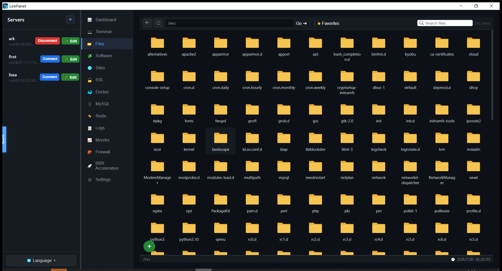
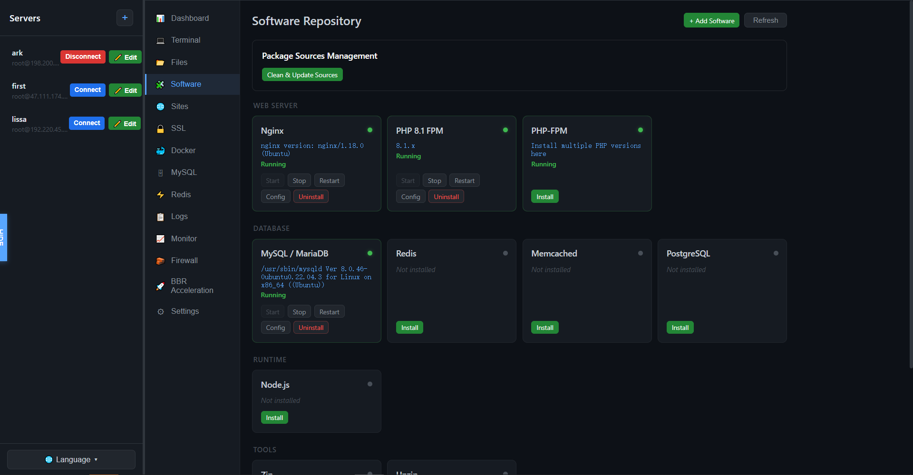
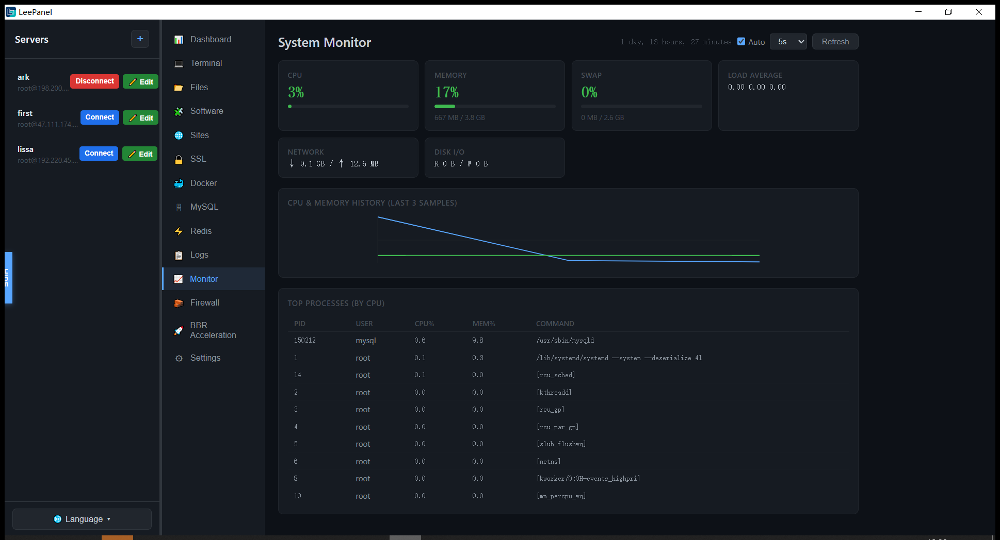

# LeePanel

<p align="center"></p>

<p align="center">
  <a href="https://github.com/gna1280072/LeePanel/stargazers"></a>
  <a href="https://github.com/gna1280072/LeePanel/releases"></a>
  <a href="https://github.com/gna1280072/LeePanel/releases"></a>
  <a href="https://github.com/gna1280072/LeePanel/blob/main/LICENSE"></a>
</p>

<p align="center">
  
  
  
  
  
  
</p>

[English](README.md) | [📥 下载软件](https://github.com/gna1280072/LeePanel/releases)

LeePanel — 免费开源，下一代 Linux 服务器管理面板。

传统 Linux/VPS 管理面板频繁曝出安全漏洞，令服务器管理员苦不堪言。

**LeePanel 为此而生。**

> 🛡️ **零服务端代码** — 所有操作均通过本地 SSH 命令完成，服务器上**不安装**任何面板代码，**不暴露**多余端口，从根源消除面板自身的安全风险。

基于 Tauri 2 + React 构建的轻量跨平台桌面应用，以单一原生客户端统一管理：

- 🔌 SSH 终端 & 📁 SFTP 文件管理
- 🌐 Nginx / ️ MySQL/MariaDB / ️ PHP / ⚡ Redis / 🐳 Docker
- ️ 防火墙 / 🔒 免费 SSL 证书

安装包最小仅 **6 MB** 起，灵活小巧！彻底取代传统浏览器面板。

使用过程中如有任何建议或意见，欢迎前往 [GitHub Discussions](https://github.com/gna1280072/LeePanel/discussions) 交流反馈。

🌐 官网: https://www.LeePanel.com


## 💡 为什么选择 LeePanel？

| 维度 | 传统 Web 面板 ❌ | LeePanel ✅ |
|------|------------------|-------------|
| 部署方式 | 在服务器上安装运行面板代码，占用资源 | 完全在您的桌面端运行，不在服务器上安装 |
| 端口暴露 | 向互联网开放 8888/8080 端口 | 仅使用您已有的 SSH 端口 |
| 攻击面 | 面板本身成为首要攻击目标 | 服务器保持您原始的配置不变 |
| 安全风险 | 面板以 root 运行，漏洞 = 服务器完全沦陷 | 不介入服务器，无此风险 |
| 卸载方式 | 需 SSH 进服务器执行卸载脚本，残留难清理 | 关闭应用即可，零残留 |
| 安全指数 | ⭐⭐ | ⭐⭐⭐⭐⭐ |

##  系统要求

| 平台 | 版本 |
|------|------|
| Windows | 10/11 (64-bit) |
| macOS | 12+ (Intel / Apple Silicon) |
| Linux | x64 / arm64 (AppImage) |

## 📦 安装包大小

| 平台 | 大小 |
|------|------|
| Windows | ~6 MB |
| macOS | ~6 MB |
| Linux | ~6 MB |

 
## 🖥️ 支持的服务器
> 🖥️  当前各项功能在 **Ubuntu** / **Debian**测试通过，更多系统适配中，敬请期待...

##  界面预览

<p align="center">
  
</p>

<p align="center">
  
</p>

<p align="center">
  
</p>

## ⚡ 功能特性

### 🔌 连接与终端
- 🔑 SSH 密码 / 密钥认证，支持凭证存储
- ️ 基于 xterm.js 的全功能终端，支持剪贴板、超链接和搜索
-  断线自动重连
-  多服务器并发管理 — 每个会话独立运行，互不阻塞

###  文件管理
- 🌐 远程文件浏览器，支持拖拽上传/下载
-  大文件分块上传，带进度跟踪
- 🗜️ 压缩包管理（zip、tar.gz）
- 🔐 文件权限管理（chmod）
- 📋 批量文件操作（复制、移动、删除、重命名）
- ⭐ 收藏夹快速访问
-  目录缓存加速浏览

### 🏗️ LNMP 环境管理
-  一键安装 Nginx、MySQL/MariaDB、PHP-FPM，支持版本选择
- ️ 服务启动 / 停止 / 重启 / 重载控制
- 📊 实时状态监控
- 🔀 PHP 多版本管理与切换

### 🌐 站点管理
- 🏠 Nginx 虚拟主机创建与配置
- 🔒 Let's Encrypt SSL 证书管理
- 🔁 反向代理配置（支持 WebSocket）
- ️ 防盗链保护配置
-  站点级 PHP 版本切换
- 📝 Rewrite 规则管理
- ️ 站点启用 / 禁用 / 删除

### 🗄️ 数据库管理
- 📊 MySQL/MariaDB 数据库增删改查
- 👥 用户权限管理（localhost / 任意主机 / 指定 IP）
- 💾 数据库备份与恢复（zip 格式）
- 📥 SQL 文件导入（编辑器或备份文件）
- 🔑 root 密码管理
- 📝 数据库备注（团队文档协作）

### ⚡ Redis 管理
- 🔍 基于 SCAN 的 Key 浏览与分页
-  Key 增删改查，支持 TTL
- 🗂️ 多数据库（DB0–DB15）切换
- 🧹 数据库清空确认
-  备份与恢复

### 🐳 Docker 管理
- 🔄 容器生命周期管理（启动、停止、重启、删除）
- 📦 镜像管理（拉取、删除、运行）
- 📋 容器日志查看器
- 🔗 Docker 镜像源配置
- 🚀 一键安装 Docker，支持多种镜像源

### 🖧 系统与网络
- 📊 CPU、内存、磁盘、网络实时监控
- 📋 进程列表与资源占用
- 🛡️ 防火墙规则管理（ufw / firewalld / iptables）
- 🚀 BBR TCP 拥塞控制
- 🖥️ 系统信息仪表盘
- ⏱️ 服务器运行时间追踪

### 📦 软件仓库
- 📦 包管理器集成（apt）
- 🔗 自定义软件源管理
- 🔄 软件安装 / 卸载 / 更新
- 🔍 可用 PHP 版本浏览

### ⚙️ 服务器设置
-  SSH 认证模式（密码 / 密钥）管理
- 🔐 SSH 密钥生成（RSA、Ed25519、ECDSA）与部署
- 🔄 服务器重启（正常 / 强制）
- 🗂️ 文件缓存管理

### 🌍 多语言支持
- 🌐 英文与简体中文
- 💾 语言偏好本地持久化
- 🔄 应用内语言切换器

## ️ 技术栈

| 层级 | 技术 |
|------|------|
| 桌面框架 | Tauri 2.x |
| 前端 | React 19 + TypeScript |
| 构建工具 | Vite 8 |
| 终端 | xterm.js 6 |
| SSH 客户端 | russh (Rust) |
| SFTP | russh-sftp (Rust) |
| 存储 | SQLite (rusqlite) |
| 国际化 | react-i18next |

## 🚀 开发

### 📋 环境要求
- [Node.js](https://nodejs.org/)（v18+）
- [Rust](https://www.rust-lang.org/tools/install)
- [Tauri](https://v2.tauri.app/start/prerequisites/) 所需的系统依赖

### 🏃 启动

```bash
# 安装依赖
npm install

# 启动开发服务
npm run tauri dev

# 生产环境构建
npm run tauri build
```

##  许可证

MIT 许可证。详见 [LICENSE](LICENSE) 文件。
 